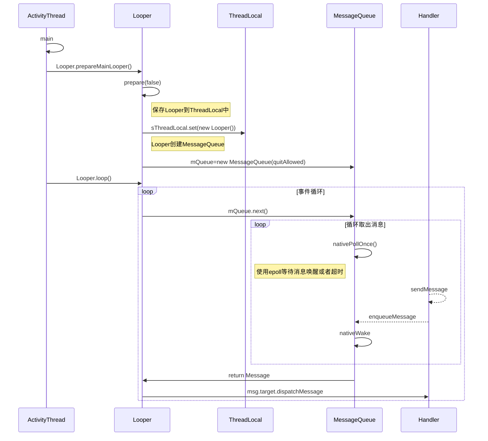
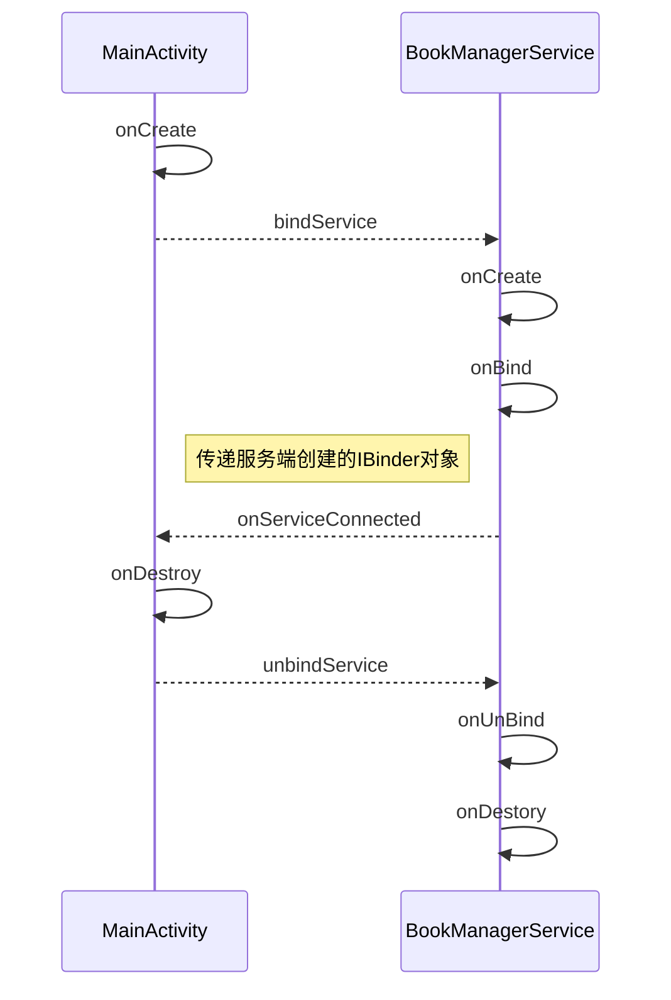
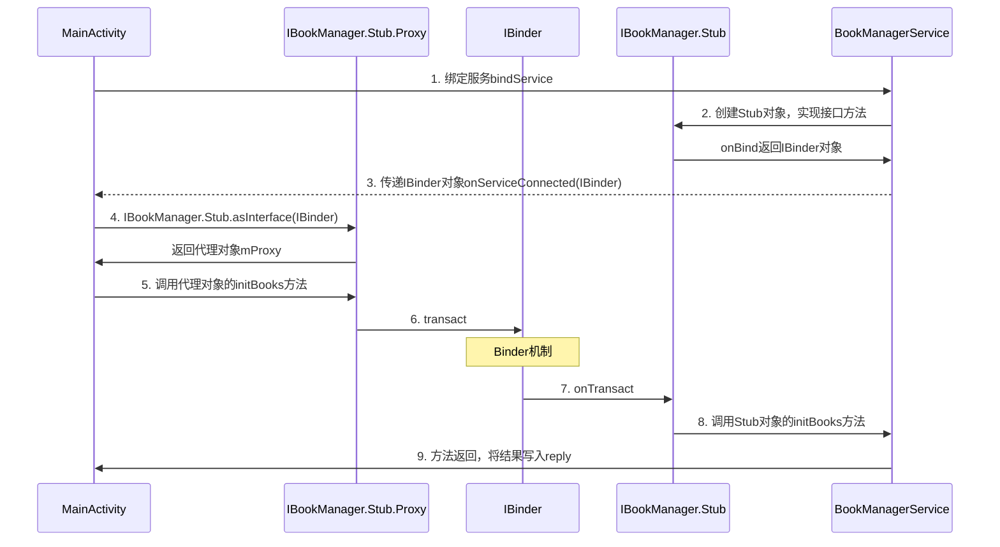

# Handler机制

```mermaid
sequenceDiagram
ActivityThread->>ActivityThread:main
ActivityThread->>Looper:Looper.prepareMainLooper()
Looper->>Looper:prepare(false)
note right of Looper:保存Looper到ThreadLocal中
Looper->>ThreadLocal:sThreadLocal.set(new Looper())
note right of Looper:Looper创建MessageQueue
Looper->>MessageQueue:mQueue=new MessageQueue(quitAllowed)
ActivityThread->>Looper:Looper.loop()
loop 事件循环
Looper->>MessageQueue:mQueue.next()
loop 循环取出消息
MessageQueue->>MessageQueue:nativePollOnce()
note left of MessageQueue:使用epoll等待消息唤醒或者超时
Handler-->>Handler:sendMessage
Handler-->>MessageQueue:enqueueMessage
MessageQueue->>MessageQueue:nativeWake
end
MessageQueue->>Looper:return Message
Looper->>Handler:msg.target.dispatchMessage
end
```

# bindService生命周期

```mermaid
sequenceDiagram
MainActivity->>MainActivity: onCreate
MainActivity-->>BookManagerService: bindService
BookManagerService->>BookManagerService: onCreate
BookManagerService->>BookManagerService: onBind
note left of BookManagerService: 传递服务端创建的IBinder对象
BookManagerService-->>MainActivity: onServiceConnected
MainActivity->>MainActivity: onDestroy
MainActivity-->>BookManagerService: unbindService
BookManagerService->>BookManagerService: onUnBind
BookManagerService->>BookManagerService: onDestory
```

```mermaid
sequenceDiagram
participant MainActivity
participant IBookManager.Stub.Proxy
participant IBinder
participant IBookManager.Stub
MainActivity->>BookManagerService: 1. 绑定服务bindService
BookManagerService->>IBookManager.Stub: 2. 创建Stub对象，实现接口方法
IBookManager.Stub->>BookManagerService: onBind返回IBinder对象
BookManagerService-->>MainActivity: 3. 传递IBinder对象onServiceConnected(IBinder)
MainActivity->>IBookManager.Stub.Proxy: 4. IBookManager.Stub.asInterface(IBinder)
IBookManager.Stub.Proxy->>MainActivity: 返回代理对象mProxy
MainActivity->>IBookManager.Stub.Proxy: 5. 调用代理对象的initBooks方法
IBookManager.Stub.Proxy->>IBinder: 6. transact
note over IBinder: Binder机制
IBinder->>IBookManager.Stub: 7. onTransact
IBookManager.Stub->>BookManagerService: 8. 调用Stub对象的initBooks方法
BookManagerService->>MainActivity: 9. 方法返回，将结果写入reply
```

