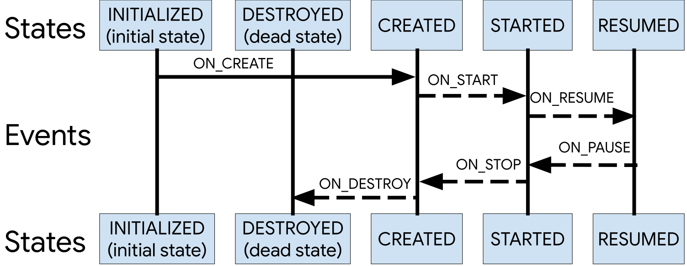

# 生命周期和状态


Lifecycle状态



具体场景：

ActivityA启动ActivityB时

> 1. 先调用A的onPause
> 2. 然后调用B的onCreate -> onStart -> onResume
> 3. 然后调用A的onSavedInstanceState -> onStop

back返回的时候

> 1. 调用B的onPause
> 2. 再调用A的onRestart -> onStart -> onResume
> 3. 然后调用B的onStop->onDestroy

总结：要等后一个Activity完全显示出来onResume之后，才会触发前一个Activity的onStop

Dialog和生命周期

> 1. 当前Activity弹出的Dialog不会触发Activity生命周期
> 2. 其它Activity弹出的Dialog才会使当前的Activity执行`onPause()`

## onSavedInstanceState

`onSavedInstanceState`：通过Bundle保存Activity的实例，用于恢复页面意外销毁前的状态（备忘录模式）

调用场景：当activity**有可能**被系统回收的情况下，在onStop之前执行。即Activity在后台（不在当前活动栈的栈顶，可能是在当前活动Task栈底，或者在其他Task中），内存不足时可能被回收。

> 如果必定被销毁，例如按下返回键或者调用finish方法手动销毁Activity，则不会调用`onSavedInstanceState`

调用时机：

* Android 3之前：在onPause之前调用
* Android 3-9：在onStop之前调用
* Android 9及之后：在onStop之后调用

**举例**

> 1. 当按下Home键退回桌面时
> 2. 打开新的Activity时（在当前活动Task栈底）
> 3. 打开其他程序时，如跳到电话界面，或者从通知栏进入其他程序，或者打开后台显示切换到另一个程序（在其他Task中）
> 4. 按下电源键关闭屏幕时
> 5. 横竖屏切换时

## onRestoreInstanceState

`onRestoreInstanceState`：获取`onSavedInstanceState`保存的数据，恢复页面状态。

调用场景：只有在Activity确定是被**系统**回收后，**重新创建**Activity的时候才会被调用。

调用时机：在onStart之后。

注：

* 如果是手动销毁Activity，则不会被调用
* 如果`onRestoreInstanceState`被调用了，则页面必然被系统回收过，`onSavedInstanceState`、`onDestroy`必然被调用过。因此重建的时候必然调用`onCreate`
* `onRestoreInstanceState`中的Bundle不为空，`onCreate`中的Bundle可能为空，需要进行判空。

进行横竖屏切换时，生命周期如下

> `onPause->onSavedInstanceState->onStop->onDestroy->onCreate->onStart->onRestoreInstanceState->onResume`

如果在清单文件中设置了` android:configChanges="orientation|keyboardHidden|screenSize"`，则不会调用各个生命周期，而是调用`onConfigurationChanged`方法

# 四种启动方式

* standard模式：默认的启动模式。每次启动Activity都会创建Activity实例，并放入任务栈。
* singleTop模式：栈顶复用。如果任务栈的栈顶正好存在该Activity的实例，就重用该实例，否则创建新的实例并放入栈顶。例如：点击通知打开页面
* singleTask模式：栈内复用。如果任务栈中存在该实例，则不需要创建，会把该Activity以上的实例都pop销毁，一般用于应用首页
* singleInstance模式：新建一个栈并把Activity加入栈中，该Activity独占该栈（被它开启的Activity会加入其他栈）。整个系统中只有一个这样的实例，再次启动时（即使是另一个app）会重用该实例。例如Launcher、拨号页面等

## onNewIntent

当Activity被重用时，会调用`onNewIntent()`方法，**在onResume之前调用**

注：在`onNewIntent`中获取到了Intent参数，需要使用`setIntent(intent)`保存下来，否则`getIntent`拿到的是老的`Intent`

配置LaunchMode

1. 在`AndroidManifest.xml`中配置`android:launchMode`属性。
2. `startActivity`设置Intent的Flag

任务栈（Task）、回退栈

> 1. 用于存储当前程序的Activity。
> 2. 当前运行的Task叫当前活动栈。当前运行的Activity在当前活动栈的栈顶。
> 3. 退出应用时，把任务栈中的activity都销毁出栈，然后销毁任务栈
> 4. 一个应用程序至少有一个任务栈，还可能有多个
> 5. Activity在栈内的顺序是可以控制的，通过启动方式和Intent Flag

场景1：

1. B设置为singleInstance，A打开B，B打开C：此时A和C在Task1中，B在Task2中。如果A和C的taskAffinity不相同的话，B会新建一个Task3来存放C
2. 点击返回：C出栈，回到A页面
3. 再点一次返回：A出栈，Task1销毁，回到B页面

场景2：

B设置为singleInstance，A启动B，按下Home键，点击图标进入app，回到页面A。从launcher打开应用的时候会启动默认的栈。

场景3：

B设置为singleInstance，A启动C，C启动B，从B页面打开A，结果显示的是C，而不是A。

注：

* 如果想让两个页面处于同一个栈，可以设置taskAffinity属性（任务归属），设置同样的栈名
* `starActivityForResult`在5.0之后无论目标Activity设置什么模式，启动后都会强制放在当前栈顶

## taskAffinity属性

* Activity包含一个taskAffinity属性，表示该Activity归属的栈的名称。
* 具有相同taskAffinity的两个Activity处于同一个任务栈（即使是两个应用）
* 默认情况下，一个应用的所有Activity具有相同的taskAffinity，即应用程序包名。可以通过设置不同的taskAffinity进行分组，也可以把不同应用的Activity设置为相同的值
* 使用singleTask方式启动页面时，会检查名为taskAffinity的任务栈中是否存在该实例，如果存在，则重用并弹出在其上的所有Activity，如果不存在，则新建一个实例到名为taskAffinity的任务栈中

## Intent的Flag属性

1. `Intent.FLAG_ACTIVITY_NEW_TASK`：如果taskAffinity和当前栈相同，则在当前栈新建一个Activity实例，如果不同，则新建一个栈存放Activity
   1. 注：在非Activity的Context中启动Activity需要添加这个属性，否则ContextImpl中会抛异常，Activity重写了startActivity方法，因此不会抛异常
2. `FLAG_ACTIVITY_SINGLE_TOP`：类似singleTop
3. `FLAG_ACTIVITY_CLEAR_TOP`：类似singleTask，将其上的Activity清除
   1. 和SingleTask不一样的是，`FLAG_ACTIVITY_CLEAR_TOP`会把自身也销毁，然后重新实例化该Activity。而SingleTask会复用该Activity，只会触发onNewIntent，不触发onCreate。
4. `FLAG_ACTIVITY_REORDER_TO_FRONT`：将栈内的Activity移到栈顶，不销毁其他Activity
5. `FLAG_ACTIVITY_BROUGHT_TO_FRONT`：将栈内的Activity移到栈顶，销毁其他Activity

# Intent

Intent是一种在不同组件之间传递的请求消息，是应用程序发出的请求和意图。作为一个完整的消息传递机制，Intent不仅需要发送端，还需要接收端。

## 显式Intent

明确指出了组件名称

> 一般用于应用程序内部传递消息（因为我们无法知道其他应用程序的组件名称）

```java
Intent intent = new Intent(MainActivity.this, SecondActivity.class);
startActivity(intent);
```

## 隐式Intent

组件在清单文件中声明`<Intent-Filter>`（包括Action、Category、Data），注册到AMS中，由系统（AMS）来找到对应的组件。

> Extra和Flag在解析Intent找到组件时是不起作用的

```java
//过滤出电话程序
Intent intent = new Intent(Intent.ACTION_CALL);
intent.setData(Uri.parse("tel:10086"));
startActivity(intent);
//打开浏览器，并访问网址
Intent intent = new Intent(Intent.ACTION_VIEW,Uri.parse("http://www.baidu.com"));
startActivity(intent);
```

## 常用Action

| 动作              | 说明                                                         |
| ----------------- | ------------------------------------------------------------ |
| ACTION_PICK       | 启动一个子Activity，从提供的数据列表中选取一项               |
| ACTION_SEARCH     | 启动一个Activity，执行搜索动作                               |
| ACTION_SENDTO     | 启动一个Activity，向数据提供的联系人发送信息                 |
| ACTION_SEND       | 启动一个可以发送数据的Activity，短信                         |
| ACTION_VIEW       | 最常用的动作，对以Uri方式传送的数据，根据Uri协议部分以最佳方式启动相应的Activity进行处理。对于http:address将打开浏览器查看；对于tel:address将打开拨号界面并呼叫指定的电话号码 |
| ACTION_WEB_SEARCH | 打开一个Activity，对提供的数据进行Web搜索                    |
| ACTION_ANSWER     | 打开接听电话的Activity，默认为Android内置的拨号界面          |
| ACTION_CALL       | 打开拨号盘界面并拨打电话，使用Uri中的数字部分作为电话号码    |
| ACTION_DIAL       | 打开内置拨号界面，显示Uri中提供的电话号码                    |
| ACTION_EDIT       | 打开一个Activity，对所提供的数据进行编辑操作                 |
| ACTION_DELETE     | 打开一个Activity，对所提供的数据进行删除操作                 |
| ACTION_INSERT     | 打开一个Activity，在提供数据的当前位置插入新项               |

# Intent和Bundle

为什么有了Intent还需要Bundle？

1. Intent内部也是使用Bundle存储源码，并且在`getExtras`构造新的Bundle对象，避免破坏Intent
2. 假设数据需要从页面A经过B再传到C，如果使用Intent，需要一个一个取出来放到新的Intent中，使用Bundle只需要取一次即可
3. 使用场景不同：
   1. Intent用于组件间传值，包含Action、Flags、Data、Component、Extras等，不仅仅是数据。
   2. 有些场景只需要Bundle不需要Intent：例如Handler中的Message，Binder建立连接后，客户端和服务端通信数据传递

```java
public class Intent  implements Parcelable, Cloneable {
    private Bundle mExtras;
    ...
    public @NonNull Intent putExtra(String name, int value) {
        if (mExtras == null) {
            mExtras = new Bundle();
        }
        mExtras.putInt(name, value);
        return this;
    }
    public int getIntExtra(String name, int defaultValue) {
        return mExtras == null ? defaultValue : mExtras.getInt(name, defaultValue);
    }
    public @Nullable Bundle getExtras() {
        //外部获取的时候构造一个新的Bundle对象，避免破坏Intent
        return (mExtras != null) ? new Bundle(mExtras) : null;
    }
    ...
}
```

为什么Bundle不使用HashMap替代？

1. Bundle内部使用ArrayMap实现，在数据量较小的情况下，比HashMap更省内存
2. HashMap使用Serializable序列化，不支持Parcelable

# 结语

* [开发者文档-Activity](https://developer.android.google.cn/guide/components/activities/intro-activities)