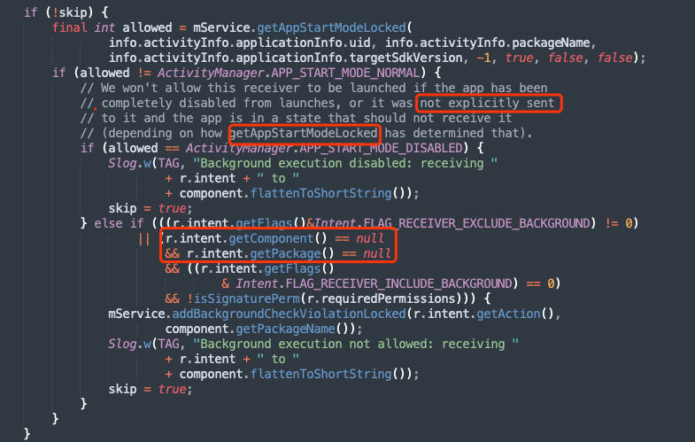

# 简介

分为广播发送者和广播接收者。可用于进程或线程间通信。


原理：

* 注册广播的时候，将`BroadcastReceiver`和`IntentFilter`封装到`ReceiverRecord`中，使用`HashMap<String, ArrayList<ReceiverRecord>>`进行记录，键是Action
* 注销的时候从Map移除
* 发送的时候通过Intent的action在Map中查找

## 分类

按注册方式：

* 静态广播：静态注册的广播，应用程序关闭后也能接收到广播。每次接收都会创建新的`BroadcastReceiver`对象，onReceive执行完后销毁。
* 动态广播：动态注册的广播，生命周期与注册的组件相同

按作用范围：

* 全局广播：发出的广播所有应用都可以接收，或者可以接收其他应用的广播。
* 本地广播：只能接收应用内部广播，发出的广播只有应用内部能接收。

按发送方式：

* 无序广播/标准广播：所有的接收者都会接收事件，不可以被拦截，不可以被修改。
* 有序广播：按照优先级，一级一级的向下传递，接收者可以修改广播数据，也可以终止广播事件。
* 粘性广播：

按发送者：

* 系统广播
* 自定义广播
* 保护广播

前台广播、后台广播

# 使用

## 定义广播接收器

```java
//自定义广播接收器
public class MyBroadCastReceiver extends BroadcastReceiver   
{  
   @Override  
   public void onReceive(Context context, Intent intent)   
   {   
       //可以从Intent中获取数据、还可以调用BroadcastReceiver的getResultData()获取数据
       //一般不进行耗时操作，不允许开启多线程
   }   
} 
```

## 注册广播接收器

可以注册监听系统广播（可能需要添加权限，例如开机广播、SMS等）

### 静态注册

* 在Manifest中注册
* 常驻型广播：应用程序关闭后也能接收到广播

```xml
<application>
	<receiver android:name=".MyBroadCastReceiver">  
		<!-- android:priority设置此接收者的优先级（从-1000到1000），用于有序广播，越大优先级越高 -->
		<intent-filter android:priority="20">
            <!-- 监听action为com.afauria.demo.broadcast的广播 -->
			<action android:name="com.afauria.demo.broadcast"/>
		</intent-filter>  
	</receiver>
</application>
```

### 动态注册

* 在java代码中注册
* 和所在的组件（Service、Activity、Application）的生命周期一致
* 需要在组件销毁的时候注销广播，`unregisterReceiver(recevier);`一般在相应的onDestroy方法中注销

```java
//实例化广播接收器
MyBroadCastReceiver mBroadCastReceiver = new MyBroadCastReceiver();
//实例化过滤器并设置要过滤出来的广播
IntentFilter intentFilter = new IntentFilter("com.afauria.demo.broadcast");
//注册广播监听器
myContext.registerReceiver(mBroadCastReceiver, intentFilter);
```

## 发送广播

```java
//定义action为com.afauria.demo.broadcast的意图，或者intent.setAction("com.afauria.demo.broadcast");
Intent intent = new Intent("com.afauria.demo.broadcast");
//发送广播
mContext.sendBroadcast(Intent);
//第二个参数是权限
mContext.sendBroadcast(Intent, String);

//有序广播
mContext.sendOrderedBroadcast(Intent, String, BroadCastReceiver, Handler, int, String, Bundle)；
//修改广播数据，下一级的广播使用getResultData获取数据
setResultData();
//终止广播传递
abortBroadcast();
```

# 本地广播

1. 全局广播会被其他应用监听访问，存在数据安全问题，本地广播只在应用内生效。
2. 全局广播通过AMS跨进程发送，本地广播不需要跨进程通信，效率更高
3. 本地广播只能动态注册

```java
//使用LocalBroadcastManager类
//实例化本地广播
LocalBroadcastManager localBroadcastManager = LocalBroadcastManager.getInstance(this);

//注册广播接收器
localBroadcastManager.registerReceiver(recevier,intentFilter);
//注销广播接收器,localBroadcastManager同一个实例
localBroadcastManager.unregisterReceiver()
    
//发送无序广播
localBroadcastManager.sendBroadcast(intent);
//发送有序广播
localBroadcastManager.sendBroadcastSync(intent);
```

# 版本适配

Android8.0限制应用接收静态注册的隐式广播（不带package也不带component）。反过来说，setPackage之后能被收到就是显式广播，不在限制范围内。

另外，原生的部分广播不在限制范围内，例如开机广播，所以开机广播能够静态注册并接收



# 结语

* [高版本隐式广播限制](https://developer.android.google.cn/guide/components/broadcast-exceptions)
* [Intent类型](https://developer.android.google.cn/guide/components/intents-filters#Types)

https://javajgs.com/archives/78133

https://www.jianshu.com/p/ca3d87a4cdf3
