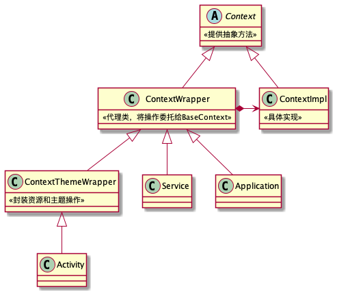

# Context设计

Context是Android系统提供的应用程序上下文环境，是一个抽象类，包含以下方法：

1. 文件、SharedPreferences、数据库操作
2. 获取资源：例如`getResource、getString、getColor`等
3. 获取应用信息：例如`getPackageName、getApplicationInfo`等
4. 四大组件操作：例如`startActivity、startService、sendBroadcast`等
5. 创建其他Context：例如`createPackageContext、createDeviceProtectedStorageContext`等
6. ...



Context存在于源码的各个地方，例如四大组件、View、Window等。为什么不直接使用全局Context对象，而要和Activity、View等绑定？

1. 各个地方都持有Context，是为了开发者能够在任意地方调用Context方法，而不需要自行传入。假设View类中没有Context，要获取资源、inflate布局就很麻烦。
2. 不同组件内Context的上下文执行环境不同。例如两个Activity主题不一样，通过各自Context获取到的资源也不一样。

**使用代理模式设计**：

1. Context是抽象类，ContextWrapper是代理类，ContextImpl是被代理类。
2. 代理类将操作委托给真实对象实现，并且可以在前后添加自己的操作。
3. Activity可以重写代理类方法，替换自己的实现。例如Activity中重写了startActivity、getSystemService方法等

## ContextWrapper

ContextWrapper是Context的包装类（代理类），没有具体实现，将操作都委托给mBase对象处理，通常是ContextImpl对象。

```java
//代理类
public class ContextWrapper extends Context {
    //被代理对象
    @UnsupportedAppUsage
    Context mBase;
    public ContextWrapper(Context base) {
        mBase = base;
    }
    //绑定代理类
    protected void attachBaseContext(Context base) {
        if (mBase != null) {
            throw new IllegalStateException("Base context already set");
        }
        mBase = base;
    }
}
```

**ActivityThread中创建Activity、Service、Application对象，并调用attach方法，绑定ContextImpl**

```java
ActivityThread#handleBindApplicaiton()
  app = data.info.makeApplication();
    ContextImpl appContext = ContextImpl.createAppContext(mActivityThread, this); //创建ContextImpl
    app = mActivityThread.mInstrumentation.newApplication(cl, appClass, appContext);
      Application app = AppComponentFactory#instantiateApplication(cl, className); //创建Application对象
        app.attach(context); 
          attachBaseContext(context); //Application绑定ContextImpl

ActivityThread#performLaunchActivity()
  ContextImpl appContext = createBaseContextForActivity(r); //创建ContextImpl
  activity = mInstrumentation.newActivity(cl, component.getClassName(), r.intent); //创建Activity对象
  activity.attach(appContext, ...)
    attachBaseContext(context) //Activity绑定ContextImpl
    
ActivityThread#handleCreateService()
  ContextImpl context = ContextImpl.createAppContext(this, packageInfo); //创建ContextImpl
  service = packageInfo.getAppFactory().instantiateService(); //创建Service对象
  service.attach(context, ...); 
    attachBaseContext(context); //Service绑定ContextImpl
```

## ContextImpl

ContextImpl：具体实现类，封装了大部分公共的操作。

目的：

1. 代码复用：抽取公共逻辑，Activity和Service不需要分别实现抽象方法
2. Activity和Service可以重写包装类方法，实现自己的逻辑

为什么使用包装类+组合的方式，而不使用继承，让父类实现公共逻辑，子类需要的时候覆写？

1. 组合优于继承，外部可以传入不同的Context对象，切换具体实现。
2. 减轻子类的逻辑，避免子类包含过多职责，代码臃肿。

> 如果使用继承，当Context方法存在多种实现的时候，需要定义多个子类，可能会出现FirstActivity、SecondActivity。
>
> 由于这些类是提供给开发者使用的，如果存在多种实现，会导致开发者难以选择继承的类。

ContextImpl创建方式：

1. 静态方法创建：使用外部传入的变量作为参数创建ContextImpl
2. 实例方法创建：使用当前Context的成员变量作为参数创建ContextImpl

```java
class ContextImpl extends Context {
    ...
    //创建保护存储区Context，getDataDir时判断flag，返回不同的路径
    @Override
    public Context createDeviceProtectedStorageContext() {
        final int flags = (mFlags & ~Context.CONTEXT_CREDENTIAL_PROTECTED_STORAGE)
                | Context.CONTEXT_DEVICE_PROTECTED_STORAGE;
        //使用当前Context的成员变量作为参数
        return new ContextImpl(this, mMainThread, mPackageInfo, mAttributionTag, mSplitName,
                mToken, mUser, flags, mClassLoader, null);
    }
    //创建其他应用的Context，用于访问其他应用资源和路径，实现插件加载
    @Override
    public Context createPackageContext(String packageName, int flags)
            throws NameNotFoundException {
        return createPackageContextAsUser(packageName, flags, mUser);
    }

    //静态方法
    static ContextImpl createAppContext(ActivityThread mainThread, LoadedApk packageInfo,
            String opPackageName) {
        if (packageInfo == null) throw new IllegalArgumentException("packageInfo");
        //使用传入的变量作为参数
        ContextImpl context = new ContextImpl(null, mainThread, packageInfo, null, null, null, null,
                0, null, opPackageName);
        context.setResources(packageInfo.getResources());
        context.mIsSystemOrSystemUiContext = isSystemOrSystemUI(context);
        return context;
    }
    @UnsupportedAppUsage
    static ContextImpl createActivityContext(ActivityThread mainThread,
            LoadedApk packageInfo, ActivityInfo activityInfo, IBinder activityToken, int displayId,
            Configuration overrideConfiguration) {
      ...
    }
}
```

# Context作用域

不同组件Context使用存在限制

|              | Application | Activity | Service | ContentProvider | BroadcastReceiver |
| ------------ | ----------- | -------- | ------- | --------------- | ----------------- |
| Toast        | YES         | YES      | YES     | YES             | YES               |
| 显示弹窗     | NO          | YES      | NO      | NO              | NO                |
| 启动Activity | NO1         | YES      | NO1     | NO1             | NO1               |
| 布局解析     | NO2         | YES      | NO2     | NO2             | NO2               |
| 启动服务     | YES         | YES      | YES     | YES             | YES               |
| 绑定服务     | YES         | YES      | YES     | YES             | NO                |
| 发送广播     | YES         | YES      | YES     | YES             | YES               |
| 注册广播     | YES         | YES      | YES     | YES             | NO3               |
| 加载资源     | YES         | YES      | YES     | YES             | YES               |

* Activity的Context没有限制
* 非Activity的Context无法用于弹出Dialog，除非是系统弹窗，并且需要申请权限
* bindService生命周期和Context绑定，由于广播生命周期很短，不能用于绑定服务
* NO1：需要添加`FLAG_ACTIVITY_NEW_TASK`启动新的任务栈。
* NO2：可以inflate布局，但是会使用默认的主题，Activity自定义主题不生效
* NO3：receiver传入null时，可以用于获取粘性广播的Intent。广播一般通过onReceive方法接收，如果存在粘性广播会直接返回上一个结果。

## Context#startActivity限制

`ContextImpl#startActivity`方法限制：非Activity的Context没有任务栈，因此无法直接启动Activity，会抛异常。需要添加`FLAG_ACTIVITY_NEW_TASK`或者指定`LaunchTaskId`

```java
//ContextImpl.java
@Override
public void startActivity(Intent intent, Bundle options) {
    warnIfCallingFromSystemProcess();

    // Calling start activity from outside an activity without FLAG_ACTIVITY_NEW_TASK is
    // generally not allowed, except if the caller specifies the task id the activity should
    // be launched in. A bug was existed between N and O-MR1 which allowed this to work. We
    // maintain this for backwards compatibility.
    final int targetSdkVersion = getApplicationInfo().targetSdkVersion;

    if ((intent.getFlags() & Intent.FLAG_ACTIVITY_NEW_TASK) == 0
            && (targetSdkVersion < Build.VERSION_CODES.N || targetSdkVersion >= Build.VERSION_CODES.P)
            && (options == null || ActivityOptions.fromBundle(options).getLaunchTaskId() == -1)) {
        throw new AndroidRuntimeException(
                "Calling startActivity() from outside of an Activity context requires the FLAG_ACTIVITY_NEW_TASK flag."
                        + " Is this really what you want?");
    }
    mMainThread.getInstrumentation().execStartActivity(getOuterContext(), mMainThread.getApplicationThread(), null,
            (Activity) null, intent, -1, options);
}
```

Android10+不允许后台应用启动Activity，需要申请权限

## Context显示Dialog限制

非Activity的Context无法用于弹出Dialog。除非是系统弹窗，并且需要申请悬浮窗权限

```dart
Dialog dialog = new Dialog(getApplication());
...
dialog.show();
```

使用Application的Context崩溃：token为空

```shell
android.view.WindowManager$BadTokenException: Unable to add window -- token null is not valid; is your activity running?
  at android.view.ViewRootImpl.setView(ViewRootImpl.java:1068)
  at android.view.WindowManagerGlobal.addView(WindowManagerGlobal.java:409)
  at android.view.WindowManagerImpl.addView(WindowManagerImpl.java:109)
  at android.app.Dialog.show(Dialog.java:340)
```

原因分析：**`WindowManagerImpl`的parentWindow不为空，则设置Token。否则WMS会返回异常**

```java
new Dialog(Context)  //创建Dialog
  mWindowManager = (WindowManager) context.getSystemService(Context.WINDOW_SERVICE); //获取WindowManagerImpl对象

Dialog#show() //显示Dialog
  mWindowManager.addView(mDecor, l); //传入WindowManagerImpl的parentWindow
    WindowManagerGlobal#addView(view, params, display, parentWindow, userId)
      parentWindow.adjustLayoutParamsForSubWindow(wparams); //parentWindow不为空，则设置token
        wp.token = mContainer == null ? mAppToken : mContainer.mAppToken;
      root = new ViewRootImpl(view.getContext(), display); //创建ViewRootImpl对象
      root.setView(view, wparams, panelParentView, userId);
        res = mWindowSession.addToDisplayAsUser(...); //跨进程调用WMS方法添加窗口，WMS返回WindowManagerGlobal.ADD_BAD_APP_TOKEN，
        throw new WindowManager.BadTokenException(） //抛异常
```

看看parentWindow什么时候为空？

```java
public final class WindowManagerImpl implements WindowManager {
    @UnsupportedAppUsage
    private final WindowManagerGlobal mGlobal = WindowManagerGlobal.getInstance();
    @VisibleForTesting
    public final Context mContext;
    private final Window mParentWindow;
    //parentWindow为空
    public WindowManagerImpl(Context context) {
        this(context, null);
    }
    //parentWindow不为空
    private WindowManagerImpl(Context context, Window parentWindow) {
        mContext = context;
        mParentWindow = parentWindow;
    }
    public WindowManagerImpl createLocalWindowManager(Window parentWindow) {
        return new WindowManagerImpl(mContext, parentWindow);
    }
}
```

使用ApplicationContext时，调用被代理的`ContextImpl.getSystemService`方法，获取WindowManagerImpl对象，此时parentWindow为空

```java
//ContextImpl.java
@Override
public Object getSystemService(String name) {
    ...
    return SystemServiceRegistry.getSystemService(this, name);
}
```

```java
//SystemServiceRegistry.java
@SystemApi
public final class SystemServiceRegistry {
    static {
        //注册WindowManager服务
        registerService(Context.WINDOW_SERVICE, WindowManager.class, new CachedServiceFetcher<WindowManager>() {
            @Override
            public WindowManager createService(ContextImpl ctx) {
                //返回WindowManagerImpl
                return new WindowManagerImpl(ctx);
            }
        });
    }
}
```

使用ActivityContext时，调用重写的`getSystemService`方法，直接返回Activity的WindowManager对象，此时parentWindow不为空，是Activity的PhoneWindow

```java
//Activity.java
@Override
public Object getSystemService(@ServiceName @NonNull String name) {
    if (getBaseContext() == null) {
        throw new IllegalStateException("System services not available to Activities before onCreate()");
    }
    //返回Activity的WindowManager对象
    if (WINDOW_SERVICE.equals(name)) {
        return mWindowManager;
    } else if (SEARCH_SERVICE.equals(name)) {
        ensureSearchManager();
        return mSearchManager;
    }
    return super.getSystemService(name);
}
//attach的时候创建WindowManager对象
final void attach(...) {
    ...
    mWindow = new PhoneWindow(this, window, activityConfigCallback);
    ...
    mWindow.setWindowManager((WindowManager)context.getSystemService(Context.WINDOW_SERVICE), mToken, ...);
    //获取PhoneWindow的WindowManager
    mWindowManager = mWindow.getWindowManager();
}
//PhoneWindow.java
public void setWindowManager(WindowManager wm, IBinder appToken, String appName, boolean hardwareAccelerated) {
    ...
    //创建WindowManagerImpl，传入parentWindow
    mWindowManager = ((WindowManagerImpl)wm).createLocalWindowManager(this);
}
```

# Context获取方式

1. Activity和Service组件中获取，直接使用`this`
2. View中获取，使用`view.getContext()`
3. ContextWrapper的`getBaseContext`方法：不推荐使用。例如在Activity中调用`getBaseContext().startActivity()`，会导致Activity重写的`startActivity()`失效
4. 使用静态变量或单例存储Application的Context

## 三方库中获取Context

一般是让调用者主动传入Context，例如`Glide.with(Context)`。

某些情况SDK初始化可以直接使用Application的Context

1. 反射调用`ActivityThread.currentApplication()`或者`AppGlobals.getInitialApplication()`静态方法获取Application
   1. 存在版本适配风险
2. 使用ContentProvider无侵入获取Application的Context
   1. Manifest自动注册，不需要开发者主动调用
   2. 应用使用多进程时容易出现问题
   3. SDK初始化耗时会增加应用启动时长

```java
ActivityThread#handleBindApplication()
  app = data.info.makeApplication(); //创建Application对象
  installContentProviders(app, data.providers);
    installProvider(context, ...); // 遍历并初始化ContentProvider，传入Application的Context
      localProvider = (ContentProvider)cl.loadClass(info.name).newInstance(); //创建ContentProvider对象
      localProvider.attachInfo(c, info); //传入Context
        ContentProvider.this.onCreate(); //调用ContentProvider的onCreate方法
  mInstrumentation.callApplicationOnCreate(app); //调用Application的onCreate方法
```

# 其他

一个应用程序有几个Context？

> 这题没有实际意义，主要考察对Context的理解
>
> Context数量=Activity+Service+1。
>
> BroadcastReceiver和ContentProvider不是Context子类，他们的context都是从其他地方传入的。
>
> 特殊情况：
>
> 1. 在多进程情况下，会多一个Application。
> 2. 当使用插件化时，可以通过`createPackageContext`自行创建Context。

Context内存泄露

> 一般是指Activity、Service内存泄漏。
>
> 避免Context对象被单例、静态变量、或者其他长生命周期对象持有。考虑使用Application的Context

`getApplication()`和`getApplicationContext()`

> 二者返回同一个对象，只是返回类型不同，Application类能调用的方法比Context更多。
>
> `getApplication()`是Activity和Service的方法，不是Context的方法。其他地方只能`getApplicationContext()`之后再进行强转

`getApplicationContext()`为空？

> 当一个进程有多个APK时，例如存在插件apk，通过`createPackageContext()`创建Context。
>
> 由于此时没有调用makeApplication，因此`getApplicationContext`为空。

```java
Context#createPackageContext(packageName) // 两个package的签名和uid需要相同
  Context#createPackageContextAsUser()
    ActivityThread#getPackageInfo() // 创建LoadedApk
      packageInfo = new LoadedApk()
    ContextImpl c = new ContextImpl() // 创建ContextImpl

LoadedApk#makeApplication() //创建Application对象，并保存到LoadedApk中
  app = mActivityThread.mInstrumentation.newApplication(cl, appClass, appContext); 
    mApplication = app;
```
