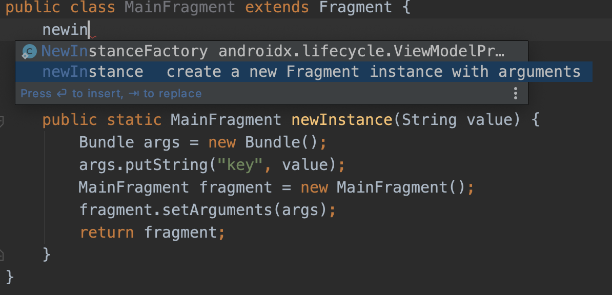

# Fragment构造

**建议使用newInstance方式创建Fragment，不建议自定义Fragment构造方法。**

原因：

1. **Fragment重建时会调用默认的无参构造方法**，如果定义了带参数的构造方法，不会被执行，可能导致Fragment的变量未初始化。
2. 使用Arguments传递参数，在重建时可以保存数据。
3. 定义newInstance方法相比由调用者主动创建并setArguments要**优雅**。
   1. 通过方法参数进行约束，避免遗漏
   2. 调用方不需要知道Bundle的key
   3. 多处调用避免重复编码
   4. 便于扩展，方法加参数时IDE会编译报错

AS支持**快捷生成模版代码**，在类体中输入`newInstance`即可，如下



# Fragment数据传递


# Arguments如何保存数据？

1. `Activity#onSaveInstanceState`的时候保存数据
2. `Activity#onCreate`的时候恢复数据

```java
//FragmentActivity
@Override
protected void onSaveInstanceState(Bundle outState) {
    super.onSaveInstanceState(outState);
    Parcelable p = mFragments.saveAllState();
    if (p != null) {
        //onSaveInstanceState保存数据
        outState.putParcelable(FRAGMENTS_TAG, p);
    }
}

@Override
protected void onCreate(@Nullable Bundle savedInstanceState) {
    mFragments.attachHost(null /*parent*/);
    if (savedInstanceState != null) {
        //onCreate时恢复数据
        Parcelable p = savedInstanceState.getParcelable(FRAGMENTS_TAG);
        mFragments.restoreSaveState(p);
    }
}
```

调用`FragmentManager#saveAllState`方法保存数据。

1. 保存Arguments到**FragmentState**中
2. 调用`saveFragmentBasicState`保存Fragment的状态、outState等
3. 保存Fragment名称列表、backStack等到**FragmentManagerState**中
4. 保存ViewModel等非序列化数据到**FragmentManagerNonConfig**中

```java
//FragmentManager
Parcelable saveAllState() {
    if (mActive.isEmpty()) {
        return null;
    }
    // First collect all active fragments.
    int size = mActive.size();
    ArrayList<FragmentState> active = new ArrayList<>(size);
    for (Fragment f : mActive.values()) {
        if (f != null) {
            //保存Arguments
            FragmentState fs = new FragmentState(f);
            active.add(fs);

            if (f.mState > Fragment.INITIALIZING && fs.mSavedFragmentState == null) {
                //保存View状态、onSaveInstanceState中添加的数据等
                fs.mSavedFragmentState = saveFragmentBasicState(f);
            } else {
                fs.mSavedFragmentState = f.mSavedFragmentState;
            }
        }
    }
    ArrayList<String> added = null;
    BackStackState[] backStack = null;
    // 保存Fragment名称列表
    size = mAdded.size();
    if (size > 0) {
        added = new ArrayList<>(size);
        for (Fragment f : mAdded) {
            added.add(f.mWho);
        }
    }

    // 保存BackStack
    if (mBackStack != null) {
        size = mBackStack.size();
        if (size > 0) {
            backStack = new BackStackState[size];
            for (int i = 0; i < size; i++) {
                backStack[i] = new BackStackState(mBackStack.get(i));
            }
        }
    }
    // 保存Fragment名称列表、backStack等到FragmentManagerState中
    FragmentManagerState fms = new FragmentManagerState();
    fms.mActive = active;
  	fms.mAdded = added;
    fms.mBackStack = backStack;
    //保存ViewModel等非序列化数据
    saveNonConfig();
    return fms;
}
```

调用`FragmentManager#restoreSaveState`方法恢复数据。

1. 通过反射调用Fragment无参构造函数，实例化Fragment，并恢复Arguments数据
2. 恢复mAdded列表
3. 恢复backStack

```java
//FragmentManager
void restoreSaveState(Parcelable state) {
    // If there is no saved state at all, then there's nothing else to do
    if (state == null) return;
    FragmentManagerState fms = (FragmentManagerState)state;
    if (fms.mActive == null) return;
  
    // Build the full list of active fragments, instantiating them from
    // their saved state.
    mActive.clear();
    for (FragmentState fs : fms.mActive) {
        if (fs != null) {
            //FragmentFactory反射调用无参构造函数，实例化Fragment，并恢复Arguments数据
            Fragment f = fs.instantiate(mHost.getContext().getClassLoader(), getFragmentFactory());
            f.mFragmentManager = this;
            mActive.put(f.mWho, f);
            fs.mInstance = null;
        }
    }

    // Build the list of currently added fragments.
    mAdded.clear();
    if (fms.mAdded != null) {
        for (String who : fms.mAdded) {
            //从Active中取出Fragment添加到mAdded中
            Fragment f = mActive.get(who);
            f.mAdded = true;
            synchronized (mAdded) {
                mAdded.add(f);
            }
        }
    }

    // Build the back stack.
    if (fms.mBackStack != null) {
        mBackStack = new ArrayList<BackStackRecord>(fms.mBackStack.length);
        for (int i=0; i<fms.mBackStack.length; i++) {
            //实例化BackStackRecord
            BackStackRecord bse = fms.mBackStack[i].instantiate(this);
            mBackStack.add(bse);
            if (bse.mIndex >= 0) {
                setBackStackIndex(bse.mIndex, bse);
            }
        }
    } else {
        mBackStack = null;
    }
}
```


