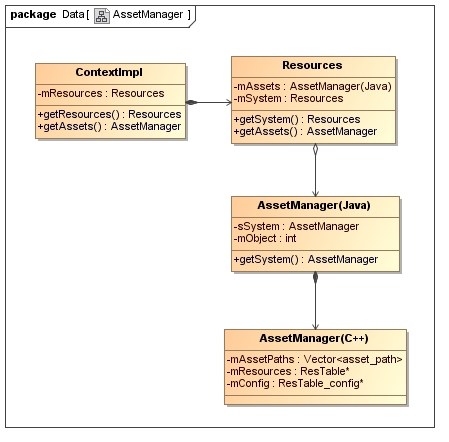
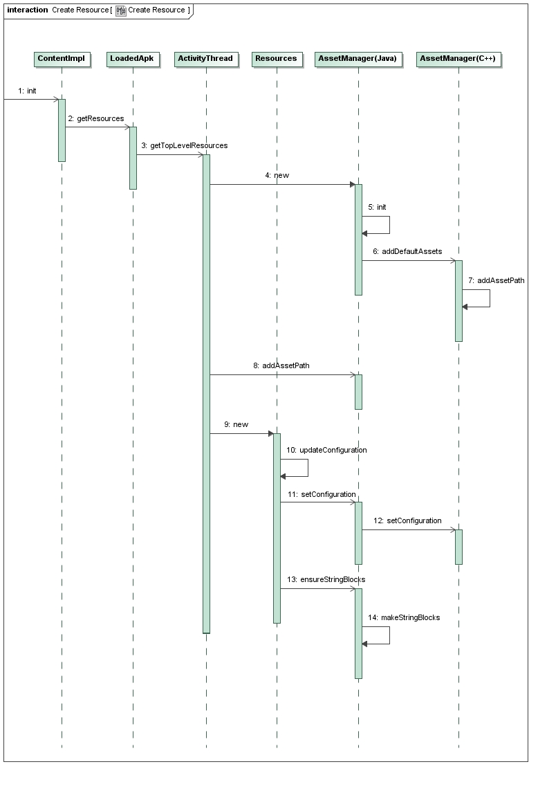

# Android资源加载流程

Resources持有AssetManager，AssetManager会调用native的AssetManager方法解析资源



通过AssetManager查找资源：编译过的资源通过id访问，未编译的资源通过文件名访问。

Resources和AssetManager中分别包含一个静态变量，用于加载`/system/framework/framework-res.apk`系统资源

此外还会加载`/data/resource-cache/`下的Overlay资源，存储Overlay apk文件路径

AssetManager.Builder.build，会将系统资源和应用资源合并，创建一个新的AssetManager

高版本通过ResourceManager创建Resources




https://blog.51cto.com/shyluo/1229260

# 插件化加载资源

```java
AssetManager assetManager;
try {
  //创建AssetManager
    assetManager = AssetManager.class.newInstance();
  //反射添加资源路径，加载资源
    Method method = AssetManager.class.getDeclaredMethod("addAssetPath", String.class);
    method.invoke(assetManager, path);
} catch (Exception e) {
    throw new SkinException(e);
}
//创建Resource对象
mResources = new Resources(
    assetManager,
    context.getResources().getDisplayMetrics(),
    context.getResources().getConfiguration()
);
```


# 插件化加载代码

1. 使用DexClassLoader加载dex包
2. loadClass加载类
3. 反射创建类的实例
4. 调用方依赖标准接口，将实例对象强转为标准接口调用

# 插件化启动没有注册的Activity

[插件化之启动没有注册的Activity](https://blog.islinjw.cn/2018/10/25/%E6%8F%92%E4%BB%B6%E5%8C%96%E4%B9%8B%E5%90%AF%E5%8A%A8%E6%B2%A1%E6%9C%89%E6%B3%A8%E5%86%8C%E7%9A%84Activity/)

原理：

1. 注册StubActivity

2. 使用动态代理创建IActivityManager

3. 代理startActivity方法，修改Intent参数，替换为StubActivity，并保存原来的目标Intent

   ```java
   //Instrumentation.java调用AMS
   ActivityManagerNative.getDefault().startActivity()
   //8.0以上替换为getService
   ActivityManager.getService().startActivity()
   ```

4. ActivityThread中会创建Activity，并通过Handler创建Activity（可以修改Handler的msg）

5. 反射获取sCurrentActivityThread静态变量，再获取ActivityThread的mH成员变量

6. 自定义Handler.Callback对象替换mH中的mCallback，重写handleMessage，获取msg中的Intent，修改intent为目标Intent

7. 启动AppCompatActivity时PMS.getActivityInfo可能会报错Activity未注册。动态代理PMS的getActivityInfo方法，替换为StubActivity

# 插件化和热修复

插件化和热修复都是通过自定义类加载器实现。

* 热修复是为了修复原有类的缺陷，所以要先加载新的类，替代原有类，类名相同。
* 插件化是为了增加新功能或新资源，所以不需要修改类加载顺序。实现更简单。

另外有的热修复框架还支持通过Diff算法对比新旧版本，生成差分包。

