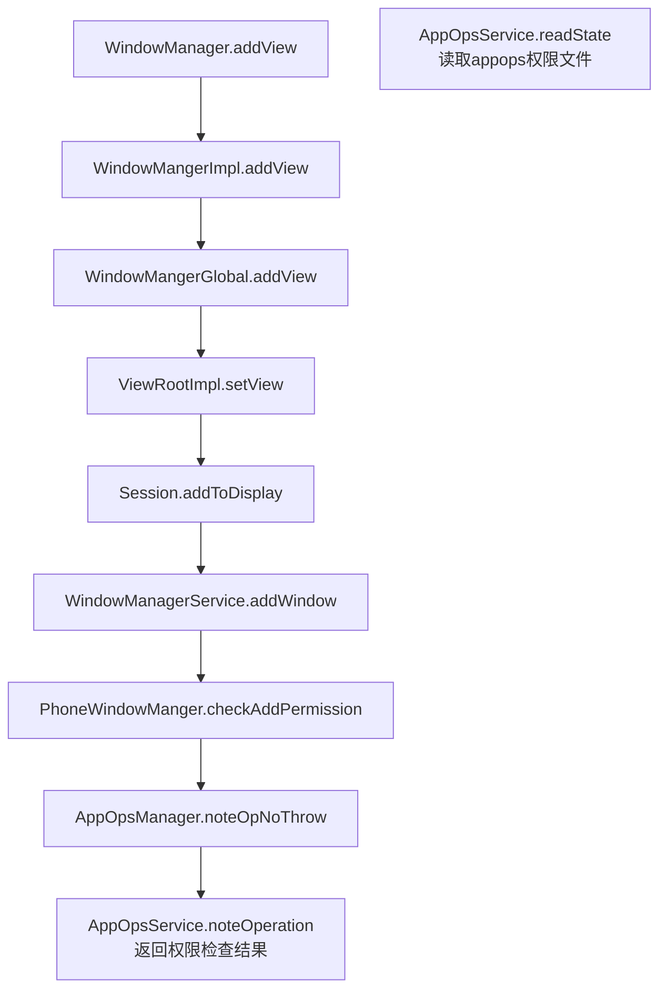

版本适配：[官方文档](https://developer.android.com/about/versions/marshmallow/android-6.0-changes?hl=zh-cn)

https://developer.android.google.cn/about/versions

* 5.1：MaterialDesign
* 6.0：权限，危险权限，权限组。悬浮窗权限跳转到settings特殊申请。移除Apache Http客户端
* 7.0：directBoot、v2签名、org.apache不支持、非公开so库链接限制
* 8.0：
  * 限制后台应用启动后台服务（前台应用不受限制），需要使用`startForegroundService`启动前台服务，并且在服务创建后五秒内调用`startForeground`方法打开一个通知。否则会出现ANR
  * 引入通知渠道
  * 部分**静态隐式**广播无法接收，需要指定Component（不包含开机广播，应用安装广播）
  * 对TYPE_TOAST做了限制
* 9.0：
  * 禁止明文传输
  * 非公开sdk使用限制（SDK中的@hide api无法使用反射访问到。AOSP自行添加的framework的jar包无法使用，需要添加白名单，或者系统签名）
  * 启动前台服务需要注册`android.permission.FOREGROUND_SERVICE`权限

* 10.0：限制后台服务启动Activity。除非处于前台或者有`SYSTEM_ALERT_WINDOW`权限等场景

# DirectBoot

Caused by: java.lang.IllegalStateException: SharedPreferences in credential encrypted storage are not available until after user is unlocked
[](https://developer.android.com/training/articles/direct-boot?hl=zh-cn)

https://blog.csdn.net/ShiShiLunHui/article/details/121246836

## Android 8.0启动后台服务

Android8.0限制**后台应用**（前台应用不受限制）创建**后台服务**，需要调用startForegroundService启动服务。

```shell
Caused by: java.lang.IllegalStateException: Not allowed to start service Intent { cmp=com.afauria.iot/.IoTService }: app is in background uid UidRecord{1eeb6b7 u0a41 SVC  idle change:idle|uncached procs:1 seq(0,0,0)}
```

```kotlin
if (Build.VERSION.SDK_INT >= Build.VERSION_CODES.O) {
	startForegroundService(Intent(this, IoTService::class.java))
} else {
	startService(Intent(this, IoTService::class.java))
}
```

应用需要5s内调用startForeground()将服务设置为前台服务。否则会报ANR。如果这期间有其他异常，会报其他异常退出

```shell
2021-01-04 15:59:12.611 2872-2946/system_process E/ActivityManager: ANR in com.afauria.iot
    PID: 7972
    Reason: Context.startForegroundService() did not then call Service.startForeground(): ServiceRecord{e669e2d u0 com.afauria.iot/.IoTService}
```

Android 8.0启动通知需要设置通知渠道，否则会报异常

```shell
android.app.RemoteServiceException: Bad notification for startForeground: java.lang.RuntimeException: invalid channel for service notification: Notification(channel=null pri=0 contentView=null vibrate=null sound=null defaults=0x0 flags=0x40 color=0x00000000 vis=PRIVATE)
```

```java
val notification = if (Build.VERSION.SDK_INT >= Build.VERSION_CODES.O) {
	val channel = NotificationChannel(CHANNEL_ID, CHANNEL_NAME, IMPORTANCE_HIGH)
	val manager = getSystemService(Context.NOTIFICATION_SERVICE) as NotificationManager
	manager.createNotificationChannel(channel)
	Notification.Builder(this, CHANNEL_ID).build()
} else {
	Notification()
}
startForeground(NOTIFICATION_ID, notification)
```

Android 9.0启动前台服务startForeground需要在Manifest中注册权限

```shell
Caused by: java.lang.SecurityException: Permission Denial: startForeground from pid=13556, uid=10041 requires android.permission.FOREGROUND_SERVICE
```


## Service启动dialog

新线程更新UI崩溃。

ViewRootImpl创建时，设置原始线程mThread，requestLayout的时候会检查当前线程是否是原始线程。

Activity.onCreate的时候ViewRootImpl还没创建完成，此时子线程可以更新UI。

Dialog会创建一个新的ViewRootImpl，可以不在主线程创建。

```shell
android.view.ViewRootImpl$CalledFromWrongThreadException: 
Only the original thread that created a view hierarchy can touch its views.
```

子线程创建Dialog异常。

Dialog会创建Handler，Handler初始化需要获取Looper，子线程默认没有Looper，需要先调用Looper.prepare或者传入Looper

```shell
2021-01-26 15:16:21.672 10658-10781/com.afauria.smarthome.test E/AndroidRuntime: FATAL EXCEPTION: Firebase-FCMTestService
    Process: com.afauria.smarthome.test, PID: 10658
    java.lang.RuntimeException: Can't create handler inside thread Thread[Firebase-FCMTestService,5,main] that has not called Looper.prepare()
        at android.os.Handler.<init>(Handler.java:205)
        at android.os.Handler.<init>(Handler.java:118)
        at android.app.Dialog.<init>(Dialog.java:123)
        at android.app.Dialog.<init>(Dialog.java:149)
        at com.afauria.smarthome.test.FCMTestService.onMessageReceived(FCMTestService.kt:50)
        at com.google.firebase.messaging.FirebaseMessagingService.zzd(Unknown Source:60)
        at com.google.firebase.iid.zzc.run(Unknown Source:2)
        at java.util.concurrent.ThreadPoolExecutor.runWorker(ThreadPoolExecutor.java:1167)
        at java.util.concurrent.ThreadPoolExecutor$Worker.run(ThreadPoolExecutor.java:641)
        at com.google.android.gms.common.util.concurrent.zza.run(Unknown Source:6)
        at java.lang.Thread.run(Thread.java:764)
```

```kotlin
//传入Looper，到主线程创建Dialog
Handler(Looper.getMainLooper()).post {
	val dialog = Dialog(context)
	...
	dialog.show()
}
//子线程设置为Looper线程
Looper.prepare()
val dialog = Dialog(context)
	...
dialog.show()
Looper.loop()
```

Service创建Dialog异常，Activity的Context才能添加Dialog。

```shell
2021-01-26 15:13:55.110 10005-10005/com.afauria.smarthome E/AndroidRuntime: FATAL EXCEPTION: main
    Process: com.afauria.smarthome, PID: 10005
    android.view.WindowManager$BadTokenException: Unable to add window -- token null is not valid; is your activity running?
        at android.view.ViewRootImpl.setView(ViewRootImpl.java:808)
        at android.view.WindowManagerGlobal.addView(WindowManagerGlobal.java:371)
        at android.view.WindowManagerImpl.addView(WindowManagerImpl.java:93)
        at android.app.Dialog.show(Dialog.java:329)
        at com.afauria.smarthome.FcmListenerService$onMessageReceived$2.run(FcmListenerService.kt:34)
        at android.os.Handler.handleCallback(Handler.java:873)
        at android.os.Handler.dispatchMessage(Handler.java:99)
        at android.os.Looper.loop(Looper.java:193)
        at android.app.ActivityThread.main(ActivityThread.java:6669)
        at java.lang.reflect.Method.invoke(Native Method)
        at com.android.internal.os.RuntimeInit$MethodAndArgsCaller.run(RuntimeInit.java:493)
        at com.android.internal.os.ZygoteInit.main(ZygoteInit.java:866)
```

原因：WindowManagerService.addWindow检查window token为null，且Type不为悬浮窗type，返回错误

* startActivity构建ActivityRecord->ActivityRecord中创建App Token->ActivityStack.startActivityLocked()创建ActivityRecord。createWindowContainer中创建window token->window token保存在DisplayContent的mTokenMap中
* [token创建流程](https://www.jianshu.com/p/3d7e91b2253d)

解决方案：设置type，获取权限

注：

8.0窗口类型换为TYPE_APPLICATION_OVERLAY

```java
 if(Build.VERSION.SDK_INT>=Build.VERSION_CODES.O){
	dialog.getWindow().setType(WindowManager.LayoutParams.TYPE_APPLICATION_OVERLAY);
}else{
	dialog.getWindow().setType(WindowManager.LayoutParams.TYPE_TOAST);
}
```

悬浮窗需要申请权限android.permission.SYSTEM_ALERT_WINDOW。

* 6.0以下Manifest注册。
* 6.0以上Manifest注册无效，需要跳转到Settings页面申请

TYPE_TOAST不需要权限：源码PhoneWindowManager.checkAddPermission，跳过了toast的检查

8.0以上限制TYPE_TOAST显示：源码WindowManagerService.doesAddToastWindowRequireToken

	* 可以修改app targetSdkVersion，小于26

TYPE_SYSTEM_OVERLAY无法获取焦点和事件：源码PhoneWindowManager.adjustWindowParamsLw

```shell
2021-01-26 15:18:53.657 10888-10888/? E/AndroidRuntime: FATAL EXCEPTION: main
    Process: com.afauria.smarthome.test, PID: 10888
    android.view.WindowManager$BadTokenException: Unable to add window android.view.ViewRootImpl$W@ea8b1b5 -- permission denied for window type 2038
        at android.view.ViewRootImpl.setView(ViewRootImpl.java:832)
        at android.view.WindowManagerGlobal.addView(WindowManagerGlobal.java:371)
        at android.view.WindowManagerImpl.addView(WindowManagerImpl.java:93)
        at android.app.Dialog.show(Dialog.java:329)
        at com.afauria.smarthome.test.FCMTestService$onMessageReceived$2.run(FCMTestService.kt:53)
        at android.os.Handler.handleCallback(Handler.java:873)
        at android.os.Handler.dispatchMessage(Handler.java:99)
        at android.os.Looper.loop(Looper.java:193)
        at android.app.ActivityThread.main(ActivityThread.java:6669)
        at java.lang.reflect.Method.invoke(Native Method)
        at com.android.internal.os.RuntimeInit$MethodAndArgsCaller.run(RuntimeInit.java:493)
        at com.android.internal.os.ZygoteInit.main(ZygoteInit.java:866)
```

```java
 if (!Settings.canDrawOverlays(MainActivity.this)) {
	Toast.makeText(this, "can not DrawOverlays", Toast.LENGTH_SHORT).show();
	Intent intent = new Intent(Settings.ACTION_MANAGE_OVERLAY_PERMISSION, Uri.parse("package:" + MainActivity.this.getPackageName()));
	startActivityForResult(intent, OVERLAY_PERMISSION_REQ_CODE);
} else {
	// Already hold the SYSTEM_ALERT_WINDOW permission, do addview or something.
}
```


通过Activity显示弹窗：

非Activity Context启动Activity需要加FLAG_ACTIVITY_NEW_TASK。[Context适用范围](https://blog.csdn.net/jia635/article/details/52387658)

```shell
called with pending exception android.util.AndroidRuntimeException: Calling startActivity() from outside of an Activity  context requires the FLAG_ACTIVITY_NEW_TASK flag. Is this really what you want?
```

10.0：限制后台服务启动Activity。除非处于前台或者有`SYSTEM_ALERT_WINDOW`权限等场景。需要通过通知打开

```json
//9256源码
ActivityStarter.executeRequest
->ActivityStarter.handleBackgroundActivityAbort
->ActivityStarter.shouldAbortBackgroundActivityStart//允行启动的条件
->ActivityManagerService.isBackgroundActivityStartsEnabled
->ActivityManagerConstants.mFlagBackgroundActivityStartsEnabled
//9256大象画报无法弹出Activity问题，系统修改mFlagBackgroundActivityStartsEnabled，将开关默认打开
```




**可以通过`appops set 包名 SYSTEM_ALERT_WINDOW allow`命令授予权限。也可以调用AppOpsManager和AppOpsService服务setMode方法授予权限**

普通权限可以通过pm命令授予，例如： pm grant package android.permission.CAMERA

# 悬浮窗权限问题

**可以通过`appops set 包名 SYSTEM_ALERT_WINDOW allow`命令授予权限。也可以调用AppOpsManager和AppOpsService服务setMode方法授予权限**

### SYSTEM_ALERT_WINDOW权限用处：

1. 添加全局系统弹窗；
2. Android10后台服务不允许启动Activity，声明该权限可解决。

### 权限声明：

6.0以下：manifest中直接声明
6.0以上：无法动态申请，需要通过intent跳转到Settings页面手动打开。TV上Settings被阉割，没有该页面。

### 原来的做法：

1. 大象画报后台无法启动Activity：9256 Android11强制关闭后台服务不允许启动Activity的限制。
2. 系统签名。
3. 系统预置权限。
4. 系统修改源码，根据包名跳过权限检查。

### 方案对比：

| 纬度     | 系统预置权限                             | 系统修改源码，加白名单  | tvapi添加接口               | Settings无感知实现。不提供UI           | Settings实现+UI                                              |
| -------- | ---------------------------------------- | ----------------------- | --------------------------- | -------------------------------------- | ------------------------------------------------------------ |
| 难易度   | 推动不同方案实现                         | 推不同方案实现，导入CBB | 需要推不同方案实现，导入CBB | Settings实现动态授权，避免处理交互问题 | 需要考虑交互问题：“弹窗提示”，用户选择“不再询问”、“下次提醒”等复杂场景， |
| 可维护性 | 每个方案单独维护                         | 每个方案单独维护        | 每个方案单独维护            | Settings不分方案，智研维护             |                                                              |
| 易用性   | 三方应用不需要改动                       | 三方应用不需要改动      | 三方应用需要依赖tvapi接口   | 三方应用启动服务或者发送广播           | 三方应用使用原生方式申请                                     |
| 通用性   | 系统适配多个三方应用                     | 系统添加多个应用白名单  | 三方应用自行调用            | 三方应用自行调用                       | 三方应用自行调用                                             |
| 影响范围 | 已量产的不支持，均需更新系统或者系统应用 |                         |                             |                                        |                                                              |
| 其他     | 功能划分来说放在settings更合理           |                         |                             |                                        |                                                              |


# Uri访问权限问题

多媒体打开html文件，html文件中引用的图片无法显示。

多媒体打开html文件：通过Intennt.ACTION_VIEW，找到HtmlViewer App打开。

1. Android N以下使用`Uri.fromFile`给外部访问。Android N以上使用FileProvider共享文件给其他APP。否则会报`FileUriExposedException`异常
2. 需要给其他应用授权访问uri。否则会提示`java.lang.SecurityException: Permission Denial:....requires the provider be exported, or grantUriPermission()`
3. 设置` intent.setFlags(Intent.FLAG_GRANT_READ_URI_PERMISSION);`，再调用`intent.setData(uri)`，会给目标应用授权访问uri
4. 由于html内部使用相对路径引用图片资源等，这些文件没有经过授权，HtmlViewer无法访问
5. 解决方案1：手动调用`grantUriPermission(String toPackage, Uri uri, int modeFlags)`临时授权，关机失效，也可以通过`revokeUriPermission(Uri uri, int modeFlags)`手动取消授权
   1. `toPackage`：可以通过`queryIntentActivities`找到目标应用的包名
   2. `uri`：需要给整个文件夹授权
   3. `Intent.FLAG_GRANT_PREFIX_URI_PERMISSION`：匹配前缀，不加的话需要uri完全匹配。
6. 解决方案2：永久授权，关机不会失效。通过`/data/system/urigrants.xml`配置权限，AMS开机的时候会读取该文件，保存权限。源码：`ActivityManagerService -> readGrantedUriPermissionsLocked`。
7. 代码永久授权：`takePersistableUriPermission(@NonNull Uri uri, @Intent.AccessUriMode int modeFlags)`
   1. A应用打开B应用的时候`intent.setFlags(Intent.FLAG_GRANT_PERSISTABLE_URI_PERMISSION)`，表示允许B应用执行永久授权
   2. B应用调用`takePersistableUriPermission`，会通过AMS写`urigrants.xml`文件，源码：`ActivityManagerService -> writeGrantedUriPermissions`
8. `urigrants.xml`文件格式如下：

```xml
<?xml version='1.0' encoding='utf-8' standalone='yes' ?>
<uri-grants>
<uri-grant sourceUserId="0" targetUserId="0" sourcePkg="com.afauria.example" targetPkg="com.android.htmlviewer" uri="content://com.afauria.example.fileProvider" prefix="true" modeFlags="1" />
</uri-grants>
```


```java
//Android N 需要使用FileProvider共享文件，否则会报FileUriExposedException异常
if (Build.VERSION.SDK_INT >= Build.VERSION_CODES.N) {
  //设置允许访问uri权限，只允许了该文件uri
    intent.setFlags(Intent.FLAG_GRANT_READ_URI_PERMISSION);
    Uri contentUri;
    contentUri = FileProvider.getUriForFile(this, BuildConfig.APPLICATION_ID + ".fileProvider", file);
    intent.setDataAndType(contentUri, type);

  //html文件中通过相对路径引用了图片等资源，因此需要给整个文件夹uri授权
    Uri uri = FileProvider.getUriForFile(this, BuildConfig.APPLICATION_ID + ".fileProvider", new File(""));
    List<ResolveInfo> resolveInfos = getPackageManager().queryIntentActivities(intent, PackageManager.MATCH_DEFAULT_ONLY);
    for (ResolveInfo resolveInfo : resolveInfos) {
      //通过Intent.FLAG_GRANT_PREFIX_URI_PERMISSION设置前缀匹配
        grantUriPermission(resolveInfo.activityInfo.packageName, uri, Intent.FLAG_GRANT_READ_URI_PERMISSION | Intent.FLAG_GRANT_PREFIX_URI_PERMISSION);
    }
} else {
    intent.setDataAndType(Uri.fromFile(file), type);
}
```

Android N以上且targetVersion >= N需要使用FileProvider共享文件，无法直接用`file://`，否则会抛异常`FileUriExposedException`

并设置权限：`intent.setFlags(Intent.FLAG_GRANT_READ_URI_PERMISSION);`。否则会提示Permission Denial

```shell
java.lang.SecurityException: Permission Denial: reading android.support.v4.content.FileProvider uri content://xxxx.fileProvider/all_files/storage/2513-1203/0/all.css from pid=2770, uid=10061 requires the provider be exported, or grantUriPermission()
```

Android11强制使用，不受targetVersion限制。


## 常用路径

android系统常用配置路径：可以通过find . -name 文件名查找文件

1. appops权限路径：`/data/system/appops.xml`
2. 运行时权限：`/data/system/users/0/runtime-permissions.xml`
3. `/system/etc/permissions`、`/vendor/etc/permissions`
4. `/system/etc/default_permissions/default-permissions.xml`、`/system/etc/default_permissions/open app-permissions.xm`
5. settings provider属性：`/data/system/users/0/settings_global.xml`
6. 所有应用权限：/data/system/packages.xml
7. uri访问权限：/data/system/urigrants.xml

```xml
<?xml version='1.0' encoding='utf-8' standalone='yes' ?>
<uri-grants>
<uri-grant sourceUserId="0" targetUserId="0" sourcePkg="com.afauria.media" targetPkg="com.android.htmlviewer" uri="content://com.afauria.media.fileProvider" prefix="true" modeFlags="1" />
</uri-grants>
```

# Android11 Launcher使用framework自定义jar包访问异常

Android 9开始

```shell
01-05 21:17:24.615  6499  6499 W .launcher.spac: Accessing hidden field Lcom/afauria/api/aidl/EntityInputSource;->category:Lcom/afauria/api/aidl/EnumInputSourceCategory; (blacklist, linking, denied)
01-05 21:17:24.615  6499  6499 W .launcher.spac: Accessing hidden field Lcom/afauria/api/aidl/EnumInputSourceCategory;->INPUTSOURCE_HDMI:Lcom/afauria/api/aidl/EnumInputSourceCategory; (blacklist, linking, denied)
```

解决方案：添加白名单配置

```shell
#源码中要修改的文件：
frameworks/base/data/etc/hiddenapi-package-whitelist.xml

#ROM中对应的文件：
/system/etc/sysconfig # ls hiddenapi-package-whitelist.xml
```

# 广播

在android3.1以后的版本中，如果程序被强制停止后应用状态会被标记为STOPPED，此时应用无法收到其他应用的广播，要等到应用再开启一次，将STOPPED去掉以后才可以。除此之外还有一个解决方法如下：

在广播发发送方发送广播时需要设置Intent.FLAG_INCLUDE_STOPPED_PACKAGES
