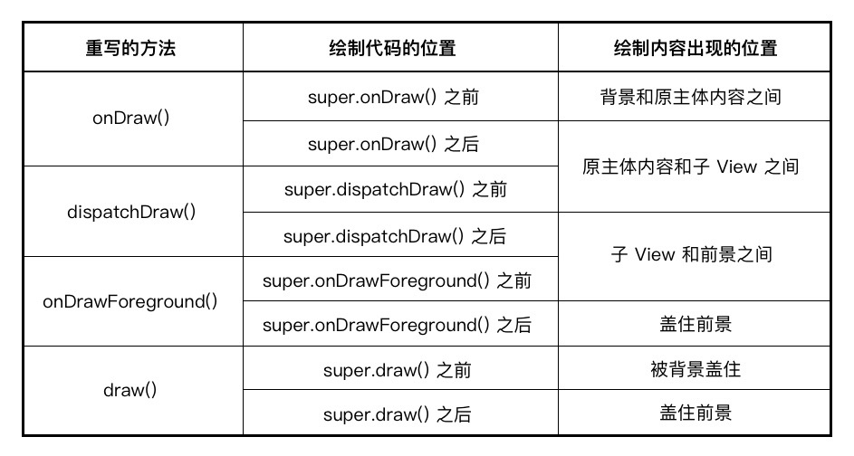

# 自定义View分类

* 继承特定View，重写绘制：例如`ImageView`上画文字，小红点
* 继承ViewGroup：inflate xml布局，例如标题栏（也可以include）
* 继承ViewGroup：add组装其他View
* 继承普通View，重写onMeasure、onLayout、onDraw方法

# 自定义View步骤

重写onMeasure()->onLayout()->onDraw()

onMeasure：参数是父View传进来的可用空间

* 如果是View，计算自身的空间
* 如果是ViewGroup，需要遍历计算子View的空间

结合可用空间和开发者定义的空间得出正确的尺寸

### MeasureSpec

32位，前2位表示3种测量模式，后30位是大小

# 控制绘制顺序

图片来源于HenCoder大佬的教程，自定义View讲的很详细很清楚：[HenCoder Android 开发进阶：自定义 View 1-5 绘制顺序](https://hencoder.com/ui-1-5/)

# 自定义属性
