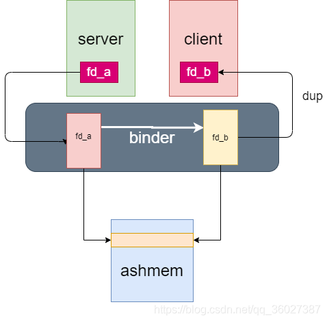

由于Binder驱动的限制，传输数据不能超过1M-8K，否则会抛出`TransactionTooLargeException`异常。

对于大数据传输，可以使用共享内存，没有大小限制。

# 匿名共享内存

Android提供了共享内存机制——Ashmem（Anonymous Shared Memory，匿名共享内存），基于Linux的mmap系统调用，可以将同一段物理内存映射到不同进程各自的虚拟地址空间，实现高效的进程间共享。

原理：

1. A进程创建共享内存，写入数据
2. 通过Binder跨进程传递共享内存的文件描述符FD（句柄）
3. B进程通过句柄读取共享内存数据。



## 使用方式

### C++

使用`IAllocator`、`IMemory`、`hidl_memory`、`hidl_handle`等接口实现共享内存。Java层也封装了对应的接口

### Java

封装了`MemoryFile`或`SharedMemory`类，本质也是调用native方法

首先写一个服务端，这个服务端中在远程调用的的时候，要做以下事情：

1. 创建一个匿名共享内存
2. 往这个共享内存中写一个字符数据
3. 将这个匿名共享内存的文件句柄通过binder机制传递给客户端

```java
package com.kobe.ashmen;

import android.app.Service;
import android.content.Intent;
import android.os.Binder;
import android.os.IBinder;
import android.os.MemoryFile;
import android.os.Parcel;
import android.os.ParcelFileDescriptor;
import android.os.RemoteException;

import java.io.FileDescriptor;
import java.lang.reflect.Method;


public class RemoteService extends Service {

   @Override
   public IBinder onBind(Intent intent) {
       return new MyBinder();
   }

   public class MyBinder extends Binder {
       @Override
       protected boolean onTransact(int code, Parcel data,
                                    Parcel reply, int flags) throws RemoteException {
           if (code == 1) {
               try {
                   String str = "kobewang";
                   byte[] contentBytes = str.getBytes();
                   //创建匿名共享内存
                   MemoryFile mf = new MemoryFile("memfile", contentBytes.length);
                   //写入字符数据
                   mf.writeBytes(contentBytes, 0, 0, contentBytes.length);
                   Method method = MemoryFile.class.getDeclaredMethod("getFileDescriptor");
                   //通过反射获得文件句柄
                   FileDescriptor fd = (FileDescriptor) method.invoke(mf);
                   ParcelFileDescriptor pfd = ParcelFileDescriptor.dup(fd);
                   //将文件句柄写到binder调用的返回值中。
                   reply.writeFileDescriptor(fd);
                   return true;
               } catch (Exception e) {
                   e.printStackTrace();
               }
           }
           return super.onTransact(code, data, reply, flags);
       }
   }
}
```

再写一个客户端，主要做以下事情：

1. bindservice获得服务端的binder对象
2. 调用binder的接口获得服务端匿名共享内存的文件句柄
3. 通过文件句柄，直接访问匿名共享内存中的数据，并打印出log。

```java
package com.kobe.ashmen;

import android.content.ComponentName;
import android.content.Context;
import android.content.Intent;
import android.content.ServiceConnection;
import android.os.IBinder;
import android.os.Parcel;
import android.support.v7.app.AppCompatActivity;
import android.os.Bundle;
import android.util.Log;

import java.io.BufferedReader;
import java.io.FileDescriptor;
import java.io.FileReader;

public class MainActivity extends AppCompatActivity {

    @Override
    protected void onCreate(Bundle savedInstanceState) {
        super.onCreate(savedInstanceState);
        setContentView(R.layout.activity_main);
        //绑定服务
        Intent intent = new Intent(this, RemoteService.class);
        bindService(intent, new ServiceConnection() {
            @Override
            public void onServiceConnected(ComponentName name, IBinder service) {
                Parcel data = Parcel.obtain();
                Parcel reply = Parcel.obtain();
                try {
                    //通过binder机制跨进程调用服务端的接口
                    service.transact(1, data, reply, 0);
                    //获得RemoteService创建的匿名共享内存的fd
                    FileDescriptor fd = reply.readFileDescriptor().getFileDescriptor();
                    //读取匿名共享内存中的数据，并打印log
                    BufferedReader br = new BufferedReader(new FileReader(fd));
                    Log.v("kobe-result", br.readLine());
                } catch (Exception e) {
                    e.printStackTrace();
                }

            }

            @Override
            public void onServiceDisconnected(ComponentName name) {

            }

        }, Context.BIND_AUTO_CREATE);
    }
}
```

注册服务端，指定新进程

```xml
<?xml version="1.0" encoding="utf-8"?>
<manifest xmlns:android="http://schemas.android.com/apk/res/android"
    package="com.kobe.ashmen">

    <application
        android:allowBackup="true"
        android:icon="@mipmap/ic_launcher"
        android:label="@string/app_name"
        android:roundIcon="@mipmap/ic_launcher_round"
        android:supportsRtl="true"
        android:theme="@style/AppTheme">
        <activity android:name=".MainActivity">
            <intent-filter>
                <action android:name="android.intent.action.MAIN" />

                <category android:name="android.intent.category.LAUNCHER" />
            </intent-filter>
        </activity>
        <service
            android:name=".RemoteService"
            android:process=":RemoteService" />
    </application>

</manifest>
```

## 案例

1. Android的`SurfaceFlinger`服务：APP进行渲染，将绘制信息保存到应用进程的共享内存映射中，`SurfaceFlinger`进程收集各个窗口视图，合成最终的画面。


# FileProvider

FileProvider也是通过跨进程传递文件FD，从而读取文件流。

早期的安卓系统通过`file://`类型的Uri来访问其他应用的文件，应用需要修改文件的系统访问权限，这样会导致其他应用也能访问该文件。

Android 7.0 引入`FileProvider`，可以授予其他应用访问内部文件的临时权限，并且可随时撤销。

> 也可以授予永久权限：原理是写入`urigrants.xml`文件，开机系统会读取该文件，进行授权。

用途：通过`PackageInstaller`程序安装应用内的APK、使用浏览器打开应用内的HTML文件、拍照预览、共享等

# 结语

参考资料：

* [FileProvider 原理简单分析](https://www.jianshu.com/p/9b375ca4556f)
* [安卓共享内存](https://blog.csdn.net/qq_36027387/article/details/106221324)
