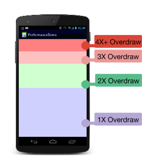

# 过度绘制

概念：屏幕上某一像素点在一帧中被重复绘制多次

检查过度绘制

* 可以在开发者模式下打开GPU过度绘制
* 命令行开启/关闭：`adb shell setprop debug.hwui.overdraw show/false`
* 使用 AndroidStudio 的LayoutInspector捕获当前页面布局，可以查看当前页面布局层级

原色（无过度绘制，即正常绘制1次）<蓝色（过度绘制x1）<绿色<粉色<红色



方法：减少布局层级、减少不必要的背景，避免过度绘制

# 布局优化

## 使用ConstraintLayout，减少布局层级

## merge：减少布局层级

1. 作为根布局，配合include使用
2. 不能设置属性
3. 使用inflate加载的时候，root不为空，且attachToRoot为true

```xml
<!--使用方法-->
<?xml version="1.0" encoding="utf-8"?>
<merge xmlns:android="http://schemas.android.com/apk/res/android">
  <Button 
          android:layout_width="match_parent"  
          android:layout_height="wrap_content"  
          android:layout_marginLeft="20dp"  
          android:layout_marginRight="20dp"  
          android:text="按钮" /> 
</merge>
```

源码：

```java
   public View inflate(XmlPullParser parser, @Nullable ViewGroup root, boolean attachToRoot) {        
   	... 
     if (TAG_MERGE.equals(name)) {
       if (root == null || !attachToRoot) {
         throw new InflateException("<merge /> can be used only with a valid "
                                    + "ViewGroup root and attachToRoot=true");
       }
       rInflate(parser, root, inflaterContext, attrs, false);
     }
     ...
   }
```

## ViewStub：懒加载、按需加载

1. 调用inflate真正加载布局，未加载前不可见，inflate之后会remove空View，替换真正的布局
2. 不支持merge标签
3. 只能inflate一次，再次inflate会抛异常
4. 需要指定宽高属性

```xml
<!--使用方法-->
<LinearLayout xmlns:android="http://schemas.android.com/apk/res/android"
              xmlns:tools="http://schemas.android.com/tools"
              android:layout_width="match_parent"
              android:layout_height="match_parent">
	...
	<ViewStub
          android:id="@+id/viewstub"
          android:layout_width="match_parent"
          android:layout_height="wrap_content"
          android:layout="@layout/layout_weather_info" />
  ...
</LinearLayout>
```

```java
//代码中加载
ViewStub stub = ((ViewStub) findViewById(R.id.viewstub));
if(stub != null){
	View stubView = stub.inflate();
	TextView city = (TextView) stubView.findViewById(R.id.city); 
	TextView temperature = (TextView) stubView.findViewById(R.id.temperature);
}
```

源码如下

```java
//inflate替换布局
public View inflate() {
        final ViewParent viewParent = getParent();
        if (viewParent != null && viewParent instanceof ViewGroup) {
            if (mLayoutResource != 0) {
                final ViewGroup parent = (ViewGroup) viewParent;
                final View view = inflateViewNoAdd(parent);//inflate布局不add，将ViewStub的id设置给该布局
                replaceSelfWithView(view, parent);//移除ViewStub，添加布局到父布局中

                mInflatedViewRef = new WeakReference<>(view);
                if (mInflateListener != null) {
                    mInflateListener.onInflate(this, view);
                }
                return view;
            } else {
                throw new IllegalArgumentException("ViewStub must have a valid layoutResource");
            }
        } else {
            throw new IllegalStateException("ViewStub must have a non-null ViewGroup viewParent");
        }
}

private void replaceSelfWithView(View view, ViewGroup parent) {
        final int index = parent.indexOfChild(this);
        parent.removeViewInLayout(this);

        final ViewGroup.LayoutParams layoutParams = getLayoutParams();
        if (layoutParams != null) {
            parent.addView(view, index, layoutParams);
        } else {
            parent.addView(view, index);
        }
}
```

## include

主要用于布局重用

      1. 多个include标签，需要指定id，通过id找到子view控件
      2. layout根布局和include标签id设置相同

```xml
<include
	android:layout_width="match_parent"
	android:layout_height="40dp"
	layout="@layout/layout_title_bar" />
```
