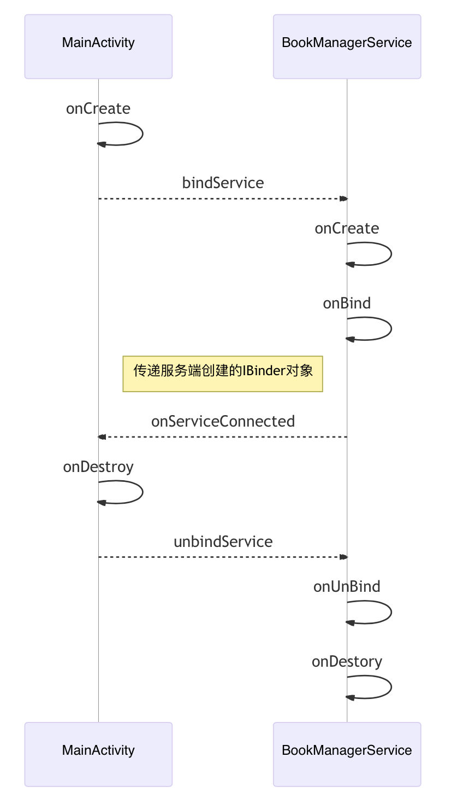

# 基本使用

例子：服务端管理一个Book列表，客户端通过IBookManager接口调用远程方法，添加和查询书籍。

> 准确的讲，服务端是方法定义方、执行方，客户端是方法调用方。
>
> 通信过程中可以互换角色，例如服务端拿到客户端的Binder对象后可以回调客户端方法，此时服务端才是调用方

这里直接贴完整的代码，避免一点一点介绍。

## 定义AIDL接口

### 创建AIDL文件

在`src/main/aidl`文件夹下创建AIDL文件，gradle会编译该目录下的aidl文件，生成相应的接口代码，避免开发者手写Parcel代码

> AIDL（Android Interface Definition Language）是一种DSL（领域特定语言），语法和Java接口类似，**不能有同名方法，也不支持重载**。
>
> Binder只负责数据传递，并不支持远程调用。远程调用无非就是客户端和服务端按照一定协议，客户端写入方法名和参数，服务端读取并解析方法名和参数，执行相应的方法。
>
> AIDL是Android提供的一种RPC机制，准确地说，AIDL只是一种RPC接口定义规范，它的作用只是在编译时生成序列化传输的代码，真正跨进程通信是靠Binder。开发者也可以手写接口代码，不通过AIDL生成。

### 支持数据类型

1. 基本数据类型、String、CharSequence、数组类型、List（接收方只创建ArrayList）、Map（接收方只创建HashMap）。
2. 对象传递只能使用Parcelable类型
   1. Android原生类型：Bundle、Intent、ParcelFileDescriptor等
   2. 自定义对象类型，需要实现Parcelable接口，并且在aidl文件中声明`parcelable`
3. 其他类型：IBinder

> List、Map是抽象类型，无法直接实例化。因此在AIDL中，接收端会将List类型组装成ArrayList，接收端会将Map类型组装成HashMap。
>
> 上述类型是AIDL语法支持的类型。实际上Parcel还支持writeException、writeFileDescriptor等，这些方法在手写AIDL接口时可以使用。

### 关键字使用

AIDL提供了oneway关键字用于修饰方法，定向标记in、out、inout用于修饰方法参数

1. **oneway不能有返回值**，否则编译会报错：`oneway method 'initBooksOneWay' cannot return a value`
2. **oneway方法可以有in参数，不能有out或者inout参数**。编译会报错：`oneway method 'addBook' cannot have out parameters`
3. 参数为非String和基本数据类型时，需要**显式地**添加数据定向Tag，否则编译会报错：`can be an out type, so you must declare it as in, out, or inout.`
4. String或基本数据类型参数**只能为in**，可以省略，使用out或者inout编译会报错：`'out String name' can only be an in parameter.`

```java
// IBookManager.aidl
package com.afauria.sample.ipc;

//对象传递只能使用Parcelable类型
//需要使用parcelable关键字声明，否则编译会报错
parcelable Book;

//可以定义Book.aidl，再import
//import com.afauria.sample.ipc.Book;

interface IBookManager {
    void initBooks();
    
    //oneway不能有返回值，否则编译会报错：oneway method 'initBooksOneWay' cannot return a value
    oneway void initBooksOneWay();
    
    //oneway方法不能有out或者inout参数。编译会报错：oneway method 'addBook' cannot have out parameters
    //oneway void addBook(out Book book);

    List<Book> listBooks();

    //参数为非String和基本数据类型时，需要添加数据定向Tag：in、out、inout，否则编译会报错：can be an out type, so you must declare it as in, out, or inout.
    void addBookIn(in Book book);

    void addBookOut(out Book book);

    void addBookInout(inout Book book);

    //参数为String或者基本数据类型时，数据定向Tag只能为in，可以省略。使用out编译会报错：'out String name' can only be an in parameter.
    Book findBook(String name);
}
```

## 定义Parcelable对象

Parcel对象是数据传递的容器，可以理解为一块内存区域，保存该内存起始地址。

跨进程数据传递本质是A进程从Parcel起始地址开始写数据，B进程从Parcel起始地址开始读数据。

> Java对象无法直接写入内存，需要展开成字符串或者基本数据类型写入，接收端读取之后再组装成Java对象。

定义Book类，实现Parcelable接口，AS可以自动生成代码

```java
public class Book implements Parcelable {
    private String name;
    private int price;
    //省略Getter、Setter方法
    //空构造函数不能省略，因为使用了out关键字
    public Book() {
    }
    public Book(String name, int price) {
        this.name = name;
        this.price = price;
    }
    protected Book(Parcel in) {
        readFromParcel(in);
    }
    //重写toString方法，便于打印日志
    @Override
    public String toString() {
        return "Book{name=" + name + ",price=" + price + "}";
    }
    //从parcel中读取数据，组装成Book对象
    public void readFromParcel(Parcel in) {
        name = in.readString();
        price = in.readInt();
    }
    //将Book对象展开，写入parcel中
    @Override
    public void writeToParcel(Parcel dest, int flags) {
        dest.writeString(name);
        dest.writeInt(price);
    }
    @Override
    public int describeContents() {
        return 0;
    }
    public static final Creator<Book> CREATOR = new Creator<Book>() {
        @Override
        public Book createFromParcel(Parcel in) {
            return new Book(in);
        }
        @Override
        public Book[] newArray(int size) {
            return new Book[size];
        }
    };
}
```

关于对象序列化方式可以查看[Android序列化](Android/序列化.md)

## 定义服务端

1. 定义Service，注册到Manifest中
2. 创建IBinder对象，实现AIDL生成的Stub抽象类的方法
3. 重写onBind方法，返回IBinder对象

```java
public class BookManagerService extends Service {
    private static final String TAG = "BookManagerService";

    private List<Book> mBooks;

    @Override
    public void onCreate() {
        Log.d(TAG, "onCreate: ");
        super.onCreate();
    }

    @Nullable
    @Override
    public IBinder onBind(Intent intent) {
        Log.d(TAG, "onBind: ");
        //创建Stub对象并返回
        return new IBookManager.Stub() {
            @Override
            public void initBooks() throws RemoteException {
                try {
                    Log.d(TAG, "initBooks start: " + Thread.currentThread());
                    //模拟耗时调用
                    Thread.sleep(5000);
                } catch (InterruptedException e) {
                    e.printStackTrace();
                }
                mBooks = new ArrayList<>();
                mBooks.add(new Book("《雪中悍刀行》", 10));
                mBooks.add(new Book("《大奉打更人》", 20));
                Log.d(TAG, "initBooks end: " + Thread.currentThread());
            }
            //同initBooks方法
            @Override
            public void initBooksOneWay() throws RemoteException {
                try {
                    Log.d(TAG, "initBooksOneWay start: " + Thread.currentThread());
                    Thread.sleep(5000);
                } catch (InterruptedException e) {
                    e.printStackTrace();
                }
                mBooks = new ArrayList<>();
                mBooks.add(new Book("《雪中悍刀行》", 10));
                mBooks.add(new Book("《大奉打更人》", 20));
                Log.d(TAG, "initBooksOneWay end: " + Thread.currentThread());
            }

            @Override
            public Book findBook(String name) throws RemoteException {
                Log.d(TAG, "findBook: " + name);
                for (Book book : mBooks) {
                    if (name.equals(book.getName())) {
                        return book;
                    }
                }
                return null;
            }

            @Override
            public void addBookIn(Book book) throws RemoteException {
                Log.d(TAG, "addBookIn: " + book);
                //修改参数对象属性
                book.setPrice(book.getPrice() + 5);
                mBooks.add(book);
            }

            @Override
            public void addBookOut(Book book) throws RemoteException {
                Log.d(TAG, "addBookOut: " + book);
                book.setPrice(book.getPrice() + 5);
                mBooks.add(book);
            }

            @Override
            public void addBookInout(Book book) throws RemoteException {
                Log.d(TAG, "addBookInout: " + book);
                book.setPrice(book.getPrice() + 5);
                mBooks.add(book);
            }

            @Override
            public List<Book> listBooks() throws RemoteException {
                Log.d(TAG, "listBooks: " + mBooks.size());
                return mBooks;
            }
        };
    }

    @Override
    public boolean onUnbind(Intent intent) {
        Log.d(TAG, "onUnbind: ");
        return super.onUnbind(intent);
    }

    @Override
    public void onDestroy() {
        Log.d(TAG, "onDestroy: ");
        super.onDestroy();
    }
}
```

## 定义客户端

1. 调用bindService绑定服务，重写`onServiceConnected`方法获取服务端的Proxy对象
2. 点击按钮调用服务端方法：分别测试在主线程调用、新线程调用、Looper子线程调用

> 省略布局代码，直接定义onClick点击事件

```java
public class MainActivity extends AppCompatActivity implements ServiceConnection {
    private static final String TAG = "MainActivity";
    IBookManager mRemoteProxy;
    private Handler mHandler;
    
    @Override
    protected void onCreate(Bundle savedInstanceState) {
        super.onCreate(savedInstanceState);
        setContentView(R.layout.activity_main);
        Intent intent = new Intent("com.afauria.sample.BookManager");
        //需要使用显式Intent
        intent.setPackage("");
        bindService(intent, this, BIND_AUTO_CREATE);
        //创建Looper子线程
        HandlerThread handlerThread = new HandlerThread("childThread");
        handlerThread.start();
        mHandler = new Handler(handlerThread.getLooper());
    }

    @Override
    protected void onDestroy() {
        super.onDestroy();
        //解绑
        unbindService(this);
    }

    @Override
    public void onServiceConnected(ComponentName name, IBinder service) {
        Log.d(TAG, "onServiceConnected: ");
        //获取服务端的Proxy对象
        mRemoteProxy = IBookManager.Stub.asInterface(service);
    }

    @Override
    public void onServiceDisconnected(ComponentName name) {
        Log.d(TAG, "onServiceDisconnected: ");
        //连接断开时调用，例如进程被杀或崩溃
        //主动unbindService不会调用
    }
    
    //onClick点击事件
    public void onInitBooksClick(View view) {
        Runnable task = new Runnable() {
            @Override
            public void run() {
                try {
                    Log.d(TAG, "onInitBooksClick before: " + Thread.currentThread());
                    //耗时调用
                    mRemoteProxy.initBooks();
                    Log.d(TAG, "onInitBooksClick after: " + Thread.currentThread());
                } catch (RemoteException e) {
                    e.printStackTrace();
                }
            }
        };
        //主线程调用测试
        task.run();
        //子线程调用测试
        //mHandler.post(task);
        //新线程调用测试
        //new Thread(task).start();
    }

    public void onInitBooksOneWayClick(View view) {
        Runnable task = new Runnable() {
            @Override
            public void run() {
                try {
                    Log.d(TAG, "onInitBooksOneWayClick before: " + Thread.currentThread());
                    //耗时调用
                    mRemoteProxy.initBooksOneWay();
                    Log.d(TAG, "onInitBooksOneWayClick after: " + Thread.currentThread());
                } catch (RemoteException e) {
                    e.printStackTrace();
                }
            }
        };
        task.run();
        //新线程调用测试
        //new Thread(task).start();
    }

    public void onListBooksClick(View view) {
        try {
            List<Book> books = mRemoteProxy.listBooks();
            Log.d(TAG, "onListBooksClick: " + books.size());
        } catch (RemoteException e) {
            e.printStackTrace();
        }
    }

    public void onAddBookInClick(View view) {
        try {
            Book book = new Book("《龙族》", 30);
            mRemoteProxy.addBookIn(book);
            Log.d(TAG, "onAddBookInClick: " + book);
        } catch (RemoteException e) {
            e.printStackTrace();
        }
    }

    public void onAddBookOutClick(View view) {
        try {
            Book book = new Book("《龙族》", 30);
            mRemoteProxy.addBookOut(book);
            Log.d(TAG, "onAddBookOutClick: " + book);
        } catch (RemoteException e) {
            e.printStackTrace();
        }
    }

    public void onAddBookInoutClick(View view) {
        try {
            Book book = new Book("《龙族》", 30);
            mRemoteProxy.addBookInout(book);
            Log.d(TAG, "onAddBookInOutClick: " + book);
        } catch (RemoteException e) {
            e.printStackTrace();
        }
    }

    public void onFindBookClick(View view) {
        try {
            Book returnBook = mRemoteProxy.findBook("《雪中悍刀行》");
            Log.d(TAG, "onFindBookClick: " + returnBook);
        } catch (RemoteException e) {
            e.printStackTrace();
        }
    }
}
```

## 服务端指定进程

`BookManagerService`和`MainActivity`运行在同一个进程中，调用AIDL接口并没有用到跨进程。

使用`android:process`指定进程名，让Service运行在新进程中，实现跨进程通信。

```xml
<service
    android:name="com.afauria.sample.ipc.server.BookManagerService"
    android:process="com.afauria.sample.ipc.process">
    <intent-filter>
        <action android:name="com.afauria.sample.BookManager" />
    </intent-filter>
</service>
```

## 总结

1. 创建AIDL文件，定义AIDL接口，编译生成Java接口
2. 自定义对象类型，需要实现Parcelable接口，才能序列化传输
3. 编写服务端代码：创建Service并在Manifest中注册，重写onBind方法，创建IBinder对象，实现AIDL生成的Stub抽象类的方法。
4. 编写客户端代码：bindService绑定服务，根据服务端的IBinder对象，创建代理对象，通过代理对象调用远程方法。
4. Service指定进程名，

# bindService生命周期

操作：打开MainActivity，返回键退出。



需要特别注意的是：

1. `bindService`返回false表示找不到服务，或者没有权限
1. `unbindService`时服务端销毁，如果没有调用的话会提示`android.app.ServiceConnectionLeaked: Activity xxx has leaked ServiceConnection xxx that was originally bound here`
2. 如果客户端已经绑定了服务，再次调用bindService不会回调`onServiceConnected`
2. `onServiceDisconnected`只在连接意外中断时调用，例如服务端进程崩溃或者终止时。主动`unbindService`不会调用
5. 如果服务端先通过startService启动，再绑定，则`unbindService`不会销毁服务端，需要调用`stopSelf`或者`stopService`才会停止。例如Activity启动时启动并绑定服务，播放音乐，Activity退出时解绑，音乐持续播放，Activity再次打开时重新绑定，控制音乐播放。
6. **多个客户端绑定同一个服务，系统会缓存IBinder对象，因此只会调用一次onBind方法，当所有客户端解绑时，服务端才会被销毁。**

> 特殊情况：多个客户端绑定同一个服务，如果Intent不相同（例如一个指定Package，一个指定Component），则会再次调用onBind，应该是考虑到服务端可能会根据Intent来创建不同的IBinder对象。

# AIDL执行线程

## 同进程调用

**客户端在哪个线程调用，服务端就在哪个线程执行**。同一个线程执行，服务端耗时会阻塞客户端。

```shell
# 客户端在主线程调用，客户端和服务端进程号均为4984
2022-05-27 18:52:06.156 4984-4984 D/MainActivity: onInitBooksClick before: Thread[main,5,main]
# 服务端在主线程中执行方法
2022-05-27 18:52:06.156 4984-4984 D/BookManagerService: initBooks start: Thread[main,5,main]
# 延时5s
2022-05-27 18:52:11.157 4984-4984 D/BookManagerService: initBooks end: Thread[main,5,main]
# 客户端主线程阻塞，直到服务端返回
2022-05-27 18:52:11.157 4984-4984 D/MainActivity: onInitBooksClick after: Thread[main,5,main]
```

> 同进程情况下，调用方可以直接创建AIDL接口实现类，不需要bindService，等AMS回调onServiceConnected。
>
> 当然有时候从架构设计和代码重用解耦的角度，也可以用bindService

```java
mRemoteProxy = new IBookManager.Stub() {
  重写方法...
};
```

## 不同进程调用

修改Manifest文件，指定`android:process`进程，点击initBooks按钮，分别在不同线程执行

实验1：客户端在主线程调用，服务端在Binder线程执行，多次调用在同一个Binder线程执行。服务端耗时会阻塞客户端

```shell
# 客户端在主线程调用，客户端进程号为4822
2022-05-27 18:50:28.918 4822-4822 D/MainActivity: onInitBooksClick before: Thread[main,5,main]
# 服务端在Binder线程中执行方法，服务端进程号为4865
2022-05-27 18:50:28.920 4865-4884 D/BookManagerService: initBooks start: Thread[Binder:4865_2,5,main]
# 延时5s
2022-05-27 18:50:33.921 4865-4884 D/BookManagerService: initBooks end: Thread[Binder:4865_2,5,main]
# 客户端主线程阻塞，直到服务端返回
2022-05-27 18:50:33.922 4822-4822 D/MainActivity: onInitBooksClick after: Thread[main,5,main]
```

实验2：客户端在同一个子线程多次调用，服务端使用同一个Binder线程，**依次排队执行任务**。

```shell
# 客户端在子线程调用
2022-05-27 19:28:32.309 7227-7276 D/MainActivity: onInitBooksClick before: Thread[childThread,5,main]
# 服务端在Binder线程中执行【Binder:7277_2】
2022-05-27 19:28:32.311 7277-7296 D/BookManagerService: initBooks start: Thread[Binder:7277_2,5,main]
2022-05-27 19:28:37.312 7277-7296 D/BookManagerService: initBooks end: Thread[Binder:7277_2,5,main]
2022-05-27 19:28:37.314 7227-7276 D/MainActivity: onInitBooksClick after: Thread[childThread,5,main]
# 使用HandlerThread，多次点击，排队执行
2022-05-27 19:28:37.314 7227-7276 D/MainActivity: onInitBooksClick before: Thread[childThread,5,main]
# 服务端重用Binder线程【Binder:7277_2】
2022-05-27 19:28:37.315 7277-7296 D/BookManagerService: initBooks start: Thread[Binder:7277_2,5,main]
2022-05-27 19:28:42.316 7277-7296 D/BookManagerService: initBooks end: Thread[Binder:7277_2,5,main]
2022-05-27 19:28:42.316 7227-7276 D/MainActivity: onInitBooksClick after: Thread[childThread,5,main]
```

实验3：客户端每次都在新线程调用，服务端Binder线程如果没被占用，则重用该Binder线程，如果已经被占用，则再随机选择其他Binder线程执行任务

```shell
# 客户端每次在新线程调用
2022-05-27 19:44:14.993 7850-7924 D/MainActivity: onInitBooksClick before: Thread[Thread-2,5,main]
2022-05-27 19:44:14.994 7882-7904 D/BookManagerService: initBooks start: Thread[Binder:7882_5,5,main]
2022-05-27 19:44:19.995 7882-7904 D/BookManagerService: initBooks end: Thread[Binder:7882_5,5,main]
2022-05-27 19:44:19.997 7850-7924 D/MainActivity: onInitBooksClick after: Thread[Thread-2,5,main]
# 等第一次执行完再点击，服务端重用Binder线程【Binder:7882_5】
2022-05-27 19:44:22.798 7850-7926 D/MainActivity: onInitBooksClick before: Thread[Thread-3,5,main]
2022-05-27 19:44:22.800 7882-7904 D/BookManagerService: initBooks start: Thread[Binder:7882_5,5,main]
2022-05-27 19:44:27.800 7882-7904 D/BookManagerService: initBooks end: Thread[Binder:7882_5,5,main]
2022-05-27 19:44:27.801 7850-7926 D/MainActivity: onInitBooksClick after: Thread[Thread-3,5,main]

# 快速点击，由于【Binder:7882_5】被占用，因此使用【Binder:7882_4】
2022-05-27 19:45:16.481 7850-7950/ D/MainActivity: onInitBooksClick before: Thread[Thread-4,5,main]
2022-05-27 19:45:16.483 7882-7904/ D/BookManagerService: initBooks start: Thread[Binder:7882_5,5,main]
2022-05-27 19:45:16.858 7850-7952/ D/MainActivity: onInitBooksClick before: Thread[Thread-5,5,main]
2022-05-27 19:45:16.859 7882-7903/ D/BookManagerService: initBooks start: Thread[Binder:7882_4,5,main]
2022-05-27 19:45:21.484 7882-7904/ D/BookManagerService: initBooks end: Thread[Binder:7882_5,5,main]
2022-05-27 19:45:21.484 7850-7950/ D/MainActivity: onInitBooksClick after: Thread[Thread-4,5,main]
2022-05-27 19:45:21.859 7882-7903/ D/BookManagerService: initBooks end: Thread[Binder:7882_4,5,main]
2022-05-27 19:45:21.860 7850-7952/ D/MainActivity: onInitBooksClick after: Thread[Thread-5,5,main]
```

## 总结

* 同进程调用：**客户端在哪个线程调用，服务端就在哪个线程执行**。同一个线程执行，服务端耗时会阻塞客户端。
* 不同进程调用：**客户端不管在哪个线程调用，服务端随机从Binder线程池中选择可用线程执行**。虽然是不同线程，但是服务端耗时依然会阻塞客户端。
* 由于服务端会随机选择Binder线程执行方法，因此**多次调用存在并发问题，需要考虑线程安全**。
* 由于服务端会阻塞客户端执行，因此客户端在同一个线程多次调用时，是排队执行的
* **跨进程调用始终会阻塞客户端，因此在服务端方法中不应该执行耗时操作**。解决方法如下
  * 客户端在子线程中调用服务端方法，避免阻塞UI线程
  * 服务端创建新线程执行耗时操作，服务端执行start线程之后方法返回。
  * 使用oneway关键字，方法立即返回，不等待服务端执行。
  * 对于上面2、3种方法，如果客户端需要接收服务端的结果，则需要将客户端的IBinder对象传给服务端，执行完毕后**回调通知**客户端。

> 即使处于不同进程，服务端依然会阻塞客户端。
>
> 之所以这么设计，是为了符合开发者的习惯。将跨进程调用当作普通的方法调用，由方法的调用方和执行方自行处理耗时逻辑。

# oneway

## 实验

实验1：客户端在主线程调用，立即返回，不等待服务端执行结果。快速点击多次，服务端依次排队执行，使用随机线程

```shell
# 快速点击多次，服务端排队执行，使用随机线程
2022-05-30 16:53:37.519 7127-7127 D/MainActivity: onInitBooksOneWayClick before: Thread[main,5,main]
# 客户端调用oneway方法立即返回，不等待服务端执行完毕
2022-05-30 16:53:37.521 7127-7127 D/MainActivity: onInitBooksOneWayClick after: Thread[main,5,main]
# 服务端使用【Binder:7173_3】线程
2022-05-30 16:53:37.522 7173-7193 D/BookManagerService: initBooksOneWay start: Thread[Binder:7173_3,5,main]
2022-05-30 16:53:37.816 7127-7127 D/MainActivity: onInitBooksOneWayClick before: Thread[main,5,main]
2022-05-30 16:53:37.816 7127-7127 D/MainActivity: onInitBooksOneWayClick after: Thread[main,5,main]
2022-05-30 16:53:38.121 7127-7127 D/MainActivity: onInitBooksOneWayClick before: Thread[main,5,main]
2022-05-30 16:53:38.122 7127-7127 D/MainActivity: onInitBooksOneWayClick after: Thread[main,5,main]
# 服务端等待5s之后执行结束，开始下一个任务
2022-05-30 16:53:42.523 7173-7193 D/BookManagerService: initBooksOneWay end: Thread[Binder:7173_3,5,main]
2022-05-30 16:53:42.524 7173-7193 D/BookManagerService: initBooksOneWay start: Thread[Binder:7173_3,5,main]
2022-05-30 16:53:47.564 7173-7193 D/BookManagerService: initBooksOneWay end: Thread[Binder:7173_3,5,main]
# 服务端使用【Binder:7173_2】线程
2022-05-30 16:53:47.565 7173-7192 D/BookManagerService: initBooksOneWay start: Thread[Binder:7173_2,5,main]
2022-05-30 16:53:52.603 7173-7192 D/BookManagerService: initBooksOneWay end: Thread[Binder:7173_2,5,main]
```

实验2：客户端快速点击多次，每次开启新线程，服务端依次排队执行，使用随机线程

```shell
# 客户端每次开启新线程调用方法
2022-05-30 17:02:01.535 7507-7592 D/MainActivity: onInitBooksOneWayClick before: Thread[Thread-2,5,main]
2022-05-30 17:02:01.536 7507-7592 D/MainActivity: onInitBooksOneWayClick after: Thread[Thread-2,5,main]
# 服务端使用【Binder:7554_3】线程
2022-05-30 17:02:01.538 7554-7574 D/BookManagerService: initBooksOneWay start: Thread[Binder:7554_3,5,main]
2022-05-30 17:02:01.849 7507-7593 D/MainActivity: onInitBooksOneWayClick before: Thread[Thread-3,5,main]
2022-05-30 17:02:01.849 7507-7593 D/MainActivity: onInitBooksOneWayClick after: Thread[Thread-3,5,main]
2022-05-30 17:02:02.158 7507-7594 D/MainActivity: onInitBooksOneWayClick before: Thread[Thread-4,5,main]
2022-05-30 17:02:02.158 7507-7594 D/MainActivity: onInitBooksOneWayClick after: Thread[Thread-4,5,main]
# 服务端等待5s之后执行结束，开始下一个任务
2022-05-30 17:02:06.539 7554-7574 D/BookManagerService: initBooksOneWay end: Thread[Binder:7554_3,5,main]
2022-05-30 17:02:06.540 7554-7574 D/BookManagerService: initBooksOneWay start: Thread[Binder:7554_3,5,main]
2022-05-30 17:02:11.579 7554-7574 D/BookManagerService: initBooksOneWay end: Thread[Binder:7554_3,5,main]
# 服务端使用【Binder:7554_2】线程
2022-05-30 17:02:11.580 7554-7573 D/BookManagerService: initBooksOneWay start: Thread[Binder:7554_2,5,main]
2022-05-30 17:02:16.620 7554-7573 D/BookManagerService: initBooksOneWay end: Thread[Binder:7554_2,5,main]
```

## 总结

1. oneway修饰方法，不能有返回值，且参数不能使用out和inout
2. oneway只针对不同进程，同一进程内同普通方法调用
3. **对于客户端来说是异步**，不需要等待结果，所以也叫异步调用，但在服务端是串行的
4. 多次调用同一个Binder对象方法，**服务端会排队串行处理**，并且随机从Binder线程池中选择可用线程执行。

oneway的理解

> 从字面意思理解：
>
> 1. 单向：**数据只能从客户端发到服务端**
>    1. 由于out、inout，数据会从服务端流向客户端，因此不能使用out、inout定向标记
>    2. 由于返回值是服务端返回给客户端，因此带返回值的方法不能使用oneway
>    3. 由于客户端不需要等待服务端返回，因此可以立即返回，**不会被阻塞**
> 2. 一条通路：**同一个Binder对象的多次调用会在一条通路上排队执行**
>    1. 一个客户端在不同线程快速调用多次Binder对象方法，排队执行
>    2. 多个客户端绑定同一个服务端，同时调用Binder对象方法，排队执行
>
> 类比Handler发送消息，发送完之后方法立即返回，Looper不断从消息队列取出消息执行，排队执行。Handler可以在不同线程发送消息，交给同一个MessageQueue处理。

为什么需要oneway？

> **避免阻塞客户端，提高客户端执行效率**，减少服务端写入数据

oneway如何获取返回结果？

> 客户端传一个IBinder对象到服务端，服务端通过该对象回调客户端方法

多个客户端调用同一个服务端oneway方法，会同时执行吗？

> 不能同时执行，需要排队执行。
>
> 在上文bindService提到，对于同一个Intent系统会缓存Binder对象，只会调用一次onBind方法，因此不同进程拿到的Binder对象是相同的。

多个客户端分别调用同一个服务端的两个oneway方法，会同时执行吗？

> 不能同时执行，需要排队执行。
>
> Binder驱动中判断是oneway方法且该binder_node有正在执行的oneway任务时，则将任务加入异步队列。
>
> 这里是判断即`node->has_async_transaction`为true，不是判断具体的方法

多个客户端分别调用同一个服务端的非oneway方法，会同时执行吗？

> 会同时执行。与"客户端在不同线程调用"相同，会随机选择空闲线程执行。

# 定向TAG：in、out、inout

## 实验

操作：分别点击addBookIn、addBookOut、addBookInout按钮，服务端修改参数对象的Price

```shell
# 服务端能够接收参数
D/BookManagerService: addBookIn: Book{name=《龙族》,price=30}
# 服务端修改对象属性，客户端对象不会发生变化
D/MainActivity: onAddBookInClick: Book{name=《龙族》,price=30}

# 服务端接收不到参数，而是接收一个空对象
D/BookManagerService: addBookOut: Book{name=null,price=0}
# 服务端修改对象属性，客户端对象改变
D/MainActivity: onAddBookOutClick: Book{name=null,price=5}

# 服务端能够接收参数
D/BookManagerService: addBookInout: Book{name=《龙族》,price=30}
# 服务端修改对象属性，客户端对象属性也发生改变
D/MainActivity: onAddBookInOutClick: Book{name=《龙族》,price=35}
```

1. 使用in修饰参数：服务端能够接收到客户端参数，修改形参对象的属性，客户端实参不会发生变化
2. 使用out修饰参数：服务端不能接收客户端参数，而是接收一个空对象，修改对象属性，客户端实参也会发生变化
3. 使用inout修饰参数：服务端能够接收客户端参数，修改形参对象属性，客户端实参也会发生变化

## 总结

1. in、out、inout**修饰AIDL方法的参数**，基本数据类型和String只能为in，可省略。对象类型必须添加定向TAG。
2. 定向TAG只针对不同进程，同一进程内同普通方法调用
3. 定向TAG表示数据流向，这里只针对方法参数，方法返回值一定是从服务端流向客户端。
   1. in表示只能从客户端流向服务端（**服务端只读对象**），服务端修改形参对象属性后，客户端的实参不会发生变化
   2. out表示只能从服务端流向客户端（**服务端只写对象**），服务端接收到的参数为空对象
   3. inout表示双向流通（**服务端可读写对象**），服务端修改形参对象属性后，客户端的实参会发生变化

**为什么基本数据类型和String只能为in？**

> 众所周知
>
> 1. Java中的方法对于基本数据类型是值传递，方法内部修改形参的值后，实参不会发生改变。即in
> 2. String对象在Java中被设计成不可变，在方法内部修改字符串，会新建字符串对象，不会影响原来的对象。即in
> 3. 对于引用类型，在方法中修改对象的属性，该对象会发生变化。即inout
>
> 基本数据类型和String默认in符合Java的开发习惯。

为什么要设计定向TAG？

> **适当地使用in和out可以减少对象类型序列化和跨进程传递的消耗。**

**定向TAG使用场景？**

1. inout就是大家常见的对象传递：【客户端需要将对象写入内存->服务端读取->服务端修改对象后需要写回内存->客户端再读取】
2. in：【客户端将对象写入内存->服务端读取】。例如
   1. 服务端不修改对象时，没有必要写回客户端。
   2. 客户端只传递参数，不关心结果。例如`doSomething(new Book("《XX》", 20))`，直接new了一个对象传入，后续不再使用该对象
3. out：【服务端直接创建空对象->服务端修改对象后写回内存->客户端读取】。可能不太容易想到使用场景，例如Android源码中
   1. `read(byte b[])`：传递一个空的byte数组，在方法中给byte数组赋值。这种时候服务端自行创建空对象即可，没必要读写内存。
   2. `getDrawingRect(Rect outRect)`：传递一个空Rect，在方法中给Rect赋值。执行完后调用方（客户端）可以直接使用该对象
   3. `transfer(Entry<K,V>[] src, Entry<K,V>[] dest)`：dest目标对象传入空数组，在方法中给新数组赋值
   4. 由于返回值只能有一个，当我们调用一个方法需要获取多个结果时，可以使用out

> 实际情况根据语义使用即可，上面的案例只是便于理解

# 异常

* 当连接中断时，调用远程方法会抛`DeadObjectException`异常
* 当两个进程的AIDL方法冲突时，会抛`SecurityException: Binder invocation to an incorrect interface`异常。主要是接口描述（Description）不一致，或者写入类型和读取类型不对应，例如writeString需要对应readString。

# AIDL工作流程

1. MainActivity bindService绑定服务
2. AMS查找并启动服务，调用BookManagerService的onBind方法，创建Stub对象实现接口方法，返回IBinder对象
3. AMS回调onServiceConnected方法，传入IBinder对象
4. MainActivity拿到IBinder对象，通过asInterface方法获取代理对象Proxy
5. 调用代理对象的initBooks方法
6. 代理对象内部调用transact方法写入方法名和参数
7. 通过Binder机制通知Service端，调用Stub对象的onTransact方法读取方法名和参数
8. 根据方法名和参数调用Stub对象的实现方法
9. 将返回结果写入reply，客户端读取


# 源码分析

## 基本结构

先看下AIDL生成接口的基本结构

```java
interface IBookManager extends android.os.IInterface {
  //接口方法定义
  public void initBooks() throws RemoteException;
  //1. 服务端创建Stub对象，实现接口方法
  static abstract class Stub extends Binder implements IBookManager {
    //方法名对应唯一序号
    static final int TRANSACTION_initBooks = (android.os.IBinder.FIRST_CALL_TRANSACTION + 0);
    //6. onTransact回调读取方法序号和参数
    public boolean onTransact(int code, Parcel data, Parcel reply, int flags) throws RemoteException {
      java.lang.String descriptor = DESCRIPTOR;
      switch (code) {
        //7. 根据方法名和参数调用相应的方法
        case TRANSACTION_initBooks: {
          //2. 服务端实现该接口方法
          this.initBooks();
          return true;
        }
      }
    }
    //3. 客户端创建代理类
    static class Proxy implements IBookManager {
      private IBinder mRemote;
      //4. 客户端调用代理方法，进行远程调用
      public void initBooks() throws RemoteException {
        //5. transact写入方法序号和参数
        mRemote.transact(...);
      }
    }
  }
}
```

类图如下（类图中的序号和上面的序号不是对应的，分开看）


## 创建代理对象

**服务端和客户端是同一进程时，直接访问Stub对象，调用真实方法，不需要通过Proxy代理**

客户端通过`IBookManager.Stub.asInterface(IBinder)`创建代理对象，源码如下：

1. `queryLocalInterface`查询本地是否存在实现接口，如果存在则直接使用本地接口，如果不存在则创建代理对象
2. 本地创建Stub对象时，调用`attachInterface`将Stub对象注册到IBinder对象中

```java
//IBookManager.java
public static abstract class Stub extends android.os.Binder implements com.afauria.sample.ipc.IBookManager {
    //接口描述
    private static final java.lang.String DESCRIPTOR = "com.afauria.sample.ipc.IBookManager";

    public Stub() {
        this.attachInterface(this, DESCRIPTOR);
    }

    public static com.afauria.sample.ipc.IBookManager asInterface(android.os.IBinder obj) {
        if ((obj == null)) {
            return null;
        }
        //查询本地实现接口
        android.os.IInterface iin = obj.queryLocalInterface(DESCRIPTOR);
        //同进程直接使用本地接口
        if (((iin != null) && (iin instanceof com.afauria.sample.ipc.IBookManager))) {
            return ((com.afauria.sample.ipc.IBookManager) iin);
        }
        //不同进程创建代理对象
        return new com.afauria.sample.ipc.IBookManager.Stub.Proxy(obj);
    }
}
//Binder.java
public void attachInterface(@Nullable IInterface owner, @Nullable String descriptor) {
    mOwner = owner;
    mDescriptor = descriptor;
}
public @Nullable IInterface queryLocalInterface(@NonNull String descriptor) {
    if (mDescriptor != null && mDescriptor.equals(descriptor)) {
        return mOwner;
    }
    return null;
}
```

如果是同一进程，直接创建Stub对象，正常调用即可，为什么还需要定义Service？

> 一个Service可以被多个客户端绑定，客户端可能在同一进程，也可能是不同进程。使用Service可以复用逻辑，统一调用方式（bindService）。
>
> 如果明确只在同一进程调用，则使用普通接口，AIDL接口主要用于跨进程调用。

## 普通方法

先介绍`findBook`方法，既有参数，又有返回值

1. Parcel data用于客户端写入参数，reply用于服务端写入结果（包括返回值和out数据、异常）
2. 客户端调用`findBook`代理方法，writeString将参数写入data数据区，调用transact方法传入方法唯一序号，执行事务
3. 服务端监听到数据，回调onTransact方法，readString从data数据区读取参数，执行相应的`findBook`真实方法
4. 服务端将返回值写入reply数据区，如果为空，则写入0，如果不为空则写入1，写入序列化的对象`writeToParcel`
5. 客户端从reply数据区中读取返回值，反序列化创建对象`createFromParcel`

> 注意这里是先write的数据先被read，即指针指向Parcel分配的内存的起始地址，数据读取之后指针往后移动。

```java
public static abstract class Stub extends android.os.Binder implements com.afauria.sample.ipc.IBookManager {
    @Override
    public boolean onTransact(int code, Parcel data, Parcel reply, int flags) throws RemoteException {
        switch (code) {
            case TRANSACTION_findBook: {
                //校验接口描述是否匹配，如果不匹配会出现SecurityException
                data.enforceInterface(descriptor);
                java.lang.String _arg0;
                _arg0 = data.readString();
                //执行findBook真实方法
                com.afauria.sample.ipc.Book _result = this.findBook(_arg0);
                reply.writeNoException();
                if ((_result != null)) {
                    reply.writeInt(1);
                    //服务端将返回值写入reply数据区
                    _result.writeToParcel(reply, android.os.Parcelable.PARCELABLE_WRITE_RETURN_VALUE);
                } else {
                    //如果没有返回值，则写入0
                    reply.writeInt(0);
                }
                return true;
            }
        }
    }
    private static class Proxy implements com.afauria.sample.ipc.IBookManager {
        private android.os.IBinder mRemote;
        @Override
        public Book findBook(java.lang.String name) throws android.os.RemoteException {
            //data用于客户端写入参数
            android.os.Parcel _data = android.os.Parcel.obtain();
            //reply用于服务端写入结果：包括返回值和out数据、异常
            android.os.Parcel _reply = android.os.Parcel.obtain();
            com.afauria.sample.ipc.Book _result;
            try {
                _data.writeInterfaceToken(DESCRIPTOR);
                // 客户端写入参数name
                _data.writeString(name);
                // transact传入findBook方法唯一序号
                boolean _status = mRemote.transact(Stub.TRANSACTION_findBook, _data, _reply, 0);
                if (!_status && getDefaultImpl() != null) {
                    return getDefaultImpl().findBook(name);
                }
                _reply.readException();
                if ((0 != _reply.readInt())) {
                    //客户端从reply数据区中读取返回值，反序列化创建对象
                    _result = com.afauria.sample.ipc.Book.CREATOR.createFromParcel(_reply);
                } else {
                    _result = null;
                }
            } finally {
                _reply.recycle();
                _data.recycle();
            }
            return _result;
        }
    }
}
```

注意到有个`getDefaultImpl()`方法，比较简单，就是让客户端提供一个默认实现，如果transact方法没被识别处理，即onTransact返回false，则调用默认的接口实现。（后面介绍省略这段代码）

```java
public static boolean setDefaultImpl(com.afauria.sample.ipc.IBookManager impl) {
    if (Stub.Proxy.sDefaultImpl != null) {
        throw new IllegalStateException("setDefaultImpl() called twice");
    }
    if (impl != null) {
        Stub.Proxy.sDefaultImpl = impl;
        return true;
    }
    return false;
}

public static com.afauria.sample.ipc.IBookManager getDefaultImpl() {
    return Stub.Proxy.sDefaultImpl;
}
```

## oneway分析

对比非oneway方法和oneway方法差异：

1. 非oneway方法会创建reply数据区，oneway方法不需要reply，也不需要阻塞等待
2. oneway方法会添加`IBinder.FLAG_ONEWAY`

```java
public static abstract class Stub extends android.os.Binder implements com.afauria.sample.ipc.IBookManager {
    @Override
    public boolean onTransact(int code, Parcel data, Parcel reply, int flags) throws RemoteException {
        switch (code) {
            case TRANSACTION_initBooks: {
                data.enforceInterface(descriptor);
                this.initBooks();
                reply.writeNoException();
                return true;
            }
            case TRANSACTION_initBooksOneWay: {
                data.enforceInterface(descriptor);
                this.initBooksOneWay();
                return true;
            }
        }
    }

    private static class Proxy implements com.afauria.sample.ipc.IBookManager {
        private android.os.IBinder mRemote;

        @Override
        public void initBooks() throws android.os.RemoteException {
            android.os.Parcel _data = android.os.Parcel.obtain();
            android.os.Parcel _reply = android.os.Parcel.obtain();
            try {
                _data.writeInterfaceToken(DESCRIPTOR);
                boolean _status = mRemote.transact(Stub.TRANSACTION_initBooks, _data, _reply, 0);
                _reply.readException();
            } finally {
                _reply.recycle();
                _data.recycle();
            }
        }
        @Override
        public void initBooksOneWay() throws android.os.RemoteException {
            android.os.Parcel _data = android.os.Parcel.obtain();
            //oneway方法没有reply
            try {
                _data.writeInterfaceToken(DESCRIPTOR);
                //oneway方法会添加IBinder.FLAG_ONEWAY
                boolean _status = mRemote.transact(Stub.TRANSACTION_initBooksOneWay, _data, null, android.os.IBinder.FLAG_ONEWAY);
                //oneway方法没有阻塞等待
            } finally {
                _data.recycle();
            }
        }
        ...
    }
}
```

看一下`IBinder.FLAG_ONEWAY`的作用：

1. 每个Binder对象对应一个Binder驱动中的binder_node
2. `node->has_async_transaction`表示该binder是否有正在执行的oneway方法
3. 如果是普通方法，或者没有正在执行的oneway任务时，`pending_async`为false，选择空闲线程执行，如果没有可用线程，则将任务加入队列`&prco->todo`中
4. 如果是oneway方法，且有正在执行的oneway任务时，`pending_async`为true，将任务加入等待队列`&node->async_todo`中
5. oneway方法执行完之后，从`&node->async_todo`中取出等待的异步任务执行，如果队列为空，则将`node->has_async_transaction`设置为false

```c
// binder.c
// Binder驱动监听到数据
static int binder_proc_transaction(struct binder_transaction *t,
				    struct binder_proc *proc,
				    struct binder_thread *thread)
{
  //服务端在Binder驱动中的对象binder_node
	struct binder_node *node = t->buffer->target_node;
	struct binder_priority node_prio;
  //根据Flag判断是否是oneway方法
	bool oneway = !!(t->flags & TF_ONE_WAY);
  //是否延迟调用该方法，默认为false
	bool pending_async = false;

	BUG_ON(!node);
	binder_node_lock(node);
	node_prio.prio = node->min_priority;
	node_prio.sched_policy = node->sched_policy;

  //执行oneway方法时，如果有正在执行的oneway方法，则设置pending_async为true
	if (oneway) {
		BUG_ON(thread);
		if (node->has_async_transaction)
      //判断正在执行oneway方法，延迟调用设为true
			pending_async = true;
		else
      //首次调用oneway方法，binder_node标记正在执行oneway方法
			node->has_async_transaction = true;
	}

  binder_inner_proc_lock(proc);
	...

	if (!thread && !pending_async)
    //非oneway方法，或者首次调用oneway方法，选择空闲线程
		thread = binder_select_thread_ilocked(proc);

	if (thread) {
    //线程不为空，使用该线程执行work任务
		binder_transaction_priority(thread->task, t, node_prio, node->inherit_rt);
		binder_enqueue_thread_work_ilocked(thread, &t->work);
	} else if (!pending_async) {
    //没有可用线程，将任务放到todo队列
		binder_enqueue_work_ilocked(&t->work, &proc->todo);
	} else {
    //oneway方法，且没有可用线程，将任务放到node的async_todo队列
		binder_enqueue_work_ilocked(&t->work, &node->async_todo);
	}

	if (!pending_async)
    //非oneway调用，唤醒线程执行
		binder_wakeup_thread_ilocked(proc, thread, !oneway /* sync */);

	proc->outstanding_txns++;
	binder_inner_proc_unlock(proc);
	binder_node_unlock(node);

	return 0;
}

//执行完事务之后释放binder
static void binder_free_buf(struct binder_proc *proc,
		struct binder_thread *thread,
		struct binder_buffer *buffer, bool is_failure)
{
	binder_inner_proc_lock(proc);
	if (buffer->transaction) {
		buffer->transaction->buffer = NULL;
		buffer->transaction = NULL;
	}
	binder_inner_proc_unlock(proc);
  //如果是异步事务
	if (buffer->async_transaction && buffer->target_node) {
		struct binder_node *buf_node;
		struct binder_work *w;

		buf_node = buffer->target_node;
		binder_node_inner_lock(buf_node);
		BUG_ON(!buf_node->has_async_transaction);
		BUG_ON(buf_node->proc != proc);
    //从async_todo中取出等待执行的oneway方法
		w = binder_dequeue_work_head_ilocked(&buf_node->async_todo);
		if (!w) {
      //没有需要执行的oneway方法
			buf_node->has_async_transaction = false;
		} else {
      //如果有等待执行的oneway方法，则取出加入todo队列
			binder_enqueue_work_ilocked(w, &proc->todo);
      //唤醒线程执行
			binder_wakeup_proc_ilocked(proc);
		}
		binder_node_inner_unlock(buf_node);
	}
  //释放Buffer
	trace_binder_transaction_buffer_release(buffer);
	binder_transaction_buffer_release(proc, thread, buffer, 0, is_failure);
	binder_alloc_free_buf(&proc->alloc, buffer);
}
```

## 定向TAG分析

对于客户端Proxy对象：

1. in写入序列化的参数，但是没有读取reply结果（返回值和异常的reply除外）
2. out没有写入序列化的参数，但是会读取reply结果
3. inout写入序列化的参数，同时读取reply结果

对于服务端的Stub对象：

1. in读取序列化的参数创建对象，但是没有将修改过的参数对象写回reply
2. out没有读取序列化的参数，而是调用默认构造方法，创建空对象，会将修改过的参数对象写回reply
3. inout读取序列化的参数创建对象，同时将修改过的参数对象写回reply

```java
public static abstract class Stub extends android.os.Binder implements com.afauria.sample.ipc.IBookManager {
    @Override
    public boolean onTransact(int code, Parcel data, Parcel reply, int flags) throws RemoteException {
        java.lang.String descriptor = DESCRIPTOR;
        switch (code) {
            case TRANSACTION_addBookIn: {
                data.enforceInterface(descriptor);
                com.afauria.sample.ipc.Book _arg0;
                if ((0 != data.readInt())) {
                    //in读取序列化的参数创建对象
                    _arg0 = com.afauria.sample.ipc.Book.CREATOR.createFromParcel(data);
                } else {
                    _arg0 = null;
                }
                this.addBookIn(_arg0);
                //in没有将修改过的参数对象写回reply
                reply.writeNoException();
                return true;
            }
            case TRANSACTION_addBookOut: {
                data.enforceInterface(descriptor);
                com.afauria.sample.ipc.Book _arg0;
                //out没有读取序列化的参数，而是调用默认构造方法，创建空对象
                _arg0 = new com.afauria.sample.ipc.Book();
                this.addBookOut(_arg0);
                reply.writeNoException();
                if ((_arg0 != null)) {
                    reply.writeInt(1);
                    //out将修改过的参数对象写回reply
                    _arg0.writeToParcel(reply, android.os.Parcelable.PARCELABLE_WRITE_RETURN_VALUE);
                } else {
                    reply.writeInt(0);
                }
                return true;
            }
            case TRANSACTION_addBookInout: {
                data.enforceInterface(descriptor);
                com.afauria.sample.ipc.Book _arg0;
                if ((0 != data.readInt())) {
                    //inout读取序列化的参数创建对象
                    _arg0 = com.afauria.sample.ipc.Book.CREATOR.createFromParcel(data);
                } else {
                    _arg0 = null;
                }
                this.addBookInout(_arg0);
                reply.writeNoException();
                if ((_arg0 != null)) {
                    reply.writeInt(1);
                    //inout将修改过的参数对象写回reply
                    _arg0.writeToParcel(reply, android.os.Parcelable.PARCELABLE_WRITE_RETURN_VALUE);
                } else {
                    reply.writeInt(0);
                }
                return true;
            }
        }
    }

    private static class Proxy implements com.afauria.sample.ipc.IBookManager {
        private android.os.IBinder mRemote;

        @Override
        public void addBookIn(com.afauria.sample.ipc.Book book) throws android.os.RemoteException {
            android.os.Parcel _data = android.os.Parcel.obtain();
            android.os.Parcel _reply = android.os.Parcel.obtain();
            try {
                _data.writeInterfaceToken(DESCRIPTOR);
                if ((book != null)) {
                    _data.writeInt(1);
                    //in写入序列化的参数
                    book.writeToParcel(_data, 0);
                } else {
                    _data.writeInt(0);
                }
                boolean _status = mRemote.transact(Stub.TRANSACTION_addBookIn, _data, _reply, 0);
                //in没有读取reply的结果
                _reply.readException();
            } finally {
                _reply.recycle();
                _data.recycle();
            }
        }

        @Override
        public void addBookOut(com.afauria.sample.ipc.Book book) throws android.os.RemoteException {
            android.os.Parcel _data = android.os.Parcel.obtain();
            android.os.Parcel _reply = android.os.Parcel.obtain();
            try {
                _data.writeInterfaceToken(DESCRIPTOR);
                //out没有写入序列化参数
                boolean _status = mRemote.transact(Stub.TRANSACTION_addBookOut, _data, _reply, 0);
                _reply.readException();
                if ((0 != _reply.readInt())) {
                    //out读取reply结果
                    book.readFromParcel(_reply);
                }
            } finally {
                _reply.recycle();
                _data.recycle();
            }
        }

        @Override
        public void addBookInout(com.afauria.sample.ipc.Book book) throws android.os.RemoteException {
            android.os.Parcel _data = android.os.Parcel.obtain();
            android.os.Parcel _reply = android.os.Parcel.obtain();
            try {
                _data.writeInterfaceToken(DESCRIPTOR);
                if ((book != null)) {
                    _data.writeInt(1);
                    //inout写入序列化的参数
                    book.writeToParcel(_data, 0);
                } else {
                    _data.writeInt(0);
                }
                boolean _status = mRemote.transact(Stub.TRANSACTION_addBookInout, _data, _reply, 0);
                _reply.readException();
                if ((0 != _reply.readInt())) {
                    //inout读取reply结果
                    book.readFromParcel(_reply);
                }
            } finally {
                _reply.recycle();
                _data.recycle();
            }
        }
    }
}
```

# 结语

参考资料：

* [开发者文档-AIDL](https://developer.android.google.cn/guide/components/aidl?hl=zh_cn)
* [[023]你真的懂AIDL的oneway嘛？](https://www.jianshu.com/p/0b22194b131c)
