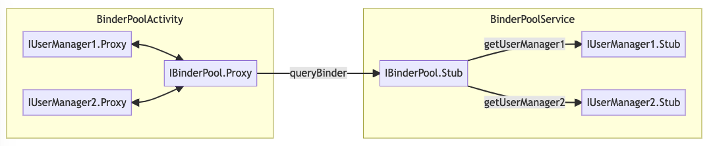

# 前言

上一节介绍了AIDL的使用和源码。客户端获取服务端的Binder对象，需要使用bindService从AMS中获取，一个Service对应一个AIDL接口。

当我们有多个AIDL接口时，需要分别定义Service，客户端绑定多个Service，占用的资源更多，代码也更复杂。

思路1：服务端定义一个Service，根据Intent返回不同的Binder对象。

> 虽然共用了一个Service，但是客户端还是需要bindService多次，并且依次unbindService，客户端代码复杂度没降低

思路2：定义**Binder连接池**，即多个Binder对象，绑定同一个Service，共用一个连接。

原理比较简单，由于IBinder对象可以跨进程传输，因此可以专门定义一个AIDL接口，用来查询其他Binder对象



# Binder连接池实现

先定义两个AIDL接口`IUserManager1.aidl`、`IUserManager2.aidl`

```java
// IUserManager1.aidl
package com.afauria.sample.ipc;
interface IUserManager1 {
    void testUser1();
}

// IUserManager2.aidl
package com.afauria.sample.ipc;
interface IUserManager2 {
    void testUser2();
}
```

服务端编译之后分别定义两个实现类

```java
class UserManager1Impl extends IUserManager1.Stub {
    @Override
    public void testUser1() throws RemoteException {
        Log.d("UserManager1Impl", "testUser1: ");
    }
}
class UserManager2Impl extends IUserManager2.Stub {
    @Override
    public void testUser2() throws RemoteException {
        Log.d("UserManager2Impl", "testUser2: ");
    }
}
```

再创建`IBinderPool.aidl`，用于查询IUserManager1和IUserManager2的Binder对象

```java
// IBinderPool.aidl
package com.afauria.sample.ipc;
import com.afauria.sample.ipc.IUserManager1;
import com.afauria.sample.ipc.IUserManager2;

interface IBinderPool {
    //方式1：通过参数查询
    IBinder queryBinder(int binderCode);
    //方式2：直接调用方法
    IUserManager1 getUserManager1();
    IUserManager2 getUserManager2();
}
```

服务端定义IBinderPool连接池的实现类

```java
class BinderPoolImpl extends IBinderPool.Stub {
    //定义接口唯一标记，也可以使用类限定名查询
    public static final int BINDER_USER_MANAGER1 = 1;
    public static final int BINDER_USER_MANAGER2 = 2;

    @Override
    public IBinder queryBinder(int binderCode) throws RemoteException {
        switch (binderCode) {
            case BINDER_USER_MANAGER1:
                return getUserManager1().asBinder();
            case BINDER_USER_MANAGER2:
                return getUserManager2().asBinder();
            default:
                return null;
        }
    }

    @Override
    public IUserManager1 getUserManager1() throws RemoteException {
        return new UserManager1Impl();
    }

    @Override
    public IUserManager2 getUserManager2() throws RemoteException {
        return new UserManager2Impl();
    }
}
```

定义Service并注册到Manifest中，指定进程名

```java
public class BinderPoolService extends Service {
    @Nullable
    @Override
    public IBinder onBind(Intent intent) {
        //返回连接池对象
        return new BinderPoolImpl();
    }
}
```

编写客户端代码

```java
public class BinderPoolActivity extends AppCompatActivity implements ServiceConnection {
    private static final String TAG = "BinderPoolActivity";
    private IBinderPool mRemoteProxy;

    @Override
    protected void onCreate(Bundle savedInstanceState) {
        super.onCreate(savedInstanceState);
        setContentView(R.layout.activity_second);
        connectToService();
    }

    private void connectToService() {
        //绑定服务
        Intent intent = new Intent("com.afauria.sample.BinderPool");
        intent.setPackage("com.afauria.sample.ipc");
        bindService(intent, this, BIND_AUTO_CREATE);
    }

    @Override
    public void onServiceConnected(ComponentName name, IBinder service) {
        Log.d(TAG, "onServiceConnected: ");
        mRemoteProxy = IBinderPool.Stub.asInterface(service);
        try {
            //方式1：使用queryBinder查询接口1、2，并且调用asInterface转换
            IUserManager1.Stub.asInterface(mRemoteProxy.queryBinder(1)).testUser1();
            IUserManager2.Stub.asInterface(mRemoteProxy.queryBinder(2)).testUser2();
            //方式2：直接调用方法获取接口1、2
            mRemoteProxy.getUserManager1().testUser1();
            mRemoteProxy.getUserManager2().testUser2();
        } catch (RemoteException e) {
            e.printStackTrace();
        }
    }

    @Override
    public void onServiceDisconnected(ComponentName name) {
        Log.d(TAG, "onServiceDisconnected: ");
    }
}
```

启动Activity之后输出如下，执行接口1、接口2方法成功

```shell
# 客户端进程号为7835
2022-05-31 17:12:46.340 7835-7835 D/BinderPoolActivity: onServiceConnected: 
# 服务端进程号为7865
# 方式1：通过参数查询
2022-05-31 17:12:46.342 7865-7884 D/BinderPoolImpl: queryBinder: 
2022-05-31 17:12:46.345 7865-7884 D/UserManager1Impl: testUser1: 
2022-05-31 17:12:46.346 7865-7884 D/BinderPoolImpl: queryBinder: 
2022-05-31 17:12:46.349 7865-7884 D/UserManager2Impl: testUser2: 

# 方式2：直接调用方法
2022-05-31 17:12:46.351 7865-7884 D/UserManager1Impl: testUser1: 
2022-05-31 17:12:46.353 7865-7884 D/UserManager2Impl: testUser2: 
```

思考：为什么方式1需要调用`asInterface`转换，方式2不需要？

> 方式2直接返回接口，AIDL自动生成`asInterface`转换代码。源码如下

```java
private static class Proxy implements com.afauria.sample.ipc.IBinderPool {
    //方式1：通过参数查询
    @Override
    public android.os.IBinder queryBinder(int binderCode) throws android.os.RemoteException {
        android.os.Parcel _data = android.os.Parcel.obtain();
        android.os.Parcel _reply = android.os.Parcel.obtain();
        android.os.IBinder _result;
        try {
            _data.writeInterfaceToken(DESCRIPTOR);
            _data.writeInt(binderCode);
            boolean _status = mRemote.transact(Stub.TRANSACTION_queryBinder, _data, _reply, 0);
            _reply.readException();
            _result = _reply.readStrongBinder();
        } finally {
            _reply.recycle();
            _data.recycle();
        }
        return _result;
    }
    //方式2：直接调用方法
    @Override
    public com.afauria.sample.ipc.IUserManager1 getUserManager1() throws android.os.RemoteException {
        android.os.Parcel _data = android.os.Parcel.obtain();
        android.os.Parcel _reply = android.os.Parcel.obtain();
        com.afauria.sample.ipc.IUserManager1 _result;
        try {
            _data.writeInterfaceToken(DESCRIPTOR);
            boolean _status = mRemote.transact(Stub.TRANSACTION_getUserManager1, _data, _reply, 0);
            _reply.readException();
            //AIDL生成的代码已经帮我们做了转换
            _result = com.afauria.sample.ipc.IUserManager1.Stub.asInterface(_reply.readStrongBinder());
        } finally {
            _reply.recycle();
            _data.recycle();
        }
        return _result;
    }
}
```

# 连接池优化

## Binder对象缓存

上面的`BinderPoolImpl`每次调用都返回新的对象，可以使用变量或者Map进行缓存

```java
class BinderPoolImpl extends IBinderPool.Stub {
    public static final int BINDER_USER_MANAGER1 = 1;
    public static final int BINDER_USER_MANAGER2 = 2;
    private IUserManager1 mIUserManager1;
    private IUserManager2 mIUserManager2;

    @Override
    public IUserManager1 getUserManager1() throws RemoteException {
        if(mIUserManager1 == null) {
            mIUserManager1 = new UserManager1Impl();
        }
        return mIUserManager1;
    }

    @Override
    public IUserManager2 getUserManager2() throws RemoteException {
        if(mIUserManager2 == null) {
            mIUserManager2 = new UserManager2Impl();
        }
        return mIUserManager2;
    }
}
```

问题：这里只是服务端进行了缓存，客户端每次获取Binder对象都需要跨进程调用

> 客户端可以自行缓存获取到的Binder对象。

问题：多个进程或者同一个进程多个线程同时调用`getUserManager1`方法，服务端会在不同线程执行，当两个线程同时进入null判断，会创建两遍对象。存在并发问题

> 可以使用DCL加锁

## 客户端全局绑定

上面的连接池Binder在Activity中绑定，Activity退出解绑。但是一般情况很少出现一个页面需要绑定多个Binder对象的场景，因此使用Binder连接池的时候，**客户端通常需要全局绑定**。

1. 使用Application的Context绑定服务，跟随整个应用生命周期
2. 使用`iBinder.linkToDeath(mBinderPoolDeathRecipient, 0);`监听Binder对象死亡或者连接断开时，自动重连
3. 客户端封装**线程安全的单例类**，供全局使用
4. 有可能出现还没绑定成功，立马调用`queryBinder`方法的场景，有两种解决思路
   1. 将请求封装成Runnable，加到延迟队列中，`onServiceConnected`连接成功后，从队列中取出任务执行
   2. 提供监听器给外部注册，`onServiceConnected`之后回调给外部，自行处理
   2. 在子线程中调用AIDL接口，首次调用时，初始化调用`connectToService`方法，并立马wait等待，主线程回调`onServiceConnected`之后唤醒。

```java
//这里继承IBinderPool即可，不需要继承IBinderPool.Stub
public class BinderPool extends IBinderPool.Stub {
    private static final String TAG = "BinderPool";
    private static volatile BinderPool sInstance;
    private Context mContext;

    public static BinderPool getInstance(Context context) {
        if (sInstance == null) {
            synchronized (BinderPool.class) {
                if (sInstance == null) {
                    sInstance = new BinderPool(context.getApplicationContext());
                }
            }
        }
        return sInstance;
    }

    private BinderPool(Context context) {
        mContext = context;
        connectToService();
    }

    private IBinderPool mRemoteProxy;
    private final IBinder.DeathRecipient mBinderDeathRecipient = new IBinder.DeathRecipient() {
        @Override
        public void binderDied() {
            mRemoteProxy.asBinder().unlinkToDeath(mBinderDeathRecipient, 0);
            mRemoteProxy = null;
            //自动重连
            connectToService();
        }
    };

    private final ServiceConnection mServiceConnection = new ServiceConnection() {

        @Override
        public void onServiceConnected(ComponentName name, IBinder service) {
            Log.d(TAG, "onServiceConnected: " + Thread.currentThread());
            mRemoteProxy = IBinderPool.Stub.asInterface(service);
            //监听Binder对象死亡
            try {
                mRemoteProxy.asBinder().linkToDeath(mBinderDeathRecipient, 0);
            } catch (RemoteException e) {
                e.printStackTrace();
            }
        }

        @Override
        public void onServiceDisconnected(ComponentName name) {
            Log.d(TAG, "onServiceDisconnected: ");
            mRemoteProxy = null;
            //自动重连
            connectToService();
        }
    };

    private void connectToService() {
        //绑定服务
        Intent intent = new Intent("com.afauria.sample.BinderPool");
        intent.setPackage("com.afauria.sample.ipc");
        mContext.bindService(intent, mServiceConnection, BIND_AUTO_CREATE);
    }

    @Override
    public IBinder queryBinder(int binderCode) {
        if(mRemoteProxy == null) {
            return null;
        }
        try {
            return mRemoteProxy.queryBinder(binderCode);
        } catch (RemoteException e) {
            e.printStackTrace();
        }
        return null;
    }

    @Override
    public IUserManager1 getUserManager1() {
        if(mRemoteProxy == null) {
            return null;
        }
        try {
            return mRemoteProxy.getUserManager1();
        } catch (RemoteException e) {
            e.printStackTrace();
        }
        return null;
    }

    @Override
    public IUserManager2 getUserManager2() throws RemoteException {
        if(mRemoteProxy == null) {
            return null;
        }
        try {
            return mRemoteProxy.getUserManager2();
        } catch (RemoteException e) {
            e.printStackTrace();
        }
        return null;
    }
}
```

# 结语

参考资料：[【Android】Binder连接池](https://www.jianshu.com/p/3ca35499c630)
