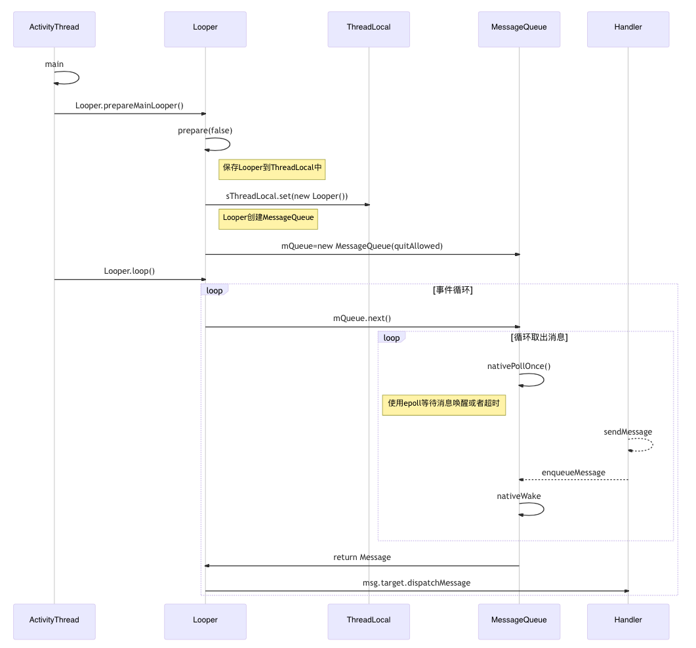

# Handler

Handler是Android消息机制的上层接口，开发者只需要关心消息的发送和处理，不需要关心内部消息循环。用于异步处理消息和线程间通信。

## Handler机制

简单来说就是**生产者-消费者模型**：

1. Handler是生产者，可以在不同线程生产消息，并且可以有多个生产者。将消息插入到关联线程的MessageQueue。
2. Looper是消费者，不断取出消息。只在一个线程消费，每个线程只能有一个消费者。
3. MessageQueue使用链表存储，按执行时间排列

工作流程：

1. `prepare`创建Looper对象，存储在`ThreadLocal`中，保证每个线程只有一个Looper，每个Looper持有一个`MessageQueue`
2. 执行`loop()`循环，从MessageQueue中读取消息，如果没有消息（或者消息延迟），则通过`nativePollOnce`阻塞
3. 外部通过Handler发送消息，将消息插MessageQueue中，按执行时间排序。并决定是否需要唤醒线程。
4. Looper读取到消息之后调用Handler的`dispatchMessage`处理消息

## 消息类型

1. 同步消息（普通消息）
2. 屏障消息（同步屏障）：拦截屏障之后的同步消息，只允许异步消息执行。
   1. `postSyncBarrier`发送同步屏障，该方法是hide的，只能反射调用
   1. **屏障消息没有target**，根据执行时间插入队列合适的位置。
   2. 只有屏障在队头的时候才会拦截后面的消息，屏障之前的消息无法拦截。
   3. 设置同步屏障之后，同步消息可以入队，只是没法执行
   3. `postSyncBarrier`不会唤醒线程（因为屏障消息不需要执行），`removeSyncBarrier`会唤醒线程
3. 异步消息：没有同步屏障时和普通消息一样，有同步屏障时会优先执行。例如`scheduleTraversals`中发送同步屏障，保证UI绘制优先执行
   1. 通过`Message.setAsynchronous`设置异步消息，Android5.1（API22）以上
   2. 创建异步消息Handler，通过该Handler发送的消息都是异步消息（该方法隐藏，开发者无法调用）
   3. 调用`ViewRootImpl.scheduleTraversals`时，会向主线程的Handler添加同步屏障，onVsync处理完之后再移除同步屏障

## 类比餐厅点餐

1. Thread相当于餐厅
2. Handler相当于点餐员
3. Looper相当于厨师
4. MessageQueue相当于打单机
5. Message相当于每一桌的订单
6. 一家店有多个点餐员和多个订单，只有一个厨师和一个打单机

普通流程：

1. 顾客通过点餐员点餐，提交到打单机，每张订单中包含桌号：`Handler.sendMessage`
2. 厨师取出一张张订单，根据订单要求制作：`MessageQueue.next`
3. 制作完成后通过点餐员将菜品交给顾客食用：`msg.target.dispatchMessage->Handler.handleMessage`

特殊流程：

1. 假设有顾客点了延时的外卖，则将订单按时间排序，插入队列的合适位置
2. 假设队列中全是延时订单，则暂时休息，设置闹钟为下一个订单的时间，时间到了再起来制作：`nativePollOnce(ptr, nextPollTimeoutMillis);`
3. 如果中间有新订单进来，厨师在休息，分为几种情况：
   1. 如果新订单晚于设置的闹钟时间，则插入队列中，不唤醒厨师。
   2. 如果新订单早于设置的闹钟时间，则唤醒厨师`nativeWake(mPtr);`，厨师检查一些订单是否需要立即制作，如果不需要，则重新设置一下闹钟。
4. 假设高峰期厨师比较忙，挂了个牌子（同步屏障`postSyncBarrier`），表示只处理堂食订单（异步消息），不处理外卖订单（同步消息）。
   1. 厨师不断取出打单机中的订单，检查到是堂食订单才进行处理。
   2. 这个时候点餐员还是会接外卖的订单，只是厨师不再处理。
   3. 等到拿掉牌子之后才开始处理堆积的外卖订单，有可能会超时，但只要顾客没取消，还是会继续制作。

# 源码分析

## 开启消息循环

以主线程为例

```java
ActivityThread.main(); //程序入口
	Looper.prepareMainLooper();
		Looper.prepare(false); //主线程Looper不可退出
			Looper.sThreadLocal.set(new Looper(quitAllowed)); //线程绑定Looper
				mQueue = new MessageQueue(quitAllowed); //Looper和MessageQueue绑定
				mThread = Thread.currentThread();
	Looper.loop();
		myLooper().mQueue.next(); //循环获取MessageQueue中的消息
			nativePollOnce(); //阻塞直到超时或者唤醒
				native -> pollInner()
					native -> epoll_wait(); //使用epoll阻塞
		Handler.dispatchMessage(msg); //消息分发
```



### Looper.prepare()

```java
 public final class Looper {
    static final ThreadLocal<Looper> sThreadLocal = new ThreadLocal<Looper>();
    private static Looper sMainLooper;  // guarded by Looper.class
    final MessageQueue mQueue;
    final Thread mThread;
   
    private Looper(boolean quitAllowed) {
        //一个Looper对应一个MessageQueue
        mQueue = new MessageQueue(quitAllowed);
        mThread = Thread.currentThread();
    }
    //开发者创建的Looper可以退出
    public static void prepare() {
        prepare(true);
    }
    private static void prepare(boolean quitAllowed) {
        if (sThreadLocal.get() != null) {
            throw new RuntimeException("Only one Looper may be created per thread");
        }
        //Looper绑定当前线程
        sThreadLocal.set(new Looper(quitAllowed));
    }
    public static void prepareMainLooper() {
        //主线程Looper不可退出
        prepare(false);
        synchronized (Looper.class) {
            if (sMainLooper != null) {
                throw new IllegalStateException("The main Looper has already been prepared.");
            }
            sMainLooper = myLooper();
        }
    }
}
```

### Looper.loop()

1. 需要先设置Looper线程
2. 调用`Looper.quit`方法退出循环
3. for循环取出消息，交给Handler处理
4. 消息使用完回收到池中

```java
public final class Looper {
    public static void loop() {
        final Looper me = myLooper();
        //先prepare设置为Looper线程
        if (me == null) {
            throw new RuntimeException("No Looper; Looper.prepare() wasn't called on this thread.");
        }
        final MessageQueue queue = me.mQueue;
        ...
        //事件循环
        for (;;) {
            //next阻塞，直到有可执行消息取出
            Message msg = queue.next(); // might block
            //调用quit方法结束Looper循环
            if (msg == null) {
                return;
            }
            //setMessageLogging添加打印
            final Printer logging = me.mLogging;
            if (logging != null) {
                logging.println(">>>>> Dispatching to " + msg.target + " " +
                        msg.callback + ": " + msg.what);
            }
            try {
                //处理消息
                msg.target.dispatchMessage(msg);
                dispatchEnd = needEndTime ? SystemClock.uptimeMillis() : 0;
            }
            ...
            //回收消息
            msg.recycleUnchecked();
        }
    }
}
```

### MessageQueue.next()

1. 如果消息还没到时间执行，则调用`nativePollOnce->native:pollInner->native:epoll_wait`阻塞，释放CPU资源
   1. 传入-1，表示没有消息，无限等待，直到新消息插入唤醒
   2. 传入0，表示有需要执行的消息，不进行阻塞
   3. 大于0，表示有延时消息，等待一定时间后唤醒。如果插入了新消息，且新消息优先级大于正在等待的消息，则立即唤醒

2. 如果没有同步屏障，则找到队头消息，如果有同步屏障，则找到第一个异步消息。
3. 如果消息已经到时间了，则从队列中取出执行。如果还没到时间计算需要阻塞的时长。
4. 在进入阻塞状态之前（即线程空闲），检查是否有IdleHandler需要执行，每次事件循环只会执行一次

```java
public final class MessageQueue {
    Message next() {
        final long ptr = mPtr;
        if (ptr == 0) {
            return null;
        }
        int pendingIdleHandlerCount = -1; // -1 only during first iteration
        int nextPollTimeoutMillis = 0;
        for (;;) {
            if (nextPollTimeoutMillis != 0) {
                Binder.flushPendingCommands();
            }
            //poll阻塞，设置超时唤醒
            nativePollOnce(ptr, nextPollTimeoutMillis);
            //同步锁，防止此时插入新消息或者removeIdleHandler导致异常
            synchronized (this) {
                final long now = SystemClock.uptimeMillis();
                Message prevMsg = null;
                Message msg = mMessages;
                if (msg != null && msg.target == null) {
                    //如果有同步屏障，则找到第一个异步消息，而不是队头消息
                    do {
                        prevMsg = msg;
                        msg = msg.next;
                    } while (msg != null && !msg.isAsynchronous());
                }
                if (msg != null) {
                    if (now < msg.when) {
                        // 如果第一个消息还没到时间执行，则计算阻塞超时时长
                        // Next message is not ready.  Set a timeout to wake up when it is ready.
                        nextPollTimeoutMillis = (int) Math.min(msg.when - now, Integer.MAX_VALUE);
                    } else {
                        //从队列中取出消息
                        mBlocked = false;
                        if (prevMsg != null) {
                            prevMsg.next = msg.next;
                        } else {
                            mMessages = msg.next;
                        }
                        msg.next = null;
                        if (DEBUG) Log.v(TAG, "Returning message: " + msg);
                        msg.markInUse();
                        return msg;
                    }
                } else {
                    nextPollTimeoutMillis = -1;
                }
                if (mQuitting) {
                    //调用quit方法退出消息循环
                    dispose();
                    return null;
                }
                //只在首次循环中检查是否有IdleHandler
                if (pendingIdleHandlerCount < 0 && (mMessages == null || now < mMessages.when)) {
                    pendingIdleHandlerCount = mIdleHandlers.size();
                }
                //如果没有IdleHandler要执行，并且第一个消息还没到时间执行，则进入阻塞状态
                if (pendingIdleHandlerCount <= 0) {
                    mBlocked = true;
                    continue;
                }
                if (mPendingIdleHandlers == null) {
                    mPendingIdleHandlers = new IdleHandler[Math.max(pendingIdleHandlerCount, 4)];
                }
                mPendingIdleHandlers = mIdleHandlers.toArray(mPendingIdleHandlers);
            }
            for (int i = 0; i < pendingIdleHandlerCount; i++) {
                final IdleHandler idler = mPendingIdleHandlers[i];
                mPendingIdleHandlers[i] = null;
                boolean keep = false;
                try {
                    //queueIdle返回true表示可以重复执行，返回false表示只执行一次
                    keep = idler.queueIdle();
                } catch (Throwable t) {
                    Log.wtf(TAG, "IdleHandler threw exception", t);
                }
                if (!keep) {
                    synchronized (this) {
                        mIdleHandlers.remove(idler);
                    }
                }
            }
            //保证每次事件循环只执行一次IdleHandler
            pendingIdleHandlerCount = 0;
            //由于IdleHandler执行时间不可控，中间有可能加入了新的消息，因此不阻塞，再次检查消息
            nextPollTimeoutMillis = 0;
        }
    }
}
```

## 创建Handler

查看Handler构造方法：

1. 默认使用同步消息Handler：带async参数的构造函数隐藏，开发者无法直接调用
2. 默认关联当前线程的Looper，如果在子线程中直接创建Handler，由于子线程没有创建Looper，会抛出异常，需要先调用`Looper.prepare`方法
2. 要在子线程中处理消息，可以将Handler关联到指定线程的Looper对象。通常结合`HandlerThread`使用

```java
public class Handler {
    public Handler() { this(null, false); }
    public Handler(Callback callback) { this(callback, false); }
    public Handler(Looper looper) { this(looper, null, false); }
    public Handler(Looper looper, Callback callback) { this(looper, callback, false); }
    /**
     * @hide
     */
    public Handler(boolean async) { this(null, async); }
    /**
     * @hide
     */
    public Handler(Callback callback, boolean async) {
        //获取当前线程的Looper和MessageQueue对象
        mLooper = Looper.myLooper();
        //如果该线程不是Looper线程，则抛异常
        if (mLooper == null) {
            throw new RuntimeException(
                "Can't create handler inside thread " + Thread.currentThread() + " that has not called Looper.prepare()");
        }
        mQueue = mLooper.mQueue;
        mCallback = callback;
        mAsynchronous = async;
    }
    /**
     * @hide
     */
    public Handler(Looper looper, Callback callback, boolean async) {
        //传入Looper对象
        mLooper = looper;
        mQueue = looper.mQueue;
        mCallback = callback;
        mAsynchronous = async;
    }
}
```

## 发送消息

发送消息有多种方式：最终都会加入消息队列

```java
Handler.sendMessage(Message);
  Handler.sendMessageDelayed(Message, delayMillis); //发送延时消息
    Handler.sendMessageAtTime(Message, uptimeMillis); //在某一时刻触发消息
      Handler.enqueueMessage(MessageQueue, Message, uptimeMills) //根据消息触发时间插入消息队列中
        mQueue.enqueueMessage(Message, uptimeMills);
```

1. send消息和post消息：
   * send消息通过Handler的默认Callback和`handleMessage`方法处理，在Handler构造的时候确定处理逻辑
   * post消息不包含what，直接执行`Runnable`方法，在Message构造的时候才确定处理逻辑
   * 消息处理优先级：`Message的callback => Handler的callback => Handler的handleMessage`
2. sendEmptyMessage和sendMessage：
   * sendEmptyMessage内部自动构造Message
   * sendMessage需要自行构造Message
4. sendMessageAtFrontOfQueue：将消息when设置为0，始终插入队头，在下一次迭代中处理。
   1. 只适用于特殊情况，频繁发送容易导致队列中的其他消息饥饿，无法在指定时间内执行
   2. 由于始终在队头，因此不会被屏障消息拦截

```java
public class Handler {
    //post会包装成Message
    public final boolean post(Runnable r) {
       return  sendMessageDelayed(getPostMessage(r), 0);
    }
    private static Message getPostMessage(Runnable r) {
        Message m = Message.obtain();
        m.callback = r;
        return m;
    }
    //开发者手动构造Message，包装参数
    public final boolean sendMessage(Message msg) {
        return sendMessageDelayed(msg, 0);
    }
    //自动构造Message
    public final boolean sendEmptyMessage(int what) {
        return sendEmptyMessageDelayed(what, 0);
    }
    //延时发送消息
    public final boolean sendMessageDelayed(Message msg, long delayMillis) {
        if (delayMillis < 0) {
            delayMillis = 0;
        }
        //当前系统时钟+延时
        return sendMessageAtTime(msg, SystemClock.uptimeMillis() + delayMillis);
    }
    //消息加入队头
    public final boolean sendMessageAtFrontOfQueue(Message msg) {
        MessageQueue queue = mQueue;
        if (queue == null) {
            RuntimeException e = new RuntimeException(this + " sendMessageAtTime() called with no mQueue");
            Log.w("Looper", e.getMessage(), e);
            return false;
        }
        return enqueueMessage(queue, msg, 0);
    }
    private boolean enqueueMessage(MessageQueue queue, Message msg, long uptimeMillis) {
        //设置target
        msg.target = this;
        if (mAsynchronous) {
            //异步消息
            msg.setAsynchronous(true);
        }
        return queue.enqueueMessage(msg, uptimeMillis);
    }
    public void dispatchMessage(Message msg) {
        //先交给Message处理
        if (msg.callback != null) {
            handleCallback(msg);
        } else {
            //再交给Handler处理
            if (mCallback != null) {
                if (mCallback.handleMessage(msg)) {
                    return;
                }
            }
            handleMessage(msg);
        }
    }
}
```

消息入队：

1. 一个消息对象只能发送一次，每次发送都需要重新构造
2. 由于多个线程可能同时发送消息，因此**消息的插入和移除需要加锁**
3. **将消息插入队列，按执行时间排序**
4. 决定是否需要唤醒线程，唤醒线程并不一定执行消息，而是重新检查消息队列，计算下一个消息的执行时间，如果还没到，则重新计算阻塞时长。
   1. 如果队列正在阻塞，并且新消息在队头，则唤醒线程
   2. 如果队列正在阻塞，队头是屏障消息，并且新消息是队列中最早的**异步消息**，则唤醒线程

```java
public class MessageQueue {
    //使用链表存储消息队列
    Message mMessages;
    boolean enqueueMessage(Message msg, long when) {
        if (msg.target == null) {
            throw new IllegalArgumentException("Message must have a target.");
        }
        //同一个消息对象无法发送多次
        if (msg.isInUse()) {
            throw new IllegalStateException(msg + " This message is already in use.");
        }
        //多个线程可以同时发送消息，因此需要加锁
        synchronized (this) {
            if (mQuitting) {
                IllegalStateException e = new IllegalStateException(msg.target + " sending message to a Handler on a dead thread");
                Log.w(TAG, e.getMessage(), e);
                msg.recycle();
                return false;
            }
            //消息使用标记
            msg.markInUse();
            msg.when = when;
            Message p = mMessages;
            boolean needWake;
            if (p == null || when == 0 || when < p.when) {
                //队列为空或者消息when小于队头消息when，则直接加入队头
                msg.next = p;
                mMessages = msg;
                needWake = mBlocked;
            } else {
                //队头是屏障消息，只有异步消息能够唤醒
                needWake = mBlocked && p.target == null && msg.isAsynchronous();
                Message prev;
                //遍历找到大于目标时间的节点
                for (;;) {
                    prev = p;
                    p = p.next;
                    if (p == null || when < p.when) {
                        break;
                    }
                    //如果在新消息之前，队列中已经有异步消息，则不需要新消息来唤醒线程
                    if (needWake && p.isAsynchronous()) {
                        needWake = false;
                    }
                }
                //插入节点
                msg.next = p;
                prev.next = msg;
            }
            //唤醒线程
            if (needWake) {
                nativeWake(mPtr);
            }
        }
        return true;
    }
}
```

## 移除消息

1. 查找符合条件的消息，删除节点：判断Handler、what、Object是否相等
2. 如果Object传入null，则只判断Handler、what是否相等。通常使用`removeCallbacksAndMessages(null)`移除所有消息

```java
public final class MessageQueue {
    //移除指定消息
    void removeMessages(Handler h, int what, Object object) {
        if (h == null) {
            return;
        }
        synchronized (this) {
            Message p = mMessages;
            // 删除消息队列的头节点
            while (p != null && p.target == h && p.what == what && (object == null || p.obj == object)) {
                Message n = p.next;
                mMessages = n;
                p.recycleUnchecked();
                p = n;
            }
            // 删除消息队列的中间节点
            while (p != null) {
                Message n = p.next;
                if (n != null) {
                    if (n.target == h && n.what == what && (object == null || n.obj == object)) {
                        Message nn = n.next;
                        n.recycleUnchecked();
                        p.next = nn;
                        continue;
                    }
                }
                p = n;
            }
        }
    }
    void removeCallbacksAndMessages(Handler h, Object object) {
        if (h == null) {
            return;
        }
        synchronized (this) {
            Message p = mMessages;
            // 删除消息队列的头节点，如果object为null，则所有消息都会被移除
            while (p != null && p.target == h && (object == null || p.obj == object)) {
                Message n = p.next;
                mMessages = n;
                p.recycleUnchecked();
                p = n;
            }
            // 删除消息队列的中间节点
            while (p != null) {
                Message n = p.next;
                if (n != null) {
                    if (n.target == h && (object == null || n.obj == object)) {
                        Message nn = n.next;
                        n.recycleUnchecked();
                        p.next = nn;
                        continue;
                    }
                }
                p = n;
            }
        }
    }
}
```

## 消息池

1. 复用Message对象，避免频繁创建Message对象、分配空间（**享元模式**）
2. **使用静态变量sPool存储消息链表**，所有线程共享一个消息池，容量为50
3. Looper中取出消息用完之后调用`recycleUnchecked`回收，释放Message持有的对象

```java
public final class Message implements Parcelable {
    //使用链表存储
    Message next;
    /** @hide */
    public static final Object sPoolSync = new Object();
    private static Message sPool;
    private static int sPoolSize = 0;
    private static final int MAX_POOL_SIZE = 50;

    public static Message obtain() {
        //从消息池中取出头部消息
        synchronized (sPoolSync) {
            if (sPool != null) {
                Message m = sPool;
                sPool = m.next;
                m.next = null;
                m.flags = 0; // clear in-use flag
                sPoolSize--;
                return m;
            }
        }
        return new Message();
    }
  
    void recycleUnchecked() {
        //消息池中的消息都标记为inUse，避免已回收的消息被重复使用
        flags = FLAG_IN_USE;
        what = 0;
        arg1 = 0;
        arg2 = 0;
        obj = null;
        replyTo = null;
        sendingUid = -1;
        when = 0;
        target = null;
        callback = null;
        data = null;
        //将回收的消息插入队头，不需要遍历
        synchronized (sPoolSync) {
            if (sPoolSize < MAX_POOL_SIZE) {
                next = sPool;
                sPool = this;
                sPoolSize++;
            }
        }
    }
}
```

# ThreadLocal

线程本地变量：不同线程中get返回不同的值。每个线程各自拥有，互不影响。

原理：

1. 每个线程Thread对象中存储一个`ThreadLocalMap<ThreadLocal<T>, T>`
2. `ThreadLocal.get`首先找到当前线程的`ThreadLocalMap`，再计算Key的hash值和索引，获取value
2. Entry使用弱引用存储Key，当Key为空时，会自动清除条目

```java
public class ThreadLocal<T> {
    public T get() {
        Thread t = Thread.currentThread();
        ThreadLocalMap map = getMap(t);
        if (map != null) {
            ThreadLocalMap.Entry e = map.getEntry(this);
            if (e != null) {
                T result = (T)e.value;
                return result;
            }
        }
        return setInitialValue();
    }
  
    public void set(T value) {
        Thread t = Thread.currentThread();
        ThreadLocalMap map = getMap(t);
        if (map != null)
            //将ThreadLocal作为key
            map.set(this, value);
        else
            //初始化Map
            createMap(t, value);
    }
    //获取当前线程的ThreadLocalMap
    ThreadLocalMap getMap(Thread t) {
        return t.threadLocals;
    }
    //每个Thread存储一个ThreadLocalMap
    void createMap(Thread t, T firstValue) {
        t.threadLocals = new ThreadLocalMap(this, firstValue);
    }
    static class ThreadLocalMap {
        //Key是ThreadLocal，使用弱引用存储Key
        static class Entry extends WeakReference<ThreadLocal<?>> {
            Object value;
            Entry(ThreadLocal<?> k, Object v) {
                super(k);
                value = v;
            }
        }
        //使用数组存储，初始容量为16
        private static final int INITIAL_CAPACITY = 16;
        private Entry[] table;
        private int size = 0;
        private Entry getEntry(ThreadLocal<?> key) {
            //计算key的hash值和数组下标
            int i = key.threadLocalHashCode & (table.length - 1);
            Entry e = table[i];
            if (e != null && e.get() == key)
                return e;
            else
                return getEntryAfterMiss(key, i, e);
        }
        //当Key弱引用被回收时，自动清除该条目
        private Entry getEntryAfterMiss(ThreadLocal<?> key, int i, Entry e) {
            Entry[] tab = table;
            int len = tab.length;

            while (e != null) {
                ThreadLocal<?> k = e.get();
                if (k == key)
                    return e;
                if (k == null)
                    //清除条目
                    expungeStaleEntry(i);
                else
                    i = nextIndex(i, len);
                e = tab[i];
            }
            return null;
        }
    }
}
```

# View.post

内部调用`Handler.post`方法，在下一个事件循环中处理。

```java
public class View {
    public boolean post(Runnable action) {
        final AttachInfo attachInfo = mAttachInfo;
        if (attachInfo != null) {
            //使用ViewRootImpl的Handler对象
            return attachInfo.mHandler.post(action);
        }
        //如果View还没有显示，则先加入RunQueue中，在dispatchAttachedToWindow中分发
        getRunQueue().post(action);
        return true;
    }
}
```

# runOnUiThread

Activity中提供了`runOnUiThread`方法，可以切回主线程执行，内部也是使用`Handler.post`方法

```java
public class Activity {
    ...
    final Handler mHandler = new Handler();
    public final void runOnUiThread(Runnable action) {
        //如果当前线程不是主线程，则在下一个事件循环中处理
        if (Thread.currentThread() != mUiThread) {
            mHandler.post(action);
        } else {
            //如果当前线程是主线程，则立即执行
            action.run();
        }
    }
}
```

# IdleHandler

IdleHandler：在Looper线程空闲时执行

使用场景：例如性能监控、执行GC、埋点上报、初始化SDK等

原理：将`IdleHandler`加入列表，当Looper没有消息要处理或者消息延时，在调用poll阻塞之前检查列表，执行空闲任务（源码见上文`MessageQueue.next`）

```java
public final class MessageQueue {
    //添加IdleHandler
    public void addIdleHandler(@NonNull IdleHandler handler) {
        if (handler == null) {
            throw new NullPointerException("Can't add a null IdleHandler");
        }
        synchronized (this) {
            mIdleHandlers.add(handler);
        }
    }
    public void removeIdleHandler(@NonNull IdleHandler handler) {
        synchronized (this) {
            mIdleHandlers.remove(handler);
        }
    }
    public static interface IdleHandler {
        //返回true表示重复执行，返回false表示只执行一次，再执行需要重新addIdleHandler
        boolean queueIdle();
    }
}
```

# HandlerThread

HandlerThread原理：继承Thread，在run方法中创建Looper对象（prepare），并执行loop循环，即在子线程开启消息循环，调用quit结束消息循环，退出线程。

* 避免开发者手动定义线程类，重写run方法，实现Looper循环
* 拥有自己的消息队列，它不会干扰或阻塞UI线程。
* 内部任务是串行执行，按消息发送顺序处理，一旦队列中有某个任务执行时间过长，那么就会导致后续的任务都会被延迟处理。
* HandlerThread不适合网络IO操作，因为它只有一个线程，需要排队。
* 如果线程还没启动就调用`getLooper()`，会调用`wait()`阻塞，直到线程run方法中创建完Looper才调用`notifyAll()`唤醒

## 使用

```java
HandlerThread thread = new HandlerThread(threadName); //创建线程
mHandlerThread.start(); //启动线程
Handler handler = new Handler(thread.getLooper()){ //传入子线程的Looper
    //如果线程还没启动或者Looper还没创建，getLooper会wait阻塞，在run中创建完后，会notifyAll
    @Override
	  public void handleMessage(Message msg) {
        //doSomething
    }
}
```

## 源码

```java
public class HandlerThread extends Thread {
    @Override
    public void run() {
        mTid = Process.myTid();
        Looper.prepare();
        synchronized (this) {
            mLooper = Looper.myLooper();
            notifyAll(); //Looper创建完后唤醒主线程的wait
        }
        Process.setThreadPriority(mPriority);
        onLooperPrepared();
        Looper.loop();
        mTid = -1;
    }
    public Looper getLooper() {
        if (!isAlive()) {
            return null;
        }
        synchronized (this) {
            //循环直到子线程Looper创建完成
            while (isAlive() && mLooper == null) {
                try {
                    wait(); //阻塞
                } catch (InterruptedException e) {
                }
            }
        }
        return mLooper;
    }
}
```

# IntentService

Service生命周期在主线程执行，当需要执行耗时任务时，需要开启新线程。Android封装了`IntentService`，避免开发者手动创建线程。

使用：继承`IntentService`，重写`onHandlerIntent`方法。

原理：使用Handler+HandlerThread实现单线程模型。Handler内部维护消息队列，多个Intent排队处理

1. 内部使用`HandlerThread`创建Looper线程，发送消息，在子线程中调用`onHandlerIntent`，执行完之后会自动结束服务。
2. 通过startService启动服务，多次启动服务，会按顺序调用多次`onHandleIntent`。
3. 使用消息队列处理多个Intent，共用一个Looper线程，排队执行，不是多线程并发

> `stopSelf(startId)`表示结束该请求Id的服务，当接收到新的请求时startId会更新，stopSelf失效，因此不会停止Service
>
> 1. stopSelf传入-1表示直接结束服务
> 2. 传入startId则会等到其他任务执行完再结束服务

```java
public abstract class IntentService extends Service {
    private volatile Looper mServiceLooper;
    private volatile ServiceHandler mServiceHandler;
    //使用Handler+HandlerThread实现单线程模型。Handler内部维护消息队列，多个Intent排队处理
    private final class ServiceHandler extends Handler {
        public ServiceHandler(Looper looper) { super(looper); }
        @Override
        public void handleMessage(Message msg) {
            //3. 处理消息
            onHandleIntent((Intent)msg.obj);
            //4. 传入startId
            stopSelf(msg.arg1);
        }
    }
    @Override
    public void onCreate() {
        super.onCreate();
        //1. 创建一个Looper线程
        HandlerThread thread = new HandlerThread("IntentService[" + mName + "]");
        thread.start();
        mServiceLooper = thread.getLooper();
        mServiceHandler = new ServiceHandler(mServiceLooper);
    }
    @Override
    public void onStart(@Nullable Intent intent, int startId) {
        //2. 发送消息
        Message msg = mServiceHandler.obtainMessage();
        msg.arg1 = startId;
        msg.obj = intent;
        mServiceHandler.sendMessage(msg);
    }
    //5. 退出Looper循环，释放线程
    @Override
    public void onDestroy() {
        mServiceLooper.quit();
    }
    //在工作线程中处理消息
    @WorkerThread
    protected abstract void onHandleIntent(@Nullable Intent intent);
}
```

# Handler内存泄漏

```java
class MainActivity extends Activity {
    //提示Handler匿名内部类可能存在内存泄漏
    //This Handler class should be static or leaks might occur (anonymous android.os.Handler)
    private Handler mHandler = new Handler() {};
}
```

## 原因

1. Handler非静态内部类持有Activity的引用
2. 分析引用链：`Activity->Handler->Message.target->MessageQueue->Looper->sMainLooper(GCRoot)`
3. 当该Handler存在延时消息时，Handler被`sMainLooper`引用，导致finish之后Activity无法被释放
4. 当该Handler的所有Message处理完之后，Message回收之后才会释放引用

子线程Looper是否会导致内存泄漏？

> 不会。子线程中引用链：`Activity->Handler->Message.target->MessageQueue->Looper->sThreadLocal(GCRoot)`
>
> 虽然`sThreadLocal`是GCRoot，但由于上文提到`sThreadLocal`中使用弱引用存储对象，因此Looper对象可以被释放。

## 正确使用Handler

1. 使用静态内部类+弱引用：如果需要调用外部类方法则使用弱引用，如果不需要则可以不引用
2. 页面退出时移除消息

```java
class MainActivity extends Activity {
    private Handler mHandler = new MyHandler(this);

    static class MyHandler extends Handler {
        //弱引用持有外部类对象
        WeakReference<MainActivity> source;

        public MyHandler(MainActivity source) {
            this.source = new WeakReference<>(source);
        }

        @Override
        public void handleMessage(Message msg) {
            super.handleMessage(msg);
        }
    }

    @Override
    protected void onDestroy() {
        super.onDestroy();
        //页面退出时移除消息
        mHandler.removeCallbacksAndMessages(null);
    }
}
```

# 主线程loop死循环或者poll阻塞为什么不会卡死？

最直接的答案：`ActivityThread.main`中开启loop死循环，一旦退出循环，则表示应用结束，代码如下

```java
public final class ActivityThread extends ClientTransactionHandler {
    public static void main(String[] args) {
        ...
        Looper.prepareMainLooper();
        ...
        Looper.loop();
        throw new RuntimeException("Main thread loop unexpectedly exited");
    }
}
```

那么什么时候会出现卡死，卡死的原因又是什么呢？

>  卡死分为UI无法刷新和ANR超时无响应，二者有所不同
>
> 1. UI无法刷新：UI绘制是在一次消息循环中完成的，假设前1次的消息处理中进入了死循环，会导致UI绘制的消息无法执行。
> 2. ANR原理如下，以Service为例：Service也是在一次消息循环中完成的，假设前一个消息无法退出，Service创建的消息无法执行，或者Service创建过程中耗时。导致Service没有在规定时间内创建完成，会出现ANR。
>     1. AMS跨进程调用应用的`ApplicationThread`方法启动Service，并通过Handler发送一个延时消息
>       2. `ApplicationThread`通过sendMessage发送消息到主线程执行，创建并启动Service
>       3. 启动完Service之后跨进程调用`AMS.serviceDoneExecuting`，通知AMS移除延时消息
>       4. 如果AMS没有收到通知，则到时间之后会触发ANR

总结：卡死是由于loop循环中的**单次消息处理耗时**，从而导致后面的消息无法执行。

1. loop死循环不属于某一次消息处理，因此不会导致卡死
2. `nativePollOnce`只有在当前没有需要处理的消息的时候才会进行阻塞，当有新消息加入，会调用nativeWake恢复。上面提到的UI绘制和Service创建等都是一个消息，会唤醒阻塞的线程。

# 子线程为什么无法更新UI？

先说结论：

1. `ViewRootImpl`中会检查当前线程是否是**原始线程**，例如`requestLayout`、`requestChildFocus`
2. 原始线程大多数情况下都是主线程，也有可能不是

```java
public final class ViewRootImpl implements ViewParent,
        View.AttachInfo.Callbacks, ThreadedRenderer.DrawCallbacks {
    final Thread mThread;
    public ViewRootImpl(Context context, Display display) {
        ...
        //保存ViewRootImpl创建的线程
        mThread = Thread.currentThread();
    }
    @Override
    public void requestLayout() {
        //是否正在layout
        if (!mHandlingLayoutInLayoutRequest) {
            //更新UI的时候检查线程
            checkThread();
            mLayoutRequested = true;
            //不会立马刷新，而是收到同步信号之后再进行刷新
            scheduleTraversals();
        }
    }
    void checkThread() {
        //检查当前线程是否是创建ViewRootImpl的线程
        if (mThread != Thread.currentThread()) {
            throw new CalledFromWrongThreadException(
                    "Only the original thread that created a view hierarchy can touch its views.");
        }
    }
}
```

为什么设计只能在UI线程更新？

> 1. 提高绘制效率：限制单线程中绘制UI，不需要加锁
> 2. 保证线程安全：避免多个线程同时操作UI发生错误

子线程中真的不能更新UI吗？

## 实验1

onCreate方法中创建子线程更新UI成功，子线程中延时5s再更新UI闪退：`Only the original thread that created a view hierarchy can touch its views.`

```java
public class MainActivity extends AppCompatActivity {
    @Override
    protected void onCreate(Bundle savedInstanceState) {
        super.onCreate(savedInstanceState);
        setContentView(R.layout.activity_main);
        new Thread(new Runnable() {
            @Override
            public void run() {
                //延时5s
//                try {
//                    Thread.sleep(5000);
//                } catch (InterruptedException e) {
//                    e.printStackTrace();
//                }
                //更新UI
                ((TextView) findViewById(R.id.text)).setText("Hello World!");
            }
        }).start();
    }
}
```

结论：onCreate的时候ViewRootImpl还未创建，自然不会检查线程

> 分析源码可知，ViewRootImpl在`ActivityThread.handleResumeActivity->...->WindowManagerGlobal.addView`中创建，即在onResume生命周期之后。

## 实验2

在布局文件中将TextView的大小改成固定值，再在子线程中延时更新UI，不会闪退

结论：setText中会检查布局是否发生改变，决定是否调用requestLayout。代码如下（注释比较清晰）

```java
public class TextView extends View implements ViewTreeObserver.OnPreDrawListener {
    ...
    private void checkForRelayout() {
        // If we have a fixed width, we can just swap in a new text layout
        // if the text height stays the same or if the view height is fixed.
        if ((mLayoutParams.width != LayoutParams.WRAP_CONTENT
                || (mMaxWidthMode == mMinWidthMode && mMaxWidth == mMinWidth))
                && (mHint == null || mHintLayout != null)
                && (mRight - mLeft - getCompoundPaddingLeft() - getCompoundPaddingRight() > 0)) {
            // Static width, so try making a new text layout.
            int oldht = mLayout.getHeight();
            int want = mLayout.getWidth();
            int hintWant = mHintLayout == null ? 0 : mHintLayout.getWidth();
            /*
             * No need to bring the text into view, since the size is not
             * changing (unless we do the requestLayout(), in which case it
             * will happen at measure).
             */
            makeNewLayout(want, hintWant, UNKNOWN_BORING, UNKNOWN_BORING,
                          mRight - mLeft - getCompoundPaddingLeft() - getCompoundPaddingRight(),
                          false);
            if (mEllipsize != TextUtils.TruncateAt.MARQUEE) {
                // In a fixed-height view, so use our new text layout.
                if (mLayoutParams.height != LayoutParams.WRAP_CONTENT
                        && mLayoutParams.height != LayoutParams.MATCH_PARENT) {
                    autoSizeText();
                    invalidate();
                    return;
                }
                // 宽度固定时，如果高度不变，则不调用requestLayout
                // Dynamic height, but height has stayed the same,
                // so use our new text layout.
                if (mLayout.getHeight() == oldht
                        && (mHintLayout == null || mHintLayout.getHeight() == oldht)) {
                    autoSizeText();
                    invalidate();
                    return;
                }
            }

            // We lose: the height has changed and we have a dynamic height.
            // Request a new view layout using our new text layout.
            requestLayout();
            invalidate();
        } else {
            //宽度不固定时，始终调用requestLayout
            // Dynamic width, so we have no choice but to request a new
            // view layout with a new text layout.
            nullLayouts();
            requestLayout();
            invalidate();
        }
    }
}
```

## 实验3

点击按钮，在子线程中显示Dialog，闪退：`Can't create handler inside thread Thread[Thread-2,5,main] that has not called Looper.prepare()`。

```java
public class MainActivity extends AppCompatActivity {
    @Override
    protected void onCreate(Bundle savedInstanceState) {
        super.onCreate(savedInstanceState);
        setContentView(R.layout.activity_main);
        findViewById(R.id.btn).setOnClickListener(new View.OnClickListener() {
            @Override
            public void onClick(View view) {
                showDialog();
            }
        });
    }
    private void showDialog() {
        new Thread(){
            @Override
            public void run() {
                //Looper.prepare();
                Dialog dialog = new Dialog(MainActivity.this);
                dialog.setContentView(R.layout.dialog);
                dialog.show();
                //Looper.loop();
            }
        }.start();
    }
}
```

原因：子线程未开启Looper循环，Dialog初始化的时候会创建一个Handler，Handler构造函数中判断当前线程是否是Looper线程。

解决：添加`Looper.prepare()`和`Looper.loop()`，开启Looper循环，运行正常

## 实验4

点击按钮，在子线程中显示Dialog，点击Dialog按钮，子线程更新UI正常，`runOnUiThread`主线程更新UI闪退。

```java
private void showDialog() {
    new Thread(new Runnable() {
        @Override
        public void run() {
            Looper.prepare();
            Dialog dialog = new Dialog(MainActivity.this);
            dialog.setContentView(R.layout.dialog);
            dialog.findViewById(R.id.noBtn).setOnClickListener(new View.OnClickListener() {
                @Override
                public void onClick(View v) {
                    runOnUiThread(new Runnable() {
                        @Override
                        public void run() {
                            //主线程更新UI闪退
                            Log.e("MainActivity", "onClick: " + Thread.currentThread());
                            ((TextView) dialog.findViewById(R.id.title)).setText("主线程更新UI");
                        }
                    });
                }
            });
            dialog.findViewById(R.id.yesBtn).setOnClickListener(new View.OnClickListener() {
                @Override
                public void onClick(View v) {
                    //子线程更新UI正常
                    Log.e("MainActivity", "onClick: " + Thread.currentThread());
                    ((TextView) dialog.findViewById(R.id.title)).setText("子线程更新UI");
                }
            });
            dialog.show();
            Looper.loop();
        }
    }).start();
}
```

原因：`Dialog.show()`中调用`WindowManagerGlobal.addView`创建ViewRootImpl，此时原始线程是子线程。`checkThread`检查原始线程，而不是UI线程。

# TimerTask和Handler？

如果需要定时执行任务，使用TimerTask还是Handler？例如App启动页中5s倒计时进入首页

TimerTask写法：

```java
TimerTask timertask = new TimerTask() {
    @Override
    public void run() {
        //子线程
    }
};
Timer timer = new Timer();
timer.schedule(timertask, 0, 1000);
```

Handler写法：

```java
Handler handler = new Handler();
Runnable runnable = new Runnable() {
    @Override
    public void run() {
        //主线程
    }
};
handler.postDelayed(runnable, 1000);
```

结论：推荐使用Handler，使用TimerTask在子线程，需要再切换主线程更新UI

# 其他

Message发送后是否立即执行？

> 不是。sendMessage只是将消息加入队列中，等待Looper调度

Looper线程和普通线程：

> * 普通线程：run方法执行完之后销毁
> * Looper线程：run方法中开启了事件循环，循环退出才能结束线程。

Looper线程如何退出？

> * 主线程Looper不可退出（调用quit会抛异常），子线程Looper可退出
> * `quit`移除所有消息，`quitSafety`移除延时消息。二者都不再接收新的消息，回收资源、避免内存泄漏

**子线程如何变为Looper线程？**

> 1. 调用`Looper.prepare`创建Looper对象，并和当前线程绑定，再调用`Looper.loop`开启循环
> 2. 或者使用HandlerThread

获取Looper对象：

> * `Looper.getMainLooper()`：获取主线程Looper对象
> * `Looper.myLooper()`：获取当前线程Looper对象

Looper如何保证线程独有？

> 使用ThreadLocal存储

**子线程为什么不能直接new Handler？**

> Handler构造函数默认使用`Looper.myLooper()`从ThreadLocal中获取当前线程的Looper对象，子线程中未创建Looper因此会抛异常。需要使用prepare创建Looper，保存到ThreadLocal中。
>
> `Can't create handler inside thread Thread[Thread-2,5,main] that has not called Looper.prepare()`

主进程的 Looper 是何时创建的？

> 主线程在`ActivityThread.main()->Looper.prepareMainLooper()`的时候就已经创建了Looper，因此可以直接new Handler

子线程执行完任务如何切换到主线程刷新UI？

> 1. 创建主线程Handler，在子线程sendMessage或者post
> 2. 使用`runOnUiThread`
> 3. 使用`view.post`

Android源码中的同步屏障？

> `ViewRootImpl.scheduleTraversals`中开启同步屏障，保证UI绘制消息优先执行，绘制完成后移除消息

`nativePollOnce`原理？

> `nativePollOnce`底层使用`epoll_wait`多路复用，不会占用CPU资源。关于select、poll、epoll参考[IO模型](/Java/IO模型.md)

# 结语

基本上Handler各个知识点都提到了，但是感觉文章结构比较难组织，可能会有点乱。

推荐阅读：

1. [我感觉我学了一个假的Android...](https://mp.weixin.qq.com/s/tg96p50alrqAtRih8a3AhA)
2. [AsyncTask 都亡了，还在研究 Handler？](https://mp.weixin.qq.com/s/KqRazRWsYgjZMJkQJQtI1A)
3. [万字复盘 Handler 中各式 Message 的使用和原理](https://mp.weixin.qq.com/s/ZnfCoaCYX7rio8ILO7b4kw)
4. [Android的消息机制，一文吃透](https://mp.weixin.qq.com/s/JCcLX-5Hc04tcsgbTFELeA)
5. [关于Handler 的这 15 个问题，你都清楚吗？](https://mp.weixin.qq.com/s/vCnftbD3z07X79gHj30Kiw)
