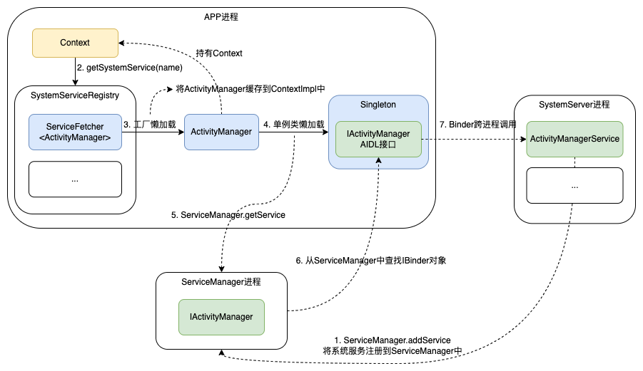

应用和系统服务跨进程通信

App运行过程中经常会与系统服务通信。当客户端要跨进程调用AMS、WMS等方法时，需要先获取系统服务的IBinder代理对象。

例如

- `context.getSystemService(Context.ACTIVITY_SERVICE)`获取ActivityManager对象
- `context.getSystemService(Context.WINDOW_SERVICE)`获取WindowManager对象

本篇介绍应用跨进程调用系统服务方法的原理：

以`ActivityManager`为例

1. SystemServer进程启动时调用`ServiceManager.addService`将系统服务注册到`ServiceManager`进程中
2. APP进程启动时，将系统服务的**工厂类**注册到`SystemServiceRegistry`中，使用Map存储
3. APP调用`context.getSystemService`查找到工厂类，使用工厂类创建`ActivityManager`对象，并缓存到ContextImpl中
4. ActivityManager通过`ServiceManager`查找`IBinder`对象，通过`IActivityManager`跨进程调用AMS方法



# 源码分析

## ContextImpl#getSystemService

Context具体实现类是ContextImpl

```java
//ContextImpl.java
@Override
public Object getSystemService(String name) {
    ...
    //从SystemServiceRegistry仓库中获取对象，传入Context
    return SystemServiceRegistry.getSystemService(this, name);
}
```

## SystemServiceRegistry

1. 保存服务名称和服务工厂到Map中，用到的时候再加载（懒加载服务）
2. 根据服务名称查找到服务工厂，使用工厂创建服务对象，并缓存到ContextImpl中

```java
public final class SystemServiceRegistry {
    private static final Map<String, ServiceFetcher<?>> SYSTEM_SERVICE_FETCHERS = new ArrayMap<String, ServiceFetcher<?>>();
    private static int sServiceCacheSize;
    
    static {
        //注册ActivityManager服务，传入工厂对象
        registerService(Context.ACTIVITY_SERVICE, ActivityManager.class, new CachedServiceFetcher<ActivityManager>() {
            @Override
            public ActivityManager createService(ContextImpl ctx) {
                return new ActivityManager(ctx.getOuterContext(), ctx.mMainThread.getHandler());
            }});
        //注册WindowManager服务
        registerService(Context.WINDOW_SERVICE, WindowManager.class, new CachedServiceFetcher<WindowManager>() {
            @Override
            public WindowManager createService(ContextImpl ctx) {
                return new WindowManagerImpl(ctx);
            }});
        ...
    }
    //注册服务工厂，保存到Map中
    private static <T> void registerService(@NonNull String serviceName,
            @NonNull Class<T> serviceClass, @NonNull ServiceFetcher<T> serviceFetcher) {
        SYSTEM_SERVICE_FETCHERS.put(serviceName, serviceFetcher);
    }
    //获取服务
    public static Object getSystemService(ContextImpl ctx, String name) {
        //获取服务的工厂对象
        final ServiceFetcher<?> fetcher = SYSTEM_SERVICE_FETCHERS.get(name);
        ...
        //从工厂中获取服务对象，如果已创建，则从缓存中获取
        final Object ret = fetcher.getService(ctx);
        return ret;
    }
}
```

## CachedServiceFetcher

1. ContextImpl中缓存服务对象数组
2. 工厂类首先从ContextImpl中查找服务，如果没有，则创建对象并缓存到ContextImpl中
3. 每个Context独立使用一个ActivityManager对象

```java
//ContextImpl.java
class ContextImpl extends Context {
    //Context缓存服务对象
    final Object[] mServiceCache = SystemServiceRegistry.createServiceCache();
}
//SystemServiceRegistry.java
static abstract class CachedServiceFetcher<T> implements ServiceFetcher<T> {
    //保存索引
    private final int mCacheIndex;

    CachedServiceFetcher() {
        mCacheIndex = sServiceCacheSize++;
    }

    //伪代码
    @Override
    public final T getService(ContextImpl ctx) {
        //从缓存中查找
        final Object[] cache = ctx.mServiceCache;
        ...
        T service = (T) cache[mCacheIndex];
        if(service != null) {
            return service;
        }
        //如果没有缓存则创建
        service = createService(ctx);
        //保存到Context中
        cache[mCacheIndex] = service;
    }
}
```

## ActivityManager和IActivityManager

getSystemService拿到的ActivityManager是一个包装类，真正跨进程通信的是IActivityManager对象。

IActivityManager是Framewrok中定义的AIDL接口，是一个IBinder对象，即服务端在客户端的代理对象。

```java
public class ActivityManager {
    //单例类，实现懒加载
    private static final Singleton<IActivityManager> IActivityManagerSingleton =
            new Singleton<IActivityManager>() {
                @Override
                protected IActivityManager create() {
                    //从ServiceManager中获取IBinder对象
                    final IBinder b = ServiceManager.getService(Context.ACTIVITY_SERVICE);
                    final IActivityManager am = IActivityManager.Stub.asInterface(b);
                    return am;
                }
            };
    //通过IActivityManager跨进程通信
    public static IActivityManager getService() {
        return IActivityManagerSingleton.get();
    }
}
```

## ServiceManager

```java
public final class ServiceManager {
    @UnsupportedAppUsage
    private static IServiceManager sServiceManager;
    private static Map<String, IBinder> sCache = new ArrayMap<String, IBinder>();

    private static IServiceManager getIServiceManager() {
        if (sServiceManager != null) {
            return sServiceManager;
        }
        //获取IBinder对象IServiceManager
        sServiceManager = ServiceManagerNative.asInterface(Binder.allowBlocking(
          // native方法，返回Binder驱动的上下文对象，句柄为0
          // ServiceManager进程启动的时候会将自身注册为Binder驱动的上下文对象
          BinderInternal.getContextObject()
        ));
        return sServiceManager;
    }
    public static void addService(String name, IBinder service, boolean allowIsolated,
            int dumpPriority) {
        try {
            //将系统服务注册到ServiceManager中
            getIServiceManager().addService(name, service, allowIsolated, dumpPriority);
        } catch (RemoteException e) {
            Log.e(TAG, "error in addService", e);
        }
    }
    public static IBinder getService(String name) {
        try {
            //从缓存中获取
            IBinder service = sCache.get(name);
            if (service != null) {
                return service;
            } else {
                //从ServiceManager中获取
                return Binder.allowBlocking(rawGetService(name));
            }
        } catch (RemoteException e) {
            Log.e(TAG, "error in getService", e);
        }
        return null;
    }
    
    private static IBinder rawGetService(String name) throws RemoteException {
        //从ServiceManager中获取系统服务的IBinder对象
        final IBinder binder = getIServiceManager().getService(name);
        ...
        return binder;
    }
}
```

# 源码设计思想

为什么`IActivityManager`使用单例类存储？

> `IActivityManager`是AMS的代理对象，用于跨进程调用，每个进程只需要一个实例即可，因此IBinder对象设计成单例

为什么开发者不能直接使用`IActivityManager`进行跨进程通信，而要通过ActivityManager包装类访问？

> 1. `IActivityManager`是AIDL接口，跟随系统源码编译，不在SDK源码中，开发者无法直接使用
> 2. ActivityManager中持有Context，并且封装了一些额外的逻辑，如果开发者直接使用AIDL接口，则需要自行封装，填入多个参数
> 3. AIDL方法调用需要`try-catch(RemoteException)`，在ActivityManager中完成，避免开发者手写

为什么SystemServiceRegistry保存的是一个工厂`ServiceFetcher`，而不是ActivityManager对象？

> 1. 实现ActivityManager懒加载：进程启动的时候只初始化工厂对象，直接初始化ActivityManager代价较大
> 2. 使用工厂可以创建多次ActivityManager对象，如果直接保存ActivityManager对象，则整个进程只能共用一个

为什么通过Context获取ActivityManager，而不直接调用`SystemServiceRegistry`？

> 1. ActivityManager中会用到Context，即需要和Context绑定，由于存在多个Context，因此也需要多个ActivityManager对象。
> 2. 同一个Context共用一个ActivityManager，避免拿到工厂对象后，重复创建ActivityManager对象。

为什么将ActivityManager缓存到Context中？是否可以缓存到一个`Map<Context, Object[]>`中？

> 1. 同一个Context共用一个ActivityManager
> 2. Context回收，ActivityManager也会释放。如果缓存到Map中则无法释放
