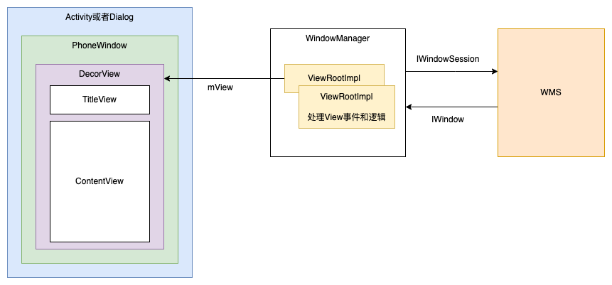

# Activity、Window、DecorView关系



* Activity：持有一个PhoneWindow，定义了一套骨架，提供给开发者直接交互。例如设置View、处理事件、生命周期钩子
* Window：用于绘制UI和响应事件的矩形区域，独立绘制，不与其他界面互相影响，持有DecorView对象
* DecorView：顶级View，包括TitleView和Activity设置的ContentView，持有Window对象
* ViewRootImpl：用来衔接Window和DecorView，控制View绘制和事件分发等。ViewRootImpl是DecorView的parent
* Surface：每个窗口包含一个由WMS分配的Surface，用于绘制，绘制完之后通过`SurfaceFlinger`进行合成，输出到FrameBuffer中

## WindowManager

WindowManager、WindowManagerImpl、WindowManagerGlobal、IWindowManager、IWindow、PhoneWindow关系

WindowManager创建

```java
ActivityThread#performLaunchActivity()
  activity = mInstrumentation.newActivity(cl, component.getClassName(), r.intent); //实例化Activity
  Activity#attach() //调用attach方法
    mWindow = PhoneWindow //初始化PhoneWindow
    mWindowManager = (WindowManager)context.getSystemService(Context.WINDOW_SERVICE) //获取WindowManager
```


```java
//Activity.java
// ActivityThread实例化Activity之后调用
final void attach(...) {
    attachBaseContext(context);
    // 创建PhoneWindow
    mWindow = new PhoneWindow(this, window, activityConfigCallback);
    // 设置Callback
    mWindow.setCallback(this);
    // 通过getSystemService获取WindowManager对象，Window关联Activity的Token
    mWindow.setWindowManager((WindowManager)context.getSystemService(Context.WINDOW_SERVICE),
        mToken, mComponent.flattenToString(), (info.flags & ActivityInfo.FLAG_HARDWARE_ACCELERATED) != 0);
    mWindowManager = mWindow.getWindowManager();
}
```


# setContentView源码

总结：Activity调用PhoneWindow的setContentView，创建DecorView，调用inflate解析布局文件，填充到mContentParent中。

**此时只是解析和创建完ViewTree，并没有添加到WindowManager，也没有开始测量和绘制**

```java
Activity#setContentView()
  PhoneWindow#setContentView()
    PhoneWindow#installDecor() //创建DecorView，根据主题设置标题栏、透明度、是否全屏等
    mLayoutInflater.inflate(layoutResID, mContentParent) //inflate解析layout，填入DecorView的ContentParent中
```

`Activity#setContentView`：

```java
// Activity.java
public void setContentView(@LayoutRes int layoutResID) {
    // 对应PhoneWindow
    getWindow().setContentView(layoutResID);
    initWindowDecorActionBar();
}
```

`PhoneWindow#setContentView`

1. `installDecor()`创建DecorView：
   1. 将Window设置到DecorView中
   2. 通过Id找到ContentParent
   3. 根据主题样式设置feature、flag等，例如标题栏、透明度、是否全屏等
2. inflate ContentView到父布局中

```java
//PhoneWindow.java
@Override
public void setContentView(int layoutResID) {
    //创建DecorView，通过findViewById找到ContentParent
    installDecor();
    ...
    //inflate ContentView布局，并添加到mContentParent中
    mLayoutInflater.inflate(layoutResID, mContentParent);
    ...
    final Callback cb = getCallback();
    if (cb != null && !isDestroyed()) {
        //回调通知Activity
        cb.onContentChanged();
    }
}
```

`mLayoutInflater.inflate()`

1. root不为空，inflate之后默认会addView到root中，除非显式指定`attachToRoot`为false
2. 通过Xml Pull方式解析layout布局文件
3. `rInflateChildren`内部调用`rInflate`方法，递归解析标签，`createViewFromTag`根据Tag创建View对象
4. 解析完成之后通过`parent.onFinishInflate()`冒泡通知父View完成填充，此时可以操作View，例如`findViewById`
5. `<merge>`标签必须绑定到一个父布局
6. `<include>`标签，需要找到对应的layout布局文件，解析填充到当前位置

```java
public View inflate(@LayoutRes int resource, @Nullable ViewGroup root) {
    //root不为空，默认直接addView
    return inflate(resource, root, root != null);
}
public View inflate(@LayoutRes int resource, @Nullable ViewGroup root, boolean attachToRoot) {
    final Resources res = getContext().getResources();
    ...
    //使用XmlPullParser解析layout布局文件
    XmlResourceParser parser = res.getLayout(resource);
    try {
        return inflate(parser, root, attachToRoot);
    } finally {
        parser.close();
    }
}
public View inflate(XmlPullParser parser, @Nullable ViewGroup root, boolean attachToRoot) {
    synchronized (mConstructorArgs) {
        Trace.traceBegin(Trace.TRACE_TAG_VIEW, "inflate");
        ...
        try {
            // parse解析直到遇到开始标签
            advanceToRootNode(parser);
            final String name = parser.getName();
            // <merge>标签必须绑定到一个父布局
            if (TAG_MERGE.equals(name)) {
                if (root == null || !attachToRoot) {
                    throw new InflateException("<merge /> can be used only with a valid "
                            + "ViewGroup root and attachToRoot=true");
                }
                // 递归填充子布局
                rInflate(parser, root, inflaterContext, attrs, false);
            } else {
                // 根据layout根布局标签创建View对象
                final View temp = createViewFromTag(root, name, inflaterContext, attrs);
                ViewGroup.LayoutParams params = null;
                if (root != null) {
                    params = root.generateLayoutParams(attrs);
                    if (!attachToRoot) {
                      // 如果是attachToRoot，则通过addView添加属性
                        temp.setLayoutParams(params);
                    }
                }
                // 递归填充子布局
                rInflateChildren(parser, temp, attrs, true);
                // attachToRoot添加到父布局
                if (root != null && attachToRoot) {
                    root.addView(temp, params);
                }
                // 如果选择了attachToRoot，则返回root，否则直接返回inflate的布局
                if (root == null || !attachToRoot) {
                    result = temp;
                }
            }
        } finally {
          ...
            Trace.traceEnd(Trace.TRACE_TAG_VIEW);
        }
        return result;
    }
}
//递归填充子布局
void rInflate(XmlPullParser parser, View parent, Context context,
        AttributeSet attrs, boolean finishInflate) throws XmlPullParserException, IOException {
    ...
    // Pull解析标签
    while (((type = parser.next()) != XmlPullParser.END_TAG ||
            parser.getDepth() > depth) && type != XmlPullParser.END_DOCUMENT) {
        if (type != XmlPullParser.START_TAG) {
            continue;
        }
        final String name = parser.getName();
        // 处理特殊标签
        if (TAG_REQUEST_FOCUS.equals(name)) {
            pendingRequestFocus = true;
            consumeChildElements(parser);
        } else if (TAG_TAG.equals(name)) {
            parseViewTag(parser, parent, attrs);
        } else if (TAG_INCLUDE.equals(name)) {
            if (parser.getDepth() == 0) {
                throw new InflateException("<include /> cannot be the root element");
            }
            // 对于<include>标签，需要找到对应的layout布局文件，解析填充到当前位置
            parseInclude(parser, context, parent, attrs);
        } else if (TAG_MERGE.equals(name)) {
            throw new InflateException("<merge /> must be the root element");
        } else {
            // 根据标签创建View对象
            final View view = createViewFromTag(parent, name, context, attrs);
            final ViewGroup viewGroup = (ViewGroup) parent;
            final ViewGroup.LayoutParams params = viewGroup.generateLayoutParams(attrs);
            // 递归创建子View
            rInflateChildren(parser, view, attrs, true);
            viewGroup.addView(view, params);
        }
    }
    ...
    if (finishInflate) {
        // 通知父View完成填充
        parent.onFinishInflate();
    }
}
```

# DecorView添加到WindowManager

`ActivityThread`在`handleResumeActivity`之后，调用`WindowManager.addView`添加DecorView，详情见上一篇Activity启动流程

这里分析下`WindowManager.addView`做了什么事情，对应`WindowManagerImpl`类

```java
//WindowManagerImpl.java
@Override
public void addView(@NonNull View view, @NonNull ViewGroup.LayoutParams params) {
    applyDefaultToken(params);
    mGlobal.addView(view, params, mContext.getDisplay(), mParentWindow);
}
```

`WindowManagerGlobal`：管理同一个应用的多个Window

1. 创建`ViewRootImpl`，内部会创建`AttachInfo`对象，保存Window、ViewRootImpl、Display、rootView等信息，供View使用
2. `WindowManagerGlobal`保存多个窗口的`DecorView`、`ViewRootImpl`等
3. 调用`ViewRootImpl.setView()`设置DecorView

```java
//WindowManagerGlobal.java
//存储多个窗口的DecorView
private final ArrayList<View> mViews = new ArrayList<View>();
//存储多个窗口的ViewRootImpl
private final ArrayList<ViewRootImpl> mRoots = new ArrayList<ViewRootImpl>();

public void addView(View view, ViewGroup.LayoutParams params,
        Display display, Window parentWindow) {
    ...
    ViewRootImpl root;
    View panelParentView = null;
    final WindowManager.LayoutParams wparams = (WindowManager.LayoutParams) params;
    if (parentWindow != null) {
        // 对于子窗口，会调用一下adjustLayoutParamsForSubWindow
        parentWindow.adjustLayoutParamsForSubWindow(wparams);
    } else {
    }
    synchronized (mLock) {
        // 系统属性变更后通知ViewRootImpl，例如开启GPU渲染，布局监测等
        // Start watching for system property changes.
        if (mSystemPropertyUpdater == null) {
            mSystemPropertyUpdater = new Runnable() {
                @Override public void run() {
                    synchronized (mLock) {
                        for (int i = mRoots.size() - 1; i >= 0; --i) {
                            mRoots.get(i).loadSystemProperties();
                        }
                    }
                }
            };
            SystemProperties.addChangeCallback(mSystemPropertyUpdater);
        }

        int index = findViewLocked(view, false);
        if (index >= 0) {
            //检查该DecorView是否已添加到WinodwManagerGlobal中
        }
        // 创建ViewRootImpl
        root = new ViewRootImpl(view.getContext(), display);

        view.setLayoutParams(wparams);
        // 保存到WindowManagerGlobal中
        mViews.add(view);
        mRoots.add(root);
        mParams.add(wparams);

        // do this last because it fires off messages to start doing things
        try {
            // 调用ViewRootImpl的setView方法，该方法会开启同步屏障，因此需要放到最后执行
            root.setView(view, wparams, panelParentView);
        } catch (RuntimeException e) {
            // BadTokenException or InvalidDisplayException, clean up.
            if (index >= 0) {
                removeViewLocked(index, true);
            }
            throw e;
        }
    }
}
```

`ViewRootImpl.setView`

1. 创建`InputChannel`，注册`WindowInputEventReceiver`监听，从native层调用`dispatchInputEvent`，而不是通过AIDL调用
2. 在添加到WMS之前请求一次`requestLayout`布局
3. 通过`IWindowSession`跨进程调用WMS的addWindow方法，WMS中会判断应用权限，Token、窗口类型等，返回结果。并且传入一个`IWindow.Stub`的Binder对象，WMS通过调用Binder对象方法通知ViewRootImpl，例如窗口焦点变化、窗口移动缩放等

```java
//ViewRootImpl.java
public final Surface mSurface = new Surface();
private final SurfaceControl mSurfaceControl = new SurfaceControl();

public void setView(View view, WindowManager.LayoutParams attrs, View panelParentView) {
    synchronized (this) {
        if (mView == null) {
            // 保存DecorView
            mView = view;
            ...
            // Keep track of the actual window flags supplied by the client.
            mClientWindowLayoutFlags = attrs.flags;

            setAccessibilityFocus(null, null);

            if (view instanceof RootViewSurfaceTaker) {
                mSurfaceHolderCallback = ((RootViewSurfaceTaker)view).willYouTakeTheSurface();
                if (mSurfaceHolderCallback != null) {
                    // 创建SurfaceHolder
                    mSurfaceHolder = new TakenSurfaceHolder();
                    mSurfaceHolder.setFormat(PixelFormat.UNKNOWN);
                    mSurfaceHolder.addCallback(mSurfaceHolderCallback);
                }
            }
            ...
            mAdded = true;
            int res; /* = WindowManagerImpl.ADD_OKAY; */

            // 请求View布局
            requestLayout();
            // 创建InputChannel，用于接收输入事件
            if ((mWindowAttributes.inputFeatures
                    & WindowManager.LayoutParams.INPUT_FEATURE_NO_INPUT_CHANNEL) == 0) {
                mInputChannel = new InputChannel();
            }
            mForceDecorViewVisibility = (mWindowAttributes.privateFlags
                    & PRIVATE_FLAG_FORCE_DECOR_VIEW_VISIBILITY) != 0;
            try {
                mOrigWindowType = mWindowAttributes.type;
                mAttachInfo.mRecomputeGlobalAttributes = true;
                collectViewAttributes();
                // 跨进程调用WMS的addWindow方法
                res = mWindowSession.addToDisplay(mWindow, mSeq, mWindowAttributes,
                        getHostVisibility(), mDisplay.getDisplayId(), mTmpFrame,
                        mAttachInfo.mContentInsets, mAttachInfo.mStableInsets,
                        mAttachInfo.mOutsets, mAttachInfo.mDisplayCutout, mInputChannel,
                        mTempInsets);
                setFrame(mTmpFrame);
            } 
            ...
            if (res < WindowManagerGlobal.ADD_OKAY) {
              // 根据res结果抛出对应的异常，例如ADD_BAD_APP_TOKEN、ADD_PERMISSION_DENIED、ADD_INVALID_TYPE等
              ...
            }

            if (view instanceof RootViewSurfaceTaker) {
                mInputQueueCallback = ((RootViewSurfaceTaker)view).willYouTakeTheInputQueue();
            }
            if (mInputChannel != null) {
                if (mInputQueueCallback != null) {
                    mInputQueue = new InputQueue();
                    mInputQueueCallback.onInputQueueCreated(mInputQueue);
                }
                // 监听输入事件
                mInputEventReceiver = new WindowInputEventReceiver(mInputChannel, Looper.myLooper());
            }
            ...
        }
    }
}
```

# 结语

参考资料：

* [深入理解Android之View的绘制流程](https://www.jianshu.com/p/060b5f68da79)
* [Android窗口机制（四）ViewRootImpl与View和WindowManager](https://www.jianshu.com/p/9da7bfe18374)
* [Android窗口机制（五）最终章：WindowManager.LayoutParams和Token以及其他窗口Dialog，Toast](https://www.jianshu.com/p/bac61386d9bf)
* [源码分析：Activity加载并显示View的流程分析(二)](https://blog.csdn.net/android_jianbo/article/details/86595403)

https://blog.csdn.net/weixin_39820136/article/details/117830768

https://blog.csdn.net/zhizhuodewo6/article/details/111246461
