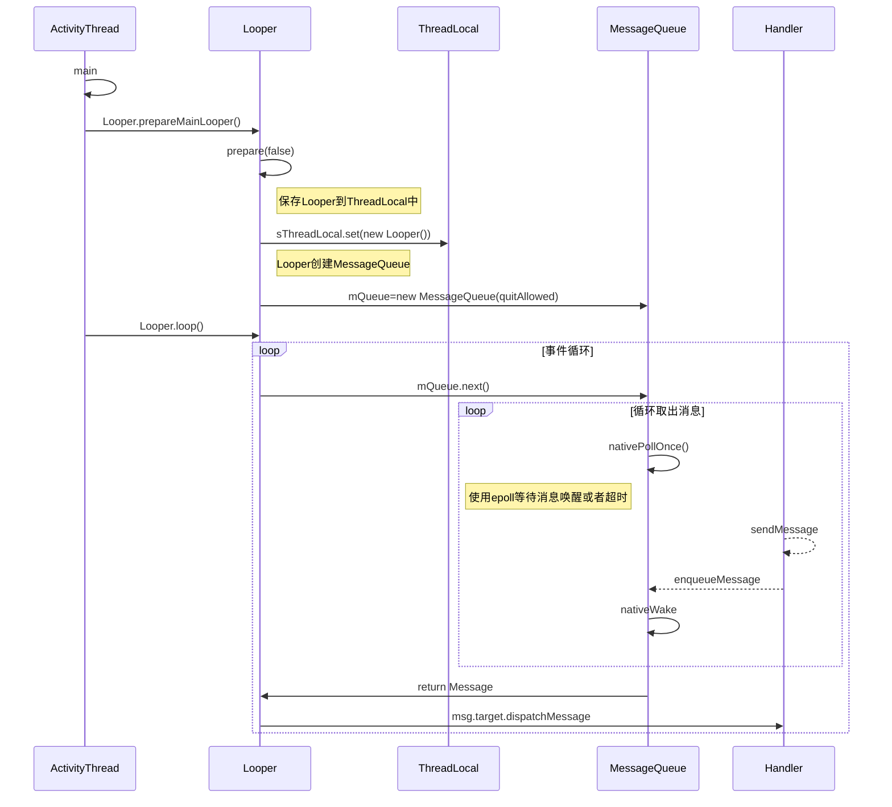

```mermaid
sequenceDiagram
ActivityThread->>ActivityThread:main
ActivityThread->>Looper:Looper.prepareMainLooper()
Looper->>Looper:prepare(false)
note right of Looper:保存Looper到ThreadLocal中
Looper->>ThreadLocal:sThreadLocal.set(new Looper())
note right of Looper:Looper创建MessageQueue
Looper->>MessageQueue:mQueue=new MessageQueue(quitAllowed)
ActivityThread->>Looper:Looper.loop()
loop 事件循环
Looper->>MessageQueue:mQueue.next()
loop 循环取出消息
MessageQueue->>MessageQueue:nativePollOnce()
note left of MessageQueue:使用epoll等待消息唤醒或者超时
Handler-->>Handler:sendMessage
Handler-->>MessageQueue:enqueueMessage
MessageQueue->>MessageQueue:nativeWake
end
MessageQueue->>Looper:return Message
Looper->>Handler:msg.target.dispatchMessage
end
```

