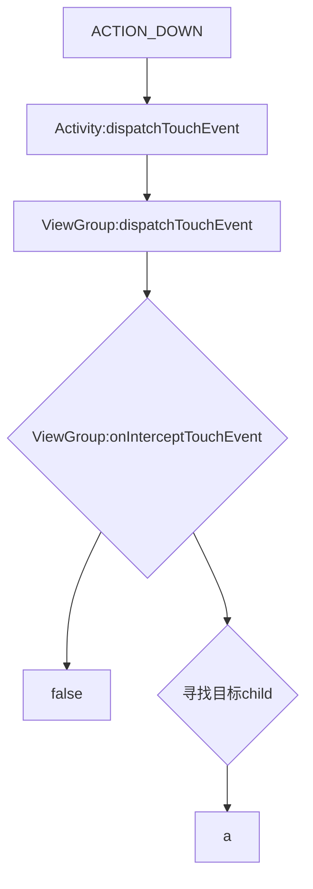

# 输入事件

```shell
ViewRootImpl#WindowInputReceiver(InputChannel)
ViewRootImpl#dispatchPointEvent
->DecorView#dispatchTouchEvent
->cb.dispatchTouchEvent
->Activity#dispatchTouchEvent
->Activity#getWindow().superDispatchTouchEvent(ev)
->DecorView#super.dispatchTouchEvent
    ->ViewGroup#dispatchTouchEvent
    ->ViewGroup#onInterceptTouchEvent
    ->View#dispatchTouchEvent
    ->View#onTouchEvent
    ->ViewGroup#onTouchEvent
    ->Activity#onTouchEvent
```

某个View一旦消费了Down事件，Move和Up也会交给他处理

* 滑动冲突：父控件和子控件都有滑动功能
  * ViewGroup#onInterceptTouchEvent：父控件拦截
  * ViewGroup#requestDisallowInterceptTouchEvent：禁止父控件拦截


> 类似HTML的事件处理：分为事件捕获、事件冒泡两个阶段
>
> dispatchTouchEvent从上往下，onTouchEvent从下往上冒泡

GestureDetector：自动识别了手势，开发者不需要再判断Type

https://www.jb51.net/article/222351.htm



https://blog.csdn.net/guolin_blog/article/details/9097463

https://www.jianshu.com/p/75a267486b44

https://www.jianshu.com/p/a0c8f21f27d4
