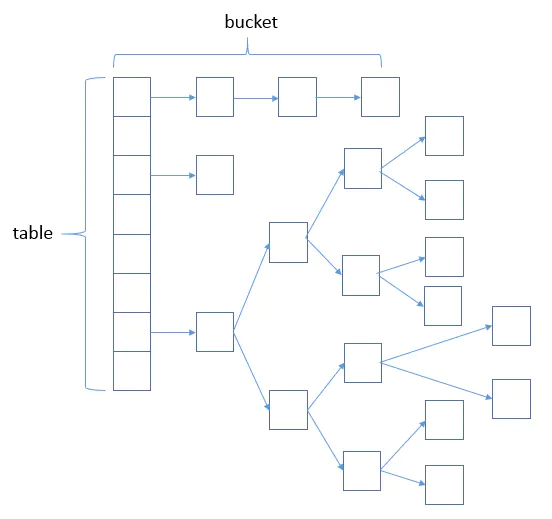
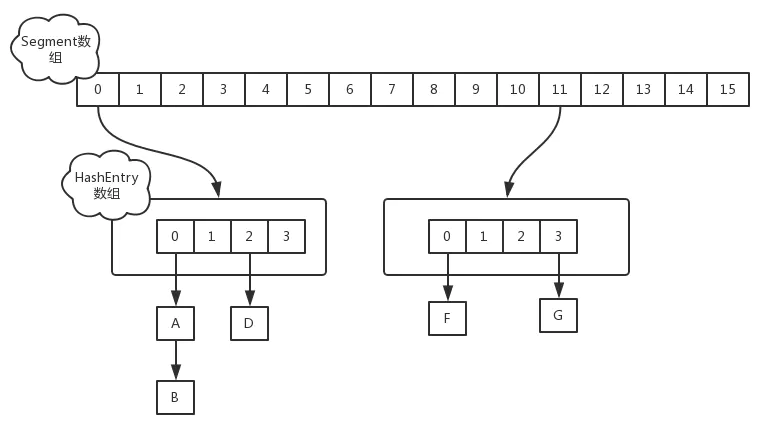
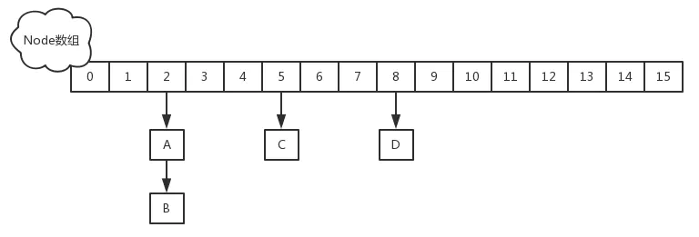

**HashMap 初始容量 10000 即 new HashMap(10000)，当往里 put 10000 个元素时，需要 resize 几次（初始化的那次不算）？**

A. 1 次
B. 2 次
C. 3 次
D. 0 次

# HashMap

HashMap和HashTable的区别？

| HashTable                 | HashMap        |
| ------------------------- | -------------- |
| 继承Dictionary类          | 实现Map接口    |
| 线程安全                  | 线程不安全     |
| 不允许null值              | 允许null值     |
| 默认容量：11              | 默认容量：16   |
| 扩容：x2+1                | 扩容：x2       |
| 直接使用Key的`hashCode()` | 自定义哈希算法 |

HashMap怎么解决hash冲突的？数组+链表+红黑树

   * jdk8以前，出现hash冲突，加入链表中
   * Jdk8中：如果冲突数量（TREEIFY_THRESHOLD）小于8，则是以链表方式解决冲突。冲突大于等于8且容量大于64时，就会将冲突的Entry转换为**红黑树**进行存储。
   * 单链表遍历时间复杂度是O(n)，红黑树查找时间复杂度为 O(logn)
   * 在jdk1.8之前是插入头部的，在jdk1.8中是插入尾部的。
     * 多线程下，头插法在扩容的时候可能会出现死循环。当然HashMap本身就是线程不安全的，应该尽量避免多线程使用




put步骤：

1. 计算Key的hash值：`hash = hashCode() ^ (hashCode >>> 16)`，高16位与低16位做异或运算，减少冲突，高16位的特征会被加入到计算中
   1. 还有平方取中法，除留余数法，伪随机数法
2. 计算数组下标：`(length - 1) & hash`，&（与）运算比%（取余）效率更高
   1. HashMap容量永远是2的幂次，此时`length - 1`二进制全为1，因此计算下标的时候存在`(length - 1) & hash = hash % length`，提高运算效率
3. 如果计算的下标不存在，则直接插入，如果发生hash冲突，且equals相等，则更新键值对，否则插入链表或红黑树
4. 当容器中元素个数大于`capacity * loadfactor`时，会扩容到2倍大小
5. 如果table == null, 则为HashMap的初始化, 生成空table返回即可;
6. 如果table不为空, 需要重新计算table的长度, newLength = oldLength << 1(注, 如果原oldLength已经到了上限, 则newLength = oldLength);
3. 遍历oldTable:
   1. 首节点为空, 本次循环结束;
   2. 无后续节点, 重新计算hash位, 本次循环结束;
   3. 当前是红黑树, 走红黑树的重定位;
   4. 当前是链表
      1. 创建两个链表，低头loHead和高头hiHead
      2. 遍历计算链表的每个节点， 判断是否需要换位置。JAVA7时需要重新计算hash位，但是JAVA8做了优化，通过(e.hash & oldCap) == 0来判断是否需要移位; 如果为真则在原位不动（加到loHead链表中），否则需要移动到当前hash槽位 + oldCap的位置（加到hiHead链表中）
      3. loHead链表放到数组原位置table[index]，hiHead链表放到数组新位置table[index + oldCap]

扩容的时候不会重新计算hash值，而是将hash值与容量做&运算，低位会多出一位

例如 hash & 16，低位会多出一位，如果该位是1则移动位置，如果是0则不移动位置

0.75：`table.length * 3/4` 可以被优化为`(table.length >> 2) << 2) - (table.length >> 2) == table.length - (table.length >> 2)`, JAVA的位运算比乘除的效率更高, 所以取3/4在保证hash冲突小的情况下兼顾了效率;

HashMap如何扩容?

* size：大小
* capality：容量
* loadFactor：扩容因子（加载因子）默认是0.75，用于衡量map是否满了。和实时加载因子比较size/capality
* threshold：阈值，插入的时候判断size大于threshold开始扩容
* `threshold = capality * loadFactor`
* 默认长度16，每次扩大为原来的两倍

为什么扩容因子是0.75：空间利用率、避免冲突链表过长，减少查询成本。

初始容量声明为10，实际会创建16的数组

处理hash冲突方法：

* 开放定址法：冲突位置往后查询空位置
* 再hash法：计算新hash
* 拉链法：冲突位置构造成链表
* 公共溢出区：冲突之后填入溢出表，使用新表存储冲突元素

LinkedHashMap：每个节点为`LinkedHashMapEntry`，继承自HashMap的Node记录了前后的节点。并且提供了头节点和尾节点

HashMap为什么线程不安全

1. JDK1.8之前，采用头插法，并发扩容会导致死循环。JDK1.8之后，采用尾插法，不会导致死循环，但仍可能出现数据覆盖的情况
2. 多线程同时操作，可能会覆盖数据。例如两个线程同时push，计算hash值相同，并且同时判断了目标位置为空。

```java
//HashMap.java
final Node<K,V>[] resize() {
    Node<K,V>[] oldTab = table;
    //计算容量...
    Node<K,V>[] newTab = (Node<K,V>[])new Node[newCap];
    table = newTab;
    if (oldTab != null) {
        for (int j = 0; j < oldCap; ++j) {
            Node<K,V> e;
            if ((e = oldTab[j]) != null) {
                oldTab[j] = null;
                if (e.next == null)
                    newTab[e.hash & (newCap - 1)] = e;
                else if (e instanceof TreeNode)
                    //红黑树扩容
                    ((TreeNode<K,V>)e).split(this, newTab, j, oldCap);
                else { // 链表扩容
                    Node<K,V> loHead = null, loTail = null;
                    Node<K,V> hiHead = null, hiTail = null;
                    Node<K,V> next;
                    do {
                        next = e.next;
                        if ((e.hash & oldCap) == 0) {
                            if (loTail == null)
                                loHead = e;
                            else
                                loTail.next = e;
                            loTail = e;
                        }
                        else {
                            if (hiTail == null)
                                hiHead = e;
                            else
                                hiTail.next = e;
                            hiTail = e;
                        }
                    } while ((e = next) != null);
                    if (loTail != null) {
                        //loHead放到原位置
                        loTail.next = null;
                        newTab[j] = loHead;
                    }
                    if (hiTail != null) {
                        //hiHead放到新位置
                        hiTail.next = null;
                        newTab[j + oldCap] = hiHead;
                    }
                }
            }
        }
    }
    return newTab;
}
```

头插法过程：

1. 假设链表为1->2->3，且1、2、3扩容后hash值还相等，填入新数组的`newTable[i]`位置，初始为空
2. 保存next=2，将1指向新数组的i位置，变为1->null，`newTable[i]`变为1
3. 保存next=3，将2指向新数组的i位置，变为2->1->null，`newTable[i]`变为2
4. 保存next=null，将3指向新数组的i位置，变为3->2->1->null，`newTable[i]`变为3
5. 结束循环

```java
 /**
      * 扩容处理
      *newCapacity 2的幂次方 原来16基础上
     **/
    void resize(int newCapacity) {
        Entry[] oldTable = table; //存放旧的table
        int oldCapacity = oldTable.length; //存放旧的table长度
        if (oldCapacity == MAXIMUM_CAPACITY) {//如果旧的table长度为最大,则将阀值也改为最大
            threshold = Integer.MAX_VALUE;
            return;//不进行扩容了
        }

        Entry[] newTable = new Entry[newCapacity];//新建扩容后的table
        transfer(newTable, initHashSeedAsNeeded(newCapacity));//转移旧数据到新table
        table = newTable;//更换为新table
        //重新计算阀值
        threshold = (int)Math.min(newCapacity * loadFactor, MAXIMUM_CAPACITY + 1);

    }
    /**
     * 数据转移
     * newTable 新table(使用头插法将老数据转移到新数据)
     */
    void transfer(Entry[] newTable, boolean rehash) {
        int newCapacity = newTable.length;
        for (Entry<K,V> e : table) {
            while(null != e) {
                Entry<K,V> next = e.next;
                if (rehash) {
                    e.hash = null == e.key ? 0 : hash(e.key);
                }
                int i = indexFor(e.hash, newCapacity);
                e.next = newTable[i];
                newTable[i] = e;
                e = next;
            }
        }
    }
```

为什么头插法会导致死循环？采用头插法会导致原链表顺序被反转

1. 假设链表为1->2，且1、2扩容后hash值还相等，填入新数组的`newTable[i]`位置，初始为空
2. 假设线程1扩容：next=2，然后线程挂起，释放CPU
3. 此时线程2也开始扩容：线程2也创建了一个新数组`newTable`，结束之后变为2->1。`newTable`是线程独立的，但是Node是共享的
4. 线程1恢复：变为1->null
5. 再次循环，由于Node被线程2修改，2.next为1，保存next=1，将2指向新数组2->1->null
6. 此时next不为空，继续循环，保存next=null，将1指向新位置2->1->null，结果变为1->2->1。
7. 当外部get查找1、2的时候正常，假设get查找3，且3的下标和1，2相同，由于链表中没有3，此时查询会出现死循环。


# ConcurrentHashMap

线程安全

* 1.8之前，segment分段锁设计`ReentrantLock + Segment` + `HashEntry`的方式进行实现，分为16个桶+16把锁，锁粒度是Segment
* 1.8之后，通过Node` + `CAS（无锁算法）` + `Synchronized，锁粒度是首节点，提高了并发性，其他线程此时可以访问其他Node。没有头节点时使用CAS，有头节点使用Syncrhonized
* ConcurrentHashMap键值不允许为null
* ConcurrentHashMap内部是线程安全的，但是不能保证外部多次调用是线程安全的，例如外部get之后可能被其他线程修改





# 其他

## 链表和数组

* 数组需要申请连续内存空间，大小固定。

* 数组应用场景：数据比较少；经常做的运算是按序号访问数据元素；数组更容易实现，任何高级语言都支持；构建的线性表较稳定。
* 链表应用场景：对线性表的长度或者规模难以估计；频繁做插入删除操作；构建动态性比较强的线性表。

https://blog.csdn.net/weixin_39667787/article/details/86678215
