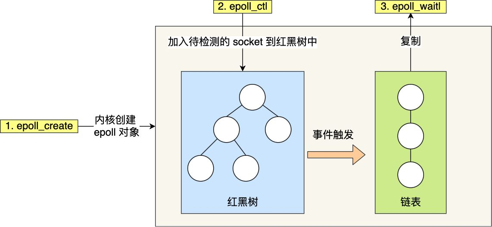
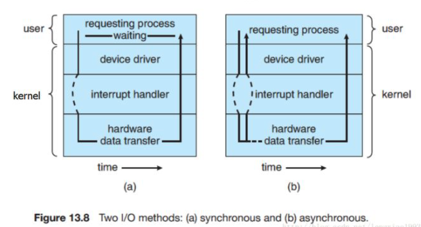
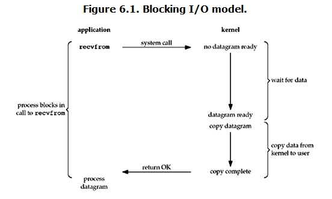
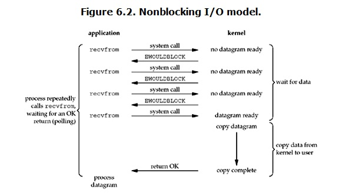
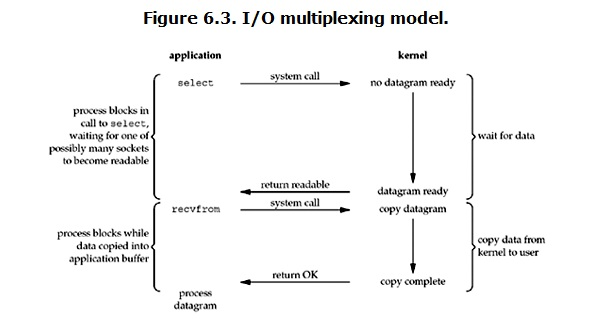
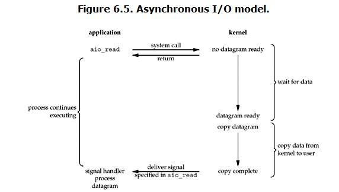

# I/O模型

> 在Linux中一切皆文件，Socket实际上也是一个文件，对应一个文件描述符（FD，File Description）

以TCP Socket通信为例（文件I/O类似）：

## 阻塞I/O（BIO）

1. 服务端调用`bind()`和`listen()`方法绑定并监听IP地址和端口。当内核收到TCP报文，解析之后会发给对应的应用程序
2. Socket调用`accept()`方法之后**阻塞等待**连接，直到客户端Socket调用`connect()`方法连接
3. 连接之后可以通过`read()`和`write()`读写数据，如果`read()`没有数据，此时也会**阻塞**

**注：这里`accept()`和`read()`是两个独立的系统调用（System Call），都会阻塞，服务端在处理完一个连接之前无法接收其他客户端连接**

示例代码：（客户端代码就不贴了）

```java
public class SocketServer {
    public static void main(String[] args) throws IOException {
        //1.创建一个服务器端Socket，即ServerSocket，指定绑定的端口，并监听此端口
        ServerSocket serverSocket = new ServerSocket(12345);
        InetAddress address = InetAddress.getLocalHost();
        String ip = address.getHostAddress();
        Socket client = null;
        //2.调用accept()等待客户端连接
        client = serverSocket.accept();
        //3.连接后获取输入流，读取客户端信息
        InputStream is = client.getInputStream();     //获取输入流
        InputStreamReader isr = new InputStreamReader(is,"UTF-8");
        BufferedReader br = new BufferedReader(isr);
        String info = null;
        while((info = br.readLine()) != null) { //循环读取客户端的信息
            System.out.println("客户端发送过来的信息" + info);
        }
        client.shutdownInput(); //关闭输入流
        client.close();
    }
}
```

## 多线程模型

上面的方式是同步阻塞，只能监听一个连接，一旦被占用，其他客户端无法连接进来。

为了处理多个连接，很容易想到：使用多进程或者多线程，每个客户端连接拥有独立的线程。

> C10K问题：由Dan Kegel提出。
>
> 字面意思是假设有1W个客户端连接或者客户端进程，如果为每个连接分配1个进程或者线程，可想而知，单机是无法承受的。
>
> 后来将这些网络现象和单机性能局限都统称为C10K问题，要求开发者在程序设计中考虑C10K场景。

**注：`accept()`会阻塞当前线程，`read()`操作在子线程执行不会阻塞当前线程，因此服务端可以接收多个连接**

示例代码：

```java
public class SocketServer {	
  private List<Socket> mList = new ArrayList<Socket>();
  private ExecutorService myExecutorService = null;

	public static void main(String[] args) {
		try {
			// 创建服务端socket
			ServerSocket serverSocket = new ServerSocket(8088);
      // 创建线程池
      myExecutorService = Executors.newCachedThreadPool();
			// 循环监听等待客户端的连接
      while(true){
        // 监听客户端
        client = serverSocket.accept();
        mList.add(client);
        //每来一个连接，开启一个子线程去执行，不阻塞当前线程。当前线程继续accept阻塞等待连接
        myExecutorService.execute(new Task(client));
      }
		} catch (Exception e) {
			e.printStackTrace();
		}
	}
  
  class Task implements Runnable {
    ...
    @Override
    public void run() {
      while((info = br.readLine()) != null) { //循环读取客户端的信息
        if(info.equals("bye")) { //直到客户端断开连接
          //关闭Socket连接，移出列表
        }
        System.out.println("客户端发送过来的信息" + info);
      }
    }
  }
}
```

## 非阻塞I/O（NIO）

一台服务器上的进程数和线程数有限，通信完成之后频繁的创建、销毁和切换线程会带来大量开销，使用线程池或者连接池可以一定程度上降低开销。

但是对于大规模的连接，还是无法解决。因此引入了非阻塞I/O。

1. 当客户端没有数据发过来时，服务端调用`read()`不会阻塞，而是立即返回空
2. 应用可以再次调用`read()`读取，直到内核获取到客户端的数据（轮询）

**注：`accept()`和`read()`立即返回，不会阻塞当前线程，即使`read()`没有数据**

示例代码如下：

```java
public static void main(String[] args) throws Exception {    
  //用于存储客户端的集合
  LinkedList clients = new LinkedList<>();    
  //nio里概念改成了channel
  ServerSocketChannel ss = ServerSocketChannel.open();
  ss.bind(new InetSocketAddress(9090));
  //设置成非阻塞
  ss.configureBlocking(false);    
  while (true) {
    //下面的accept方法不会阻塞
    SocketChannel client = ss.accept();        
    if (client == null) {
      System.out.println("null.....");                    
    } else {
      //设置客户端操作也为非阻塞            
      client.configureBlocking(false);
      clients.add(client);        
    }
    ByteBuffer buffer = ByteBuffer.allocateDirect(4096);
    //遍历已连接的客户端是否能读写数据
    for (SocketChannel c : clients) {
      int num = c.read(buffer);
      if (num > 0) {
        //其他操作
      }
    }
  }
}
```

## I/O多路复用

这一节的例子见下文[Java NIO](#Java NIo)

非阻塞I/O缺点：

1. 需要不断地轮询，会一直占用CPU
2. 每一次`accept()`和`read()`都需要从用户态切换到内核态，会产生大量开销。
3. 数据没有准备好的情况下去`read()`每次都返回空，相当于执行了空操作。

为了避免无效操作，需要想办法得知当前的文件描述符（FD）是否可读写。如果每个FD都去询问，效率和直接读写差不多，因此还需要一次性监听多个FD，即I/O多路复用。

注：

* I/O多路复用的核心就是收集多个文件描述符信息，内核检测到事件之后，告知程序哪些FD可读写。
* I/O多路复用不一定比多线程模型更快，但是它能处理更多的连接。
* I/O多路复用实际上就是把NIO中本该由进程做的轮询动作交给了内核。（并且可以设置超时时间）
* I/O多路复用通常搭配非阻塞I/O使用，如果使用阻塞I/O，可能会出现问题。

> 使用I/O多路复用的时候，`select`返回可读，紧接着调用`read`去读，但这时候不一定真的可读，有可能是FD被错误地报告为就绪，或者被其他进程读取完了。
>
> 惊群现象：假设有多个线程通过select或epoll监听同一个fd，当有一个新连接完成之后，所有线程都被唤醒，但是最终只有一个线程`accept`到了这个新连接，如果采用阻塞I/O，没有`accept`的线程就会被block住。

I/O多路复用器也分为几种：

### select模型

1. 调用select函数将需要监听的**文件描述符集合**拷贝到内核中
2. 内核检查到事件时，遍历FD集合，将对应的FD标记为可读或可写
3. 将**整个FD集合**拷贝到用户态。（包括无事件和有事件的FD）
4. 用户态遍历FD，找到可操作的FD进行处理。

缺点：使用固定长度的BitsMap存储FD集合，32位机器默认最大值为1024，64位机器默认最大值是2048，可以通过`cat /proc/sys/fs/file-max`查看

### poll模型

在select模型基础上进行优化，使用链表存储FD，没有数量限制。

select、poll的缺点：需要对FD集合进行2次遍历和拷贝操作。

**时间复杂度均为`O(n)`，每个事件来都需要遍历集合，应用收到FD集合之后也需要遍历检查，当客户端越多，遍历和拷贝操作开销越大**

### epoll模型

1. 调用`epoll_create`在内核中创建一个红黑树。（红黑树时间复杂度为`O(logn)`）
2. 调用`epoll_ctl`函数将需要监控的FD集合加入到内核中的红黑树。
3. 内核采用事件驱动机制，维护了一个链表，事件到达时将关联的FD从红黑树拷贝到链表中，链表存储的是**就绪FD**。
4. 激活程序调用的`epoll_wait`方法，返回链表中的FD。
5. 应用遍历处理就绪的FD。

**时间复杂度为`O(1)`，事件到达时只会拷贝关联的FD，应用收到FD集合之后，只要判断是否为空即可**



epoll方法：

* `epoll_create`：用于初始化epoll
* `epoll_ctl`：把需要监控的文件描述符集合添加到红黑树中
* `epoll_wait`：返回可以操作的FD集合

epoll支持两种事件触发模式：默认是LT模式

1. 水平触发（LT，Level-Triggered）：当被监控的FD集合有可读事件发生时，每次调用`epoll_wait`都会返回该FD，直到内核缓冲区数据被`read`读完，目的是告诉程序有数据需要读取。
2. 边缘触发（ET，Edge-Triggered）：当被监控的FD集合有可读事件发生时，调用`epoll_wait`只会返回1次，再次调用`epoll_wait`不会返回该FD，直到新的数据写入该FD。目的是防止返回一些应用不关心的**就绪FD**。

> ET模式下即使进程没有调用`read`从内核中读取数据，也只会苏醒一次，因此程序需要保证一次性读取完内核缓冲区的数据。

## 异步I/O（AIO）

上面提到的几个I/O模型实际上都是同步的，NIO在拷贝数据的时候进程是阻塞的，多路复用select也是阻塞的。

异步I/O是真正非阻塞的：异步I/O调用之后会立即返回，程序可以做自己的事情。内核数据准备完成之后，**主动将数据拷贝到用户空间**，并发一个signal告诉程序`read`完成了。

AIO和NIO的区别：

> 非阻塞I/O需要进程主动去检查FD是否可操作，当FD就绪后，需要主动调用`recvfrom`将数据从内核空间拷贝到用户空间，I/O拷贝的过程是阻塞的。
>
> 而AIO则将整个操作交给了内核，用户不需要主动去检查和拷贝，内核处理完后会通知应用。整个过程进程都没发生阻塞。

同步I/O和异步I/O区别：



## 信号驱动I/O（Signal Driver）

比较少用，主要就是将异步I/O的操作拆分开来：

1. 应用调用`sigaction`通知内核，并立即返回
2. 内核准备好数据报之后，发送SigIO信号
3. 应用收到信号之后调用`recvfrom`拷贝数据

## 总结

把几个流程放到一起看下：`accept`和`read`操作都是系统调用，本质都是监听和读取FD数据。

1. BIO：`recvfrom`阻塞，直到内核准备好数据报，拷贝到用户空间之后才返回。

   

2. NIO：`recvfrom`不阻塞，但是需要轮询进行系统调用，直到内核数据报准备完成，再次调用`recvfrom`真正的拷贝数据。

   

3. I/O多路复用：`select`阻塞，直到内核准备好数据，返回文件描述符集合，客户端遍历FD集合，调用`recvfrom`从内核读取数据。和BIO的区别在于可以监听多个FD。

   

4. 异步I/O：`aio_read`立即返回，程序可以做自己的事情，内核准备好数据之后，**主动**拷贝数据到用户空间，之后发一个signal通知程序拷贝完成。

   

5. 信号驱动I/O：`sigaction`立即返回，程序可以做自己的事情，内核准备好数据之后，发送SigIO信号，应用收到信号之后，调用`recvfrom`拷贝数据

# Java NIO

Java NIO是I/O多路复用的一种具体实现：`ServerSocketChannel`是NIO，一般会结合`Selector`多路复用器使用。

示例代码：

```java
ServerSocketChannel ssc = ServerSocketChannel.open();
ssc.socket().bind(new InetSocketAddress("localhost", 8080));
ssc.configureBlocking(false);

//创建多路复用器
Selector selector = Selector.open();
//向多路复用器注册channel，并且指定感兴趣的事件是 Accept
ssc.register(selector, SelectionKey.OP_ACCEPT);

ByteBuffer readBuff = ByteBuffer.allocate(1024);
ByteBuffer writeBuff = ByteBuffer.allocate(128);

while (true) {
    //阻塞，返回可读写的FD数量
    int readyNum = selector.select();
    if (readyNum == 0) {
        continue;
    }
    Set<SelectionKey> selectedKeys = selector.selectedKeys();
    Iterator<SelectionKey> it = selectedKeys.iterator();
    //遍历可读写的FD
    while (it.hasNext()) {
        SelectionKey key = it.next();
        // 判断类型是可接收、可读、可写，可连接（连接另一个服务）
        if (key.isAcceptable()) {
            // 创建通道
            SocketChannel socketChannel = ssc.accept();
            socketChannel.configureBlocking(false);
            // 向多路复用器注册channel，声明这个channel只对读操作感兴趣。
            socketChannel.register(selector, SelectionKey.OP_READ);
        } else if (key.isReadable()) {
            // 通道可读
            SocketChannel socketChannel = (SocketChannel) key.channel();
            readBuff.clear();
            // 将数据从Channel读到缓冲区
            socketChannel.read(readBuff);
            readBuff.flip();
            System.out.println("received : " + new String(readBuff.array()));
            // 读操作完毕，设置为可写，也可以一直读不写
            key.interestOps(SelectionKey.OP_WRITE);
        } else if (key.isWritable()) {
            // 通道可写
            writeBuff.rewind();
            SocketChannel socketChannel = (SocketChannel) key.channel();
            // 将数据从缓冲区写入Channel
            socketChannel.write(writeBuff);
             // 写操作完毕，设置为可读
            key.interestOps(SelectionKey.OP_READ);
        }
        it.remove();
    }
}
```

提问：`select`方法是阻塞的，为什么叫NIO？

> 这里的非阻塞指的是I/O不会阻塞，read没有数据会立即返回。
>
> 例如：A通道没有数据处于等待时，B通道可以被处理，所以这条线程并没有被A通道阻塞。

