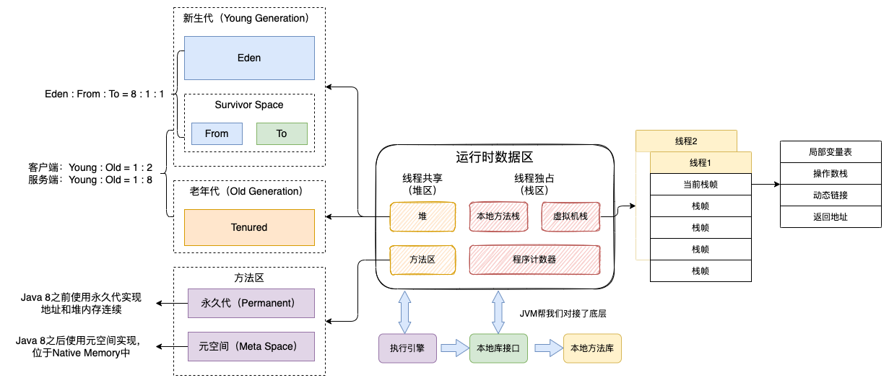
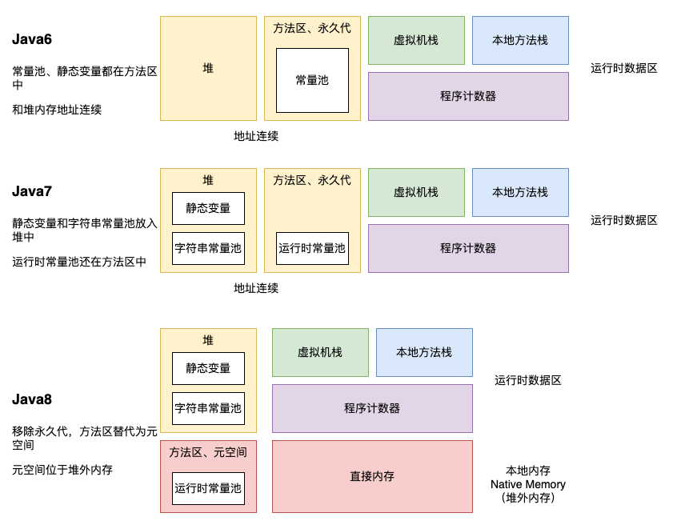
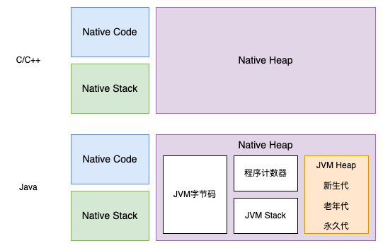
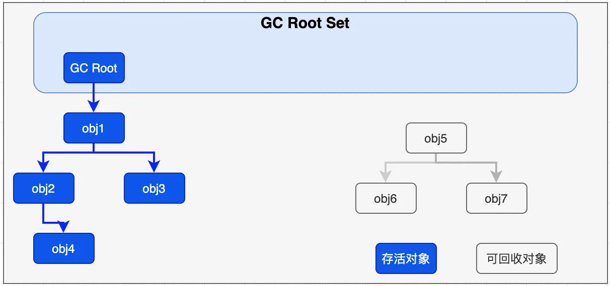
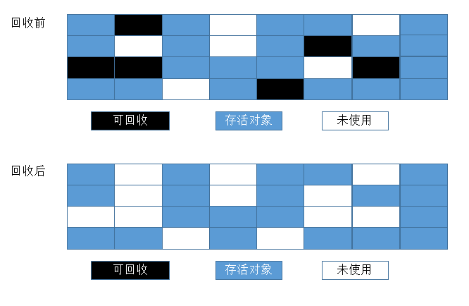

# 四种引用和引用队列

1. 强引用（StrongReference）：普通的引用，如果对象存在强引用，则不会被GC回收
2. 软引用（SoftReference）：内存不足时被回收。
3. 弱引用（WeakReference）：除了弱引用之外没有其他的引用，则GC的时候会被回收。
4. 虚引用/幽灵引用（PhantomReference）：相当于没有引用，**必须与引用队列配合使用**，使对象进入不可用状态，**GC回收时会加入到引用队列中，从引用队列中poll之后对象才被真正清除**。

```java
// 强引用
String str = new String("Strong");
str = null; //引用置空后String对象可以被回收

// 软引用
SoftReference<String> sr = new SoftReference<String>(new String("Soft"));
String str = sr.get(); //获取对象

// 弱引用
WeakReference<String> wr = new WeakReference<String>(new String("Weak"));
String str = wr.get();
// 弱引用Map
WeakHashMap<String, String> whm = new WeakHashMap<String, String>();

// 虚引用和引用队列
ReferenceQueue<String> rq = new ReferenceQueue<String>();
PhantomReference<String> pr = new PhantomReference<String>(new String("Phantom"), rq);
// 永远为null（相当于无引用）
System.out.println(pr.get());
// 从引用队列中取出一个对象
Reference<? extends String> ref = rq.poll();
```

软引用和弱引用一般用于缓存一些不重要的数据，防止内存泄漏，**同样可以配合引用队列使用**

> 例如加载大量图片，每次都从磁盘读取影响性能，一次全部读取又可能会造成内存不足。使用Map+软引用可以避免这个问题，内存不足时自动释放。

```java
ReferenceQueue<String> rq = new ReferenceQueue<String>();
SoftReference<String> sr = new SoftReference<String>(new String("Soft"), rq);
WeakReference<String> wr = new WeakReference<String>(new String("Weak"), rq);
```

**引用队列：关联了引用队列之后，GC会将要回收的对象放入引用队列，因此如果对象在引用队列中，则表示被回收了。用于跟踪GC过程，观察哪些对象被GC回收了，可以做相应的处理。**

# JVM内存模型

* 程序计数器（Program Counter Register）：线程私有，记录当前执行的指令的地址。**不会发生OOM**
* **虚拟机栈（VM Stack）：线程私有**，描述Java方法执行的内存模型。栈中只保存基本数据对象和引用对象的引用地址，对象本身存放在堆区中。
  * 每个方法执行都会创建一个栈帧（Stack Frame），栈顶的栈帧就是当前线程的活动栈，方法执行完成之后出栈。栈帧用于存储局部变量表（Local Variables）、操作数栈（Operand Stack）、当前类的运行时常量池的引用（Reference to runtime constant pool）、方法返回地址（Return Address）和一些额外的附加信息，
* 本地方法栈（Native Method Stack）：为Native方法服务
* **堆（Heap）：线程共享，存放实例对象和Class对象**。
  * JVM只有一个堆区，被所有线程共享。
  * GC回收的主要区域，分为新生代、老年代。
* **方法区（Method Area）：线程共享**，存放的都是程序运行中唯一的元素，例如**被JVM加载过的类的信息**（类名、方法名、变量名、代码等）、静态变量、静态方法、常量、JIT编译后的代码等，**还包括运行时常量池**。
  * JDK 1.8之前的实现是永久代（Permanent）：和堆内存地址是连续的，只是逻辑上进行了区分。
  * JDK 1.8之后的实现是元空间（Metadata Space）：位于本地内存（Native Memory）中。（Gen = Space，不同说法而已）

> **Class对象存放在堆区，不是方法区，类的元数据才是存放在方法区**



## 不同Java版本实现

* 在Java 6中，方法区使用永久代实现，但是JIT编译生成的代码存放在Native Memory的CodeCache区域。
* 在Java 7中，将永久代的部分数据（例如Symbol）移到了Native Memory，并且把字符串常量池和类静态变量从Perm Gen移到了Java堆中。
* 在Java 8中，移除永久代，方法区使用元空间（Metaspace）实现，位于Native Memory中。



**最令人困扰的地方是方法区和堆的关系**，例如：

1. Java8之前永久代到底是在堆中还是方法区中？GC包不包括永久代？
2. Java 8元空间在本地内存：怎么又多了个本地内存？

网上说法很多不一致，或者很含糊。这里说一下我自己的理解（如有错误，欢迎指正）：

1. **堆内存 = 堆 + 永久代**，**永久代 ≠ 方法区**
   1. 在Java8之前方法区使用永久代实现，和堆内存地址连续，只不过JVM从逻辑上把方法区分出来，实际上还是属于堆，都会参与GC，因此可以统称为堆内存。所以有时候会看到网上的图把新生代、老年代、永久代都画到堆中。
   2. 在Java8之后移除了永久代，因此GC回收主要针对堆中对象。元空间有自己的回收机制。**将堆和元空间区分开来，减少堆的GC复杂度，提升效率。**
   3. 方法区是JVM规范，永久代是HotSpot VM在Java8之前对方法区的具体实现，其他虚拟机没有永久代的概念。
2. 本地内存：根据上面的解释，这里可以理解为JVM堆之外的内存，也叫**堆外内存**（非堆）。
3. 直接内存：底层硬件共享的缓冲区，可以直接操作，减少内存间的拷贝。例如显示器缓冲。
4. 本地内存、直接内存和Java版本没有关系，上图只是在Java8中画出来而已，Java8之前也是有的。

为什么需要使用元空间？

1. 字符串存在永久代中容易产生内存溢出
2. 由于类和方法大小难以确定，因此难以指定永久代大小。如果较小容易导致永久代溢出，太大则容易导致老年代溢出
3. 永久代中元数据位置会随着Full GC发生移动，VM需要特殊处理永久代中的元数据，给GC算法带来不必要的复杂度。
4. 融合HotSpot和Jrockit虚拟机实现

> 猜测：
>
> 1. 一开始HotSpot是希望像管理堆内存一样管理方法区，因此叫永久代。
> 2. 但是方法区中的元数据会发生移动，需要进行特殊处理，导致GC算法复杂。
> 3. 因此Java 7将字符串常量池挪到了堆中，永久代"名存实亡"（元数据一般不需要回收）。
> 4. Java 8废弃了永久代，使用元空间，这部分不参与堆的GC，但是也有一套管理机制。可以通过修改参数配置进行调优。

## 如何更好地理解JVM内存模型？

在Java之前，C/C++都是编译为Native Code，直接和操作系统交互。对于内存，划分为3个部分，由程序代码手工维护Heap的分配和释放

1. Native Code：代码
2. Native Stack：方法栈
3. Native Heap：堆

Java则是通过虚拟机向系统申请内存，本质都是Native内存，只是在User空间由程序自行划分管理和命名。



## 常量池

* 静态常量池（Class常量池）：位于Class文件中，用于存放编译期生成的字面量和符号引用（可以使用`javap -v`命令查看）。每个Class文件中都有一个常量池。
* 运行时常量池：位于方法区中，存放Class文件加载后的字面量和符号引用，以及运行时动态创建的常量（例如intern方法）。加载之后所有Class共享运行时常量池。
* 字符串常量池：使用StrignTable的Hash表存储。详情见上几章的《Java字符串》
  * JDK 1.7之前字符串常量池在方法区中。
  * JDK 1.7之后字符串常量池放到了堆中。

静态常量池在类加载之后会进入运行时常量池，类加载时会将符号地址转为真实地址。

为什么需要简单类型和常量？

> * 基本数据类型（简单类型）：由于经常被使用，如果都定义一个类、创建对象，会浪费很多性能。
> * 常量：使用共享对象的方式，避免重复创建相同的引用类型对象。原理是使用池进行复用，引用指向池中对象

# Java GC

C/C++需要对象使用完之后需要手动释放，对程序员要求较高，并且可能会产生以下问题

1. 悬空指针，内存被释放，但还有指针指向它
2. 双重释放
3. 某些内存泄漏情况下，程序无法释放已经无法访问的对象占用的内存，可能导致内存耗尽

> C/C++提供了智能指针（share_ptr）来自动管理内存，不需要手动delete释放，内部是通过引用计数原理实现的。

GC（Garbage Collection，垃圾回收）是一种内存管理机制。VM会自动回收不需要的对象，不需要程序员手动释放。

优势：不需要程序员手动释放，减少程序员维护工作。

缺点：可能会影响性能

1. 垃圾回收需要决定释放哪些内存，消耗计算资源
2. 垃圾回收会发生Stop The World（STW）事件，中断程序

## 什么时候发生GC

GC执行时机不可控，手动调用`System.gc()`并不会立马GC，而是向JVM发送执行GC的请求，不保证一定会执行。

## 什么对象会被回收

GC主要针对堆内存，因为栈内存是用完即销的。主要**回收堆中没有被引用的对象**，判断方式：

1. 引用计数法：计算被引用的次数，为0时表示没有引用，可以被回收。很难解决循环引用问题
2. 可达性分析法：**判断对象是否被GC Root引用**。

常见的GC Root如下：

1. 虚拟机栈（栈帧中的**局部变量表**）中引用的对象。
2. 方法区中类静态属性引用的对象。
3. 方法区中常量引用的对象。
4. 本地方法栈中JNI（即一般说的Native方法）引用的对象。

GC Root都是线程中正在使用的对象，因此可以认为GC Root引用的对象都是"活着的"。



## GC算法

### 标记-清除算法（Mark-Sweep）

标记出所有需要回收的对象，标记完成后统一回收所有被标记的对象。**会产生大量不连续的内存碎片**。



### 复制算法（Copy）

将可用的内存分为两块，每次只用其中一块，当这一块内存用完了，就将还存活着的对象复制到另外一块上面，然后再把已经使用过的内存空间一次性清理掉。

缺点：每次只能使用一半的内存空间，可以按一定比例进行分配。


### 标记-整理（压缩）算法（Mark-Compact）

标记出所有需要回收的对象，让所有存活对象都向一端移动，然后直接清理掉边界以外的内存。


### 分代收集算法

**对不同代使用不同的算法（不同的垃圾收集器）**。

1. **新生代（Young Gen）：使用复制算法**。回收频繁，存活对象少，复制成本低
2. **老年代（Tenured Gen，Old Gen）：使用标记-整理算法**。回收不频繁，对象存活率高。（如果使用复制算法，需要预留一块较大的内存用于复制，且复制效率低）
3. 永久代（Permanent Gen）：也会回收，见下节。

新生代分为三块区域：Eden（伊甸园）、Survivor From（幸存者区，S0）、Survivor To（空幸存者区，S1）。

1. 对象被创建时，内存分配首先发生在Eden。（对于"大对象"会直接分配到老年代，大对象频繁创建销毁开销较大）
2. 当Eden区域满了，则触发Minor GC
3. GC会检查Eden区和幸存者区（Survivor From）的对象，把幸存的对象移到到空幸存者区（Survivor To）中，回收掉Eden区和Survivor From区的对象。（如果Survivor To空间不足，则移到老年代）
4. 此时Survivor To变为幸存者区，而Survivor From变为空幸存者区（只是名称上对调了），重复上述步骤
5. 多次GC之后如果对象还存活，则进入老年区，老年区GC发生频率较低，但是对象仍然可以被回收

为什么需要两块Survivor区？

> 避免产生内存碎片。
>
> 如果只有一块，第一次GC，从Eden区复制到Survivor区。当再次发生GC时，Survivor区会产生内存碎片，可能会导致Eden区的对象复制失败。

对象什么时候会进入老年代？

> 1. 大对象创建直接分配到老年代
> 2. Minor GC时，Survivor To放不下存活的对象，由老年代进行**分配担保**（即新生代空间不足，则交给老年代）
> 3. 每次GC对象年龄变大，多次GC之后，对象还存活，则进入老年代

**VM按一定比例分配各个区域大小，不同VM和垃圾回收器有不同的分配比例，也可以自定义配置**。

举例：

* 客户端：`新生代:年老代 = 1:2`
* 服务端：`新生代:年老代 = 1:8`（服务端运行时间长，存活对象多）
* Eden和Survivor是`32:1:1`或者`8:1:1`。

在`8:1:1`比例中，对象可用的内存占新生代空间90%，存活对象占10%，这是一个估算值，实际上无法保证每次存活的对象少于10%，因此需要老年代进行分配担保。

## 方法区的垃圾回收

方法区也存在GC，但是一般我们讨论和调优是针对堆内存，方法区对象生命周期较长，回收不频繁，且效率较低。

回收内容如下

1. 废弃的常量：没有被任何地方引用
2. 无用的类
   1. Java堆中不存在该类的实例
   2. 该类的Class对象没有被使用
   3. 加载该类的ClassLoader被回收

## GC类型

GC会有相应的Log，可以根据Log分析和排查GC回收次数、回收类型、分配情况等。

* `minor gc`：只回收新生代，Eden区满了触发
* `major gc`：只回收年老代，老年代空间不足，或对新生代分配担保不足触发
* `full gc`：回收整个堆（包括永久代或元空间）
  * 老年代或持久代空间不足
  * 对新生代分配担保不足
  * 类加载时空间不足
  * 手动调用`System.gc()`也可能触发（取决于VM和配置）。


**major gc通常和full gc等价**：major gc定义比较模糊，有的时候是指full gc，有的时候是专指回收老年代。

> full gc定义比较明确，minor gc和major gc是俗称。
>
> 在不同VM中叫法不一样，并且策略有一定差异：例如CMS GC、Old GC、Young GC、Serial GC、Parallel GC等

## finalize方法

1. 对象经过可达性分析发现没有引用，会加入到"即将回收"的集合中
2. VM创建一个低优先级的Finalizer线程，调用对象的`finalize`方法进行筛选，如果没有调用过`finalize`方法，则放入F-Queue队列中（队列中如果存在，表示调用过`finalize`，下次不可达时不再调用）
3. **对象可以重写`finalize`方法，重新创建引用来阻止GC**
4. 第二次可达性分析的时候会将新加了引用的对象移出"即将回收"的集合

需要注意的是：

1. 一个对象只会调用一次`finalize`方法，下次再被检测到没有引用时，不会再给机会触发
2. `finalize`在新线程中执行，防止内部调用了耗时操作，影响GC过程
3. `finalize`方法不怎么可靠，一般不会用来做什么事情

```java
public class FinalizeTest {
    public String name;
    public static FinalizeTest sObj = null;

    public FinalizeTest(String name) {
        this.name = name;
    }
    
    @Override
    protected void finalize() throws Throwable {
        super.finalize();
        System.out.println("finalize");
        //自救：重新接上引用链
        FinalizeTest.sObj = this;
    }

    @Override
    public String toString() {
        return name;
    }

    public static void main(String[] args) throws InterruptedException {
        //创建对象，赋值给静态变量，此时无法被回收
        sObj = new FinalizeTest("afauria");
        //第一次自救成功
        test();
        //华丽的分割线
        System.out.println("------");
        //第二次自救失败
        test();
    }
    
    public static void test()  throws InterruptedException {
        System.out.println(sObj);
        // 断开引用链
        sObj = null;
        // 执行GC
        System.gc();
        // 暂停0.5秒以等待GC执行finalize方法
        Thread.sleep(500);
        // 重新打印sObj
        System.out.println(sObj);
    }
}
```

运行结果如下：

```shell
afauria # 进入test方法
finalize  # 断开引用链，第一次GC执行finalize
afauria # 自救成功
------ # 分割线
afauria # 进入test方法
null # 自救失败，没有调用finalize方法
```

# 结语

经典语录：**java和c++之间有一堵由动态内存分配和垃圾收集技术所围成的'高墙'，墙外的人想进去，墙内的人想出来**

参考资料

* [Java垃圾回收（GC）机制详解](https://www.cnblogs.com/xiaoxi/p/6486852.html)
