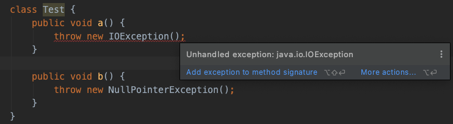

# 什么是异常

Java 通过面向对象的方法来处理异常：在一个方法的运行过程中，如果发生了异常，会产生一个异常对象，并把它交给运行时的系统，运行时系统寻找相应的代码来处理这一异常。

* 拋出（throw）异常：生成异常对象，并把它提交给运行时系统的过程。
* 捕获（catch）异常：运行时系统在方法的调用栈中查找能够处理该类型异常的代码。

作用：方便发现问题，并进行相应的处理，而不需要在业务逻辑中写一堆if判断，可以专注于代码逻辑，将问题统一放到后面处理。

关键字：

1. try：指定一段可能会产生异常的代码，后面需要跟catch或者finally捕获异常
2. catch：紧跟在try后面，指定要捕获的异常。
3. throw：手动抛出一个异常
4. throws：用来标明一个函数内部可能抛出的各种异常，调用该函数需要捕获异常
5. finally：try-catch结束之后，无论有没有发生异常都会执行。会在方法return之前执行

**try中return了也会执行finally，如果finally中也有return，会使用finally中的return的值**

**子类不能比父类抛出更多异常（Runtime异常除外，因为Runtime异常不受检查）**

# 异常类型


Error和Exception：

* Error：编译时错误或系统错误，是Java运行环境内部或系统本身的错误，一般不需要应用程序处理。如OutOfMemoryError（内存溢出）、NoClassDefFoundError（类定义错误）
* Exception：程序需要捕捉、需要处理的异常，是程序设计的不完善而出现的问题，程序必须处理的问题

Exception又分为运行时异常和非运行时异常：

* 运行时异常（Runtime Exception）：也称为不检查异常（UnChecked Exception），一般是由程序逻辑错误引起。
  * 运行时发生，编译时不会检查。
  * 程序中可以捕获，也可以不捕获。（如果需要对空指针异常处理的话，相当于所有代码都需要处理）
  * 如`NullPointerException`、`IndexOutOfBoundsException`等。
* 非运行时异常：也称为检查异常（Checked Exception），除RuntimeException以外的异常。
  * 可以被预测，程序需要进行处理，否则编译器会报错，处理方式
    * 捕获（try-catch）自己处理
    * 向上抛出（throws），交给调用者处理
  * 如IO异常、SQL异常等。


如下图：检查异常要求我们对异常进行处理，否则编译器会报错。不检查异常则没要求，程序可以捕获也可以不捕获



> 异常如果没被处理，最终会抛到该线程run方法。因此在多线程情况下，子线程出现异常会导致该线程终止

# 自定义异常

开发人员可以通过继承Exception类来自定义异常。

1. 可以自定义异常参数、名称、打印等，提高代码可读性。
2. 对业务逻辑封装异常并手动抛出，强制提醒调用方进行处理。

# Java7新特性

1. 可以捕获多个异常

```java
catch(IOException | SQLException | Exception ex){
     logger.error(ex);
     throw new MyException(ex.getMessage());
}
```

2. `try-with-resources`：finally常用来关闭资源（如IO读写），使用新特性可以不用手动关闭（建议还是手动维护释放）。本质是个语法糖，编译器编译之后会转为普通语法。

```java
//在try子句中能创建一个资源对象，当程序的执行完try-catch之后，运行环境自动关闭资源。
try (MyResource mr = new MyResource()) {
	System.out.println("MyResource created in try-with-resources");
} catch (Exception e) {
	e.printStackTrace();
}
```

