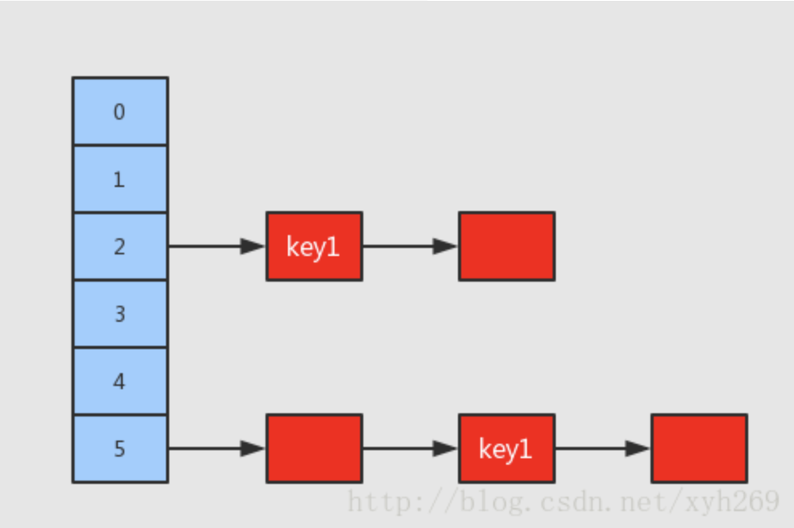
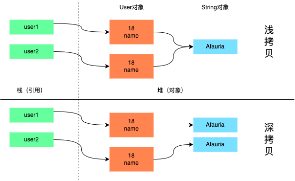

# Object类

## Object、Type和Class

Object是所有类的父类，任何类都默认继承Object。包括Class类和数组。

所有类都有一个Class对象，包含该类的信息。Class不能表示泛型，Type可以。

`java.lang.reflect.Type`是**所有类型（不是类）**的公共高级接口，代表了Java中的所有类型：包括泛型、数组类型、基本数据类型等。一般用于反射获取变量类型。

Java的类型分为

- 原始类型（Type）：包括普通的Java类、枚举、数组、注解等。由Class类实现Type接口
- 基本类型：int，float等java基本类型
- 参数化类型（ParameterizedType）：如`List<String>`这个组合类型称为参数化类型
- 类型变量（TypeVariable）：如`<T>`中的`T`称为类型变量
- 数组类型（GenericArrayType）：泛型数组

> 通配符类型（WildcardType）：如`<?>`，也是Type的子接口，但不属于Java类型。

## Object类是接口的父类吗？

定义一个接口A

```java
interface A{}
```

可以直接使用匿名内部类创建A对象，然后可以重写Object类的方法，并且可以调用Object类的方法，编译器没有报错。

```java
class Main {
    public static void main(String[] args) {
        A a = new A() {
            @Override
            public int hashCode() {
                return super.hashCode();
            }
            //省略重写Object类方法...
        };
        a.toString(); //调用Object类方法
        a.equals("");
    }
}
```

`javap -v A`反编译查看汇编代码结果如下：#2表示超类的符号引用，即对应Object类

```sh
Classfile /A.class
  Last modified 2021-12-24; size 86 bytes
  MD5 checksum f3fccb658bd55901dae25bcaaf774b6a
  Compiled from "A.java"
interface A
  minor version: 0
  major version: 52
  flags: ACC_INTERFACE, ACC_ABSTRACT
Constant pool:
  #1 = Class              #5              // A
  #2 = Class              #6              // java/lang/Object
  #3 = Utf8               SourceFile
  #4 = Utf8               A.java
  #5 = Utf8               A
  #6 = Utf8               java/lang/Object
{
}
SourceFile: "A.java"
```

但是如果我们运行时反射打印接口方法，输出为0，如下

```java
System.out.println(A.class.getMethods().length); //输出为0
```

针对接口是否继承Object类网上有不同的说法，而且都有理由和证据

1. 继承：
   1. 接口对象可以重写并且调用Object类中的方法
   2. 反编译查看汇编代码中引用了Object类
2. 不继承：
   1. 从Java语法上讲，接口只能继承其他接口，无法继承类
   2. 类需要有构造方法，javac编译会给类生成默认构造方法，但是从上面的汇编代码看，接口并没有生成构造方法。
   3. 运行时反射获取接口类的方法，可以看到不包含Object类的方法

结论：暂时认为接口不继承Object类把。

## Object类有哪些方法？

1. `clone`：实现对象的浅拷贝。需要重写并且实现了`Cloneable`接口才可以调用该方法，否则抛出`CloneNotSupportedException`异常。
2. `finalize`：GC的时候发现没有其他引用会调用，可以通过重写该方法来阻止GC回收。
3. `equals`：比较两个对象是否相等。默认内部通过`==`进行比较，没有重写的话，`equals`和`==`等价。String重写了equals方法，因此字符串比较中`equals`和`==`结果不相同
4. `getClass`：获取对象运行时类型。
5. `hashCode`：默认返回对象内存地址的hash值，作为对象的唯一标识。一般用于哈希查找。
6. `toString`：返回对象的字符串表示，默认是`类名+@+16进制hashCode`。一般需要重写。
7. `wait`：让当前线程进入等待状态，等待该对象的锁。直到获得对象锁或者被中断
8. `wait(long timeout)`：同wait，可以设定超时间隔，如果在规定时间内没有获得锁就返回。参数为0的时候等价于`wait()`方法
9. `notify`：唤醒等待该对象锁的**任意一个线程**。
10. `notifyAll`：同notify，唤醒等待该对象锁的**所有线程**。

final声明的方法，无法重写：wait、notify、notifyAll、getClass

wait状态如何唤醒？

> 1. 其他线程调用了该对象的notify方法获得锁。
> 2. 其他线程调用了该对象的notifyAll方法获得锁。
> 3. 其他线程调用了interrupt中断该线程。
> 4. 超过间隔时间
>
> 时间间隔到了或中断并不会释放锁，只是唤醒了线程，线程还是会等待锁

wait、notify、notifyAll要求当前线程是该对象的所有者，即持有该对象的锁，否则调用该方法会抛出`IllegalMonitorStateException`异常

一次只能有一个线程持有对象的锁

### equals方法

==对于基本数据类型，比较的是数值

==对于非基本数据类型（引用类型），比较的是对象的内存地址，用于判断是否是同一个对象

Object的equals方法默认比较两个对象的内存地址（内部直接调用==判断），String重写了equals方法，比较字符串是否相等

```java
String a = new String("123");
String b = new String("123");
System.out.println(a==b);//false
System.out.println(a.equals(b));//true
```

重写equals方法规范：

1. 自反性：`x.equals(x)==true`
2. 对称性：如果`x.equals(y)==true`，那么`y.equals(x)==true`
3. 传递性：如果`x.equals(y)==true`，`y.equals(z)==true`，那么`x.equals(z)==true`
4. 一致性：无论多少次调用`x.equals(y)`结果始终相同

重写equals步骤：

1. 使用==检查是否是同一个对象，如果是则返回true
2. 使用instanceof检查是否是正确的类型，如果不是，返回false
3. 将参数转换为对比的类型
4. 比较对象中的属性、内容
5. 检查是否符合上述规范

推荐写法

```java
//通过字面量调用equals，避免str为空产生异常
"test".equals(str);
//判断字符串为空可以使用工具类，避免str为空产生异常
TextUtils.isEmpty(str);
```

### hashCode方法

Object类hashCode方法默认返回对象内存地址。

String重写了hashCode方法，根据字符串计算hash值

### 为什么重写equals方法，也要重写hashCode方法？

1. equals表示两个对象相等，此时要求hashCode相等。
2. hashCode相等，equals并不一定相等

因此重写equals的时候也要重写hashCode方法

例如：使用hashmap的时候，put插入元素会先计算hashCode，如果存在该key的hashCode，则遍历链表，再使用equals判断是否相等，如果相等则替换新的value。如果链表中没找到，则将新元素插入到链表头节点。

如果不重写hashCode方法，可能会找到不同拉链，此时重写equals没有意义，会插入重复元素



# 对象的clone

Java创建对象（为对象分配内存空间）的方式有两种：

1. new创建一个对象：分配内存，调用构造函数，初始化对象
2. clone复制一个对象：分配内存，使用原对象中的值，初始化新对象

## 复制对象和复制引用

变量存放在栈中，对象存放在堆中。

```java
User user1 = new User(); //创建新对象
User user2 = user1;
//User2和User1指向同一个user对象，两个变量地址值相同，这种现象称为复制引用

User user1 = new User();
User user2 = user1.clone(); //复制新对象
System.out.println(user1 == user2); //false，对象地址不同
//User2和User1指向不同的user对象，两个变量地址值不同，这种现象称为复制对象
```

## 深拷贝和浅拷贝

对于基本数据类型，直接拷贝值。对于引用类型，分为两种情况：

1. 浅拷贝：将源对象字段的引用值直接赋值给新对象的字段
2. 深拷贝：根据源对象字段引用的对象，复制一个新的对象，再进行赋值

如下：可以看到java的clone实现的是浅拷贝，源对象和新对象中的name字段指向同一个字符串对象

```java
public class User implements Cloneable {
  int age;
  String name;
  //省略构造方法和getter、setter
  @Override
  protected Object clone() throws CloneNotSupportedException {
    return (Person)super.clone();
  }
}
public class Main {
  public static void main(String[] args) {
    //此处使用new String，引用堆中的对象，否则由于字符串池缓存，拷贝前后都指向池中的对象
    User user1 = new User(18, new String("Afauria")); 
    User user2 = null;
    try {
      user2 = user1.clone();
    } catch (CloneNotSupportedException e) {
      e.printStackTrace();
    }
    System.out.println(user1 == user2); //false
    System.out.println(user1.age == user2.age); //true
    System.out.println(user1.name == user2.name); //true
  }
}
```



**为了避免浅拷贝修改引用对象，导致其他的引用也跟着变更**，Java限制了clone方法的调用：

* 要求类实现`Cloneable`接口并且重写`clone`方法才可以调用该方法，否则会抛出`CloneNotSupportedException`异常，编译报错（提醒开发者重写clone进行深拷贝）：
  ```java
  /**
   * @throws  CloneNotSupportedException  if the object's class does not
   *               support the {@code Cloneable} interface. Subclasses
   *               that override the {@code clone} method can also
   *               throw this exception to indicate that an instance cannot
   *               be cloned.
   * @see java.lang.Cloneable
   */
  protected native Object clone() throws CloneNotSupportedException;
  ```
* 并且要求类中所有引用的对象也要显式重写clone方法（传递性）：例如存在`User->Head->Face->Mouth`引用链，所有类都需要重写clone方法，否则深拷贝不彻底。
	
	> 如果引用链中的某一个类是在三方库中定义的，此时无法实现`Cloneable`接口、重写clone方法。需要使用new创建对象并手动设置初始值

**String是深拷贝还是浅拷贝？**

* 从性质上讲是浅拷贝：因为拷贝前后指向同一个地址。
* 从效果上讲是深拷贝：由于String的不可变性，修改String实际上会创建一个新的String对象，不会影响原有对象。
