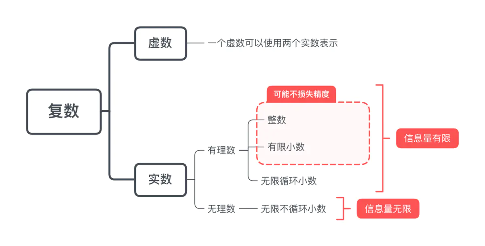

# 8种基本数据类型

* 字符型：char（实际是一个16位无符号整数）
* 布尔型：boolean
* 数值型：
  * 整型：byte、short、int、long
  * 浮点型：float（单精度）、double（双精度）

> String不是基本数据类型，是引用类型

实际上，Java中还存在另外一种基本类型`void`，它也有对应的包装类`java.lang.Void`，不过我们无法直接对它们进行操作。

## 类型间转换

1. 隐式类型转换：小类型可以自动转为大类型，发生在赋值的时候，如果右侧是表达式，会先计算表达式，再进行隐式类型转换。
2. 大类型转到小类型需要强制转换，否则可能会造成精度损失，提示编译错误。除非使用强制转换
3. 表达式运算的时候涉及多种数据类型，会自动向较大类型转换。
4. 表达式运算的时候涉及多种数据类型，没有大类型的话不会自动转换，而是舍入。
5. byte、char实际上都是整数类型，计算的时候会转为int进行计算

```java
private static void autoConversion() {
    //隐式类型转换：小类型可以自动转为大类型
    long a = 0;
    //大类型转到小类型需要强制转换。否则会编译错误，提示“不兼容的类型: 从long转换到int可能会有损失”，
    // int b = 1L;
    int c = (int) 1L;

    //没有大类型的话不会自动转换，而是舍入
    System.out.println(5 / 10 * 10); //输出0，而不是5

    //先计算右侧表达式，再进行隐式类型转换，因此会出现舍入误差
    long d = Integer.MAX_VALUE + 1;
    System.out.println(d); //输出-2147483648，int溢出
    double e = 80 / 100;
    System.out.println(e); //输出0.0，舍入误差

    //表达式出现多种数据类型，自动向大类型转换
    long f = Integer.MAX_VALUE + 1L;
    System.out.println(f); //输出2147483648
    //表达式出现多种数据类型，自动向大类型转换
    double g = 80.0 / 100;
    System.out.println(g); //输出0.8，右边表达式有double型直接量参与， 运算结果为double型

    //byte、char实际上都是整数类型，计算的时候会转为int进行计算
    byte h = 97;
    char i = 97;
    System.out.println(h); //97
    System.out.println(i); //a
    System.out.println(h + i); //194
}
```

char数字字符转成int数字

```java
// 字符1，直接转为int使用的是ASCII码
char c = '1';
int i = c; // 结果为49

// 正确方式
int j = c - '0';
// 或者先转为字符串，再转为Int类型
int k = Integer.parseInt(String.valueOf(c));
```


## 存储大小

| 基本数据类型（内置类型） | 对应的包装类型 | 大小             |
| ------------------------ | -------------- | ---------------- |
| char                     | Character      | 2字节            |
| boolean                  | Boolean        | 1个字节或4个字节 |
| byte                     | Byte           | 1个字节          |
| short                    | Short          | 2个字节          |
| int                      | Integer        | 4个字节          |
| long                     | Long           | 8个字节          |
| float                    | Float          | 4字节            |
| double                   | Double         | 8字节            |

1个字节=8位。以int为例：取值范围为`-2^31`到`2^31-1`，可以使用`Integer.MIN_VALUE`和`Integer.MAX_VALUE`获取最小值和最大值。使用`Integer.SIZE`获取int类型位数。

## 取值范围

8位可以表示的数字是2^8，为什么是[-128,127]，而不是[0,255]?

整型使用**有符号**的二进制补码存储，最高位表示符号位。8位**无符号整数**可以表示[0,255]

```
最小值：10000000（-128）
最大值：01111111（127）
```

## boolean占1或4个字节？

boolean类型理论上只需要1bit空间，但是计算机处理数据的最小单位是1个字节，实际存储的空间是：用1个字节的最低位存储，其他7位用0填补

位（bit）是计算机存储的最小单位，字节是计算机处理数据的最小单位，1字节=8位

> 《Java虚拟机规范》一书中的描述：“虽然定义了boolean这种数据类型，但是只对它提供了非常有限的支持。在Java虚拟机中没有任何供boolean值专用的字节码指令，Java语言表达式所操作的boolean值，在编译之后都使用Java虚拟机中的int数据类型来代替，而boolean数组将会被编码成Java虚拟机的byte数组，每个元素boolean元素占8位”。这样我们可以得出boolean类型**单独使用是4个字节**，在**数组中又是1个字节**。
>
> 使用int的原因是，对于当下32位的处理器（CPU）来说，一次处理数据是32位（这里不是指的是32/64位系统，而是指CPU硬件层面），具有高效存取的特点。

## 数据超出取值范围？

如果是字面量（直接量）超出int的取值范围[-2147483648, 2147483647]，会出现编译错误，如下：

```java
//字面量超出int范围。编译错误，提示“过大的整数”
// int a = 2147483648;
// long a = 2147483648; //字面量超出int取值范围，此时还未进行隐式类型转换
long a = 2147483648L;
```

如果是计算结果溢出，不会抛异常，也没有任何提示。因此计算的时候**需要注意数据溢出**的问题。如下：

```java
//计算结果溢出，不会抛异常
System.out.println(Integer.MAX_VALUE + 1);  //输出-2147483648
```

为什么输出结果是负数？

> 以byte8位为例， -128 ~ 127
>
> 127的二进制： 0111 1111。1的二进制： 0000 0001
>
> 相加结果为1000 0000。
>
> 整型使用**有符号**的二进制补码存储，最高位表示符号位。因此1000 0000表示-128

## 布尔类型属性命名规范

需要注意的是布尔属性的命名：在阿里巴巴Java开发手册中，要求**对POJO类的布尔类型变量，都不要加is，否则可能会引起序列化错误**。

* 布尔基本类型自动生成getter和setter方法，名称是`isXXX()`和`setXXX()`，（JavaBean规范定义布尔类型getter使用is开头）
* 布尔包装类型自动生成getter和setter方法，名称是`getXXX()`和`setXXX()`

如下

```java
class Model1  {
    private Boolean isSuccess;
    public void setSuccess(Boolean success) {
        isSuccess = success;
    }
    public Boolean getSuccess() {
        return isSuccess;
    }
 }

class Model2 {
    private Boolean success;
    public Boolean getSuccess() {
        return success;
    }
    public void setSuccess(Boolean success) {
        this.success = success;
    }
}

class Model3 {
    private boolean isSuccess;
    public boolean isSuccess() {
        return isSuccess;
    }
    public void setSuccess(boolean success) {
        isSuccess = success;
    }
}

class Model4 {
    private boolean success;
    public boolean isSuccess() {
        return success;
    }
    public void setSuccess(boolean success) {
        this.success = success;
    }
}
```

对于Model2和Model4序列化结果为success，不存在问题

但是对于Model3，严格来说isSuccess变量的getter方法应该为`isIsSuccess()`，但是IDE自动生成默认是`isSuccess()`，在不同序列化框架中结果不一致：

* **`fastjson`和`jackson`序列化json字符串的时候会反射遍历所有getter方法，根据JavaBean规范，序列化去掉is作为key。**
* **`Gson`是反射遍历该类所有属性，使用属性名作为key**

```java
public class BooleanMainTest {
    public static void main(String[] args) throws IOException {
        //定一个Model3类型
        Model3 model3 = new Model3();
        model3.setSuccess(true);

        //使用fastjson(1.2.16)序列化model3成字符串并输出
        System.out.println(JSON.toJSONString(model3)); //输出{"name":"Afauria","success":true}

        //使用Gson(2.8.5)序列化model3成字符串并输出
        Gson gson =new Gson();
        System.out.println(gson.toJson(model3)); //输出{"isSuccess":true}

        //使用jackson(2.9.7)序列化model3成字符串并输出
        ObjectMapper om = new ObjectMapper();
        System.out.println(om.writeValueAsString(model3)); //输出{"success":true,"name":"Afauria"}
    }
}

class Model3 implements Serializable {
    private boolean isSuccess;
    public boolean isSuccess() {
        return isSuccess;
    }
    public void setSuccess(boolean success) {
        isSuccess = success;
    }
    public String getName(){
        return "Afauria";
    }
}
```

## char类型范围和赋值

char类型实际上是一个16位无符号整数（16位Unicode字符），范围是[0, 65535]，**存储的是对应字符编码**。如字符a实际值为97，字符A实际值为65，字符0实际值为48

> Java字符类型采用Unicode字符集编码（定长字符集），所有字符都是16位表示。
>
> 范围是'\u0000'到'\uffff'，即0到65535。

字符字面量包含在单引号中，对不方便输出的字符，可以采用转义字符`\`表示。如`\n`、`\'`、`\"`等

赋值方式：

1. 使用字符赋值
2. 使用16进制整数赋值
3. 使用十进制整数赋值

```java
//char取值范围为0-65535，超出会编译错误，提示"不兼容的类型: 从int转换到char可能会有损失"
//char c = 65536;
//char存储对应的字符编码
char c1 = '中';  //字符赋值
char c2 = '\u4e2d';  //16进制unicode赋值
char c3 = 20013;  //十进制赋值
System.out.println(c1);  //输出"中"
System.out.println(c2);  //输出"中"
System.out.println(c3);  //输出"中"
```

## 浮点类型舍入

回顾下复数的分类



> 无限循环小数可以写作两个整数之比。如0.333...可以用1/3表示

* 定点：小数点固定在某个位置。
* 浮点：使用科学计数法存储数字，小数点位置根据指数大小浮动。可以表示更大范围的数值

例如8位二进制能表示256个整数。表示定点类型的时候，同样只能表示256个实数，例如约定小数位为2位

```
000000.00 // 表示 0.0
000000.01 // 表示 0.25
000000.10 // 表示 0.5
000000.11 // 表示 0.75
000001.00 // 表示 1.0
000001.01 // 表示 1.25
... 
```

我们知道0.0到0.25之间有连续的、无限多个数。而计算机只能处理离散的数据，二进制的位数表示它能表示的离散数据个数（2^n个信息量）。0.0到0.25之间的数字被跳过了。

引入浮点数能够表示更大范围的数值，但仍然无法精确表示。**因此不能用浮点型表示金额等重要指标。**建议使用`BigDecimal`或Long（单位为分）表示金额。

计算机的存储和运算都是通过二进制：

十进制整数转二进制整数采用**除2取余，逆序排列**的方式：

- 用2整除十进制整数，得到一个商和余数；
- 再用2去除商，又会得到一个商和余数，如此进行，直到商为小于1时为止
- 逆序排列得到的余数。

十进制小数转二进制小数采用**乘二取整，顺序排列**法：

- 用2乘十进制小数，得到积
- 将积的整数部分取出，再用2乘小数部分，又得到一个积
- 再将积的整数部分取出，如此进行，直到积中的小数部分为零。或者达到所要求的精度为止。
- 顺序排列取出的整数

如0.25

```
0.25*2=0.5 //整数部分为0
0.5*2=1.0 //整数部分为1
因此0.25表示为二进制为0.01
```

二进制在有些情况下无法精确表示，如下：

```
0.2*2=0.4  //整数部分为0
0.4*2=0.8  //整数部分为0
0.8*2=1.6  //整数部分为1
0.6*2=1.2  //整数部分为1
0.2*2=0.4  //整数部分为0
...
结果为无限循环小数：0.001100110011...
```

**为什么浮点数运算不精确？**

> 无理数包含的信息量是无限的，而计算机能表示的信息量是有限的，因此采用浮点数表示的是近似值。如Math.PI
>
> 十进制转二进制之后存在舍入误差。如
>
> ```java
> System.out.println(1.0f - 0.9f); //输出0.099999905
> System.out.println(1.0 - 0.9); //输出0.09999999999999998
> ```

**浮点数值默认为双精度，即double类型，如果要使用float，需要加f或F后缀。**

```java
//编译错误：提示“不兼容的类型: 从double转换到float可能会有损失”
//float a = 3.14;
float b = 3.14f;
```

# 包装类型

## 为什么需要基本数据类型？

> 对象比较消耗资源：`new`一个对象是存储在堆里的，通过栈中的引用来使用这些对象；对于经常用到的类型，如果我们每次使用这种变量的时候都需要new一个Java对象的话，就会比较笨重。
>
> 使用基本数据类型不会在堆上创建，而是直接在栈内存中存储。因此更加高效

## 为什么需要包装类型？

> Java是一种面向对象语言，很多地方都需要使用对象而不是基本数据类型。例如，在集合类中，我们是无法将int 、double等类型放进去的。因为集合的容器要求元素是Object类型。
>
> 为了让基本类型也具有对象的特征，就出现了包装类型，将基本类型“包装起来”，使得它具有了对象的性质，并且为其添加了属性和方法，丰富了基本类型的操作。

## 使用包装类型还是基本数据类型？

**包装类型默认值为null，需要显式的初始化，否则外部调用get方法，由于自动拆箱可能产生NPE**

阿里巴巴Java开发手册建议**POJO类属性、RPC方法返回值和参数使用包装类型**

> 1. 提醒使用者传入初始值，否则可能产生NPE
> 2. 如int，默认值0是合法值，null是非法值，可以通过null判断调用失败，阻断程序，异常退出。如果使用基本数据类型，系统可能不会报错，使用0参与运算。

# 自动拆装箱

装箱（boxing）：将基本类型转换成对应的包装类型。拆箱（unboxing）则反过来

* 在Java SE5之前，手动装箱：`Integer i = new Integer(10);`
* 在Java SE5中，提供了自动装箱、拆箱功能

自动装箱、拆箱原理：编译时使用包装类的`valueOf()`和`xxxValue()`方法进行拆装箱

举例：

```java
public static void main(String[]args){
  Integer i = 10;  //自动装箱
  int b = i;     //自动拆箱
}
```

将上述代码反编译后得到

```java
public static void main(String[]args){
  Integer a = Integer.valueOf(10); //装箱
  int b = a.intValue(); //拆箱
}
```

**注：**

1. 如果包装类型是`null`，拆箱`null.intValue()`会发生NPE
2. 循环中大量拆装箱操作会浪费很多资源
3. 方法重载问题：例如集合类`remove(int index)`和`remove(Object obj)`，Object为Integer，此时调用`remove(1)`不会自动装箱

## 常见场景

可以使用`javac`编译之后`javap -c`查看汇编指令。也可以通过工具（如`jd-gui`）反编译查看代码

```java
//基本数据类型放入集合类
List<Integer> li = new ArrayList<>();
for (int i = 1; i < 50; i ++){
    li.add(i);
}
```

```java
//包装类型与基本数据类型比较
//理论上==是比较对象地址，这里进行了拆箱，因此比较的是数值
Integer a=1;
System.out.println(a==1);//true
Boolean bool=false;
System.out.println(bool==false);//true
```

```java
//包装类型的运算
Integer i = 10;
Integer j = 20;
System.out.println(i+j);
```

```java
//三目运算符使用，当第二，第三位操作数分别为基本类型和对象时，其中的对象就会拆箱为基本类型进行操作。
boolean flag = true;
Integer i = 0;
int j = 1;
int k = flag ? i : j;//这里对i进行拆箱，如果是null，会发生NPE，拆箱：i.intValue();
```

```java
//函数参数和返回值
//自动拆箱
public int getNum1(Integer num) {
 return num;
}
//自动装箱
public Integer getNum2(int num) {
 return num;
}
```

## 装箱缓存

Java5对自动装箱提供了**缓存机制**，对常用范围内的包装对象进行缓存和重用，避免频繁创建对象，节省内存、提高性能。

```java
private static void boxingCache() {
    //装箱缓存范围是-128到127
    Integer a = 127;
    Integer b = 127;
    System.out.println(a == b);  //输出true
    Integer c = 128;
    Integer d = 128;
    System.out.println(c == d);  //输出false
    //缓存只适用于自动装箱，手动构造是不同对象
    Integer e = new Integer(127);
    Integer f = new Integer(127);
    System.out.println(e == f); //输出false
}
```

**注：**

1. 只适用于自动装箱，使用构造函数主动创建对象不适用。推荐使用`valueOf`方法定义整型，会取缓存，直接new不会取缓存
2. 除了int之外，也有`ByteCache、ShortCache、LongCache、CharacterCache`缓存对应类型的对象
3. byte、short、int、long缓存范围是-128到127，Character范围是0到127
3. Boolean使用TRUE、FALSE常量缓存
3. 浮点型float、double范围无限，没有缓存，直接构造新对象返回

原理：上面提到自动装箱原理是使用`valueOf()`方法返回包装类。

1. 查看`valueOf()`源码，内部使用一个`cache`数组进行缓存，数组中存在会返回同一个对象

```java
public static Integer valueOf(int i) {
  if (i >= IntegerCache.low && i <= IntegerCache.high)
    return IntegerCache.cache[i + (-IntegerCache.low)];  //数组缓存对象
  return new Integer(i);
}
```

2. `IntegerCache`中类初始化的时候循环创建对象，存入数组

# 常见问题和注意事项

1. 0.1和1万亿，请问哪个数能用二进制数精确表示？

> 0.1转换为二进制是无限循环小数，无法精确表示，1万亿可以精确表示

2. +=会强制转换

```java
short s1 = 1;
//编译错误，先计算右侧表达式，自动转为大类型int，int赋值给short会出现类型转换错误
//s1 = s1 + 1;
//不会报错，+=会自动强制转换
s1 += 1;
```

3. char类型变量能不能储存一个中文的汉字，为什么？

> char类型变量是储存Unicode编码的字符的，unicode字符集包含了汉字，所以char类型当然可以存储汉字的，如果某个生僻字没有包含在unicode编码字符集中，那么就char类型就不能存储该生僻字。 

4. Integer和int的区别

> * int是java的8种内置的基本数据类型。Integer就是int的包装类。
> * int变量的默认值为0，Integer变量的默认值为null。
> * Integer类内提供了一些关于整数操作的一些方法，例如上文用到的表示整数的最大值和最小值。

5. switch可以作用于byte、char、short、int和其包装类，以及enum、String类型。无法作用于boolean、long、float、double类型，会出现编译错误。如果包装类传入null，运行时出现空指针

> 1.7版本之前不可以作用在string上，1.7版本之后switch可以作用在string上

```java
switch(1L) {} //编译错误

String f = null;
switch(f) {} //抛出异常：java.lang.NullPointerException
```

6. 是否存在`x>x+1`?为什么？

> 数据溢出的时候。当x=Integer.MAX_VALUE;时，再加1溢出。
>
> `System.out.println(Integer.MAX_VALUE + 1); `结果为-2147483648

7. 十进制小数转二进制小数，**因子中包含5才能被精确表示，不包含5只能近似表示，因此会出现舍入误差**

```java
//包含5，二进制可以精确表示
float a = 0.125f;
double b = 0.125d;
System.out.println((a - b) == 0.0); //输出true

//不包含5，只能近似表示，因此会出现舍入误差
double c = 0.8;
double d = 0.7;
double e = 0.6;
System.out.println((c - d) == (d - e)); //输出false
```

8. `System.out.println(1.0 / 0);` 的结果是Infinity
9. `System.out.println(1 / 0);`抛出异常：`java.lang.ArithmeticException: / by zero`
10. `System.out.println(0.0 / 0.0);`输出NaN
10. 多个方法重载，不会发生自动装箱，会进行自动类型转换。

```java
public class Main {
  public void test() {
    foo(1); //调用double方法，此时不会自动装箱，会进行自动类型转换
  }
  private void foo(double s) {}
  private void foo(Integer s) {}
}
```

# 结语

## 案例汇总

```java
public class Main {
	public static void main(String[] args) {
		System.out.println("-----拆装箱-----");
		boxingCache();
		System.out.println("-----字面量溢出-----");
		literalExceed();
		System.out.println("-----自动类型转换-----");
		autoConversion();
		System.out.println("-----浮点型精度-----");
		floatPrecision();
		System.out.println("-----字符型定义-----");
		charDefine();
		System.out.println("-----更多细节-----");
		more();
	}

	private static void boxingCache() {
		//装箱缓存范围是-128到127
		Integer a = 127;
		Integer b = 127;
		System.out.println(a == b);  //输出true
		Integer c = 128;
		Integer d = 128;
		System.out.println(c == d);  //输出false
    //缓存只适用于自动装箱，手动构造是不同对象
		Integer e = new Integer(127);
		Integer f = new Integer(127);
		System.out.println(e == f); //输出false
	}

	private static void literalExceed() {
		//字面量超出int范围。编译错误，提示"过大的整数"
		// int a = 2147483648;
		// long a = 2147483648; //字面量超出int取值范围，此时还未进行隐式类型转换
		long a = 2147483648L;

		//计算结果溢出，不会抛异常
		System.out.println(Integer.MAX_VALUE + 1); //输出-2147483648
	}

	private static void autoConversion() {
		//隐式类型转换：小类型可以自动转为大类型
		long a = 0;
		//大类型转到小类型需要强制转换。否则会编译错误，提示"不兼容的类型: 从long转换到int可能会有损失"，
		// int b = 1L;
		int c = (int) 1L;

		//没有大类型的话不会自动转换，而是舍入
		System.out.println(5 / 10 * 10); //输出0，而不是5

		//先计算右侧表达式，再进行隐式类型转换，因此会出现舍入误差
		long d = Integer.MAX_VALUE + 1;
		System.out.println(d); //输出-2147483648
		double e = 80 / 100; 
		System.out.println(e); //输出0.0

		//表达式出现多种数据类型，自动向大类型转换
		long f = Integer.MAX_VALUE + 1L;
		System.out.println(f); //输出2147483648
		//表达式出现多种数据类型，自动向大类型转换
		double g = 80.0 / 100; 
		System.out.println(g); //输出0.8，右边表达式有double型直接量参与， 运算结果为double型

		//byte、char实际上都是整数类型，计算的时候会转为int进行计算
		byte h = 97;
		char i = 97;
		System.out.println(h); //97
		System.out.println(i); //a
		System.out.println(h + i); //194
	}

	private static void floatPrecision() {
		//浮点数默认为double类型，如果要使用float，需要加f或F后缀。
		//编译错误：提示“不兼容的类型: 从double转换到float可能会有损失”
		//float a = 3.14;
		float b = 3.14f;
		//舍入误差
		System.out.println(1.0f - 0.9f); //输出0.099999905
    	System.out.println(1.0 - 0.9); //输出0.09999999999999998
	}

	private static void charDefine() {
		//char取值范围为0-65535，超出会编译错误，提示"不兼容的类型: 从int转换到char可能会有损失"
		//char c = 65536;

		//char存储对应的字符编码
		char c1 = '中';  //字符赋值
		char c2 = '\u4e2d';  //16进制unicode赋值
		char c3 = 20013;  //十进制赋值
		System.out.println(c1);  //输出"中"
		System.out.println(c2);  //输出"中"
		System.out.println(c3);  //输出"中"
	}

	private static void more() {
		short s1 = 1;
		//编译错误，先计算右侧表达式，自动转为大类型int，int赋值给short会出现类型转换错误
		//s1 = s1 + 1;
		//不会报错，+=会自动强制转换
		s1 += 1;

		//switch无法使用boolean、long、float、double类型，可以作用于其他基本数据类型和其包装类，以及enum、String类型
		//编译错误
		// switch(1L) {}

		//如果包装类为null，运行时抛出空指针
		//String f = null;
    //switch(f) {} //抛出异常：java.lang.NullPointerException

		//包含5，二进制可以精确表示
		float a = 0.125f;
		double b = 0.125d;
		System.out.println((a - b) == 0.0); //输出true

		//不包含5，只能近似表示，因此会出现舍入误差
		double c = 0.8;
		double d = 0.7;
		double e = 0.6;
		System.out.println((c - d) == (d - e)); //输出false

		System.out.println(1.0 / 0); //输出Infinity
		//System.out.println(0 / 0); //抛出异常：`java.lang.ArithmeticException: / by zero`
		System.out.println(0.0 / 0.0); //输出NaN
	}
}
```

> Tips：带有中文注释，编译的时候需要指定UTF-8编码`javac -encoding UTF-8 Main.java`，再使用`java Main`执行。可以使用`javap -c -p Main`查看汇编代码，-p表示显示私有方法

## 参考资料

* [什么是Java中的自动拆装箱](https://blog.csdn.net/wufaliang003/article/details/82347077)
* [「计算机原理」| 为什么浮点数运算不精确？](https://www.jianshu.com/p/2adb8fe74987)