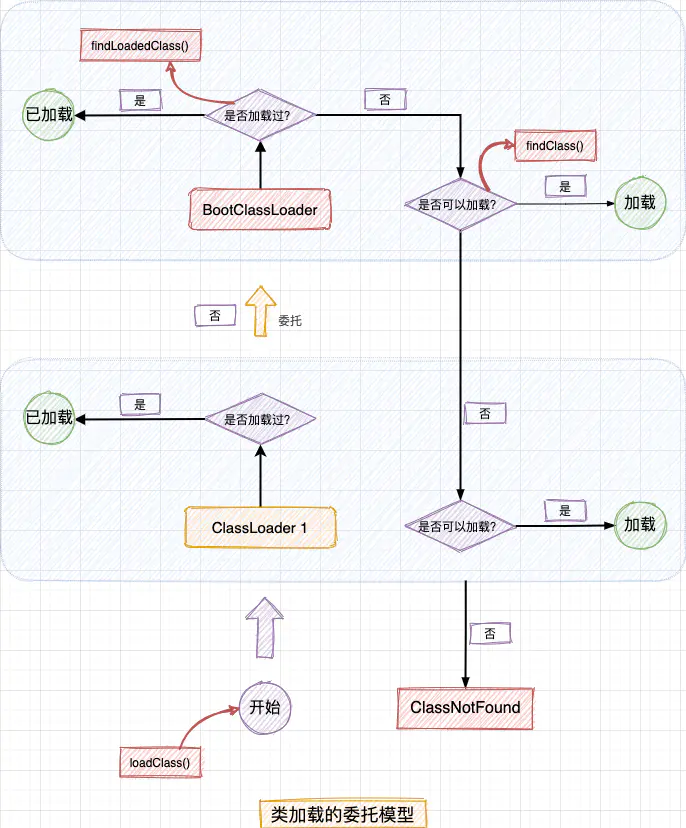

# 类的初始化

## 继承时构造方法

* 子类构造方法总是先调用父类的构造方法，如果没有显式指明调用父类哪个构造方法，则默认调用无参构造方法
* 若父类没有无参构造方法，子类需要在自己的构造函数中显式调用父类的构造函数`super(arg);`，并且一定要在第一行调用。若不调用，编译器会报错

## 继承时初始化顺序

- 父类的静态变量和静态代码块
- 子类的静态变量和静态代码块
- 父类的普通变量和普通代码块
- 父类构造函数
- 子类的普通变量和普通代码块
- 子类构造函数

静态内部类的初始化：

1. 静态内部类和静态变量一样只和类有关，和对象引用无关，不需要通过实例调用。
2. 静态内部类在使用时（不一定要实例化）才加载（可用于实现懒汉单例模式）
3. 加载外部类、或者使用外部类对象时不会初始化静态内部类。
4. 加载静态内部类时会初始化外部类

# 类的加载

## 类加载方式

隐式加载：

1. 创建该类或者其子类的对象
2. 使用该类或者其子类的静态变量或静态方法
3. JVM启动时，`BootStrapClassLoader`加载JVM自身运行所需的Class
4. JVM启动时，`ExtClassLoader`加载指定目录下的Class
5. JVM启动时，`AppClassLoader`加载classpath路径下的Class，以及main函数所在的类

显示加载：

1. 主动调用`loadClass(className)`方法：只会加载和连接，不会初始化
2. 主动调用`Class.forName(className, initialize, loader)`方法：通过`initialize`参数决定是否初始化

## 类加载过程

* 加载：
  * 通过完整类名获取类的二进制字节流
  * 生成类的运行时数据结构（元数据），存放在**方法区**中
  * **在堆中**生成Class对象，用于访问方法区中的类信息。
* 链接：
  * 验证：确保加载的类信息符合JVM规范，没有安全方面的问题。
  * 准备：为静态变量分配内存，并赋默认值（默认值不是初始值，初始值会在初始化阶段赋值）
  * 解析：将常量池内的符号引用替换为直接引用（地址引用）的过程。
* 初始化：初始化类，静态代码块。当初始化一个类的时候，如果发现其父类还没有进行过初始化、则需要先初始化其父类。
* 使用
* 卸载

类的唯一性由两个因素决定：完整类名 + 类加载器。判断两个类是否相同，除了类名之外，还需要判断是否由同一个`ClassLoader`加载。

> 类加载器相当于类的命名空间

## 双亲委托

自顶向下加载：递归地委托给父`ClassLoader`加载，当父`ClassLoader`无法加载时，才由自身加载。当父`ClassLoader`已经加载了该类的时候，子`ClassLoader`不会再次加载。

目的：

1. 避免重复加载，复用上级`ClassLoader`已经加载过的类，提高效率
2. 防止自定义的类覆盖系统类：例如Android系统有一个View类，如果应用也定义了一个View类，优先加载应用的话会覆盖掉系统的类。

常见类加载器：

* Java类加载器：`Bootstrap ClassLoader-->Extension ClassLoader-->Application ClassLoader`
* Android类加载器：`BootClassLoader-->PathClassLoader（已安装的apk）-->DexClassLoader（可以加载未安装apk、dex、jar等）`

## 源码解析

TODO



```java
public abstract class ClassLoader {
    // 上级类加载器
    private final ClassLoader parent;
    protected Class<?> loadClass(String name, boolean resolve) {
        // 检查是否加载过
        Class<?> c = findLoadedClass(name);
        if (c == null) {
            try {
                if (parent != null) {
                    // 递归委派给上级类加载器
                    c = parent.loadClass(name, false);
                } else {
                    // 委派给顶级启动类加载器
                    c = findBootstrapClassOrNull(name);
                }
            } catch (ClassNotFoundException e) {
            }
            // 上级类加载器找不到该类，由自身加载，调用findClass()
            if (c == null) {
                c = findClass(name);
            }
        }
        return c;
    }
    
    protected Class<?> findClass(String name) throws ClassNotFoundException {
        throw new ClassNotFoundException(name);
    }
}
```

# SO库加载

TODO

参考[「NDK 路线」| so 库加载到卸载的全过程](https://www.jianshu.com/p/6a075297f9b6)

# 自定义类加载器

TODO

热更新通过自定义`DexClassLoader`加载补丁，反射获取`DexPathList`中的`Element`数组，放到原程序`PathClassLoader`加载的`Element`数组之前，这样类加载的时候会优先使用补丁包中的类。

# 对象头

对象在内存中存储的布局可以分为三块区域：对象头（Header）、实例数据（Instance Data）和对齐填充（Padding）。 

对象头：

1. 对象运行时数据：例如hashCode，GC分代年龄，锁状态标志等
2. 类型指针：指向类元数据的指针，如果是Java数组，还需要记录数组长度

https://blog.csdn.net/zhoufanyang_china/article/details/54601311
