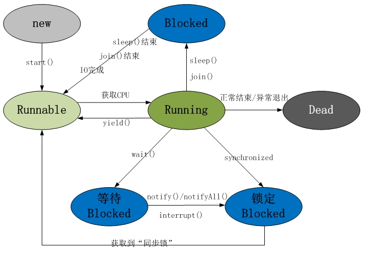
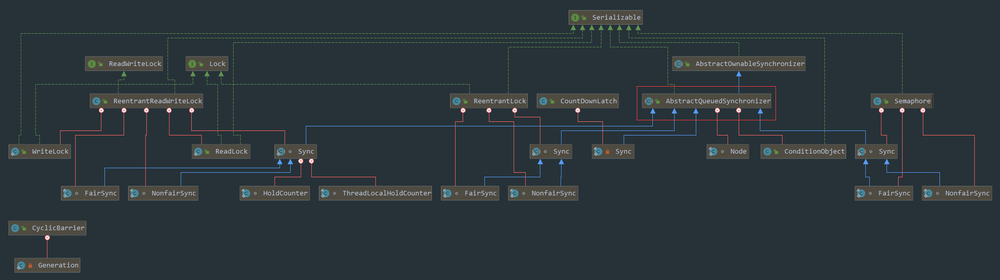
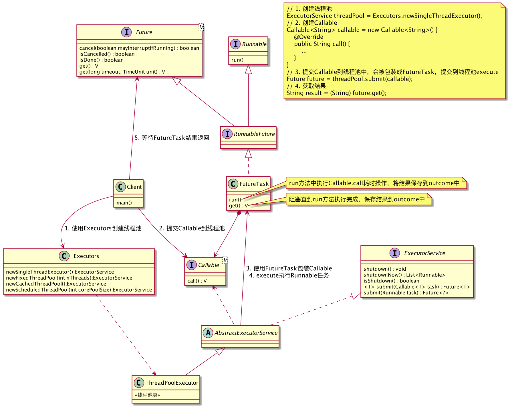

# 线程

线程（Thread）是系统（CPU）调度的基本单位。线程是进程的一个实体，是进程的一条执行路径。

## 线程状态



1. 新建状态（New）：线程对象被创建后，就进入了新建状态。例如，Thread thread = new Thread()。
2. 就绪状态（Runnable，可执行状态）：线程对象被创建并调用`start()`方法启动线程后，处于就绪状态，随时可能被CPU调度执行。
3. 运行状态（Running）：线程获取到CPU执行权限。**线程只能从就绪状态进入到运行状态。不能从新建或阻塞状态直接运行**
4. 阻塞状态（Blocked）：阻塞状态是线程因为某种原因放弃CPU使用权，暂时停止运行。例如
   * 等待阻塞：调用`wait()`方法，释放对象锁，等待某工作完成之后`notify`进行唤醒。
   * 同步阻塞：线程获取`synchronized`同步锁失败（因为对象锁被其它线程所占用），进入同步阻塞状态。占有锁的线程的同步代码块执行完后，所有处于同步阻塞的线程都会进入就绪状态，竞争锁。
   * 其他阻塞：
     * 调用线程的`sleep()`方法使线程休眠：`sleep()`超时之后，线程重新进入就绪状态
     * 其他线程调用了`join()`方法优先执行：`join()`等待线程终止或者超时，线程重新进入就绪状态
     * 发出了I/O请求时：当I/O处理完毕时，线程重新进入就绪状态
5. 死亡状态(Dead)    : 线程执行完了或者因异常退出了`run()`方法，该线程结束生命周期。

## 锁池和等待池

调用`wait()`方法进入等待阻塞，`notify()`唤醒之后进入同步阻塞。这两种阻塞有什么区别呢？

* 等待池：线程A调用了某个对象的`wait()`方法，线程A就会释放该对象的锁，进入到该对象的等待池。**不会去竞争锁**。
* 锁池：线程A持有某个对象的锁，导致其他线程不能访问该对象的`synchronized`方法（代码块），这些线程就会进入锁池，等待对象的锁被释放，**与其他线程竞争锁**
* `notify()`可以将等待池中的线程唤醒，**被唤醒的线程会从等待池进入锁池**

# 多线程

单核CPU同一时间CPU只能处理一个线程。多核CPU可以同时处理多个线程任务。

空闲CPU数较多的情况下，多线程会充分利用CPU**并行**执行。CPU不足的情况下，会快速地在多个线程间切换执行，造成"同时"执行的效果。

优点：

1. 提高程序执行效率
2. 提高CPU资源利用率
3. 线程上的任务完成之后，线程会自动销毁

缺点：

1. 程序设计复杂，需要考虑资源抢占，线程同步
2. 开启线程会占用内存空间。
3. 线程越多，CPU频繁切换开销越大，如果不频繁切换则线程执行效率较低。

## 并行和并发

* 并行是同一时刻做多件事情，并发是同一时间间隔内做多件事情
* 并行是同时做很多事情（依靠多核处理）。并发是一次处理很多事情，可以是虚拟的同时执行（轮流占用CPU和各种资源）也可以是真的同时执行。

# 线程间同步

由于线程可以共享同一进程中的资源、变量等，因此需要防止多线程同时访问同一个数据，导致破坏数据的完整性，造成不确定性。

和进程一样，线程之间也存在竞争和协作关系。也由此引入了**线程间的同步，保证线程执行顺序，实现线程安全**

线程间同步方式有很多：

1. 锁机制：
   1. 互斥锁：以排他方式防止数据结构被并发修改的方法。
   2. 条件变量：条件变量可以以原子的方式阻塞进程，直到某个特定条件为真为止。对条件的测试是在互斥锁的保护下进行的。条件变量始终与互斥锁一起使用。
2. 信号量机制（Semaphore）：和进程同步一样，允许多个线程使用共享资源，规定访问共享资源线程的最大数目
3. 信号机制（Signal）：和进程同步一样
4. 临界区（Critical Section）：和互斥锁一样，同时只能有一个线程访问资源
5. while轮询：忙等状态，消耗cpu资源。可使用wait阻塞替代

Java线程同步机制：

1. `synchronized`和Lock
2. `wait`、`notify`
2. `join`
2. 单线程池
2. 协程await
2. Lock+多个Condition，挨个唤醒Condition
3. 同步屏障（CyclicBarrier）
4. 闭锁（CountDownLatch）
5. CAS
6. AQS
7. 接口回调：一个线程中执行任务之后，在另一个线程中回调通知
8. Callable，Future，ExecutorService：线程池中执行，get阻塞返回，submit回调返回

# 线程间通信

通信可以说是一种特殊的同步，或者说线程间同步需要用到通信机制。

> 这里界限不是很明显，大概能明白意思就行，不用太纠结，同步方式、通信方式、异步方式大部分时候是可以混用的。
>
> 简单区分：同步一般针对访问临界资源，控制线程执行顺序，通信则没有限制。

由于线程共享进程的堆区域，因此线程可以直接通过对象通信。另外进程间通信的方式大部分时候也能用于线程间通信。

* IO管道流：`PipedInputStream`、`PipedOutputStream`
* Socket
* 消息队列

Android中大部分异步框架都支持线程切换或线程间通信：

1. Handler
2. EventBus
3. RxJava
4. 协程

# 锁

多线程**访问同一资源**会发生竞争，此时需要进行线程间的资源同步。加锁是线程同步的一种方式。

当多个线程读写文件时，读操作和写操作会发生冲突现象，写操作和写操作也会发生冲突现象，但是读操作和读操作不会发生冲突现象。

**线程持有锁和占用CPU是两回事**

1. 线程能够占用CPU的一个前提是持有锁
2. 线程持有锁，但不占用CPU，例如`sleep()`休眠

**并发和加不加锁也是两回事**

1. 不加锁也能并发，只要不访问同一数据即可。
2. 加锁会降低并发效率，同一时刻只能有一个线程访问资源，其他线程获取不到锁只能等待

## 锁的特性

按照不同特性进行分类，一种锁可以包含多种特性。

### 公平锁/非公平锁

* 公平锁：多个线程按照申请锁的顺序优先获取锁。可以使用FIFO（先进先出），维护一个队列，当一个线程执行完之后唤醒下一个线程
* 非公平锁：多个线程获取锁的顺序不确定，处于就绪状态的线程会互相竞争锁，可能会造成优先级反转或者饥饿现象。

syncrhonized是非公平锁，ReentrantLock可以通过构造函数决定是否公平

### 可重入锁/不可重入锁

* 可重入锁：可嵌套或递归调用，重复对同一个对象加锁，并且不发生死锁。
* 不可重入锁：重复对同一个对象加锁会导致死锁

sychronized和Lock都是可重入锁。

### 独享锁和共享锁、互斥锁和读写锁

独享锁/共享锁与互斥锁/读写锁其实是类似的，只不过描述角度不同。

针对锁是否能被多个线程持有：

* 独享锁：该锁只能被一个线程持有，例如`ReentrantLock`
* 共享锁：该锁可以被多个线程持有，例如`CountDownLatch`和`ReentrantReadWriteLock`读写锁，支持多个线程读操作，但写操作是互斥的

针对资源加锁时的状态：

* 互斥锁：每次只能有一个线程访问共享资源，其他线程会阻塞，直到解锁。
* 读写锁：允许多个线程同时读共享数据，而对写操作是互斥的。分为三种情况
  * 不加锁状态：任何线程都可以访问
  * 读加锁状态：正在被读，允许其他线程获取读状态锁，但不允许获得写状态锁
  * 写加锁状态：正在被写，不允许其他线程获取锁

### 乐观锁和悲观锁

悲观锁：每次访问数据都认为别人会修改，因此每次访问数据前都需要上锁，其他线程阻塞。

1. 例如Java的`synchronized`和`ReentrantLock`

乐观锁：每次读数据都认为别人不会修改，所以不会上锁，但是更新数据的时候会使用CAS判断是否有其他线程更新了数据。

1. 适用于多读的类型。
2. 例如Java的原子类`java.util.concurrent.atomic.*`

### 自旋锁

线程获取不到锁的时候会进入循环，直到获取锁才退出循环。

自旋锁和互斥锁同一时刻只能有一个持有者。区别：

1. 互斥锁获取不到锁，线程会进入阻塞状态，不占用CPU。
2. 自旋锁获取不到锁，线程仍处于运行状态，占用CPU。

> 阻塞需要进行线程上下文切换，执行速度慢。自旋会一直消耗CPU资源。需要综合考虑

### 分段锁

使用独占锁每次只能有一个线程访问，导致并发效率降低。

将数据划分为多个部分，每一段由一把锁占有，多线程访问不同数据段不会发生竞争，提高并发访问效率。

例如`ConcurrentHashMap`使用包含16个锁的数组，分为16个散列桶进行保护。

### 偏向锁、轻量级锁、重量级锁

针对获取锁的代价，可以分为：无锁、偏向锁、轻量级锁、重量级锁

这四种状态不是Java语言中的锁，而是JVM为了提高锁的获取和释放效率做的优化，会随着竞争情况逐渐升级，不可逆。

* 偏向锁：一段同步代码一直被一个线程所访问，线程会自动获取锁，降低获取锁的代价
* 轻量级锁：当锁是偏向锁时，被另一个线程访问，会升级为轻量级锁，通过自旋形式尝试获取锁
* 重量级锁：当锁是轻量级锁时，自旋到一定次数还没有获取到锁，会升级为重量级锁，进入阻塞状态，获取锁的代价高

## 锁的实现

利用CAS实现自旋锁：

1. A线程调用lock，B线程再次调用lock会进入循环，直到A线程调用unlock释放锁。
2. 单线程调用两次lock，会导致死锁，因此是不可重入的。

```java
public class SpinLock {
    private AtomicReference cas = new AtomicReference();
    public void lock() {
        Thread current = Thread.currentThread();
        // 利用CAS，循环直到获取到锁
        while (!cas.compareAndSet(null, current)) {
            // DO nothing
        }
    }
    public void unlock() {
        Thread current = Thread.currentThread();
        cas.compareAndSet(current, null);
    }
}
```

加一个状态实现可重入锁：

1. 原子变量存放当前锁，表示当前持有锁的线程
2. 同一个线程支持多次lock，每次lock判断是同一个线程则state+1，标记当前重入锁的数量
3. unlock的时候判断是当前线程，则state-1，为0表示当前线程只有一个锁，unlock会释放当前原子变量

```java
public class MyReentrantLock {
   private AtomicReference owner = new AtomicReference();
   private int count = 0;
   public void lock() {
       Thread current = Thread.currentThread();
       if (current == owner.get()) {
           count++;
           return;
       }
       while (!owner.compareAndSet(null, current) {
       }
   }
   public void unlock() {
       Thread current = Thread.currentThread();
       if (current == owner.get()) {
           if (count != 0) {
               count--;
           } else {
               owner.compareAndSet(current, null);
           }
       }
   }
}
```

使用synchronized实现不可重入锁：使用一个isLocked变量，重复lock会进入wait状态

```java
public class Lock{  
    private boolean isLocked = false;  
    public synchronized void lock()  
        throws InterruptedException{  
        while(isLocked){  
            wait();  
        }  
        isLocked = true;  
    }  

    public synchronized void unlock(){  
        isLocked = false;
        notify();
    }  
}
```

使用syncrhonized实现可重入锁：synchronized本身就是可重入锁，不需要再实现

公平锁实现：维护一个线程队列，lock的时候判断不在队头则不获取锁

## 总结

* `synchronized`是可重入的、悲观的、互斥的、非公平的
* `ReentrantLock`是可重入的、悲观的、互斥的、是否公平可以通过参数控制
* `ReentrantReadWriteLock`读操作是共享的、乐观的，写操作是独占的、互斥的、悲观的。

# Java实现锁的方式

## synchronized

synchronized同步能够保证可见性和原子性，同一时刻只允许一个线程访问资源。

按作用对象来分：

1. 类锁：锁住该类的所有对象
2. 对象锁：锁住该类的一个实例

按修饰对象来分：

1. 实例方法：也被称为同步方法，锁住调用该方法的对象（对象锁）
2. 静态方法：类锁
3. 代码块：
   1. 传入类对象：类锁
   2. 传入实例对象：锁住传入的对象（对象锁）

```java
//同步代码块，持有object对象的锁
synchronized(object){
    //doSomething……
}
//持有class对象的锁
synchronized(Test.class){
    //doSomething……
}
//同步方法，默认传入this，即调用该方法的对象
public synchronized void func() {
}
//静态同步方法，持有该类的锁
public static synchronized void func() {
}
```

**synchronized实际上锁住的是对象，而不是代码块**，新建一个实例，其他线程仍然可以执行代码块。要想锁住代码块，需要使用类锁（锁住了所有对象即相当于锁住了代码块）

**两个线程只有访问同一代码块或方法才会有限制，不同方法声明两个synchonized互不影响，是两把锁**

原理：

1. 方法级的同步是隐式，即无需通过字节码指令来控制的，它实现在方法调用和返回操作之中。JVM可以从方法常量池中的方法表结构(method_info Structure) 中的`ACC_SYNCHRONIZED`访问标志区分一个方法是否同步方法。JVM执行方法调用指令时，会先获取monitor（虚拟机规范中用的是管程一词）， 再执行方法，方法完成时释放monitor。
2. 代码块的同步是利用`monitorenter`和`monitorexit`这两个字节码指令。它们分别位于同步代码块的开始和结束位置。
   1. 当jvm执行到`monitorenter`指令时，当前线程尝试获取monitor对象的所有权，如果未加锁或者已经被当前线程所持有，就把锁的计数器+1；
   2. 当执行`monitorexit`指令时，锁计数器-1；
   3. 当锁计数器为0时，该锁就被释放了。
   4. 如果获取monitor对象失败，该线程则会进入阻塞状态，直到其他线程释放锁，计数器变为0。


## CAS

CAS（CompileAndSet）是Java Unsafe类中的方法

1. CAS保证并发安全，不保证并发同步
2. 一般配合自旋实现线程同步

原理：外部传入期望值和想设置的新值，CAS判断当前值和期望值是否相等，如果相等则设置新的值。若不一致，则返回false。

```java
public final class Unsafe {
    ...
    public final native boolean compareAndSwapInt(Object object, long value, int expected, int newValue);
}
```

> CAS是原子操作，由CPU原语支持，中间不能被打断，因此不需要考虑比较一致之后被其他线程修改

ABA问题：一个线程将变量从A修改为B，再修改为A，另一个线程无法感知，认为没被修改过。

解决：可以给变量设置一个版本号，保证CAS的正确性。例如`AtomicStampedReference`通过一个stamp变量记录版本号

## Lock

内部使用AQS（AbstractQueuedSynchronizer，队列同步器）实现，内部也使用了CAS保证并发安全。

调用lock实际会调用AQS的acquire方法

1. 首先调用tryAcquire方法
2. state==0则表示没有锁，尝试获取锁
3. state!=0则表示有线程在使用，判断是否是当前线程持有锁，如果是则更新state值，实现可重入。
4. 如果不是当前线程持有，则调用入队列操作，如果在队头则再次尝试获取锁
5. 如果获取失败，则将前驱节点状态设置为SIGNAL，表示当前节点释放锁时需要唤醒下一个节点，并调用park阻塞

TODO：类图

AQS内部维护了两个队列

* 同步队列：当线程获取资源失败之后，通过CAS加到同步队列的尾部，并调用park进入阻塞状态
* 条件队列：只有在使用了Condition才会存在条件队列，一个线程可能会有多个条件队列

`LockSupport.park()`阻塞当前线程，通过`unpack`停止阻塞

1. `lock()`得不到锁线程会等待，`tryLock()`得不到锁会返回false继续执行，`tryLock(time, unit)`可以设置等待时间
2. `lock()`不可以被线程interrupt中断，`tryLock()`、`lockInterruptibly()`可以被中断，抛出`InterruptedException`异常

CLH队列



## Lock和synchronized

TODO

1. Lock是一个接口，而synchronized是Java中的关键字，synchronized是内置的语言实现；
2. synchronized在发生异常时，会自动释放线程占有的锁，因此不会导致死锁现象发生；而Lock在发生异常时，如果没有主动通过unLock()去释放锁，则很可能造成死锁现象，因此使用Lock时需要在finally块中释放锁；
4. 通过Lock可以知道有没有成功获取锁，而synchronized却无法办到。
5. Lock可以提高多个线程进行读操作的效率。
6. 在性能上来说，如果竞争资源不激烈，两者的性能是差不多的，而当竞争资源非常激烈时（即有大量线程同时竞争），此时Lock的性能要远远优于synchronized。所以说，在具体使用时要根据适当情况选择。
6. Lock可以让等待锁的线程响应中断，而synchronized却不行，使用synchronized时，等待的线程会一直等待下去，不能够响应中断；（I/O和Synchronized都能响应中断，即不需要处理InterruptionException异常）

Lock提供了比synchronized更多的功能：

1. 由于Synchronized不会释放锁

1. 在使用synchronized关键字的情形下，假如占有锁的线程由于要等待IO或者其他原因（比如调用sleep方法）被阻塞了，但是又没有释放锁，那么其他线程就只能一直等待，别无他法。这会极大影响程序执行效率。因此，就需要有一种机制可以不让等待的线程一直无期限地等待下去（比如只等待一定的时间 (解决方案：`tryLock(long time, TimeUnit unit)`)或者能够响应中断(解决方案：`lockInterruptibly()`），这种情况可以通过 Lock 解决。
2. synchronized不允许两个线程同时进行读操作，`ReentrantReadWriteLock`可以让两个线程同时进行读操作。
3. synchronized无法得知锁有没有被线程持有，`ReentrantLock.isLocked`可以得知锁被线程持有

Lock 是`java.util.concurrent.locks`包下的接口，Lock 实现提供了比 synchronized 关键字更广泛的锁操作，它能以更优雅的方式处理线程同步问题。

## volatile

线程安全需要保证原子性、可见性、有序性

### 原子性

一个操作不可被中断，要么全部执行，要么都不执行。

例如synchronized对方法加锁，只有等该方法执行完之后，其他线程才可执行该方法。

### 可见性

线程之间不可见：每个线程都有自己的一块区域（CPU高速缓存），当需要访问一个变量时，会先从共享空间（内存）复制一份放在线程的工作空间。修改的时候先在工作空间修改，再写回共享空间。线程在高速缓存中对变量的修改另一个线程不可见。

缓存一致性问题：A、B线程分别读取变量i=0的值到CPU缓存中，A线程对i+1，写入内存，此时B线程中i值还是0，B线程对i+1，写入内存，最终结果还是1。

### 有序性

指令重排：JVM为了提高程序运行效率，会对输入代码进行优化，导致代码执行顺序不确定。

1. 只会对无关的代码进行重排序
2. 保证单线程执行结果是正确的，但是不保证多线程执行结果正确

举个例子：单线程

```java
// 第1、2行代码顺序不一定
// 第3行代码依赖了1、2行代码，因此不会被重排序
int a = 1;
int b = 2;
b = a + 1;
```

多线程：线程1的两行代码可能会发生重排序，导致线程2获取inited变量为true，但实际上context并没有初始化完成。

```java
// 线程1
context = loadContext();
inited = true;

// 线程2
while (!inited) {
}
doSomething(context);
```

JVM依据happens-before原则保证有序性

- 程序次序规则：一个线程内，按照代码顺序，书写在前面的操作先行发生于书写在后面的操作
- 锁定规则：一个unLock操作先行发生于后面对同一个锁的lock操作
- volatile变量规则：对一个变量的写操作先行发生于后面对这个变量的读操作
- 传递规则：如果操作A先行发生于操作B，而操作B又先行发生于操作C，则可以得出操作A先行发生于操作C
- 线程启动规则：Thread对象的start()方法先行发生于此线程的每个一个动作
- 线程中断规则：对线程interrupt()方法的调用先行发生于被中断线程的代码检测到中断事件的发生
- 线程终结规则：线程中所有的操作都先行发生于线程的终止检测，我们可以通过Thread.join()方法结束、Thread.isAlive()的返回值手段检测到线程已经终止执行
- 对象终结规则：一个对象的初始化完成先行发生于他的finalize()方法的开始

### volatile作用

1. 保证可见性，不保证原子性：线程2修改变量之后会立即写入内存，并且使线程1中缓存的变量失效，并重新从内存中读取，保证每次读取的是最新的值。
2. 禁止指令重排

volatile和syncrhonized

1. volatile本质是在告诉jvm当前变量在寄存器（工作内存）中的值是不确定的，需要从主存中读取； synchronized则是锁定当前变量，只有当前线程可以访问该变量，其他线程被阻塞住。
2. volatile仅能实现变量的修改可见性，不能保证原子性；而synchronized则可以保证变量的修改可见性和原子性
3. volatile不会造成线程的阻塞；synchronized可能会造成线程的阻塞。
4. volatile仅能使用在变量级别；synchronized则可以使用在变量、方法、和类级别的

### 单例模式DCL中的volatile作用

`singleton = new Singleton();`不是原子操作：

1. 给对象分配内存空间
2. 调用构造函数，初始化Singleton对象
3. singleton变量指向分配的内存空间

发生指令重排之后2、3步骤可能交换，此时另一个线程调用`getInstance`方法，判断不为空直接返回了，但是对象还没完成初始化

只有volatile没有synchronized两个线程可能同时进入null判断，导致对象new两次

# interrupt和stop

旧版本通过stop终止线程，新版本不建议使用

interrupt不会终止线程，只是设置一个标志位，破坏等待状态。可以在线程循环中判断`isInterrupted`，如果线程处于wait阻塞状态，会停止等待，抛出`Interrupted`异常

* `isInterrupted`：判断标志位
* `interrupted`：第一次调用为true，会将标志位改为false
* `interrupt`：请求中断

//TODO

# Java Future对象



```java
//ExecutorService提供的方法，传入Callable，submit会封装成FutureTask（继承RunnableFuture接口）然后执行
<T> Future<T> submit(Callable<T> task);
//FutureTask run执行任务，将结果保存到outcome变量中，get的时候通过CAS循环等待线程允许完
```

Future的get()方法用来获取执行结果，会阻塞线程（通过CAS+LockSupport.park），直到任务执行完毕。

# wait()，notify()，notifyAll()阻塞和唤醒线程

 这三个方法都是属于Object的本地final方法；无法被重写，所有类都可以调用这三方法； 

* wait()：使当前线程等待，并且释放锁，直到其他线程调用notify()或者notifyAll()方法唤醒。

* notify()：唤醒一个等待当前对象的锁的线程（随机）。

* notifyAll(）就是唤醒所有在等待当前对象的线程。

`wait()`和`notify()`方法要求在调用时线程持有对象的锁，因为线程只有在同步块中才会占用对象的锁，因此对这两个方法的调用需要放在synchronized方法或synchronized块中。

不持有锁的话可能会产生竞态问题，notify可能比wait先执行，导致一直wait

```java
//使用synchronized获取对象锁，在同步块中使用wait方法让当前线程进入等待状态，等待当前锁住的对象，
//同样的在另一个同步块中使用notify方法释放对象锁，唤醒等待该对象锁的线程。
synchronized(obj){
	obj.wait();
}
synchronized(obj){
	obj.notify();
}
```

# yield，sleep，join都是Thread的方法

* yield：让步，让当前线程由运行状态进入到就绪状态，从而让其他线程有机会获得cpu（一般是更高优先级的线程，也可能当前线程立马获得cpu）
* sleep：让线程休眠一段时间，进入阻塞状态。放弃cpu，给其他线程执行的机会，但是不释放对象锁，如果加了锁，其他线程还是不能使用资源
* join：当前线程挂起，让指定的另一个线程执行。`thread.join(long)`方法在内部使用的是`wait (long)`方法来实现的；所以`join(long)`方法具有释放锁的特点。（相当于在程序中间插入了一段代码）

```java
public class Main{
    public static void main(String[] args){
        Thread t = new Thread();
        //主线程会阻塞，直到t线程执行完毕。
        //join的意思是加入，即将线程排队，把t线程加入到队伍里面去
        //也可以传入时间参数，表示主线程只等待一段时间
        t.join();
    }
}
```

wait：是Object 类的方法，对此对象调用wait 方法导致本线程放弃对象锁，进入等待此对象的等待池，只有针对此对象发出notify 方法（或notifyAll）后本线程才进入锁池准备获得对象锁进入运行状态。  

sleep是native方法，并且是静态的，`Thread.sleep(1000);`让当前线程休眠

wait会释放锁，sleep不释放锁

sleep必须捕获异常，而wait，notify和notifyAll不需要捕获异常  

# 同步屏障

# 闭锁

1. 同步屏障（CyclicBarrier）：若有多条线程，他们到达屏障时将会被阻塞，只有当所有线程都到达屏障时才能打开屏障，所有线程同时执行，若有这样的需求可以使用同步屏障。此外，当屏障打开的同时还能指定执行的任务。
2. 闭锁（CountDownLatch）：若有多条线程，其中一条线程需要等到其他**所有**线程准备完所需的资源后才能运行，这样的情况可以使用闭锁。
3. 同步屏障和闭锁的区别

   * 闭锁只会阻塞一条线程，目的是为了让该条任务线程满足条件后执行；
   * 而同步屏障会阻塞所有线程，目的是为了让所有线程同时执行（实际上并不会同时执行，而是尽量把线程启动的时间间隔降为最少）。

TODO

https://blog.csdn.net/yusimiao/article/details/105378311

https://yearn.xyz/posts/techs/%E5%8D%8F%E7%A8%8B/

https://blog.csdn.net/x541211190/article/details/109549244

https://segmentfault.com/a/1190000021394353?utm_source=tag-newest

## IllegalMonitorStateException

没有获取到锁，但是调用notify

## InterruptedException
