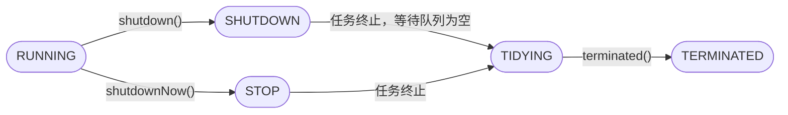
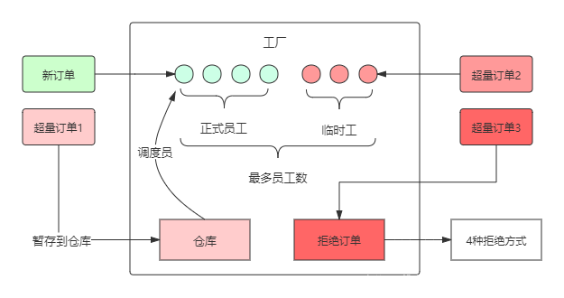
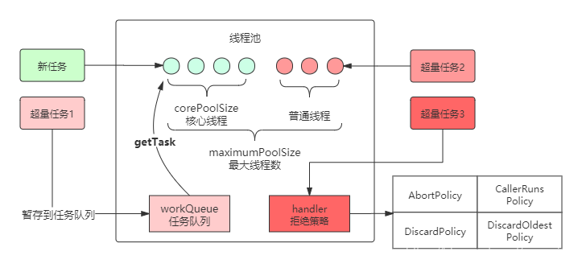
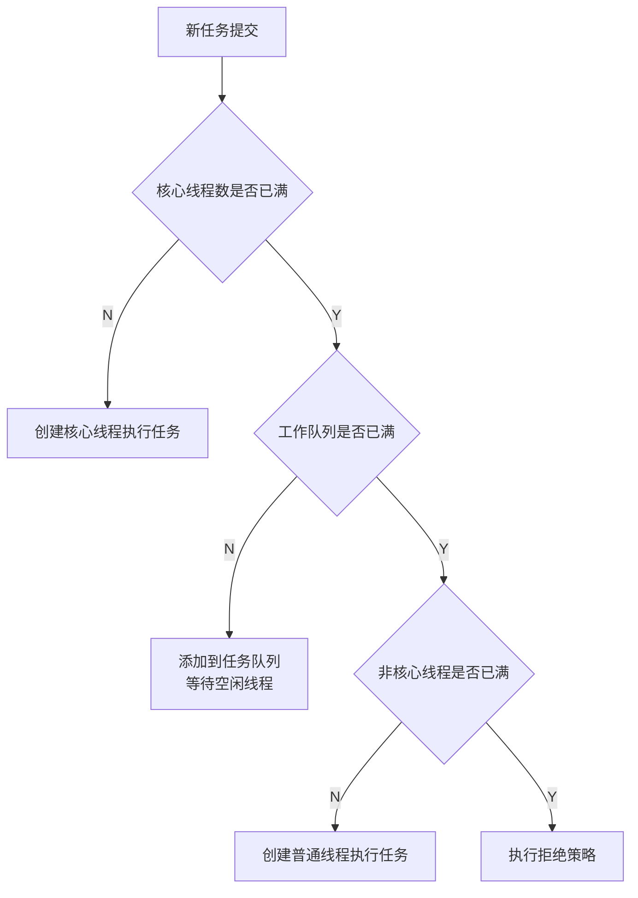
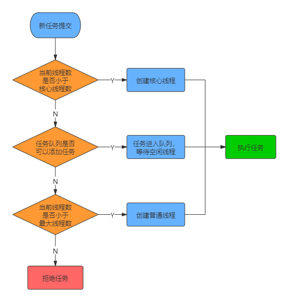

# 线程池作用

* 降低资源消耗：线程池通常会维护一些线程（数量为 corePoolSize），这些线程被重复使用来执行不同的任务，任务完成后不会销毁。在待处理任务量很大的时候，通过对线程资源的复用，避免了线程的频繁创建与销毁，从而降低了系统资源消耗。
* 提高响应速度：由于线程池维护了一批 alive 状态的线程，当任务到达时，不需要再创建线程，而是直接由这些线程去执行任务，从而减少了任务的等待时间。
* 提高线程的可管理性：使用线程池可以对线程进行统一的分配，调优和监控。

# 线程池构造参数

1. corePoolSize（必需，>=0）：核心线程数。即池中一直保持存活的线程数，当线程数<核心线程数时，即使线程处于空闲状态也不销毁。
2. maximumPoolSize（必需，>0 && >=corePoolSize）：池中允许的最大线程数。当核心线程全部繁忙且任务队列排满之后，线程池会临时追加线程，直到总线程数达到maximumPoolSize这个上限。
3. keepAliveTime（必需，>=0）：线程空闲超时时间。当非核心线程处于空闲状态的时间超过这个时间后，该线程将被回收。
4. unit（必需）：keepAliveTime参数的时间单位。有：TimeUnit.DAYS（天）、TimeUnit.HOURS（小时）、TimeUnit.MINUTES（分钟）、TimeUnit.SECONDS（秒）、TimeUnit.MILLISECONDS（毫秒）、TimeUnit.MICROSECONDS（微秒）、TimeUnit.NANOSECONDS（纳秒）
5. workQueue（必需）：任务队列，采用阻塞队列实现。当核心线程全部繁忙时，后续由execute方法提交的Runnable将存放在任务队列中，等待被线程处理。
6. threadFactory（可选）：线程工厂。指定线程池创建线程的方式。
7. handler（可选）：拒绝策略。当线程池中线程数达到maximumPoolSize且workQueue排满时，后续提交的任务将被拒绝，handler可以指定用什么方式拒绝任务。

补充：

* `allowCoreThreadTimeOut`设置为true后，核心线程也会被回收。
* 线程销毁的条件：
  * 当前线程数量大于核心线程数
  * 工作队列为空
  * 线程超出空闲时间
* 核心线程和非核心线程并没有特殊的标记，线程只要空闲都可能被销毁，直到小于核心线程数，剩下的线程都算核心线程。
* corePoolSize和maximumPoolSize可以调用set方法动态调整：`setCorePoolSize()`,`setMaximumPoolSize`
* 线程池创建之后不会立马创建线程，而是等到任务提交之后再创建，如果需要提前创建核心线程（**预热**），可以调用下面两个方法：
  * `prestartCoreThread`：初始化一个核心线程
  * `prestartAllCoreThreads`：初始化所有核心线程

# 工作队列（任务队列、等待队列、阻塞队列）

1. SynchronousQueue：同步队列。这是一个内部没有任何容量的阻塞队列，任何一次插入操作的元素都要等待相对的删除/读取操作，否则插入的任务就要一直等待，反之亦然。
2. LinkedBlockingQueue：无界队列，基于链表结构。使用无界队列后，当核心线程都繁忙时，后续任务可以无限加入队列，因此线程池中线程数不会超过核心线程数。这种队列可以提高线程池吞吐量，但代价是牺牲内存空间，甚至会导致内存溢出。另外，使用它时可以指定容量，这样它也就是一种有界队列了。
3. ArrayBlockingQueue：有界队列，基于数组实现。在线程池初始化时，指定队列的容量，后续无法再调整。这种有界队列有利于防止资源耗尽，但可能更难调整和控制。
4. PriorityBlockingQueue：支持优先级排序的无界阻塞队列。存放在PriorityBlockingQueue中的元素必须实现Comparable接口，这样才能通过实现compareTo()方法进行排序。优先级最高的元素将始终排在队列的头部；PriorityBlockingQueue不会保证优先级一样的元素的排序，也不保证当前队列中除了优先级最高的元素以外的元素，随时处于正确排序的位置。
5. DelayQueue：延迟队列。基于二叉堆实现，同时具备：无界队列、阻塞队列、优先队列的特征。DelayQueue延迟队列中存放的对象，必须是实现Delayed接口的类对象。通过执行时延从队列中提取任务，时间没到任务取不出来。
6. LinkedBlockingDeque：双端队列。基于链表实现，既可以从尾部插入/取出元素，还可以从头部插入元素/取出元素。
7. LinkedTransferQueue：由链表结构组成的无界阻塞队列。这个队列比较特别的时，采用一种预占模式，意思就是消费者线程取元素时，如果队列不为空，则直接取走数据，若队列为空，那就生成一个节点（节点元素为null）入队，然后消费者线程被等待在这个节点上，后面生产者线程入队时发现有一个元素为null的节点，生产者线程就不入队了，直接就将元素填充到该节点，并唤醒该节点等待的线程，被唤醒的消费者线程取走元素。

# 四种拒绝策略（饱和策略）

继承`RejectedExecutionHandler`接口，Java默认提供四种拒绝策略

1. AbortPolicy（默认）：丢弃任务并抛出RejectedExecutionException异常。
2. CallerRunsPolicy：直接运行这个任务的run方法，但并非是由线程池的线程处理，而是交由任务的调用线程处理。
3. DiscardPolicy：直接丢弃任务，不抛出任何异常。
4. DiscardOldestPolicy：取出等待队列队头的任务（即最早提交的任务），再尝试将当前任务提交到线程池执行。

# 线程池五种状态

## 五种状态

* RUNNING：线程池初始化即进入RUNNING状态。能够接收新任务，对已添加任务进行处理
* SHUTDOWN：不再接收新任务，但能处理等待队列中的任务
* STOP：不接收新任务，清空等待队列中的任务，尝试中断正在执行的任务
* TIDYING：所有任务终止，工作线程数量为0。变为TIDYING状态时，会调用terminated()方法，执行完terminated()方法后进入TERMINATED状态。
* TERMINATED：线程池彻底终止。

## 状态切换




* **shutdown()**：不会立即终止线程池，而是要等所有任务缓存队列中的任务都执行完后才终止，但再也不会接受新的任务
* **shutdownNow()**：立即终止线程池，并尝试打断正在执行的任务，并且清空任务缓存队列，返回尚未执行的任务

# 线程池工作流程

工厂生产流程：

1. 工厂先准备5个长期工位，3个临时工位。
2. 新订单到来如果工位上没有人会新招聘正式员工处理，直到长期工位排满。订单少的时候正式工即使空闲也不会辞退。
3. 正式员工已满还有新订单过来，会将订单堆积到仓库中，等正式员工空闲时再从仓库取出来处理
4. 仓库堆积满了会临时扩招工人应对生产高峰。临时工空闲一定时间（keepAliveTime）会被清退。正式员工和临时工并不指特定的人，临时工表现好会转为正式员工，正式员工也可能会被清退。直到员工数量等于长期工位（或者说直到临时工位没有员工）不再辞退。
5. 临时工招满后再有任务会拒绝订单。



类比工厂生产流程：

1. 线程池初始设置核心线程数为5，最大线程数为8。初始不创建线程。
2. 新任务到来如果没有线程处理，会先创建新线程处理，直到达到核心线程数。任务少的时候线程即使空闲也不会回收。
3. 核心线程数已满还有新任务进来，会将任务加到等待队列中，等线程空闲时处理。
4. 工作队列满了会创建临时线程处理。线程数大于核心线程时，只要监测到空闲线程超过一定时间（keepAliveTime）就会回收。
5. 达到最大线程数后再有任务会执行拒绝策略。








# 常用线程池

Executors封装好了常用的线程池

## newFixedThreadPool

固定容量线程池

1. 核心线程数=最大线程数，即所有的线程都为核心线程，不会被回收。意味着keepAliveTime失效
2. 超出的任务加入等待队列，等待队列未指定容量，默认为`Integer.MAX_VALUE`
3. 适用于需要长时间并发的场景

```java
public static ExecutorService newFixedThreadPool(int nThreads) {
	return new ThreadPoolExecutor(nThreads, nThreads, 
                                0L, TimeUnit.MILLISECONDS,
                                new LinkedBlockingQueue<Runnable>());
}
```

## newSingleThreadExecutor

单线程线程池

1. 同固定容量线程池，核心线程数=最大线程数=1，由于只有一个线程，因此任务会按顺序执行

```java
public static ExecutorService newSingleThreadExecutor() {
    return new FinalizableDelegatedExecutorService
        (new ThreadPoolExecutor(1, 1,
                                0L, TimeUnit.MILLISECONDS,
                                new LinkedBlockingQueue<Runnable>()));
}
```

## newCachedThreadPool

缓存线程池

1. 核心线程数=0，最大线程数为`Integer.MAX_VALUE`，线程空闲60s回收，同步队列容量为空，put任务之后阻塞，直到调用take读取
2. 适用于任务量大，耗时短的场景

```java
public static ExecutorService newCachedThreadPool() {
    return new ThreadPoolExecutor(0, Integer.MAX_VALUE,
                                  60L, TimeUnit.SECONDS,
                                  new SynchronousQueue<Runnable>());
}
```

## newScheduledThreadPool

定时线程池

1. 核心线程数自行指定，最大线程数为`Integer.MAX_VALUE`。默认空闲线程存活10s，旧版本为0s。
2. 使用延时阻塞队列，时间到了之后才能取出任务。
3. 无界队列，因此不会执行拒绝策略。
4. 适用于执行定时或周期性的任务。

```java
public static ScheduledExecutorService newScheduledThreadPool(int corePoolSize) {
	return new ScheduledThreadPoolExecutor(corePoolSize);
}
//旧版本为0s，但是当核心线程数设置为0时，线程getTask的时候调用poll立马结束，会一直循环占用cpu，设置为10s，poll会阻塞，不占用cpu
private static final long DEFAULT_KEEPALIVE_MILLIS = 10L;
public ScheduledThreadPoolExecutor(int corePoolSize) {
    super(corePoolSize, Integer.MAX_VALUE,
          DEFAULT_KEEPALIVE_MILLIS, MILLISECONDS,
          new DelayedWorkQueue());
}

// 延时执行任务
public ScheduledFuture<?> schedule(Runnable command,
                                       long delay,
                                       TimeUnit unit) {...}
// 周期性执行，间隔period
public ScheduledFuture<?> scheduleAtFixedRate(Runnable command,
                                                  long initialDelay,
                                                  long period,
                                                  TimeUnit unit) {...}
```

## newWorkStealingPool：JDK1.8新增

# 源码解析

TODO

```java
//通过ctl原子对象记录线程池状态和线程数量
//高3位表示线程池状态RunState：rs
//低29位表示线程池中当前工作线程数量WorkerCount：wc
private final AtomicInteger ctl = new AtomicInteger(ctlOf(RUNNING, 0));//32位

private static final int COUNT_BITS = Integer.SIZE - 3;//29
private static final int CAPACITY   = (1 << COUNT_BITS) - 1;//线程池数量用29位表示，说明最大线程数不能超过29位

// runState is stored in the high-order bits
private static final int RUNNING    = -1 << COUNT_BITS; //111
private static final int SHUTDOWN   =  0 << COUNT_BITS; //000
private static final int STOP       =  1 << COUNT_BITS; //001
private static final int TIDYING    =  2 << COUNT_BITS; //010
private static final int TERMINATED =  3 << COUNT_BITS; //011

// Packing and unpacking ctl
// 获取当前线程池状态
private static int runStateOf(int c)     { return c & ~CAPACITY; }
// 获取当前工作线程数量
private static int workerCountOf(int c)  { return c & CAPACITY; }
private static int ctlOf(int rs, int wc) { return rs | wc; }
```


```java
   public void execute(Runnable command) {
        if (command == null)
            throw new NullPointerException();
        // 获取ctl的值
        int c = ctl.get();
        // 1.线程数小于corePoolSize
        if (workerCountOf(c) < corePoolSize) {
            // 线程池中线程数小于核心线程数，则尝试创建核心线程执行任务
            if (addWorker(command, true))
                return;
            c = ctl.get();
        }
        // 2.线程池中线程数大于核心线程数或者创建线程失败，加入工作队列
        if (isRunning(c) && workQueue.offer(command)) {
            int recheck = ctl.get();
            // 重新检查线程池状态，因为上次检测后线程池状态可能发生改变，如果非运行状态就移除任务并执行拒绝策略
            if (!isRunning(recheck) && remove(command))
                reject(command);
            // 如果是运行状态，并且线程数是0，则创建非核心线程
            else if (workerCountOf(recheck) == 0)
                // 且不指定首次执行任务，因为队列中已经有任务，再添加的话会重复
                addWorker(null, false);
        }
        // 3.阻塞队列已满，创建非核心线程执行任务
        else if (!addWorker(command, false))
            // 如果失败，则执行拒绝策略
            reject(command);
    }
 
```

# 问题

## 核心线程数和最大线程数区别？

1. 核心线程数可以为0，最大线程数不能为0。核心线程数<=最大线程数
2. 核心线程数+非核心线程数=最大线程数
3. 当前线程数<核心线程数时不会回收空闲线程，当前线程数>核心线程数，会回收空闲线程，直到当前线程数<核心线程数。
4. 可以理解为工厂正式员工和临时工的区别，临时工订单完成之后空闲一定时间（keepAliveTime）会被清退，而正式员工不会被清退。

## 核心线程数和最大线程数如何设置？

1. 线程等待时间所占比例越高，需要越多线程。线程CPU时间所占比例越高，需要越少线程。
   * IO密集型任务（读写密集），大部分时间是在等磁盘到内存的读写，cpu使用率不高：如网络通信、磁盘读写等。
   * CPU密集型（计算密集）cpu一直运行，如计算、逻辑判断等。
2. 最佳线程数目 = （线程等待时间/线程CPU时间 + 1）* CPU数目
3. 如果全是CPU密集型的任务，则最佳线程数目 = CPU数目，CPU满载
4. IO任务和CPU任务相等时，则最佳线程数目 = 2 * CPU数目

## 未达到核心线程数时，为什么直接创建新线程，不检查空闲线程？

1. 预热：核心线程数可以认为是符合实际情况的最佳配置，理论上应该在线程池创建的时候就准备好所有核心线程，考虑到一次性初始化大量线程开销太大，因此将创建线程的开销平均到执行新任务的时候。提前准备好核心线程，直到最优值，也就是**预热**。
2. 避免锁开销：检查空闲线程并复用线程需要加锁，直接判断`当前线程数<核心线程数`更快。

## 线程池如何防止核心线程被回收？

take阻塞线程

# 结束

参考文章：

* [深入Java线程池：从设计思想到源码解读](https://blog.csdn.net/mu_wind/article/details/113806680)
* [彻底搞懂Java线程池的工作原理](https://mp.weixin.qq.com/s/tyh_kDZyLu7SDiDZppCx5Q)