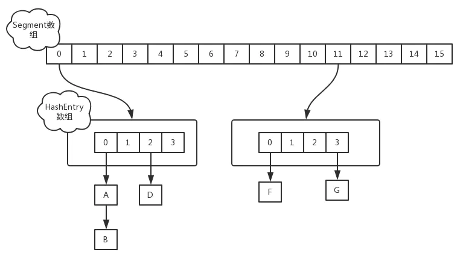
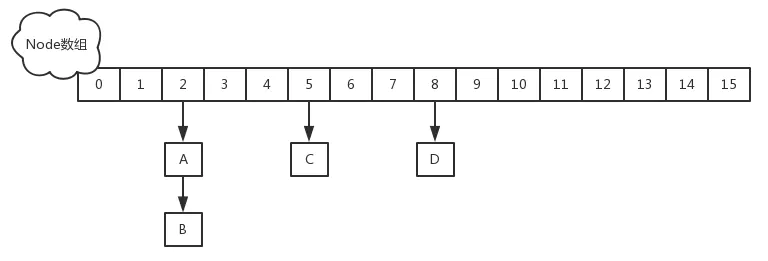

# 集合框架

| **AbstractCollection**  实现了大部分的集合接口。             |
| ------------------------------------------------------------ |
| **AbstractList**  继承于AbstractCollection 并且实现了大部分List接口。 |
| **AbstractSequentialList**  继承于 AbstractList ，提供了对数据元素的链式访问而不是随机访问。 |
| LinkedList 该类实现了List接口，允许有null（空）元素。主要用于创建链表数据结构，该类没有同步方法，如果多个线程同时访问一个List，则必须自己实现访问同步，解决方法就是在创建List时候构造一个同步的List。例如：`Listlist=Collections.synchronizedList(newLinkedList(...));`LinkedList 查找效率低。 |
| ArrayList 该类也是实现了List的接口，实现了可变大小的数组，随机访问和遍历元素时，提供更好的性能。该类也是非同步的,在多线程的情况下不要使用。ArrayList 增长当前长度的50%，插入删除效率低。 |
| **AbstractSet**  继承于AbstractCollection 并且实现了大部分Set接口。 |
| HashSet 该类实现了Set接口，不允许出现重复元素，不保证集合中元素的顺序，允许包含值为null的元素，但最多只能一个。 |
| LinkedHashSet 具有可预知迭代顺序的 `Set` 接口的哈希表和链接列表实现。 |
| TreeSet 该类实现了Set接口，可以实现排序等功能。              |
| **AbstractMap**  实现了大部分的Map接口。                     |
| HashMap  HashMap 是一个散列表，它存储的内容是键值对(key-value)映射。 该类实现了Map接口，根据键的HashCode值存储数据，具有很快的访问速度，最多允许一条记录的键为null，不支持线程同步。 |
| TreeMap  继承了AbstractMap，并且使用一颗树。                 |
| WeakHashMap  继承AbstractMap类，使用弱密钥的哈希表。         |
| LinkedHashMap  继承于HashMap，使用元素的自然顺序对元素进行排序. |
| IdentityHashMap  继承AbstractMap类，比较文档时使用引用相等。 |

**HashMap 初始容量 10000 即 new HashMap(10000)，当往里 put 10000 个元素时，需要 resize 几次（初始化的那次不算）？**

A. 1 次
B. 2 次
C. 3 次
D. 0 次

# HashMap

HashMap和HashTable的区别？

| HashTable                 | HashMap        |
| ------------------------- | -------------- |
| 继承Dictionary类          | 实现Map接口    |
| 线程安全                  | 线程不安全     |
| 不允许null值              | 允许null值     |
| 默认容量：11              | 默认容量：16   |
| 扩容：x2+1                | 扩容：x2       |
| 直接使用Key的`hashCode()` | 自定义哈希算法 |

HashMap怎么解决hash冲突的？数组+链表+红黑树

   * jdk8以前，出现hash冲突，加入链表中
   * Jdk8中：如果冲突数量（TREEIFY_THRESHOLD）小于8，则是以链表方式解决冲突。冲突大于等于8且容量大于64时，就会将冲突的Entry转换为**红黑树**进行存储。
   * 单链表遍历时间复杂度是O(n)，红黑树查找时间复杂度为 O(logn)
   * 在jdk1.8之前是插入头部的，在jdk1.8中是插入尾部的。
     * 多线程下，头插法在扩容的时候可能会出现死循环。当然HashMap本身就是线程不安全的，应该尽量避免多线程使用

put步骤：

1. 计算Key的hash值：`hash = hashCode() ^ (hashCode >>> 16)`，高16位与低16位做异或运算，减少冲突，高16位的特征会被加入到计算中
2. 计算数组下标：`(length - 1) & hash`，&（与）运算比%（取余）效率更高
3. 当容器中元素个数大于`capacity * loadfactor`时，会扩容到2倍大小
4. 如果计算的下标不存在，则直接插入，如果发生hash冲突，且equals相等，则更新键值对，否则插入链表或红黑树

扩容的时候不会重新计算hash值，而是将hash值与左移之后的容量做&运算，低位会多出一位

例如 hash & 16 转换为 hash & 32，低位会多出一位，如果是1则移动位置，如果是0则不移动位置

HashMap容量永远是2的幂次，此时`length - 1`二进制全为1，因此计算下标的时候存在`(length - 1) & hash = hash % length`，提高运算效率

HashMap的hash值如何计算，各种方式之间的效率问题，如何优化

* 对key的hashCode做hash操作，与高16位做异或运算
* 还有平方取中法，除留余数法，伪随机数法

HashMap如何扩容?

* size：大小
* capality：容量
* loadFactor：扩容因子（加载因子）默认是0.75，用于衡量map是否满了。和实时加载因子比较size/capality
* threshold：阈值，插入的时候判断size大于threshold开始扩容
* `threshold = capality * loadFactor`
* 默认长度16，每次扩大为原来的两倍

为什么扩容因子是0.75：空间利用率、避免冲突链表过长，减少查询成本。

初始容量声明为10，最终

处理hash冲突方法：

* 开放定址法：冲突位置往后查询空位置
* 再hash法：计算新hash
* 拉链法：冲突位置构造成链表
* 公共溢出区：冲突之后填入溢出表，使用新表存储冲突元素

LinkedHashMap：记录插入顺序，可以按顺序取出

# ConcurrentHashMap

线程安全

* 1.8之前，segment分段锁设计`ReentrantLock + Segment` + `HashEntry`的方式进行实现，分为16个桶+16把锁，锁粒度是Segment
* 1.8之后，通过Node` + `CAS（无锁算法）` + `Synchronized，锁粒度是首节点，提高了并发性，其他线程此时可以访问其他Node
* ConcurrentHashMap键值不允许为null

# 其他

## 迭代器和for循环

1. for循环不能修改集合
2. for循环适合访问顺序结构,可以根据下标快速获取指定元素.而Iterator 适合访问链式结构,因为迭代器是通过next()和Pre()来定位的.可以访问没有顺序的集合.
3. 迭代器不用考虑集合类内部实现，方便替换数据结构，如List换位Set。

## 链表和数组

* 数组需要申请连续内存空间，大小固定。

* 数组应用场景：数据比较少；经常做的运算是按序号访问数据元素；数组更容易实现，任何高级语言都支持；构建的线性表较稳定。
* 链表应用场景：对线性表的长度或者规模难以估计；频繁做插入删除操作；构建动态性比较强的线性表。
