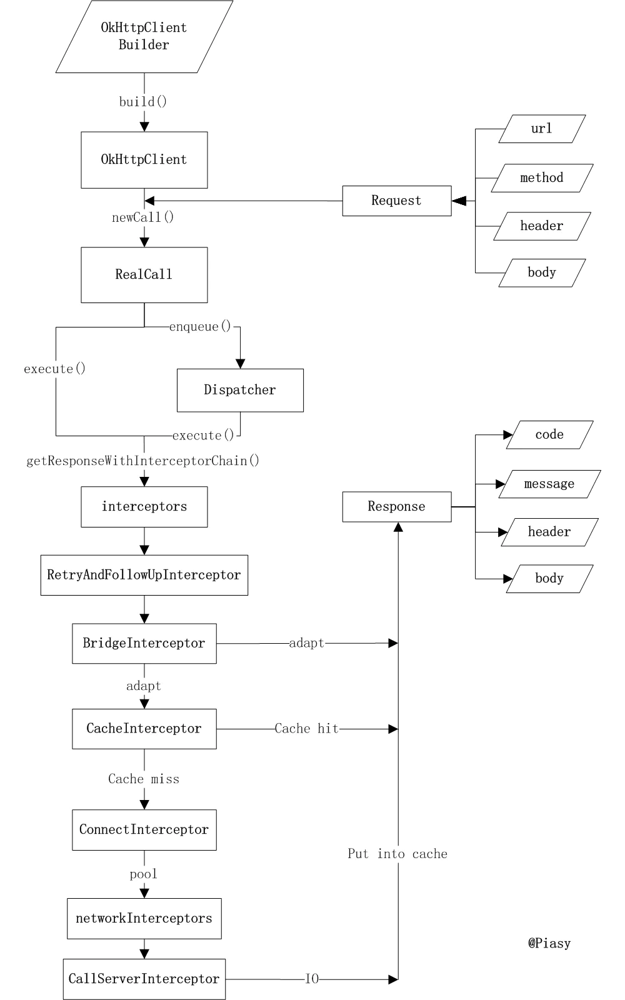

# 基本使用

# 同步和异步执行

```java
@Override public Response execute() throws IOException {
  synchronized (this) {
    if (executed) throw new IllegalStateException("Already Executed");
    executed = true;
  }
  captureCallStackTrace();
  eventListener.callStart(this);
  try {
    //加入同步队列
    client.dispatcher().executed(this);
    Response result = getResponseWithInterceptorChain();
    if (result == null) throw new IOException("Canceled");
    return result;
  } catch (IOException e) {
    eventListener.callFailed(this, e);
    throw e;
  } finally {
    client.dispatcher().finished(this);
  }
}

@Override public void enqueue(Callback responseCallback) {
  synchronized (this) {
    if (executed) throw new IllegalStateException("Already Executed");
    executed = true;
  }
  captureCallStackTrace();
  eventListener.callStart(this);
  //加入异步队列
  client.dispatcher().enqueue(new AsyncCall(responseCallback));
}
```

Dispatcher内部有三个队列：

1. `runningSyncCalls`进行中的同步请求
2. `runningAsyncCalls`进行中的异步请求。使用ExecutorService线程池，默认核心线程数为0，最大线程数Max，任务队列为空。
3. `readyAsyncCalls`异步请求等待队列，超过最大请求数64，或者同一个服务端超过5个正在运行的请求，则加入等待队列。

# 连接复用

基于HTTP2的多路复用，一个连接可以承载多个流，一个连接可以发出多次请求，并且服务端可以响应多次

1. 每个Call对应一个StreamAllocation
2. Allocation从ConnectionPool查找可用连接RealConnection，当Address相同，且该连接的allocations数量小于限制，表示可用连接，保存到StreamAllocation中（StreamAllocation通过该连接进行通信），同时将StreamAllocation加入到RealConnection中的弱引用列表allocations中（表示该连接上有多少个流）
3. 如果没有则新建，并入池
4. `ConnectionPool`中维护了一个`RealConnection`队列，`RealConnection`中封装了Socket、Buffer、路由、握手信息等

```java
public final class RealConnection extends Http2Connection.Listener implements Connection {
  //连接池
  private final ConnectionPool connectionPool;
  //一个连接可以承载多少个流，根据Http2协议设置
  public int allocationLimit = 1;
  //该连接承载的流
  public final List<Reference<StreamAllocation>> allocations = new ArrayList<>();
}
```

`ConnectionPool`遍历`RealConnection`列表，判断连接是否可重用

```java
public final class ConnectionPool {
  @Nullable RealConnection get(Address address, StreamAllocation streamAllocation, Route route) {
    assert (Thread.holdsLock(this));
    //遍历池中的连接
    for (RealConnection connection : connections) {
      //判断连接是否可重用
      if (connection.isEligible(address, route)) {
        streamAllocation.acquire(connection, true);
        return connection;
      }
    }
    return null;
  }
}
```

连接是否可重用：

1. 连接上的流未超过承载限制
2. 比较host或者路由信息

```java
public final class RealConnection extends Http2Connection.Listener implements Connection {
  ...
  public boolean isEligible(Address address, @Nullable Route route) {
    // If this connection is not accepting new streams, we're done.
    if (allocations.size() >= allocationLimit || noNewStreams) return false;

    // If the non-host fields of the address don't overlap, we're done.
    if (!Internal.instance.equalsNonHost(this.route.address(), address)) return false;

    // If the host exactly matches, we're done: this connection can carry the address.
    if (address.url().host().equals(this.route().address().url().host())) {
      return true; // This connection is a perfect match.
    }

    // 1. This connection must be HTTP/2.
    if (http2Connection == null) return false;

    // 2. The routes must share an IP address. This requires us to have a DNS address for both
    // hosts, which only happens after route planning. We can't coalesce connections that use a
    // proxy, since proxies don't tell us the origin server's IP address.
    if (route == null) return false;
    if (route.proxy().type() != Proxy.Type.DIRECT) return false;
    if (this.route.proxy().type() != Proxy.Type.DIRECT) return false;
    if (!this.route.socketAddress().equals(route.socketAddress())) return false;

    // 3. This connection's server certificate's must cover the new host.
    if (route.address().hostnameVerifier() != OkHostnameVerifier.INSTANCE) return false;
    if (!supportsUrl(address.url())) return false;

    // 4. Certificate pinning must match the host.
    try {
      address.certificatePinner().check(address.url().host(), handshake().peerCertificates());
    } catch (SSLPeerUnverifiedException e) {
      return false;
    }

    return true; // The caller's address can be carried by this connection.
  }
}
```

默认最大空闲连接为5，最长空闲连接为5分钟。

```java
public final class ConnectionPool {
  // 使用缓存线程池，实际上每次只会有一个清理任务，之所以不使用单线程池，是因为单线程池核心数为1，无法被回收
  private static final Executor executor = new ThreadPoolExecutor(
    0 /* corePoolSize */, 
    Integer.MAX_VALUE /* maximumPoolSize */, 
    60L /* keepAliveTime */, 
    TimeUnit.SECONDS,  
    new SynchronousQueue<Runnable>(), 
    Util.threadFactory("OkHttp ConnectionPool", true));
  
  // 默认最大空闲连接为5，最大空闲时长为5分钟，可自定义
  public ConnectionPool() {
    this(5, 5, TimeUnit.MINUTES);
  }
  public ConnectionPool(int maxIdleConnections, long keepAliveDuration, TimeUnit timeUnit) {
    this.maxIdleConnections = maxIdleConnections;
    this.keepAliveDurationNs = timeUnit.toNanos(keepAliveDuration);
    if (keepAliveDuration <= 0) {
      throw new IllegalArgumentException("keepAliveDuration <= 0: " + keepAliveDuration);
    }
  }
}
```

清理算法：put的时候往线程池添加清理任务

1. 超过5个空闲连接，或者超过5分钟，则清理，返回0继续清理下一个。
2. 找到空闲最久的连接，如果空闲时间不足5分钟，则计算剩余时间，返回等待时间，wait阻塞唤醒
3. 没有空闲连接，但是有正在使用的连接，则返回等待时间，wait等待5分钟后唤醒
4. 如果没有空闲和正在使用的连接，则返回-1，退出清理。
4. 下次put的时候再添加清理任务

```java
public final class ConnectionPool {
  void put(RealConnection connection) {
    assert (Thread.holdsLock(this));
    // 只会有一个清理任务
    if (!cleanupRunning) {
      cleanupRunning = true;
      // 添加清理任务
      executor.execute(cleanupRunnable);
    }
    connections.add(connection);
  }

  private final Runnable cleanupRunnable = new Runnable() {
    @Override public void run() {
      // 死循环，直到连接数为0
      while (true) {
        // 如果空闲最久的时间不足5分钟，则计算剩余时间，返回等待时间，wait阻塞唤醒
        long waitNanos = cleanup(System.nanoTime());
        // 如果没有空闲和正在使用的连接，则返回-1，结束任务
        if (waitNanos == -1) return;
        if (waitNanos > 0) {
          long waitMillis = waitNanos / 1000000L;
          waitNanos -= (waitMillis * 1000000L);
          synchronized (ConnectionPool.this) {
            try {
              ConnectionPool.this.wait(waitMillis, (int) waitNanos);
            } catch (InterruptedException ignored) {
            }
          }
        }
      }
    }
  };
  
  long cleanup(long now) {
    int inUseConnectionCount = 0;
    int idleConnectionCount = 0;
    RealConnection longestIdleConnection = null;
    // 空闲最久的时间
    long longestIdleDurationNs = Long.MIN_VALUE;
    // 找到需要清理的连接，或者计算下一次清理的时间
    synchronized (this) {
      for (Iterator<RealConnection> i = connections.iterator(); i.hasNext(); ) {
        RealConnection connection = i.next();
        // 连接正在使用，跳过
        if (pruneAndGetAllocationCount(connection, now) > 0) {
          inUseConnectionCount++;
          continue;
        }
        // 空闲连接数量
        idleConnectionCount++;
        long idleDurationNs = now - connection.idleAtNanos;
        // 找到空闲最久的连接
        if (idleDurationNs > longestIdleDurationNs) {
          longestIdleDurationNs = idleDurationNs;
          longestIdleConnection = connection;
        }
      }
      // 空闲连接数或空闲时长大于设置值时，清除连接
      if (longestIdleDurationNs >= this.keepAliveDurationNs
          || idleConnectionCount > this.maxIdleConnections) {
        connections.remove(longestIdleConnection);
      } else if (idleConnectionCount > 0) {
        // 还没到最大空闲时长，计算剩余时间
        return keepAliveDurationNs - longestIdleDurationNs;
      } else if (inUseConnectionCount > 0) {
        // 没有空闲连接，但有正在执行的连接，隔5分钟唤醒再检查
        return keepAliveDurationNs;
      } else {
        // 没有空闲连接和正在使用的连接，退出清理
        cleanupRunning = false;
        return -1;
      }
    }
    closeQuietly(longestIdleConnection.socket());
    // 每次清理空闲最久的连接，返回0，继续检查第二名连接
    return 0;
  }
}
```

# 连接超时

默认超时时间：

```java
OkHttpClient client = new OkHttpClient.Builder()
    .connectTimeout(30, TimeUnit.SECONDS)
    .callTimeout(120, TimeUnit.SECONDS)
    .pingInterval(5, TimeUnit.SECONDS)
    .readTimeout(60, TimeUnit.SECONDS)
    .writeTimeout(60, TimeUnit.SECONDS)
    .build();
```

# 责任链

Builder、责任链模式



````shell
interceptors # 自定义应用拦截器
-->RetryAndFollowUpInterceptor # 重试和跟进，创建StreamAllocation
-->BridgeIntercept # 添加各种头
-->CachedIntercept # 判断是否有缓存，或者取出缓存，使用LruDiskCache
-->ConnectionIntercept # 建立网络连接
-->NetworkIntercept # 自定义网络拦截器
-->CallServerInterceptor # 读写IO
````

应用拦截器

- 不需要关心像重定向和重试这样的中间响应。
- 总是调用一次，即使HTTP响应从缓存中获取服务。
- 监视应用原始意图。不关心OkHttp注入的像If-None-Match头。
- 允许短路并不调用`Chain.proceed()`。
- 允许重试并执行多个`Chain.proceed()`调用。

网络拦截器

- 可以操作像重定向和重试这样的中间响应。
- 对于短路网络的缓存响应不会调用。
- 监视即将要通过网络传输的数据。
- 访问运输请求的Connection。

```java
Response getResponseWithInterceptorChain() throws IOException {
  // Build a full stack of interceptors.
  List<Interceptor> interceptors = new ArrayList<>();
  interceptors.addAll(client.interceptors());
  interceptors.add(retryAndFollowUpInterceptor);
  interceptors.add(new BridgeInterceptor(client.cookieJar()));
  interceptors.add(new CacheInterceptor(client.internalCache()));
  interceptors.add(new ConnectInterceptor(client));
  if (!forWebSocket) {
    interceptors.addAll(client.networkInterceptors());
  }
  interceptors.add(new CallServerInterceptor(forWebSocket));

  Interceptor.Chain chain = new RealInterceptorChain(interceptors, null, null, null, 0,
      originalRequest, this, eventListener, client.connectTimeoutMillis(),
      client.readTimeoutMillis(), client.writeTimeoutMillis());

  return chain.proceed(originalRequest);
}
```

```java
public class RealInterceptChain {
    private final List<Interceptor> interceptors;
    public Response proceed() {
      RealInterceptorChain next = new RealInterceptorChain(interceptors, ..., index + 1);
      //责任链，用于找到下一个处理者
      Response response = interceptor.get(index).intercept(next);
    }
}

public interface Interceptor {
    Response intercept(Chain chain);
}
public class XXXInterceptor {
    @Override 
    public Response intercept(Chain chain) throws IOException {
        //doSomething，发出请求之前，处理请求数据
        //处理完之后交给责任链继续传递请求
        Response networkResponse = chain.proceed(requestBuilder.build());
        //doSomething，请求返回之后，处理返回数据
    }
}
```

# 请求失败重试

`OkHttpClient`支持配置`retryOnConnectionFailure`，默认为true。通过`RetryAndFollowUpInterceptor`拦截器进行重试，根据上一个`Response`判断是否需要再次请求，例如重定向。

`RetryAndFollowUpInterceptor`只适用于部分场景

1. 一个URL可能对应多个IP，一个IP的时候请求失败，重试其他IP
2. 一个代理服务器请求失败的时候，重试其他代理服务器
3. 过时的池连接
3. 请求重定向

对于协议错误、握手失败、SSL验证失败等情况无法恢复请求，可以自定义拦截器重试

# 缓存

意义：

1. 减少请求次数，减少服务器压力
2. 本地数据读取更快，页面能够更快的显示
3. 无网络情况下提供数据

## 缓存分类

按端分类：

1. 客户端缓存
2. 服务器缓存：CDN缓存、网关缓存

根据是否发出请求分类（重要！！！后面会频繁提到）

1. **强制缓存**：客户端验证缓存有效性，决定是否使用缓存
2. **协商缓存**（对比缓存）：向服务器发送请求，由服务器验证缓存是否失效，决定是否可以使用缓存

## Header缓存字段

1. `expires`：服务端返回的到期时间，客户端请求时判断是否到期，由于服务器和客户端时间可能存在误差，因此高版本Http使用Cache-Control替代
2. `Cache-Control`：取值如下
   1. `no-cache`：不使用缓存，每次都从服务器获取
   2. `no-store`：不进行缓存
   3. `max-age=60`，表示60秒之后缓存过期
   4. `public`：客户端和服务器、CDN等都可以缓存
   5. `private`：只能被客户端缓存
3. `Last-Modified`：服务端返回上一次修改时间，客户端将缓存标识和数据一起缓存
4. `If-Modified-Since`：客户端将缓存的标识发给服务端，由服务端判断是否过期，返回304状态码，表示客户端可以使用缓存数据
5. `ETag`：服务端返回资源在服务器的唯一标识，客户端缓存下来
6. `If-None-Match`：客户端再次请求服务器时，通过此字段将ETag唯一标识发给服务端，服务端将该字段和请求的资源标识对比，不同则说明被修改过，返回200，相同则说明没被修改过，返回304，告知客户端可以使用缓存

> `ETag/If-None-Match`优先级高于`Last-Modified/If-Modified-Since`
>
> 304表示`Not Modified`

# OkHttp

OkHttp本质是对Http协议的封装和解析，**将数据段和Java对象互相转换**，便于Java代码访问和处理

> 例如Request、Response，HttpUrl、Header、RequestBody等
>
> 如果没有这些类，则需要开发者自行分割字符串，进行解析

## Request

`Request`存储一次Http请求信息

```java
public final class Request {
  final HttpUrl url;
  final String method; // 请求方式
  final Headers headers; // 请求头
  final @Nullable RequestBody body; // 请求体
  final Object tag;
  private volatile CacheControl cacheControl; // 缓存控制字段
  ...
  public static class Builder {
    ...
    //设置cacheControl时，会转为字符串存到Header
    public Builder cacheControl(CacheControl cacheControl) {
      String value = cacheControl.toString();
      if (value.isEmpty()) return removeHeader("Cache-Control");
      return header("Cache-Control", value);
    }
  }
}
```

`CacheControl`其实是Header中的字段，设置`cacheControl`最终会写到Header中，使用的时候也可以从Header中解析。

为什么独立出来一个CacheControl类？

> 对于简单的字段，Header直接key-value存储即可。对于复杂的字段，由开发者自己编辑value字符串，或者从字符串中解析较麻烦，而且也难以记忆，因此提供对象的方式访问。

## Header

`Header`中存储Http请求头信息：本质是key-value

1. 构造过程中使用列表添加，build之后会转为数组
2. 使用数组而不是Map存储，偶数下标存储key，奇数下标存储value

```java
public final class Headers {
  private final String[] namesAndValues;
  Headers(Builder builder) {
    this.namesAndValues = builder.namesAndValues.toArray(new String[builder.namesAndValues.size()]);
  }
  //按行传入，根据冒号分割key-value
  public Builder add(String line) {
    int index = line.indexOf(":");
    if (index == -1) {
      throw new IllegalArgumentException("Unexpected header: " + line);
    }
    return add(line.substring(0, index).trim(), line.substring(index + 1));
  }
  public Builder add(String name, String value) {
    //检查是否存在非法字符
    checkNameAndValue(name, value);
    return addLenient(name, value);
  }
  Builder addLenient(String name, String value) {
    namesAndValues.add(name);
    namesAndValues.add(value.trim());
    return this;
  }
  public static final class Builder {
    final List<String> namesAndValues = new ArrayList<>(20);
  }
}
```

## CacheControl

`CacheControl`描述Header中的`Cache-Control`字段信息

1. 构造方法私有，只能使用`Builder`创建
2. 提供了两个预置的`CacheControl`对象：
   1. `FORCE_NETWORK`：强制使用网络响应数据
   2. `FORCE_CACHE`：强制使用缓存数据，如果缓存不可用，则返回504状态码

```java
public final class CacheControl {
  //强制使用网络响应数据
  public static final CacheControl FORCE_NETWORK = new Builder().noCache().build();
  //强制使用缓存数据，即使缓存已经过期，如果缓存不可用，则返回504状态码
  public static final CacheControl FORCE_CACHE = new Builder()
      .onlyIfCached()
      .maxStale(Integer.MAX_VALUE, TimeUnit.SECONDS)
      .build();

  private final boolean noCache; // 不使用缓存，使用网络响应
  private final boolean noStore; // 不存储缓存数据
  private final int maxAgeSeconds; // 设置缓存最大存活时间，超过该时间会重新发起请求，缓存时间不能超过Int范围
  private final int sMaxAgeSeconds;
  private final boolean isPrivate; // 只允许客户端缓存
  private final boolean isPublic; // 客户端和服务器都可以缓存
  private final boolean mustRevalidate;
  private final int maxStaleSeconds; // 可以接收的响应的最大过期时间，默认不接收过期响应
  private final int minFreshSeconds; // 响应保持新鲜的最小时间，小于该时间时不会重新发起网络请求
  private final boolean onlyIfCached; // 只接收缓存中的响应，如果没有缓存，会返回504状态码
  private final boolean noTransform;
  private final boolean immutable; // 数据不会被修改，缓存始终有效
  private CacheControl(boolean noCache, boolean noStore, int maxAgeSeconds, int sMaxAgeSeconds,
      boolean isPrivate, boolean isPublic, boolean mustRevalidate, int maxStaleSeconds,
      int minFreshSeconds, boolean onlyIfCached, boolean noTransform, boolean immutable,
      @Nullable String headerValue) {
    ...
  }

  CacheControl(Builder builder) {
    ...
  }
}
```

## Cache

* InternelCache：是一个接口，只能在OkHttp内部使用，没有具体实现，都是调用Cache类
* DiskLruCache：磁盘缓存类，封装了读写文件等操作
* Cache：缓存管理类，管理`InternalCache`和`DiskLruCache`

```java
// Cache类无法被继承
public final class Cache implements Closeable, Flushable {
  private static final int VERSION = 201105;
  private static final int ENTRY_METADATA = 0;
  private static final int ENTRY_BODY = 1;
  private static final int ENTRY_COUNT = 2;

  final InternalCache internalCache = new InternalCache() {
    @Override public Response get(Request request) throws IOException {
      return Cache.this.get(request);
    }
    ...
  };

  final DiskLruCache cache;

  /* read and write statistics, all guarded by 'this' */
  int writeSuccessCount;
  int writeAbortCount;
  private int networkCount;
  private int hitCount;
  private int requestCount;
  // 指定缓存路径和数量
  public Cache(File directory, long maxSize) {
    this(directory, maxSize, FileSystem.SYSTEM);
  }

  Cache(File directory, long maxSize, FileSystem fileSystem) {
    this.cache = DiskLruCache.create(fileSystem, directory, VERSION, ENTRY_COUNT, maxSize);
  }
}
```

这里需要注意的是使用方式：`OkHttpClient.Builder().cache(new Cache(File, maxSize))`指定缓存路径

1. `InternalCache`为OkHttp内部使用的类，没有提供接口让外部设置`InternalCache`
2. 由于`Cache`类被声明为final，因此只能使用OkHttp提供的`Cache`类，无法自定义实现

## 缓存策略

客户端验证缓存是否有效，决定是否发出网络请求。主要由两个变量控制

1. `networkRequest`：为null表示不需要发出请求，`only-if-cached`
2. `cacheResponse`：为null表示无缓存或者缓存失效

```java
public final class CacheStrategy {
  /** The request to send on the network, or null if this call doesn't use the network. */
  public final @Nullable Request networkRequest;
  /** The cached response to return or validate; or null if this call doesn't use a cache. */
  public final @Nullable Response cacheResponse;
}
```

存在4种情况

| networkRequest | cacheResponse |                             结果                             |
| -------------- | :-----------: | :----------------------------------------------------------: |
| null           |     null      |          不进行网络请求，且缓存无效，一定会返回504           |
| null           |   non-null    |           不进行网络请求，且缓存有效，直接返回缓存           |
| non-null       |     null      |                  缓存无效，直接发出网络请求                  |
| non-null       |   non-null    | 需要协商缓存，发出网络请求，由服务器根据ETag、Last-Modified等标签验证缓存是否有效 |

缓存策略的选择：解析Header中的缓存字段（规则比较长，可以跳过）

```java
public final class CacheStrategy {
  public static class Factory {
    public Factory(long nowMillis, Request request, Response cacheResponse) {
      this.nowMillis = nowMillis;
      this.request = request;
      this.cacheResponse = cacheResponse;

      if (cacheResponse != null) {
        //从缓存的响应中解析出Header中的缓存设置，例如ETag、Date、Expires、Last-Modified等字段
      }
    }
    // 创建对应的缓存策略
    public CacheStrategy get() {
      CacheStrategy candidate = getCandidate();
      // 强制使用缓存，并且缓存无效，返回504
      if (candidate.networkRequest != null && request.cacheControl().onlyIfCached()) {
        return new CacheStrategy(null, null);
      }
      return candidate;
    }
    private CacheStrategy getCandidate() {
      // 无缓存，直接使用网络请求
      if (cacheResponse == null) {
        return new CacheStrategy(request, null);
      }
      // Drop the cached response if it's missing a required handshake.
      if (request.isHttps() && cacheResponse.handshake() == null) {
        return new CacheStrategy(request, null);
      }

      // noStore不缓存数据情况下，使用网络请求
      if (!isCacheable(cacheResponse, request)) {
        return new CacheStrategy(request, null);
      }
      // noCache或者ETag、Last-Modified为空，使用网络请求
      CacheControl requestCaching = request.cacheControl();
      if (requestCaching.noCache() || hasConditions(request)) {
        return new CacheStrategy(request, null);
      }
      CacheControl responseCaching = cacheResponse.cacheControl();
      // 数据不会被修改，缓存始终有效
      if (responseCaching.immutable()) {
        return new CacheStrategy(null, cacheResponse);
      }

      long ageMillis = cacheResponseAge();
      
      long freshMillis = computeFreshnessLifetime();
      if (requestCaching.maxAgeSeconds() != -1) {
        freshMillis = Math.min(freshMillis, SECONDS.toMillis(requestCaching.maxAgeSeconds()));
      }

      long minFreshMillis = 0;
      if (requestCaching.minFreshSeconds() != -1) {
        minFreshMillis = SECONDS.toMillis(requestCaching.minFreshSeconds());
      }

      long maxStaleMillis = 0;
      if (!responseCaching.mustRevalidate() && requestCaching.maxStaleSeconds() != -1) {
        maxStaleMillis = SECONDS.toMillis(requestCaching.maxStaleSeconds());
      }

      if (!responseCaching.noCache() && ageMillis + minFreshMillis < freshMillis + maxStaleMillis) {
        Response.Builder builder = cacheResponse.newBuilder();
        if (ageMillis + minFreshMillis >= freshMillis) {
          builder.addHeader("Warning", "110 HttpURLConnection \"Response is stale\"");
        }
        long oneDayMillis = 24 * 60 * 60 * 1000L;
        if (ageMillis > oneDayMillis && isFreshnessLifetimeHeuristic()) {
          builder.addHeader("Warning", "113 HttpURLConnection \"Heuristic expiration\"");
        }
        //根据时间本地验证缓存是否失效
        return new CacheStrategy(null, builder.build());
      }

      // Find a condition to add to the request. If the condition is satisfied, the response body
      // will not be transmitted.
      String conditionName;
      String conditionValue;
      if (etag != null) {
        conditionName = "If-None-Match";
        conditionValue = etag;
      } else if (lastModified != null) {
        conditionName = "If-Modified-Since";
        conditionValue = lastModifiedString;
      } else if (servedDate != null) {
        conditionName = "If-Modified-Since";
        conditionValue = servedDateString;
      } else {
        //没有可以用于协商的字段，使用网络请求
        return new CacheStrategy(request, null); // No condition! Make a regular request.
      }

      Headers.Builder conditionalRequestHeaders = request.headers().newBuilder();
      Internal.instance.addLenient(conditionalRequestHeaders, conditionName, conditionValue);
      // 协商缓存请求
      Request conditionalRequest = request.newBuilder().headers(conditionalRequestHeaders.build())
          .build();
      return new CacheStrategy(conditionalRequest, cacheResponse);
    }
  }
```

## 缓存流程

1. 根据url从`DiskLruCache`中读取缓存的响应
2. 根据`Cache-Control`缓存配置、缓存验证等来创建对应的缓存策略
3. 强制缓存，但缓存无效，返回504响应
4. 强制缓存，且缓存有效，返回缓存的响应
5. 协商缓存或者缓存无效情况下，进行网络请求，交给下一个责任链
6. 协商缓存验证缓存有效，返回缓存的响应，并更新缓存
7. 协商缓存验证无效，使用新的网络响应，并缓存该响应

> 上面提到的缓存无效包括过期、被修改或者无缓存等情况

```java
public final class CacheInterceptor implements Interceptor {
  final InternalCache cache;

  @Override public Response intercept(Chain chain) throws IOException {
    // 根据url从DiskLruCache中读取缓存的响应
    Response cacheCandidate = cache != null ? cache.get(chain.request()) : null;

    long now = System.currentTimeMillis();
    // 使用Factory创建缓存策略，根据Cache-Control缓存配置等因素决定
    CacheStrategy strategy = new CacheStrategy.Factory(now, chain.request(), cacheCandidate).get();
    Request networkRequest = strategy.networkRequest;
    Response cacheResponse = strategy.cacheResponse;

    if (cache != null) {
      cache.trackResponse(strategy);
    }
    // 缓存策略判断取出的缓存不可用，则关闭该流
    if (cacheCandidate != null && cacheResponse == null) {
      closeQuietly(cacheCandidate.body()); // The cache candidate wasn't applicable. Close it.
    }

    // 如果不允许使用网络请求，并且缓存无效，则返回504
    if (networkRequest == null && cacheResponse == null) {
      return new Response.Builder().request(chain.request()).protocol(Protocol.HTTP_1_1)
          .code(504)
          .message("Unsatisfiable Request (only-if-cached)")
          .body(Util.EMPTY_RESPONSE)
          .sentRequestAtMillis(-1L)
          .receivedResponseAtMillis(System.currentTimeMillis())
          .build();
    }

    // 强制缓存，不需要经过网络，且缓存有效，直接返回本地缓存的响应
    if (networkRequest == null) {
      return cacheResponse.newBuilder().cacheResponse(stripBody(cacheResponse)).build();
    }

    Response networkResponse = null;
    try {
      // 协商缓存或者无本地缓存情况下，需要请求网络
      networkResponse = chain.proceed(networkRequest);
    } finally {
      // If we're crashing on I/O or otherwise, don't leak the cache body.
      if (networkResponse == null && cacheCandidate != null) {
        closeQuietly(cacheCandidate.body());
      }
    }
    if (cacheResponse != null) {
      // 协商缓存服务器验证有效，则使用缓存的响应，并更新响应头和数据
      if (networkResponse.code() == HTTP_NOT_MODIFIED) {
        Response response = cacheResponse.newBuilder()
            .headers(combine(cacheResponse.headers(), networkResponse.headers()))
            .sentRequestAtMillis(networkResponse.sentRequestAtMillis())
            .receivedResponseAtMillis(networkResponse.receivedResponseAtMillis())
            .cacheResponse(stripBody(cacheResponse))
            .networkResponse(stripBody(networkResponse))
            .build();
        networkResponse.body().close();
        // 更新缓存
        cache.trackConditionalCacheHit();
        cache.update(cacheResponse, response);
        return response;
      } else {
        closeQuietly(cacheResponse.body());
      }
    }
    // 协商缓存无效，或者无缓存情况下，使用新的网络响应
    Response response = networkResponse.newBuilder()
        .cacheResponse(stripBody(cacheResponse))
        .networkResponse(stripBody(networkResponse))
        .build();
    if (cache != null) {
      if (HttpHeaders.hasBody(response) && CacheStrategy.isCacheable(response, networkRequest)) {
        // 加入缓存
        CacheRequest cacheRequest = cache.put(response);
        return cacheWritingResponse(cacheRequest, response);
      }

      if (HttpMethod.invalidatesCache(networkRequest.method())) {
        try {
          cache.remove(networkRequest);
        } catch (IOException ignored) {
          // The cache cannot be written.
        }
      }
    }
    return response;
  }
}
```

# 结语

https://www.jianshu.com/p/eca3d9371248

https://www.cnblogs.com/ganchuanpu/archive/2018/02/01/8399681.html

https://www.cnblogs.com/qlky/p/7298995.html

https://www.jianshu.com/p/b32d13655be7
