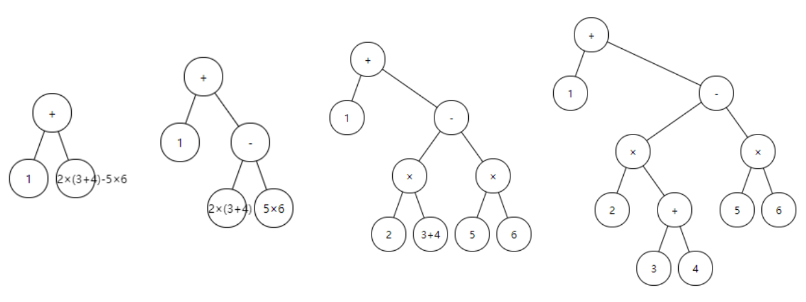
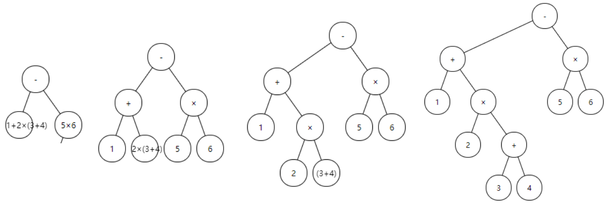

# 基本概念

## 表达式

1. 算术表达式（数值表达式）：数学公式
2. 逻辑表达式：结果为true或者false

## 操作符和操作数

一个表达式通常由操作数和操作符组成：

* 操作数：数值或者变量
* 操作符：
  * 根据表达式可以分为算术操作符、逻辑操作符
  * 根据操作数可以分为单目、双目、三目
  

## 中缀表达式、前缀表达式、后缀表达式

操作符存在优先级，例如“先乘除、后加减，如果有括号先计算括号内的表达式”。

传统的中缀表达式对于人来说比较容易理解，但是计算机难以理解，因此诞生了前缀表达式和后缀表达式，只需要按顺序加载计算。

* 中缀表达式（中缀记法）：即常见的表达式，运算符在两个操作数中间。例如`(3 + 4) * 5 - 6`
* 前缀表达式（波兰式）：运算符在操作数之前，按照优先级排好了计算顺序，并且消除了括号。例如`- * + 3 4 5 6`
* 后缀表达式（逆波兰式：RPN，Reverse Polish Notation）：运算符在操作数之后，按照优先级排好了计算顺序，并且消除了括号。例如`3 4 + 5 * 6 -`

> 这里暂时不考虑阶乘之类的单目符号

# 表达式计算

```java
public class CalculatorUtil {
    private static boolean isOperator(String ch) {
        return ch.matches("[+\\-*/]");
    }

    private static int getPriority(String operator) {
        switch (operator) {
            case "+":
            case "-":
                return 1;
            case "*":
            case "/":
                return 2;
        }
        return -1;
    }

    private static int calculate(int num1, int num2, String operator) {
        switch (operator) {
            case "+":
                return num2 + num1;
            case "-":
                return num2 - num1;
            case "*":
                return num2 * num1;
            case "/":
                return num2 / num1;
        }
        return 0;
    }
}
```

先定义几个辅助方法，下面从易到难介绍几种计算方式。

**这里暂时不考虑小数点，并且假设参数和表达式合法。**

## 后缀表达式计算

用到一个数栈就够了，只需要遍历表达式，遇到数字直接入栈，遇到符号直接出栈两个数字进行运算，将结果再入栈，直到表达式遍历结束，栈中就剩下一个数字就是计算结果

步骤：使用一个辅助栈，从前往后遍历，遇到操作数直接入栈，遇到运算符，则弹出栈顶两个数字进行运算，并将结果入栈，最后弹出栈顶的数即可。

```java
public class CalculatorUtil {
    /**
     * 后缀表达式计算
     * @param expr 假设按列表拆分，避免遍历拼接数字。
     */
    private static int calcSuffix(List<String> expr) {
        Stack<Integer> numStack = new Stack<>();
        for (int i = 0; i < expr.size(); i++) {
            String ch = expr.get(i);
            if (isOperator(ch)) {
                int num1 = numStack.pop();
                int num2 = numStack.pop();
                int res = calculate(num1, num2, ch);
                numStack.push(res);
            } else {
                numStack.push(Integer.parseInt(ch));
            }
        }
        return numStack.pop();
    }
}
```

## 前缀表达式计算

同后缀表达式，不过需要从右往左遍历。

```java
public class CalculatorUtil {
    /**
     * 前缀表达式计算
     * @param expr 假设按列表拆分，避免遍历拼接数字。
     */
    private static int calcPrefix(List<String> expr) {
        Stack<Integer> numStack = new Stack<>();
        //前缀表达式从右往左遍历
        for (int i = expr.size() - 1; i >= 0; i--) {
            String ch = expr.get(i);
            if (isOperator(ch)) {
                int num1 = numStack.pop();
                int num2 = numStack.pop();
                //注意：这里num1和num2要交换一下
                int res = calculate(num2, num1, ch);
                numStack.push(res);
            } else {
                numStack.push(Integer.parseInt(ch));
            }
        }
        return numStack.pop();
    }
}
```

相比之下，后缀表达式实现起来更容易，且便于理解，所以一般采用中缀转后缀计算。另外一个好处是，**中缀转后缀的过程中，可以边转换边计算**。

> 例如我们平常写表达式的代码，编译器和解释器基本都是转为后缀表达式进行计算。

## 中缀表达式计算

步骤：

1. 初始化两个栈，一个是符号栈s1，一个是操作数栈s2
2. 从左到右扫描中缀表达式
3. 遇到操作数直接入栈s2，需要遍历拼接数字
4. 遇到运算符时，比较其与栈顶运算符的优先级
   1. 当栈为空，或者栈顶为左括号时，则将运算符入栈s1
   2. 当优先级大于栈顶运算符时，将运算符入栈s1
   3. 当优先级小于等于栈顶运算符时，就弹出栈顶运算符和两个操作数进行计算，并将计算结果压入数栈s2，直到栈为空或当前运算符优先级大于栈顶运算符优先级，将当前运算符加入符号栈s1。
5. 遇到括号时
   1. 如果是左括号，直接入栈s1；
   2. 如果是右括号，依次弹出s1中的运算符和两个操作数进行计算，并将计算结果压入数栈s2，直到遇见左括号为止，此时将一对括号丢弃。
6. 直到整个表达式遍历结束，再将s1中剩余的运算符依次弹出，和两个操作数进行计算，并将计算结果压入数栈s2。直到符号栈为空，此时栈顶的数字就是表达式的计算结果。

```java
public class CalculatorUtil {
    private static int calcInfix(String expr) {
        final Stack<Integer> numStack = new Stack<>();
        final Stack<String> operatorStack = new Stack<>();
        for (int i = 0; i < expr.length(); i++) {
            //全部转换为String进行处理，避免用char判断ASCII编码
            String ch = String.valueOf(expr.charAt(i));
            if ("(".equals(ch)) {
                operatorStack.push(ch);
            } else if (")".equals(ch)) {
                while (!operatorStack.isEmpty()) {
                    String operator = operatorStack.pop();
                    if ("(".equals(operator)) {
                        break;
                    }
                    int num1 = numStack.pop();
                    int num2 = numStack.pop();
                    int res = calculate(num1, num2, operator);
                    numStack.push(res);
                }
            } else if (isOperator(ch)) {
                while (!operatorStack.isEmpty() && getPriority(ch) <= getPriority(operatorStack.peek())) {
                    int num1 = numStack.pop();
                    int num2 = numStack.pop();
                    String operator = operatorStack.pop();
                    int res = calculate(num1, num2, operator);
                    //计算中间结果，压入操作数栈
                    numStack.push(res);
                }
                operatorStack.push(ch);
            } else {
                //遍历拼接数字
                StringBuilder numStr =new StringBuilder();
                int j = i;
                while (j < expr.length() && Character.isDigit(expr.charAt(j))) {
                    numStr.append(expr.charAt(j));
                    j++;
                }
                i = j - 1;
                int num = Integer.parseInt(numStr.toString());
                numStack.push(num);
            }
        }
        //弹出剩余的符号进行计算
        while (!operatorStack.isEmpty()) {
            int num1 = numStack.pop();
            int num2 = numStack.pop();
            String operator = operatorStack.pop();
            int res = calculate(num1, num2, operator);
            numStack.push(res);
        }
        return numStack.pop();
    }
}
```

## 中缀表达式转后缀表达式

步骤：

1. 初始化两个栈，一个是符号栈s1，一个是结果栈s2
2. 从左到右扫描中缀表达式
3. 遇到操作数直接入栈s2
4. 遇到运算符时，比较其与栈顶运算符的优先级
   1. 当栈为空，或者栈顶为左括号时，则将运算符入栈s1
   2. 当优先级大于栈顶运算符时，将运算符入栈s1
   3. 当优先级小于等于栈顶运算符时，就弹出栈顶运算符压入s2，直到栈为空或当前运算符优先级大于栈顶运算符优先级，将当前运算符压入栈s1
5. 遇到括号时
   1. 如果是左括号，直接入栈s1；
   2. 如果是右括号，依次弹出s1中的运算符压入s2，直到遇见左括号为止，此时将一对括号丢弃
6. 直到整个表达式遍历结束，再将s1中剩余的运算符依次弹出压入s2
7. 此时将s2中元素依次弹出，再**逆序**即为后缀表达式。（可以使用队列简化，依次弹出队头元素）

> 过程和中缀表达式计算类似，只是不需要计算中间结果，而是将操作符直接加入结果栈中。并且最后需要逆序输出。

```java
public class CalculatorUtil {
    /**
     * 中缀表达式转后缀表达式
     */
    public static String infixToSuffix(String expr) {
        //由于最后需要逆序输出栈内元素，可以简化为使用队列
        Deque<String> res = new LinkedList<>();
        Stack<String> operatorStack = new Stack<>();
        for (int i = 0; i < expr.length(); i++) {
            String ch = String.valueOf(expr.charAt(i));
            if ("(".equals(ch)) {
                operatorStack.push(ch);
            } else if (")".equals(ch)) {
                while (!operatorStack.isEmpty()) {
                    String operator = operatorStack.pop();
                    if (operator.equals("(")) {
                        break;
                    }
                    res.push(operator);
                }
            } else if (isOperator(ch)) {
                while (!operatorStack.isEmpty() && getPriority(ch) <= getPriority(operatorStack.peek())) {
                    String operator = operatorStack.pop();
                    //直接将运算符压入结果栈
                    res.push(operator);
                }
                operatorStack.push(ch);
            } else {
                StringBuilder numStr = new StringBuilder();
                int j = i;
                while (j < expr.length() && Character.isDigit(expr.charAt(j))) {
                    numStr.append(expr.charAt(j));
                    j++;
                }
                i = j - 1;
                res.push(numStr.toString());
            }
        }
        while (!operatorStack.isEmpty()) {
            String operator = operatorStack.pop();
            res.push(operator);
        }
        StringBuilder sb = new StringBuilder();
        while (!res.isEmpty()) {
            sb.append(res.pollLast());
        }
        return sb.toString();
    }
}
```

## 边界情况

上面的案例中没有处理边界情况和异常情况等，例如

1. 表达式中第一个数为负数，此时`-`只有单目，少了一个操作数：可以在表达式开头补0，或者提前将0压入操作数栈
2. 括号内的第一个数为负数：需要将`(-`替换为`(0-`
3. 小数点后面没有数字的话要补0，例如3.==>3.0，或者判断非法
4. 忽略所有空格

# 中缀表达式转二叉树

步骤：

1. 找到优先级最低的操作符，作为根结点，运算符两边的表达式分别为左右子树
2. 继续拆分左右子树
3. 最终叶子结点一定是操作数，根节点是操作符
4. **此时二叉树前序遍历即前缀表达式，后序遍历即后缀表达式**

以`1 + 2 ∗ (3 + 4) − 5 * 6`为例

先拆分+，如图



* 前缀表达式：`[+, 1, -, *, 2, +, 3, 4, *, 5, 6]`
* 后缀表达式：`[1, 2, 3, 4, +, *, 5, 6, *, -, +]`

先拆分-，如图



- 前缀表达式：`[-, +, 1, *, 2, +, 3, 4, *, 5, 6]`
- 后缀表达式：`[1, 2, 3, 4, +, *, +, 5, 6, *, -]`

通过上一节的代码计算出结果均为15，可以看出"两个操作符优先级相同时，先拆分哪一个都行"

> 建议先拆分靠后的运算符，作为根节点：按照上一节"中缀转后缀"的计算方式，靠后的运算符会被放到栈顶，最后逆序输出，因此最后的运算符是根节点。

```java
public class CalculatorUtil {
    public static void main(String[] args) {
        System.out.println("calcInfix: (1+2*(3+4)-5*6) = " + calcInfix("1+2*(3+4)-5*6"));
        System.out.println("infixToSuffix: (1+2*(3+4)-5*6) = " + infixToSuffix("1+2*(3+4)-5*6"));

        System.out.println("calcSuffix: (1 2 3 4 + * 5 6 * - +) = " + calcSuffix(Arrays.asList("1 2 3 4 + * 5 6 * - +".split(" "))));
        System.out.println("calcPrefix: (- + 1 * 2 + 3 4 * 5 6) = " + calcPrefix(Arrays.asList("- + 1 * 2 + 3 4 * 5 6".split(" "))));

        System.out.println("calcSuffix: (1 2 3 4 + * + 5 6 * -) = " + calcSuffix(Arrays.asList("1 2 3 4 + * + 5 6 * -".split(" "))));
        System.out.println("calcPrefix: (+ 1 - * 2 + 3 4 * 5 6) = " + calcPrefix(Arrays.asList("+ 1 - * 2 + 3 4 * 5 6".split(" "))));
    }
}
```

# 计算器APP

开发计算器APP时，可以限制输入，防止出现非法表达式，梳理了部分限制逻辑

1. `+、*、/`不能在开头或者是`(`后
2. 不能有两个连续运算符，连续输入两次运算符要覆盖掉前一个
3. `(`只能在运算符和`(`之后。`)`只能在操作数或者`)`之后，且数量不超过`(`
4. `)`后面不能是数字
5. 一个操作数不能有两个小数点`.`
6. 小数点后要接数字
7. 操作数为0，后面不能再加0
8. 全部退格之后，空字符串显示0
9. 不合法表达式按`=`无响应
10. 操作符前后可以加空格，避免遍历查找操作数，例如(12+34)==>( 12 + 34 )，计算的时候可以直接按空格分割

