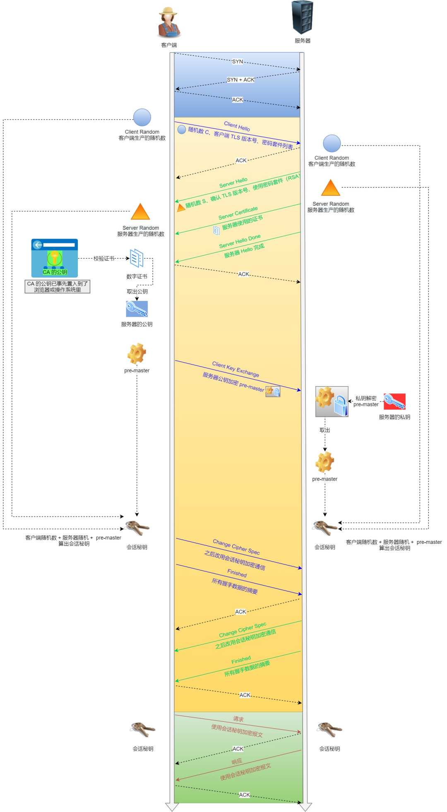

1. 在HTTP和TCP之间加入了SSL/TLS安全协议，使得HTTP报文能够加密传输
2. HTTPS除了TCP三次握手之外，还需要进行SSL/TLS的握手过程
3. HTTP端口号是80，HTTPS端口号是443
4. 需要向CA申请数字证书，验证服务器身份是可信的

证书申请：

1. 服务器将证书明文（包括域名、公司信息、服务器公钥、签名时使用的hash算法）等信息发给CA机构
2. CA机构对明文进行hash，并使用自己的私钥hash值进行加密，得到数字签名，颁发给服务器（即证书包含明文+数字签名）
3. 客户端内置CA的公钥，对加密的hash值（数字签名）进行解密得到A，再对证书明文进行hash运算得到B，A和B相等，则表示证书没有被篡改，否则提示不可信

证书包含多级链条，如果客户端没有找到对应的证书，则查找上级证书，直到根证书，一层层向下担保，顶级证书向下授权

# HTTPS连接过程

SSL/TLS是四次握手

1. 客户端发出请求：
   1. 客户端支持的SSL/TLS协议版本
   2. 客户端支持的加密算法（例如RSA）
   3. 生成随机数Client-Random
2. 服务端响应：
   1. 确认SSL/TLS版本是否支持，如果不支持，则关闭加密通信
   2. 确认使用的加密算法
   3. 生成随机数Server-Random
   4. 服务端发送数字证书
3. 客户端解析数字证书，通过浏览器或系统中的CA公钥，检查证书机构、日期，判断证书来源是否和发等。
   1. 客户端从数字证书中取出公钥
   2. 客户端生成随机数（pre-master key），使用双方协商的加密算法，将pre-masters和随机值Client-Random、Server-Random加密生成会话密钥
   3. 客户端将pre-master key使用公钥加密，发给服务端
   4. 客户端通过会话密钥加密消息，验证服务端是否能正常接收
4. 服务端使用私钥解密获得pre-master key密钥，和随机值1、2生成会话密钥
   1. 服务端同样返回加密消息，如果客户端能够接收，则表示SSL连接建立

HTTPS采用对称加密和非对称加密混合方式：

1. 非对称加密：握手过程中交换会话密钥。
2. 对称加密：使用会话密钥加密明文数据。

HTTPS：无法防止中间人攻击，除非客户端中预置证书，用本地证书的数字签名校验服务器下发证书的数字签名

https协议只能保证传输过程是安全的，中间人即使截获了数据，也不能知道里面的信息

中间人攻击（Man-in-the-MiddleAttack）：在客户端和服务器之间，窃听和篡改数据，转发客户端请求。

在黑客攻击、拒绝服务攻击、服务器劫持等方案几乎起不到什么作用。

1. 黑客攻击：服务器被侵入时，同样能获取到数据
2. 拒绝服务攻击（分布式DOS攻击）：发出大量无效请求，消耗服务器资源
3. 服务器劫持：使用ARP欺骗或DNS欺骗，将客户端请求转发或重定向到钓鱼网站
   1. 本地DNS劫持：修改服务器DNS设置
   2. 流氓DNS服务器：修改DNS服务器记录
   3. 路由器DNS劫持
4. 当CA机构不可信时，中间人攻击同样可行

过程原理：

1. 本地请求被劫持（如DNS劫持等），所有请求均发送到中间人的服务器
2. 中间人服务器返回中间人自己的证书
3. 客户端创建随机数，通过中间人证书的公钥对随机数加密后传送给中间人，然后凭随机数构造对称加密对传输内容进行加密传输
4. 中间人因为拥有客户端的随机数，可以通过对称加密算法进行内容解密
5. 中间人以客户端的请求内容再向正规网站发起请求
6. 因为中间人与服务器的通信过程是合法的，正规网站通过建立的安全通道返回加密后的数据
7. 中间人凭借与正规网站建立的对称加密算法对内容进行解密
8. 中间人通过与客户端建立的对称加密算法对正规内容返回的数据进行加密传输
9. 客户端通过与中间人建立的对称加密算法对返回结果数据进行解密

由于缺少对证书的验证，所以客户端虽然发起的是 HTTPS 请求，但客户端完全不知道自己的网络已被拦截，传输内容被中间人全部窃取

中间人容易被冒充吗？

> 除非CA机构不可信，否则无法被冒充。
>
> 访问谷歌，百度能够冒充中间人监听吗？
>
> 百度有自己的合法证书，证书中包含域名信息，证书颁发的时候需要百度在域名系统上确认。
>
> 客户端检查证书的域名和目标的域名不一致，也会提示不可信任，如果用户选择了信任，那还是能够被监听，但这不属于https本身的问题。

# Https可以被抓包吗

## Https抓包总结

1、HTTPS 不是单独的一个协议，它是 HTTP + SSL/TLS 的组合；

2、TLS 是传输层安全性协议，它会对传输的 HTTP 数据进行加密，使用非对称加密和对称加密的混合方式；

3、抓包工具的原理就是“伪装“，对客户端伪装成服务器，对服务器伪装成客户端；

4、使用抓包工具抓 HTTPS 包必须要将抓包工具的证书安装到客户端本地，并设置信任；

5、HTTPS 数据只是在传输时进行了加密，而抓包工具是接收到数据后再重新加密转发，所以抓包工具抓到的 HTTPS 包可以直接看到明文；

## 用了 HTTPS 会被抓包吗？

1、HTTPS 的数据是加密的，常规下抓包工具代理请求后抓到的包内容是加密状态，无法直接查看。但是，正如前文所说，浏览器只会提示安全风险，如果用户授权仍然可以继续访问网站，完成请求。因此，只要客户端是我们自己的终端，我们授权的情况下，便可以组建中间人网络，而抓包工具便是作为中间人的代理。

2、通常HTTPS抓包工具的使用方法是会生成一个证书，用户需要手动把证书安装到客户端中，然后终端发起的所有请求通过该证书完成与抓包工具的交互，然后抓包工具再转发请求到服务器，最后把服务器返回的结果在控制台输出后再返回给终端，从而完成整个请求的闭环。

## 既然 HTTPS 不能防抓包，那 HTTPS 有什么意义？

HTTPS可以防止用户在不知情的情况下通信链路被监听，对于主动授信的抓包操作是不提供防护的，因为这个场景用户是已经对风险知情。要防止被抓包，需要采用应用级的安全防护，例如采用私有的对称加密，同时做好移动端的防反编译加固，防止本地算法被破解。

# 结语

待整理：

https://mp.weixin.qq.com/s/fvvnQ3xI1nz-Ri3vBfG2lw

https://mbd.baidu.com/newspage/data/landingsuper?rs=3469628913&ruk=-0z0OzrK880oNILHs9dUEQ&isBdboxFrom=1&pageType=1&urlext=%7B%22cuid%22%3A%22luv1ug8hHt_jividg8HltY84H8_SO-8jg8vyi0u72u0na28F0iHA80iX1R0OfSOSrI8mA%22%7D&context=%7B%22nid%22%3A%22news_9874847962039145753%22%7D

https://www.cnblogs.com/hencins/p/9564011.html

https://mbd.baidu.com/newspage/data/landingsuper?rs=744666260&ruk=-0z0OzrK880oNILHs9dUEQ&isBdboxFrom=1&pageType=1&urlext=%7B%22cuid%22%3A%22luv1ug8hHt_jividg8HltY84H8_SO-8jg8vyi0u72u0na28F0iHA80iX1R0OfSOSrI8mA%22%7D&context=%7B%22nid%22%3A%22news_9510593537971324837%22%7D

https://zhuanlan.zhihu.com/p/269827927

https://blog.csdn.net/dh753655485/article/details/106945156

https://zhuanlan.zhihu.com/p/258334128

https://mp.weixin.qq.com/s/IYZrtK7pJTeCOBwY-sC9HA
