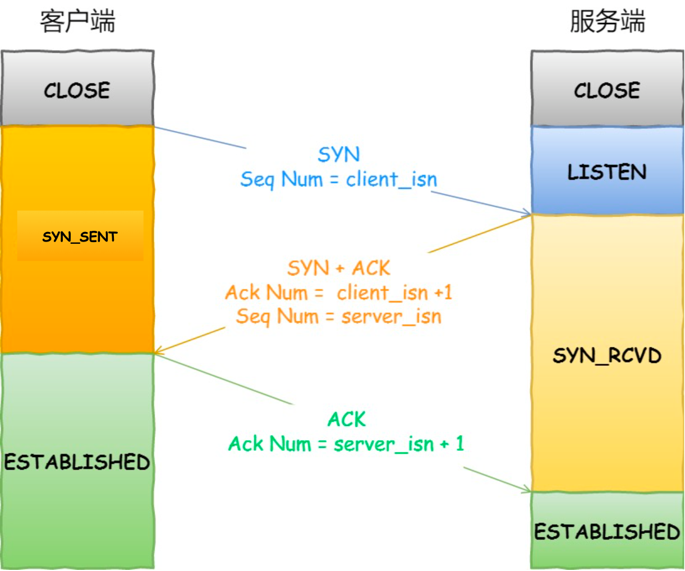
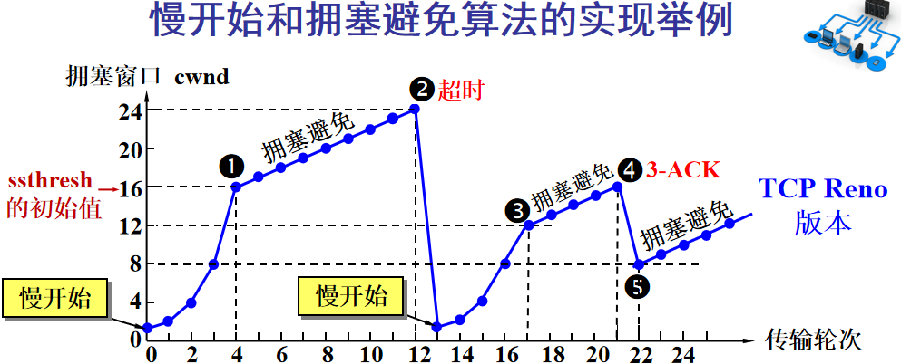
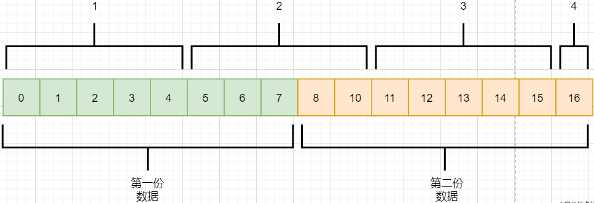

暂未整理，推荐阅读：[小林coding-图解网络介绍](https://xiaolincoding.com/network/)

https://mp.weixin.qq.com/s/G3np-WgQu3hZNICoso4X1w

https://baijiahao.baidu.com/s?id=1654225744653405133&wfr=spider&for=pc

https://mp.weixin.qq.com/s/G3np-WgQu3hZNICoso4X1w

https://blog.csdn.net/sinat_21112393/article/details/50810053

IP层不保证网络包是否完整以及按序交付，因此需要传输层控制

# TCP首部

序列号（seq）：发送数据的第一个字节的序号

确认号（ack）：期望收到对方下一个报文段的第一个数据字节的序号

> 例如序列号为301，如果数据长度是100字节，则下一个报文段的数据序号从401开始。
>
> 超过32位范围后，回到0

控制位：只占1位，0和1

* 同步SYN（Synchronization）：请求建立连接
* 确认ACK（Acknowledgetment）：确认已收到，TCP连接之后所有报文段ACK都为1
* 终止FIN（Finish）：请求释放连接
* 紧急URG（Urgent）：声明紧急指针字段是否有效
* 推送PSH（Push）：接收方收到PSH信号后，立即交给应用层处理，不用等到缓冲区填满
* 复位RST（Reset）：TCP连接出现错误，需要释放连接，重新建立连接。另外也用于拒绝非法报文段和拒绝连接

紧急指针：指出紧急数据位置，当URG为1时才有效。即使窗口为0，也可以发送紧急数据

首部长度：占4位，能表示的最大值为15，注意这里单位是4字节，因此最大能表示60字节的长度

选项：长度可变，最长为4字节。

**固定首部为20字节，选项长度可变**

x是客户端起始序列化号，y是服务端起始序列号，由发送方随机生成，没发送一次+1，用于解决包乱序问题

ack可以理解为希望对方回复的下一个序列号

TCP四元组：源地址、源端口、目标地址、目标端口

RTT

# 三次握手和四次挥手

## 三次握手

1. 客户端请求连接，发送：SYN=1，seq=x
2. 服务端响应连接，回复：SYN=1，ACK=1，seq=y，ack=x+1
3. 客户端确认，回复：ACK=1，seq=x+1，ack=y+1

为什么需要三次握手？

> 1. 如果是2次，服务端发出ACK后立马建立连接，此时发生拥塞客户端没有收到ACK，判断超时关闭并重新请求连接，服务端还保持着原来的连接
> 1. 或者客户端发出SYN超时，然后重发，服务端建立连接，等到网络恢复第一个SYN到达，服务端又建立了一次连接，而客户端已经Close了
> 2. 同步两端的序列号

## 四次挥手

1. 客户端发送FIN，请求断开连接，客户端不再发送数据，但还能接收数据
2. 服务端收到FIN包之后，回复ACK包，表示已经收到，但还需要等一下（避免客户端认为超时）
3. 此时服务端数据可能还没发完，因此需要继续发送，等待服务端剩余数据发完之后，发送FIN包，告诉客户端可以关闭了
4. 客户端收到FIN包之后，回复一个ACK包，告诉服务端已经收到了
5. 客户端等待2MSL之后关闭

> 如果服务端没有数据，有可能会出现第二次挥手和第三次挥手合并的情况

为什么要四次挥手？-->需要等待服务端剩余数据传完

1. 少于3次，服务端剩余数据没发送完
2. 如果是3次，FIN比数据先到达，客户端可能丢失B的数据

为什么需要等待2MSL（2个报文最大存活时长）？

1. B的FIN先到了，B的数据包还没发完，直接关闭的话客户端会丢失B的数据
2. A发出的ACK包丢失，B会重传FIN包，如果不等待B无法正常关闭（ACK存活1MSL，B重传的FIN报文存活1个MSL）

A和B打电话

1. A告诉B我有事要先撤了，你还有什么事情吗：FIN请求
2. B表示好的，但是先别挂，听我说完最后一个事情：回复ACK
3. B把该说的事情说了，告诉A就这些了：发送完剩余数据，请求FIN
4. A说好的，那你先挂吧：回复ACK
5. B听到之后就挂了：收到ACK，进入CLOSE状态
6. A等B挂了之后再挂电话：等2MSL，进入CLOSE状态

## **TCP三次握手**

PS：TCP协议中，主动发起请求的一端称为『客户端』，被动连接的一端称为『服务端』。不管是客户端还是服务端，TCP连接建立完后都能发送和接收数据。

起初，服务器和客户端都为CLOSED状态。在通信开始前，双方都得创建各自的传输控制块（TCB）。 
服务器创建完TCB后遍进入LISTEN状态，此时准备接收客户端发来的连接请求。

**第一次握手** 
客户端向服务端发送连接请求报文段。该报文段的头部中SYN=1，ACK=0，seq=x。请求发送后，客户端便进入SYN-SENT状态。

- SYN=1，ACK=0表示该报文段为连接请求报文。
- x为本次TCP通信的字节流的初始序号。TCP规定：SYN=1的报文段不能有数据部分，但要消耗掉一个序号。

**第二次握手**
服务端收到连接请求报文段后，如果同意连接，则会发送一个应答：SYN=1，ACK=1，seq=y，ack=x+1。 
该应答发送完成后便进入SYN-RCVD状态。

- SYN=1，ACK=1表示该报文段为连接同意的应答报文。
- seq=y表示服务端作为发送者时，发送字节流的初始序号。
- ack=x+1表示服务端希望下一个数据报发送序号从x+1开始的字节。

**第三次握手** 
当客户端收到连接同意的应答后，还要向服务端发送一个确认报文段，表示：服务端发来的连接同意应答已经成功收到。 
该报文段的头部为：ACK=1，seq=x+1，ack=y+1。 
客户端发完这个报文段后便进入ESTABLISHED状态，服务端收到这个应答后也进入ESTABLISHED状态，此时连接的建立完成！

**为什么连接建立需要三次握手，而不是两次握手？** 
防止失效的连接请求报文段被服务端接收，从而产生错误。

## **TCP四次挥手**

**第一次挥手** 
若A认为数据发送完成，则它需要向B发送连接释放请求。该请求只有报文头，头中携带的主要参数为： 
FIN=1，seq=u。此时，A将进入FIN-WAIT-1状态。

- FIN=1表示该报文段是一个连接释放请求。
- seq=u，u-1是A向B发送的最后一个字节的序号。

**第二次挥手** 
B收到连接释放请求后，会通知相应的应用程序，告诉它A向B这个方向的连接已经释放。此时B进入CLOSE-WAIT状态，并向A发送连接释放的应答，其报文头包含： 
ACK=1，seq=v，ack=u+1。

- ACK=1：除TCP连接请求报文段以外，TCP通信过程中所有数据报的ACK都为1，表示应答。
- seq=v，v-1是B向A发送的最后一个字节的序号。
- ack=u+1表示希望收到从第u+1个字节开始的报文段，并且已经成功接收了前u个字节。

A收到该应答，进入FIN-WAIT-2状态，等待B发送连接释放请求。

第二次挥手完成后，A到B方向的连接已经释放，B不会再接收数据，A也不会再发送数据。但B到A方向的连接仍然存在，B可以继续向A发送数据。

**第三次挥手** 
当B向A发完所有数据后，向A发送连接释放请求，请求头：FIN=1，ACK=1，seq=w，ack=u+1。B便进入LAST-ACK状态。

**第四次挥手** 
A收到释放请求后，向B发送确认应答，此时A进入TIME-WAIT状态。该状态会持续2MSL时间，若该时间段内没有B的重发请求的话，就进入CLOSED状态，撤销TCB。当B收到确认应答后，也便进入CLOSED状态，撤销TCB。

# TCP和UDP

|              | UDP                                        | TCP                                    |
| :----------- | :----------------------------------------- | :------------------------------------- |
| 是否连接     | 无连接                                     | 面向连接                               |
| 是否可靠     | 不可靠传输，不使用流量控制和拥塞控制       | 可靠传输，使用流量控制和拥塞控制       |
| 连接对象个数 | 支持一对一，一对多，多对一和多对多交互通信 | 只能是一对一通信                       |
| 传输方式     | 面向报文                                   | 面向字节流                             |
| 首部开销     | 首部开销小，仅8字节                        | 首部最小20字节，最大60字节             |
| 适用场景     | 适用于实时应用（IP电话、视频会议、直播等） | 适用于要求可靠传输的应用，例如文件传输 |

1. TCP在传输数据时，如何保证数据的可靠性
   * 连接管理：三次握手、四次挥手
   * 校验和：校验数据是否损坏
   * 序列号：用于检测丢失的分组（丢失数据）和冗余的分组（重传数据）
   * 确认应答：接收方告知发送方正确接收分组以及期望的下一个分组，否定确认（NACK，Negative-Acknowledgment）：接收方通知发送方未被正确接收的分组
   * 流量控制：滑动窗口
   * 拥塞控制：网络拥塞时减少数据发送
   * 累积确认：多个数据包，回复一次确认。避免网络充斥大量确认回复报文
   * 选择确认SACK：选项字段，一个报文段（多个报文）使用两个边界确定，选项字段有4个字节，左右边界各4位，因此最多可以表示4个已接受的报文段
   * 自动重传请求（ARQ，Automatic Repeat-Request）：
 2. 窗口和管道（用于增加信道的吞吐量）
3. 局域网内两台主机，一台主机去ping另一台主机的IP，其过程
   1. 路由器ARP找到对应的主机MAC

4. Android长连接的心跳机制：如何设计心跳时间，考虑哪些因素DHCP租期. NAT超时. 网络切换. 如何保证尽可能大的心跳时间 
5. UDP如何实现丢包重传策略？

Stop Wait：等待响应之后再发送下一个请求

# 重传机制

1. A发送数据包之后开始计时，超时没有收到确认回复，则认为发生丢包，再次发送
2. 前一个数据包超时，但能到达，重传之后会存在两个一样的数据包，接收方根据序列号判断属于重传数据还是新数据

随网络环境动态变化

RTT(Round-Trip Time，往返时延)：数据完全发送完到收到确认信号的时间。

RTT是动态的，重传时间每次RTTx2，到达一定阈值之后认为连接已断开。

`重传时间=2*RTT，RTT = previousRTT * i + (1 - i) * currentRTT`，i通常为90%，即新的RTT是以前的RTT值的90%加上当前RTT值的10%.

定时器（分组丢失则重传）

1. 重传计时器（Retransmission）：超时之前收到则取消计时，超时之后则重传数据，并复位计时器。
2. 坚持计时器（Persistent Timer）：当窗口大小为0时，启动计时，截止时发送探测报文段，有序号，但不需要确认。窗口为0之后过一段时间服务端会发送一个非0窗口大小的ACK用于更新窗口，但可能丢失，因此需要使用坚持计时器
3. 保活计时器（Keeplive Timer）：服务器每次收到客户信息，复位计时器，超时时间通常为2小时。连接建立完成之后一直没有数据，导致服务端一直保持该连接。
4. 时间等待计时器（Time_Wait Timer）：四次挥手之后客户端进入Time Wait状态，通常为2MSL

# 流量控制

接收方来不及处理发送方的数据，提示发送方降低速率，防止包丢失

# 拥塞控制

网络拥塞时，减少数据发送

慢启动阈值（ssthresh，slow start thresh）：处理拥塞的参照值（不是真正发生了拥塞），随着实际网络情况变化。

拥塞窗口（cwnd，Congestion Window）

1. **慢开始**：当cwnd < ssthresh时，cwnd以慢开始方式指数增长x2，设置较小的初始值
2. **拥塞避免**：当cwnd >= ssthresh时，cwnd以拥塞避免的方式线性增长+1，试探网络底线
3. 发送超时或者收到三个相同的ACK确认回复，表示网络拥塞，需要降低ssthresh阈值
4. **快重传**：收到丢包信息，客户端立即重传，不等到超时
5. **快恢复**：cwnd不是从1重新开始，而是从ssthresh开始继续拥塞避免

# 滑动窗口

客户端根据拥塞窗口和服务端接收窗口确认发送窗口大小：`swnd=min(rwnd, cwnd)`

接收端每次响应携带可用窗口大小

发送窗口（swnd，Send Window）

1. 已发送并收到确认
2. 已发送但未收到确认
3. 等待发送
4. 不允许发送

接收窗口（rwnd，Receive Window）：收到窗口外的数据则丢弃

1. 已回复确认，但是还没被应用层接收
2. 已经接收但是还没回复ACK
3. 允许接收区段
4. 不允许接收区段

# 其他问题

## 分块传输

数据包为什么要分成多个报文传输，而不是加上首部一次传输？

数据链路层限制数据长度只能有1460。

* 如果一次传输太多数据，失败之后需要重传整个数据包
* 如果数据包拆分太细，会使得首部占比过大。

## 路由转发

发送端到接收端存在多条路径。

1. 提高网络容错率：当中间某个路由坏了，可以走其他路径
2. 分流：当某一条线路拥挤，可以走其他路径

## 粘包和拆包

TCP从应用层拿到数据流，拆分成多个报文发送。TCP并不知道数据流是否来源于同一数据包。

* 粘包：两个文件的数据混在一起，形成一个报文
* 拆包：接收端收到报文之后，需要将数据拆开

解决思路：

1. 添加特殊的结束字符，接收端根据分割字符分离数据
2. 控制每个报文只包含一个文件数据，不足的用0填充

## 恶意攻击

客户端伪造IP同时发出大量请求，服务端维持大量无用的TCP连接或缓冲区，导致无法响应请求。

## 长连接

请求完之后不关闭TCP连接，避免每次请求都新建一个TCP连接。
