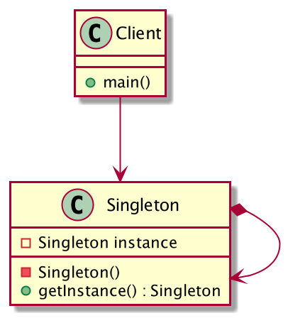

# 介绍

单例类通过在内部创建自己的实例，并提供给外部，保证外部访问的都是同一个对象。外部不需要实例化该类的对象（构造方法私有）

## 特点

* 自己创建自己的实例
* 将这个实例提供给外部
* 只能有一个实例

## 优点

* 减少内存开销，避免频繁创建和销毁实例
* 避免对资源的多重占用

## 缺点

* 与单一职责原则冲突：一个类应该只关心内部逻辑，而不关心外面怎么样来实例化。
* 没有接口，不能继承

## 类图



# 实现

## 饿汉式，线程安全

```java
public class Singleton {
    private static Singleton instance = new Singleton();  
    private Singleton () {}
    public static Singleton getInstance() {  
        return instance;
    }
}
```

依靠类加载机制的保证线程安全

缺点：类加载时进行实例化，可能会造成浪费

## 懒汉式，线程不安全

```java
public class Singleton {  
    private static Singleton instance;  
    private Singleton () {}  
    public static Singleton getInstance() {  
        if (instance == null) {  
            instance = new Singleton();  
        }  
        return instance;  
    }  
}
```

缺点：线程不安全，两个调用方同时进入null判断中，返回不同的对象

## 懒汉式，线程安全

```java
public class Singleton {  
    private static Singleton instance;  
    private Singleton () {}
    //使用synchronized加锁，影响效率
    public static synchronized Singleton getInstance() {  
        if (instance == null) {  
            instance = new Singleton();  
        }  
        return instance;  
    }  
}
```

缺点：每次调用都需要加锁，影响效率

## 双检锁/双重校验锁（DCL），线程安全

```java
public class Singleton {
    //volatile保证每次从内存中读取，跳过cpu缓存
    //正常情况下，线程从内存拷贝变量到cpu缓存，每个线程可能在不同的cpu上，变量的修改是不可见的，可能会造成数据不同步
    private volatile static Singleton singleton;  
    private Singleton () {}
    public static Singleton getSingleton() {  
    	if (singleton == null) {
        	synchronized (Singleton.class) {  
            	if (singleton == null) {  
                	singleton = new Singleton();  
            	}  
        	}  
    	}  
    	return singleton;  
    }  
}
```

DCL（Double-Checked Locking）：线程安全

* volatile：保证可见性（一个线程的修改对另一个线程可见），不能保证原子性，不会使线程阻塞，更轻量的同步机制
* synchronized：保证可见性和原子性

为什么synchronized中还要判一次空？

> 假设两个线程同时进入null，第一个线程创建完对象，第二个线程获得锁还会再创建一遍

只使用volatile，不加synchronized？

> volatile不能保证原子性
>
> 假设两个线程同时进入null，第一个线程创建完对象，第二个线程还会再创建一遍

只使用synchronized，不加volatile？

>使用volatile可以禁止指令重排，`singleton = new Singleton();`可以分为三步：
>
>1. 给对象分配内存空间
>2. 调用构造函数，初始化Singleton对象
>3. singleton变量指向分配的内存空间
>
>发生指令重排之后2、3步骤可能交换，此时另一个线程调用`getInstance`方法，判断不为空直接返回了，但是对象还没完成初始化

## 登记式/静态内部类，线程安全

```java
public class Singleton {  
    private Singleton (){}  
    public static final Singleton getInstance() {  
    	return SingletonHolder.INSTANCE;  
    }
    //通过静态内部类实现懒汉式加载
    //只有显示调用getInstance()时才会加载Holder类
    private static class SingletonHolder {  
    	private static final Singleton INSTANCE = new Singleton();  
    }
}
```

依靠类加载机制的保证线程安全，外部类被加载，内部类不会初始化，只有明确使用到内部类才会初始化。

**补充**

类加载的时机：和虚拟机有关，可能是饿汉式、也可能是懒汉式，并且受JLS保证（当有初始化需求时）

类的初始化，加载完类就进行初始化，可能由以下几种情况触发：

* 使用new关键字实例化对象，或者class.forName()反射
* get和set一个类的静态字段（被final修饰、已在编译期把结果放在常量池的静态字段除外）
* 调用一个类的静态方法

## 枚举

```java
public enum Singleton {  
    INSTANCE;
    public void whateverMethod() {  
    }
}
```

1. 线程安全
2. 调用方无法通过反射创建其他实例。

```java
public T newInstance(Object ... initargs) throws InstantiationException, IllegalAccessException,IllegalArgumentException, InvocationTargetException {
    ...
    //判断是否是枚举，如果是枚举的话，抛出异常
    if ((clazz.getModifiers() & Modifier.ENUM) != 0)
        throw new IllegalArgumentException("Cannot reflectively create enum objects");
    ...
    return inst;
}
```

# 枚举类原理

看个例子

```java
enum TIME_UNIT {  
    HOUR, MINUTE, SECOND;
}
```

反汇编查看汇编代码

```shell
$ javap -c TIME_UNIT
Compiled from "Main.java"
# 继承Enum<TIME_UNIT>抽象类
final class TIME_UNIT extends java.lang.Enum<TIME_UNIT> {
  # 将枚举编译成静态常量
  public static final TIME_UNIT HOUR;
  public static final TIME_UNIT MINUTE;
  public static final TIME_UNIT SECOND;
  
  # 生成一个$VALUES数组存储三个静态常量，并生成values方法
  public static TIME_UNIT[] values();
    Code:
       0: getstatic     #1                  // Field $VALUES:[LTIME_UNIT;
       3: invokevirtual #2                  // Method "[LTIME_UNIT;".clone:()Ljava/lang/Object;
       6: checkcast     #3                  // class "[LTIME_UNIT;"
       9: areturn
       
  # 生成valueOf方法，调用Enum父类的valueOf方法
  public static TIME_UNIT valueOf(java.lang.String);
    Code:
       0: ldc           #4                  // class TIME_UNIT
       2: aload_0
       3: invokestatic  #5                  // Method java/lang/Enum.valueOf:(Ljava/lang/Class;Ljava/lang/String;)Ljava/lang/Enum;
       6: checkcast     #4                  // class TIME_UNIT
       9: areturn

  # 实例化三个TIME_UNIT对象
  static {};
    Code:
       0: new           #4                  // class TIME_UNIT
       3: dup
       4: ldc           #7                  // String HOUR
       6: iconst_0
       7: invokespecial #8                  // Method "<init>":(Ljava/lang/String;I)V
      10: putstatic     #9                  // Field HOUR:LTIME_UNIT;
      13: new           #4                  // class TIME_UNIT
      16: dup
      17: ldc           #10                 // String MINUTE
      19: iconst_1
      20: invokespecial #8                  // Method "<init>":(Ljava/lang/String;I)V
      23: putstatic     #11                 // Field MINUTE:LTIME_UNIT;
      26: new           #4                  // class TIME_UNIT
      29: dup
      30: ldc           #12                 // String SECOND
      32: iconst_2
      33: invokespecial #8                  // Method "<init>":(Ljava/lang/String;I)V
      36: putstatic     #13                 // Field SECOND:LTIME_UNIT;
      39: iconst_3
      # 初始化一个长度为3的数组
      40: anewarray     #4                  // class TIME_UNIT
      43: dup
      44: iconst_0
      45: getstatic     #9                  // Field HOUR:LTIME_UNIT;
      48: aastore
      49: dup
      50: iconst_1
      51: getstatic     #11                 // Field MINUTE:LTIME_UNIT;
      54: aastore
      55: dup
      56: iconst_2
      57: getstatic     #13                 // Field SECOND:LTIME_UNIT;
      60: aastore
      61: putstatic     #1                  // Field $VALUES:[LTIME_UNIT;
      64: return
}
```

相当于下面的Java代码

```java
class TIME_UNIT extends Enum<TIME_UNIT> {
    public static final HOUR;
    public static final MINUTE;
    public static final SECOND;
    
    static {
      HOUR = new TIME_UNIT("HOUR", 0);
      MINUTE = new TIME_UNIT("MINUTE", 1);
      SECOND = new TIME_UNIT("SECOND", 2);
      $VALUES = new TIME_UNIT[3];
      $VALUES[0] = HOUR;
      $VALUES[1] = MINUTE;
      $VALUES[2] = SECOND;
    }
}
```

总结：

1. 枚举类会被编译成普通类，继承Enum抽象类，由于Java是单继承，因此枚举类无法继承其他类，但是可以实现接口
2. 枚举类中定义的枚举会被编译成静态常量，并在静态代码块中实例化枚举，并存入一个数组中
3. 生成`values()`和`valueOf()`方法
4. 枚举类中定义了多少个枚举，就有多少个实例对象，无法再通过new或反射来手动实例化

```java
public abstract class Enum<E extends Enum<E>> implements Comparable<E>, Serializable {
    private final String name;
    public final String name() {
        return name;
    }
    private final int ordinal;
    public final int ordinal() {
        return ordinal;
    }
    protected Enum(String name, int ordinal) {
        this.name = name;
        this.ordinal = ordinal;
    }
}
```

# 实例

`InputMethodManager.getInstance()`、`AccessibilityManager.getInstance()`：内部封装了getService

`EventBus.getDefault()`

`ARouter.getInstance()`