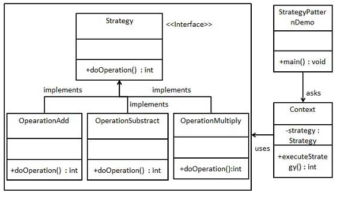
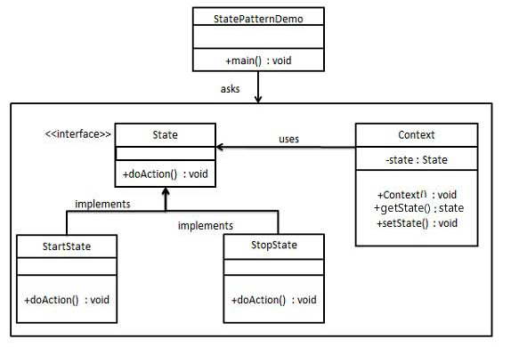

## 介绍



定义一套算法族，实现行为接口，对每一种行为进行封装。对象拥有某种行为接口，提供方法供外部动态替换行为。

### 优点

能够动态改变对象的行为，用户可以自己调用不同的行为、算法进行处理。增强了灵活性和可扩展性

### 缺点

每种算法需要定义相应的类

**补充**

可以与工厂模式配合使用，工厂模式用来创建具体的算法，避免多重条件判断

## 实现

- 定义一个策略接口（行为，算法）
- 定义不同实体类，实现策略接口
- 定义Context类，包含策略属性（面向接口），并执行相应的方法
- 外部通过创建具体的策略，传入Context中来实现动态替换对象（Context）的行为

```java
//飞的行为接口
public interface FlyBehavior {
    void fly();
}
//具体的飞的行为
public class FlyWithWings implements FlyBehavior {
    @Override
    public void fly() {
        System.out.println("Fly With Wings");
    }
}
public class FlyNoWay implements FlyBehavior {
    @Override
    public void fly() {
        System.out.println("Fly no way");
    }
}

//叫的行为接口
public interface QuackBehavior {
    void quack();
}
//具体的叫的行为
public class Quack implements QuackBehavior {
    @Override
    public void quack() {
        System.out.println("Quack");
    }
}
public class Squeak implements QuackBehavior {
    @Override
    public void quack() {
        System.out.println("Squeak");
    }
}
public class Mute implements QuackBehavior {
    @Override
    public void quack() {
        System.out.println("Mute");
    }
}
```

```java
//Context对象，抽象鸭子，拥有飞和叫的行为
public abstract class Duck {
    private FlyBehavior flyBehavior=new FlyWithWings();
    private QuackBehavior quackBehavior=new Quack();

    public void setFlyBehavior(FlyBehavior flyBehavior) {
        this.flyBehavior = flyBehavior;
    }

    public void setQuackBehavior(QuackBehavior quackBehavior) {
        this.quackBehavior = quackBehavior;
    }
    public abstract void display();
    public void fly(){
        flyBehavior.fly();
    }
    public void quack(){
        quackBehavior.quack();
    }
}
//具体的鸭子对象，对应具体的行为
//这部分是对策略模式的进一层封装，也可以由用户调用set方法动态更改Behavior
public class RedHeadDuck extends Duck {
    public RedHeadDuck() {
        setFlyBehavior(new FlyWithWings());
        setQuackBehavior(new Quack());
    }

    @Override
    public void display() {
        System.out.println("Red Head Duck");
    }
}
public class RubberDuck extends Duck {
    public RubberDuck() {
        setFlyBehavior(new FlyNoWay());
        setQuackBehavior(new Mute());
    }

    @Override
    public void display() {
        System.out.println("Rubber Duck");
    }
}
public class MallardDuck extends Duck {
    public MallardDuck() {
        setFlyBehavior(new FlyWithWings());
        setQuackBehavior(new Squeak());
    }

    @Override
    public void display() {
        System.out.println("Mallard Duck");
    }
}

```

```java
//主程序
public class RunStrategy {
    public static void main(String[] args) {
        //对策略模式的封装，将具体的行为封装到具体的对象中
        Duck duck=new RedHeadDuck();
        duck.display();
        duck.fly();
        duck.quack();
        duck=new MallardDuck();
        duck.display();
        duck.fly();
        duck.quack();
        duck=new RubberDuck();
        duck.display();
        duck.fly();
        duck.quack();
		//动态修改行为
        duck.setQuackBehavior(new Squeak());
        duck.quack();
    }
}

```


## 状态模式



```java
//状态接口
public interface GameState {
    void clickNewGame();
    void clickHelpItem();
    void clickReturnMenu();
    void clickSettingsItem();
    void clickExit();
}
//主菜单状态
public class MenuState implements GameState {
    Game game;

    public MenuState(Game game) {
        this.game = game;
    }

    @Override
    public void clickNewGame() {
        System.out.println("Start a new game");
        game.setCurrentState(game.getRunState());
    }

    @Override
    public void clickHelpItem() {
        System.out.println("Click to help");
        game.setCurrentState(game.getHelpState());
    }

    @Override
    public void clickReturnMenu() {
        System.out.println("it is menu state");
    }

    @Override
    public void clickSettingsItem() {
        System.out.println("Click Setting");
        game.setCurrentState(game.getSettingState());
    }

    @Override
    public void clickExit() {
        System.out.println("Click to exit");
        game.setCurrentState(game.getExitState());
    }
}
//帮助状态，用户只能点击返回菜单，不能做其他行为
public class HelpState implements GameState{
    Game game;

    public HelpState(Game game) {
        this.game = game;
    }

    @Override
    public void clickNewGame() {
        System.out.println("it is help state");
    }

    @Override
    public void clickHelpItem() {
        System.out.println("it is help state");
    }

    @Override
    public void clickReturnMenu() {
        System.out.println("Return menu");
        game.setCurrentState(game.getMenuState());
    }

    @Override
    public void clickSettingsItem() {
        System.out.println("it is help state");
    }

    @Override
    public void clickExit() {
        System.out.println("it is help state");
    }
}
//设置状态
public class SettingState implements GameState{
    Game game;

    public SettingState(Game game) {
        this.game = game;
    }

    @Override
    public void clickNewGame() {
        System.out.println("it is setting state");
    }

    @Override
    public void clickHelpItem() {
        System.out.println("it is setting state");
    }

    @Override
    public void clickReturnMenu() {
        System.out.println("Return menu");
        game.setCurrentState(game.getMenuState());
    }

    @Override
    public void clickSettingsItem() {
        System.out.println("it is setting state");
    }

    @Override
    public void clickExit() {
        System.out.println("it is setting state");
    }
}
//运行状态
public class RunState implements GameState{
    Game game;

    public RunState(Game game) {
        this.game = game;
    }

    @Override
    public void clickNewGame() {
        System.out.println("it is game state");
    }

    @Override
    public void clickHelpItem() {
        System.out.println("it is game state");
    }

    @Override
    public void clickReturnMenu() {
        System.out.println("Return menu");
        game.setCurrentState(game.getMenuState());
    }

    @Override
    public void clickSettingsItem() {
        System.out.println("it is game state");
    }

    @Override
    public void clickExit() {
        System.out.println("it is game state");
    }
}
```

```java
//Context对象拥有状态，且同一时间只由一种状态
public class Game {
    private GameState currentState=new MenuState(this);

    private GameState menuState=new MenuState(this);
    private GameState runState=new RunState(this);
    private GameState helpState=new HelpState(this);
    private GameState settingState=new SettingState(this);
    private GameState exitState=new ExitState(this);
    public void clickNewGame() {
        currentState.clickNewGame();
    }

    public void clickHelpItem() {
        currentState.clickHelpItem();
    }

    public void clickReturnMenu() {
        currentState.clickReturnMenu();
    }

    public void clickSettingsItem() {
        currentState.clickSettingsItem();
    }

    public void clickExit() {
        currentState.clickExit();
    }
    public String toString(){
        return "Game State: "+currentState.getClass().getSimpleName();
    }
    public GameState getMenuState() {
        return menuState;
    }

    public GameState getRunState() {
        return runState;
    }

    public GameState getHelpState() {
        return helpState;
    }

    public GameState getSettingState() {
        return settingState;
    }

    public GameState getExitState() {
        return exitState;
    }

    public GameState getCurrentState() {
        return currentState;
    }

    public void setCurrentState(GameState currentState) {
        this.currentState = currentState;
    }
}

```

```java
//主程序
public class Main {
    public static void main(String[] args) {
        Game game = new Game();
        System.out.println(game.toString());
        game.clickNewGame();
        game.clickHelpItem();
        game.clickReturnMenu();
        game.clickSettingsItem();
        game.clickReturnMenu();
        game.clickExit();
    }
}
```


## 策略模式和状态模式

uml类图相似，都能动态改变对象的行为。

状态模式的状态是自动切换的，由状态决定行为，用户无法改变逻辑，最多指定初始状态

策略模式是让用户指定更换的策略算法，动态替换算法

状态模式能够在对象内部改变行为，状态需要持有对象的引用（方法参数或者属性），通过调用对象setState，自动改变对象状态。


策略模式由用户在外部改变行为，策略不需要持有对象的引用。

通过状态模式和策略模式消除多重if……else：

策略模式将行为封装成策略，通过创建不同的策略并作为参数传给对象，代替条件判断，使用面向接口的方式，调用接口方法。

状态模式直接调用具体状态的方法，将条件行为移到状态中。

# 实例

Android动画的插值器和估值器

Glide中的缓存策略，可以自行实现DiskCache接口
