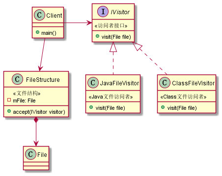
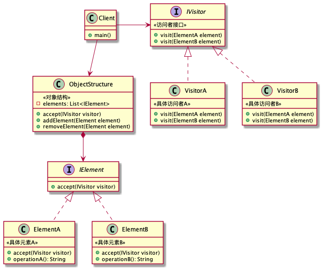

访问者模式号称最难的行为型模式。

# 引子1

## 文件扫描

一般的对象属性访问：**直接引用对象，获取对象属性并操作**。

例如递归遍历扫描出`.java`文件

```java
private void scan(File dir, List<File> collection) {
    for (File file : dir.listFiles()) {
        if (file.isFile() && file.getName().endsWith(".java")) {
            collection.add(file);
        } else if (file.isDirectory()) {
            // 递归调用:
            scan(file, collection);
        }
    }
}
```

如果以后需要新增操作，例如要求扫描出`.class`文件或者删除文件，需要重复写扫描逻辑，或者在原来的代码基础上添加条件处理。当操作逐渐增加，if-else的判断和方法需要的参数就会越来越多，且代码没法复用。

## 函数式接口

为了复用扫描逻辑：可以使用函数式编程的思想，由外部传入操作函数。例如`file -> {}`，在java中即接口。

java提供了一些默认的**函数式接口**（`@FunctionInterface`）：如`Consumer`、`Function`、`Runnable`、`Supplier`、`Predicate`等

```java
public class OriginFunction {
    @Test
    public void test() {
        List<File> list = new ArrayList<>();
        scan(new File("./"), new Consumer<File>() { //函数式接口，IDE可以转为Lambda函数
            @Override
            public void accept(File file) {
                list.add(file);
            }
        });
        System.out.println(list);
    }
    private void scan(File dir, Consumer<File> consumer) {
        for (File file : dir.listFiles()) {
            if (file.isFile() && file.getName().endsWith(".java")) { //条件判断可以放到Consumer中
                consumer.accept(file);
            } else if (file.isDirectory()) {
                scan(file, consumer);
            }
        }
    }
}
```

> 条件判断可以放到Consumer中

1. 根据面向对象的思想，我们把扫描逻辑封装到一个对象结构类ObjectStructure中，方便复用。
2. Consumer只有一个方法，一种类型参数，对象结构复杂的时候无法使用，参考Consumer定义需要的接口IVisitor。匿名内部类改为具体子类实现

经过改造后代码如下

## 抽象访问者

使用访问者模式实现上面的文件扫描功能

```java
public class Visitor1 {
    //定义访问者接口
    private interface IVisitor {
        // 访问文件夹:
        void visitDir(File dir);
        // 访问文件:
        void visitFile(File file);
    }
    //定义JavaFileVisitor处理java文件
    private class JavaFileVisitor implements IVisitor {
        public void visitDir(File dir) {
        }
        public void visitFile(File file) {
            if (file.getName().endsWith(".java")) {
                System.out.println("Found java file: " + file);
            }
        }
    }
    //定义ClassFileVisitor处理class文件
    private class ClassFileVisitor implements IVisitor {
        public void visitDir(File dir) {
        }

        public void visitFile(File file) {
            if (file.getName().endsWith(".class")) {
                System.out.println("Found class file: " + file);
            }
        }
    }
    //定义文件夹和文件数据结构
    private class FileStructure {
        // 文件对象
        private File path;
        public FileStructure(File path) {
            this.path = path;
        }
        public void accept(IVisitor visitor) {
            scan(this.path, visitor);
        }
        private void scan(File file, IVisitor visitor) {
            if (file.isDirectory()) {
                // 让访问者处理文件夹:
                visitor.visitDir(file);
                for (File sub : file.listFiles()) {
                    // 递归处理子文件夹:
                    scan(sub, visitor);
                }
            } else if (file.isFile()) {
                // 让访问者处理文件:
                visitor.visitFile(file);
            }
        }
    }
    @Test
    public void test() {
        FileStructure fs = new FileStructure(new File("./"));
        IVisitor javaVisitor = new JavaFileVisitor();
        IVisitor classVisitor = new ClassFileVisitor();
        fs.accept(javaVisitor);
        fs.accept(classVisitor);
    }
}
```

同样的，如果要删除文件或者做其他操作，可以通过增加访问者的方式处理

是不是感觉还不如加个`if-else`判断？

> 其实不然，上面的逻辑比较简单。
>
> 假设一个地方要扫描找出Java文件，另一个地方要扫描并删除Java文件，这个时候就没法用后缀名进行判断了。
>
> 这个时候一般人的做法就是加个flag标记，判断是要找出还是要删除。
>
> 假设又有一个地方需要扫描java文件并修改呢？
>
> 另外如果操作复杂，if中会堆积大量业务逻辑，如果操作耗时，还需要在if中`new Thread`增加大量嵌套。
>
> 这样写的代码显然是没法复用的。
>
> 经过上面的改造后，具有如下优势：
>
> 1. 当条件变复杂时，仍然具有较高的可读性
> 2. 当if中的操作复杂时，逻辑集中在一个类中，而不是包在一个大括号中
> 2. 当if中的操作耗时时，可以给特定访问者的特定方法新建子线程，避免嵌套过多。
> 3. 代码可复用性强，可以灵活搭配不同的访问者

思考：上面的写法真的是访问者模式吗？



> 看下类图，顶多只能算观察者模式或者策略模式。注册了监听器（Visitor），并且回调visit方法。
>
> 只有这样的话当然称不上最难的设计模式。

## 抽象元素

上面文件扫描是用了Java封装好的类，里面已经做了很多事情。假设需要使用我们自己定义的类。

我们先定义一个`BaseFile`类，再给`File`和`Directory`定义两个子类，分别有各自的特征方法，例如文件可以有后缀名，目录类可以有子文件

> 子类的作用就是对父类进行扩展，不同的子类有不同的特征

```java
public class Visitor2 {
    //文件基类，定义为抽象类或接口
    private abstract class BaseFile {
        private String name;
        public BaseFile(String name) {
            this.name = name;
        }
        public String getName() {
            return name;
        }
        @Override
        public String toString() {
            return name;
        }
    }
    //文件类
    private class RealFile extends BaseFile {
        public RealFile(String s) {
            super(s);
        }
        //文件类特征：可以有后缀名
        public String getSuffix() {
            return "";
        }
    }
    //目录类
    private class Directory extends BaseFile {
        public Directory(String s) {
            super(s);
        }
        //目录类特征：可以获取子文件数量
        public int getDirectChildCount() {
            return 0;
        }
    }
    //定义访问者接口
    private interface IVisitor {
        // 访问文件夹
        void visitDir(Directory dir);
        // 访问文件
        void visitFile(RealFile file);
    }
    //定义JavaFileVisitor处理java文件
    private class JavaFileVisitor implements IVisitor {
        public void visitDir(Directory dir) {
        }
        public void visitFile(RealFile file) {
            if (file.getName().endsWith(".java")) {
                System.out.println("Found java file: " + file);
            }
        }
    }
    //定义ClassFileVisitor处理class文件
    private class ClassFileVisitor implements IVisitor {
        public void visitDir(Directory dir) {
        }
        public void visitFile(RealFile file) {
            if (file.getName().endsWith(".class")) {
                System.out.println("Found class file: " + file);
            }
        }
    }
    //定义文件夹和文件数据结构
    private class FileStructure {
        // 文件对象：这里使用List直接存模拟的数据，否则无法构造子类对象。另外也更符合访问者模式特征
        private List<BaseFile> mFiles;
        public FileStructure(List<BaseFile> files) {
            mFiles = files;
        }

        public void accept(IVisitor visitor) {
            for (BaseFile file : mFiles) {
                //使用instanceof判断对象类型，调用不同的访问者方法
                if (file instanceof RealFile) {
                    visitor.visitFile((RealFile) file);
                } else if (file instanceof Directory) {
                    visitor.visitDir((Directory) file);
                }
            }
        }
    }
    @Test
    public void test() {
        List<BaseFile> files = new ArrayList();
        files.add(new RealFile("A.java"));
        files.add(new RealFile("B.class"));
        files.add(new Directory("C"));
        FileStructure fs = new FileStructure(files);
        IVisitor javaVisitor = new JavaFileVisitor();
        IVisitor classVisitor = new ClassFileVisitor();
        fs.accept(javaVisitor);
        fs.accept(classVisitor);
    }
}
```

注意到上面使用`instanceof`判断对象类型，调用不同的访问者方法。这么做每当新增一个子类，需要添加if判断，违背了开闭原则。思考如何优化？

> 这里需要介绍下**面向对象中的分派**的概念，见下文

思考：如果访问者接口定义`visit(BaseFile)`方法，然后把强转放到访问者中，这样做合适吗？

> 不合适，每个访问者都需要写一遍强转

## 双重分派

理解了面向对象中的分派之后，可以对文件扫描的代码再次进行改造

给`BaseFile`定义一个`accept`方法，利用两次调用实现双重分派

```java
public class Visitor3 {
    //文件基类，定义为抽象类或接口
    private abstract class BaseFile {
        private String name;
        public BaseFile(String name) {
            this.name = name;
        }
        public String getName() {
            return name;
        }
        @Override
        public String toString() {
            return name;
        }
        //定义抽象方法，由于父类this作为参数时使用的是静态类型，因此父类实现该方法没有意义，需要强制子类实现
        public abstract void accept(IVisitor visitor);
    }
    //文件类
    private class RealFile extends BaseFile {
        public RealFile(String s) {
            super(s);
        }
        @Override
        public void accept(IVisitor visitor) {
            visitor.visitFile(this);
        }
        //文件类特征：可以有后缀名
        public String getSuffix() {
            return "";
        }
    }
    //目录类
    private class Directory extends BaseFile {
        public Directory(String s) {
            super(s);
        }
        @Override
        public void accept(IVisitor visitor) {
            visitor.visitDir(this);
        }
        //目录类特征：可以获取子文件数量
        public int getDirectChildCount() {
            return 0;
        }
    }
    //定义访问者接口
    private interface IVisitor {
        // 访问文件夹
        void visitDir(Directory dir);
        // 访问文件
        void visitFile(RealFile file);
    }
    //定义JavaFileVisitor处理java文件
    private class JavaFileVisitor implements IVisitor {
        public void visitDir(Directory dir) {
        }
        public void visitFile(RealFile file) {
            if (file.getName().endsWith(".java")) {
                System.out.println("Found java file: " + file);
            }
        }
    }
    //定义ClassFileVisitor处理class文件
    private class ClassFileVisitor implements IVisitor {
        public void visitDir(Directory dir) {
        }
        public void visitFile(RealFile file) {
            if (file.getName().endsWith(".class")) {
                System.out.println("Found class file: " + file);
            }
        }
    }
    //定义文件夹和文件数据结构
    private class FileStructure {
        // 文件对象：这里使用List直接存模拟的数据，否则无法构造子类对象。另外也更符合访问者模式特征
        private List<BaseFile> mFiles;
        public FileStructure(List<BaseFile> files) {
            mFiles = files;
        }
        public void accept(IVisitor visitor) {
            for (BaseFile file : mFiles) {
                //通过两次调用，实现双重分派
                file.accept(visitor);
            }
        }
    }
    @Test
    public void test() {
        List<BaseFile> files = new ArrayList();
        files.add(new RealFile("A.java"));
        files.add(new RealFile("B.class"));
        files.add(new Directory("C"));
        FileStructure fs = new FileStructure(files);
        IVisitor javaVisitor = new JavaFileVisitor();
        IVisitor classVisitor = new ClassFileVisitor();
        fs.accept(javaVisitor);
        fs.accept(classVisitor);
    }
}
```

> 上面使用了不同名方法`visitDir和visitFile`，其实没有利用到双重分派，只是解决了`instanceof`的条件分支而已。
>
> 可以修改为重载`visit`方法，但是暂时没发现太明显的好处，只是更符合访问者模式的标准类图定义而已。

# 引子2

假设需要实现一个功能：对媒体文件，如jpg、png、gif、mp4等不同格式的文件，提取图片，进行合法性校验。

## 抽象元素

```java
public class Origin {
    //定义抽象基类或接口
    private abstract class MediaFile {
        String path;
        public MediaFile(String path) {
            this.path = path;
        }
    }
    private class Jpg extends MediaFile {
        public Jpg(String path) { super(path); }
    }
    private class Png extends MediaFile {
        public Png(String path) { super(path); }
    }
    private class Checker {
        public void check(MediaFile mediaFile) {
            //instanceof每次新增类型，都需要修改访问者代码，如果有多个访问者操作，需要修改多处
            if(mediaFile instanceof Jpg) {
                System.out.println("check jpg: " + mediaFile.path);
            } else if(mediaFile instanceof Png) {
                System.out.println("check png: " + mediaFile.path);
            }
        }
    }
    @Test
    public void test() {
        List<MediaFile> list = new ArrayList<>();
        list.add(new Jpg("A.jpg"));
        list.add(new Png("B.jpg"));
        Checker checker = new Checker();
        for (MediaFile mediaFile : list) {
            checker.check(mediaFile);
        }
    }
}
```

存在问题：instanceof每次新增类型，都需要修改访问者代码，如果有多个访问者操作，需要修改多处，不符合开闭原则

## 使用双重分派

```java
public class Visitor1 {
    private abstract class MediaFile {
        String path;
        public MediaFile(String path) {
            this.path = path;
        }
        public abstract void accept(Checker checker);
    }
    private class Jpg extends MediaFile {
        public Jpg(String path) { super(path); }

        @Override
        public void accept(Checker checker) {
            checker.check(this);
        }
    }
    private class Png extends MediaFile {
        public Png(String path) { super(path); }

        @Override
        public void accept(Checker checker) {
            checker.check(this);
        }
    }
    private class Checker {
        //重载方法，通过双重调用实现双重分派，避免instanceof
        public void check(Jpg jpg) {
            System.out.println("check jpg: " + jpg.path);
        }

        public void check(Png png) {
            System.out.println("check png: " + png.path);
        }
    }
    @Test
    public void test() {
        List<MediaFile> list = new ArrayList<>();
        list.add(new Jpg("A.jpg"));
        list.add(new Png("B.jpg"));
        Checker checker = new Checker();
        for (MediaFile mediaFile : list) {
            mediaFile.accept(checker);
        }
    }
}
```

存在问题：新增访问者，例如需要给每张图片加水印，新建WaterMaker类，文件类要新加`accept`方法

## 抽象访问者

访问者之间存在共性，即接收文件对象，因此可以提取接口

```java
public class Visitor2 {
    private abstract class MediaFile {
        String path;
        public MediaFile(String path) {
            this.path = path;
        }
        public abstract void accept(IVisitor visitor);
    }
    private class Jpg extends MediaFile {
        public Jpg(String path) { super(path); }
        @Override
        public void accept(IVisitor visitor) {
            visitor.visit(this);
        }
    }
    private class Png extends MediaFile {
        public Png(String path) { super(path); }
        @Override
        public void accept(IVisitor visitor) {
            visitor.visit(this);
        }
    }
    //定义访问者接口
    private interface IVisitor {
        void visit(Jpg jpg);
        void visit(Png png);
    }
    private class Checker implements IVisitor{
        public void visit(Jpg jpg) {
            System.out.println("check jpg: " + jpg.path);
        }
        public void visit(Png png) {
            System.out.println("check png: " + png.path);
        }
    }
    private class WaterMaker implements IVisitor{
        public void visit(Jpg jpg) {
            System.out.println("water maker jpg: " + jpg.path);
        }
        public void visit(Png png) {
            System.out.println("water maker png: " + png.path);
        }
    }
    @Test
    public void test() {
        List<MediaFile> list = new ArrayList<>();
        list.add(new Jpg("A.jpg"));
        list.add(new Png("B.jpg"));
        //可以添加多个访问者
        IVisitor checker = new Checker();
        IVisitor watermaker = new WaterMaker();
        for (MediaFile mediaFile : list) {
            mediaFile.accept(checker);
            mediaFile.accept(watermaker);
        }
    }
}
```

# 面向对象中的分派

变量有两种类型：被声明的类型是静态类型，也叫明显类型。变量引用的对象的类型是真实类型，也叫实际类型。

> 如`People man = new Man();`，变量man的静态类型是People，实际类型是Man
>
> 静态类型编译期就已经确定，无法变更。而变量引用的对象可以在运行时随时修改，因此实际类型是动态的。

分派：根据对象的类型选择执行的方法。根据确定时期可以分为两种：

1. 静态分派：根据变量的静态类型，在编译时期确定调用的方法，例如重载（编译时多态）
2. 动态分派：根据对象的真实类型，在运行时期动态的置换掉某个方法，例如重写（运行时多态）

```java
public class SampleAssign {
    private class Fruit {
        @Override
        public String toString() { //方法重写
            return "Fruit";
        }
    }

    private class Apple extends Fruit {
        @Override
        public String toString() {
            return "Apple";
        }
    }

    private class Banana extends Fruit {
        @Override
        public String toString() {
            return "Banana";
        }
    }

    public void eat(Fruit fruit) { //方法重载
        System.out.println("eat fruit");
    }

    public void eat(Apple apple) {
        System.out.println("eat apple");
    }

    public void eat(Banana banana) {
        System.out.println("eat banana");
    }

    @Test
    public void test() {
        Fruit apple = new Apple();
        Fruit banana = new Banana();
        eat(apple); //输出：eat fruit
        eat(banana); //输出：eat fruit
        //静态分派：根据对象的静态类型，编译时期就确定了调用的是参数为Fruit的方法，与具体的实例类型（Apple，Banana）无关
        
        String s1 = apple.toString(); //返回Apple
        String s2 = banana.toString(); //返回Banana
        //动态分派：根据对象的实际类型（Apple、Banana），选择调用哪个对象的方法
    }
}
```

如上，动态分派只会体现在方法的接收者（即变量引用的对象）上，而方法的参数类型则在编译期就进行了确定，不受实际类型影响。

我们把方法的接收者、方法的参数类型叫做方法的**宗量**。

> 这里不考虑方法名，只讨论同名方法（重写或者重载方法）。不同名方法毫无疑问编译时就已经确定，不需要根据变量类型进行分派。

* 单分派：根据一个宗量类型选择方法
* 多分派：根据多个宗量类型选择方法

**Java支持静态的多分派和动态的单分派**。但是可以通过代码设计**通过两次调用实现伪双重分派**（有些语言支持动态的双分派，没接触过）

> 编译时根据变量的静态类型、方法的参数选择调用的方法（多分派）
>
> 运行时根据变量的实际类型确定调用的方法（单分派）：**对同一个对象的真实类型测试仅会发生一次**

如果运行时也能根据参数类型确定调用的方法，那么就实现了运行时的**双重分派**。

那么如何在运行时判断方法的参数类型呢？

1. 通过类型判断：每次新增子类都需要添加if，不符合开闭原则。（这里没有双重分派，只是实现了运行时判断参数类型而已）

   ```java
   public void eat(Fruit fruit) {
       if(fruit instanceof Apple) {
           eat((Apple) fruit); //运行时判断参数类型选择eat方法
       } else if (fruit instanceof Banana) {
           eat((Banana) fruit);
       }
   }
   ```

2. 通过两次调用，传入this。还是上面的案例，给Fruit类加一个accept的方法，Apple重写该方法，Banana不重写，如下。

   ```java
   public class SampleAssign {
       private class Fruit {
           public void accept(SampleAssign obj) {//第一次分派：运行时选择子类实例的重写方法
               obj.eat(this); //第二次分派：传入this，根据Fruit类型选择eat重载方法
           }
       }
       private class Apple extends Fruit {
           public void accept(SampleAssign obj) {//第一次分派：运行时选择子类实例的重写方法
               obj.eat(this); //第二次分派：传入this，根据Apple类型选择eat重载方法
           }
       }
       private class Banana extends Fruit {
       }
       public void eat(Fruit fruit) { //方法重载
           System.out.println("eat fruit");
       }
       public void eat(Apple apple) {
           System.out.println("eat apple");
       }
       public void eat(Banana banana) {
           System.out.println("eat banana");
       }
       @Test
       public void test() {
           Fruit apple = new Apple();
           Fruit banana = new Banana();
           apple.accept(this); //输出eat apple
           banana.accept(this); //输出eat fruit
       }
   }
   ```

> * 第一次分派：运行时选择子类实例（**实际类型**）的重写方法
> * 第二次分派：传入this，根据**静态类型**选择eat重载方法（如果不重载eat方法，使用方法名区分就无法体现分派的意义）

思考：为什么子类一定要重写`accept`方法，父类中的this含义是什么？

> 父类中的this作为方法参数的时候，静态类型是父类自身，具体见[Java面向对象-this和super](/Java/面向对象.md)
>
> 侧面印证了参数判断使用的是静态类型
>
> 通过分派也能更好地理解重载和重写的区别：为什么一个叫编译时多态，一个叫运行时多态

# 访问者模式

将对数据的操作与数据结构进行分离，需要新增操作的时候，只需要新增访问者，不需要修改现有逻辑。

实现思路：对象结构类提供一个方法接收一个访问者，调用访问者方法，将自身或者自身的元素传给访问者。

> 对象层级较深，访问较复杂的时候，元素也可以接收访问者，递归地访问对象内部结构

使用场景：访问对象内部结构并进行处理。适用于数据结构稳定，但数据操作多变的情况（一个对象可以存在多种操作）。

## 类图



角色：

1. 抽象访问者
2. 具体访问者
3. 对象结构
4. 抽象元素
5. 具体元素

> 在简单的访问者模式中，抽象元素和具体元素可以去掉。此时类的结构与事件回调（观察者模式、策略模式）类似

## 优缺点

优点：

1. 扩展性强：容易新增不同的访问者
2. 灵活性、可复用性强：一个对象可以被多个访问者访问，一个访问者可以访问多个对象。可以灵活的搭配复用。甚至可以让元素直接`accept`访问者，不通过`ObjectStructure`
3. 符合单一职责：将不同的操作放到了不同的访问者中，每个访问者操作单一。另外客户端只负责连接对象和访问者，不需要再添加对象访问和操作的逻辑
3. 对数据结构的访问放到了对象内部，外部不需要重复写访问逻辑
3. 对数据结构的访问放到了对象内部，访问者不需要知道访问细节，只需要接收到元素处理即可。内部可以遍历访问、递归访问、前序、后续访问等，甚至可以不提供所有元素，根据条件过滤元素，只提供特定的某些元素给访问者，而访问者并不知道这是不是对象的所有元素。

缺点：

1. 数据结构变更比较困难：每新增一个元素类，都要增加新的visit接口方法，违背了开闭原则

2. 访问者需要实现所有Visitor接口，即使并不需要访问某个元素：可以定义一个默认访问者类，空实现所有方法，访问者继承默认访问者，只重写感兴趣的接口

3. 访问者依赖具体元素类，没有面向接口

   > 这一点在我看来不算缺点：
   >
   > 1. 一是因为要如果重载方法，参数必然是不同的子类。
   > 2. 二是具体元素类可能比抽象元素类扩展了一些行为，访问者可以调用具体元素的方法。例如上面的文件扫描案例，File可以获取后缀名，Directory可以获取子文件数量。

4. 破坏了类的封装：元素类需要知道访问者接口，违背迪米特法则

   > 关于这一点：网上的说法是“数据结构中的元素对访问者公布细节”：感觉不对，访问者本来就是要操作元素的，不知道元素细节如何操作呢？
   >
   > 因此我改成了上面的说法
   
5. 性能有一定影响：一次循环里面做多次操作改为多次循环里面做一次操作，会降低一些性能。由于有JIT优化，差异几乎可以忽略不计。这个时候代码可读性更加重要

> 一个梗：`O(kn)<=kO(n)`，k次操作

# 实例

现实生活中的访问者：

1. 我（访问者）到你家（对象）拜访，你先开门请我进去（accept）。再由你带我参观客厅、卧室、阳台等（内部定义访问元素的方式），我看到沙发之后坐了一会，到了书房之后看了会书（操作）。
2. 同样的，小明也到你家拜访，到了卫生间洗了个澡，到了卧室留下来睡了一晚（耗时操作），甚至还不小心砸了你家的一个杯子（同一个对象，不同的访问者，不同的操作）
3. 你带小明进厨房，小明给你做了顿饭，厨房需要`accept`访问者，并提供厨房里面的用具给小明使用。（访问者模式+组合模式：如果对象结构是树形，元素较复杂，包含其他子元素，此时元素也可以接收访问者，并提供子元素给访问者）
4. 我到小明家拜访，还是那么一套访问者行为。（访问者复用：多个对象可以被一个访问者访问和操作）
5. 我到你家不需要用卫生间，小明用了卫生间。（访问者模式+过滤器模式：并不需要操作对象结构内的所有元素）

类似的例子还有很多：

1. 不同的人到银行办理不同的业务
2. 不同的人到餐厅点不同菜
3. 一部电视剧中包含多个角色，不同的观众对他们有不同的评价
4. 公园有多个景点，不同的游客对不同的景点访问不同
5. 医生开的处方单包含不同的药品，药房人员根据处方单抓药，收银员根据处方单收费
5. ...

# 源码中的应用

（太长就不贴源码了）

最常见的就是在各种固定格式的文件解析访问中（xml结构、java文件结构、抽象语法结构），例如

1. SAX解析XML
1. `javax.lang.model`中的Element访问：一般用于APT生成代码。APT过程中如果想要修改抽象语法树，可以使用JCTree和TreeMaker：`JCTree = JavacElements.getTree(Element)`
3. Java AST（抽象语法树）访问
   1. `com.intellij.psi`中PSI（Program Structure Interface）框架：常用于Lint检查，提示错误。
   2. `org.jetbrains.uast`中UAST（Unified AST）框架：常用于Lint检查，提示错误。
   3. `com.sun.tools.javac.tree`中的JCTree：java抽象语法树，javac编译时会生成JCTree。结合APT在编译前端插入流程，可以访问抽象语法树，使用TreeMaker还可以修改抽象语法树

4. `java.nio.file`中文件树访问：`Files.walkFileTree()`。

> 注意包名：PSI和UAST是JetBrain IDE提供的，JCTree是sun提供的工具包（java官方），Files和Element都是java标准库的。

# 变种

标准的访问者模式其实较少见。大部分时候使用的是变种

1. 不使用列表容器存储元素，使用数组、Map存储元素，或者声明多个变量。对象内部可以用不同的方式访问元素（遍历、递归、迭代器、前序、后序访问，根据条件过滤元素）。
2. 元素不具备相同特性，无法抽象，不具备抽象元素，使用不同的变量存储元素。
3. 元素不接收访问者，使用`instanceof`判断元素类型，调用访问者不同名方法，或者强转调用访问者重载方法传入元素。
4. 不重载访问者方法，不同元素直接调用不同名方法。
5. 不需要对象结构，元素可以直接接收访问者。
6. 对象结构层级较深，元素中还包含子元素。

# 扩展

## 访问者模式与迭代器模式

访问者模式和迭代器模式都用于对象内部元素的访问，但二者关注的重点不相同：迭代器模式关心如何访问对象中元素，而访问者模式关心如何对对象中的元素进行操作。

访问者模式可以和迭代器模式一起使用：当对象结构是一个包含多个元素的容器，通过迭代器遍历元素，再通过参数传给访问者进行操作。

## 访问者模式与过滤器模式

访问者模式可以和过滤器模式（非GoF设计模式）一起使用：访问者有时候并不需要访问对象结构内所有的元素，因此可以对元素进行过滤。

## 访问者模式与组合模式

访问者模式可以和组合模式一起使用：当对象结构是树形结构的时候，元素对象可能是叶子对象，或者是容器对象（包含其他元素）。

组合模式：使得用户对单个对象和组合对象的使用具有一致性。（不同于UML的组合关系）