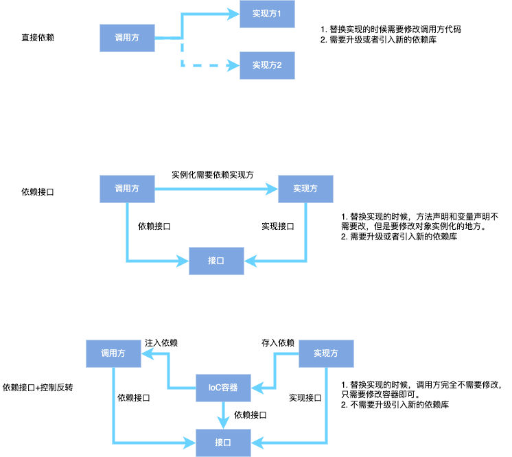

# 面向对象基本原则

SOLID原则+迪米特法则：

* 单一职责（SRP，Single-Responsibility Principle）：一个类只做一件核心的事，只有一个引起它变化的原因
* 开闭原则（OCP，Open-Closed Principle）：对扩展开放，对修改关闭
* 里氏替换原则（LSP，Liskov-Substitution Principle）：任何使用父类的地方，都能够被其子类替换，并且不影响程序运行结果。
* 接口隔离原则（ISP，Interface-Segregation Principle）：将臃肿庞大的接口拆分成多个专门的小接口，让接口只包含客户感兴趣的方法。
* 依赖倒置原则（DIP，Dependency-Inversion Principle）：高层模块不依赖于底层模块，二者都依赖于抽象。抽象不应该依赖具体，具体依赖于抽象
* 迪米特法则（LoD，Law of Demeter）：也叫做最少知识原则。一个对象对其他对象应当尽可能少的了解。
* 合成复用原则（CRP，Composite Reuse Principle）：也叫组合/聚合复用原则。简单来说就是多组合，少继承。

> Tips：设计原则不止针对类，可以小到一个方法、接口，也可以大到包、模块层面。实际编码过程中要灵活运用

## 单一职责

一个类只做一件核心的事，只有一个引起它变化的原因。

优点：

* 降低类的复杂度，避免类臃肿。外部使用的时候不需要包含冗余代码
* 提高可读性。
* 易于维护，易于发现和修复问题
* 降低修改问题的风险：只有一个职责，修改不会对其他功能造成影响

## 开闭原则

对扩展开放，对修改关闭：新增功能的时候尽量不修改原有逻辑，而是提供扩展方法（或者扩展类、扩展模块）。

优点：

* 利于测试：测试只需要针对扩展的代码测试，原有的代码没有变更
* 稳定性高：原有代码没有修改
* 易于维护和扩展：如下案例

实现方式：

1. 抽象约束，封装变化。即定义一个相对稳定的抽象层，将可变的因素封装在具体的实现类中，通过替换扩展实现类可以方便的替换实现，不需要修改原来的类。
2. 通过组合包装的方式，封装具体实现，修改的时候只需要修改包装类，不需要修改调用方。

例如使用图片加载框架

```java
//调用方使用ImageLoader加载图片，直接依赖
ImageLoader.getInstance().displayImage(imageUrl, imageView，options);
//如果要换成Glide加载图片，所有图片加载的地方都需要修改。不符合开闭原则
Glide.with(context).load(imageUrl).into(imageView);
```

> 1. 在大项目组件化开发中，各组件单独开发，同一个功能不同开发人员可能用了不同的框架（图片加载、数据库、网络请求等），最后合并的时候要求合为一种方案。
> 2. 或者出于性能等方面考虑，决定替换框架。

比较好的做法是进行包装，需要修改的时候只需要替换`loadImage`内部实现

```java
public class ImageUtil {
  public static void loadImage(View view, String imageUrl) {
    ImageLoader.getInstance().displayImage(imageUrl, view，options);
    //Glide.with(view.getContext()).load(imageUrl).into(view);
  }
}
```

Java推荐的getter和setter写法也是开闭原则的应用之一

如下，属性直接设为public，多处地方使用了该属性

```java
public class User {
  public String birthDay; //生日格式为yyyy-mm-dd
}
public class Main {
    public void test1(User user) {
        System.out.println(user.birthDay); //打印生日
    }
    public void test2(User user) {
        System.out.println(user.birthDay); //打印生日
    }
}
```

如果需求变更，需要修改日期格式为`x年x月x日`，需要修改多处代码，不符合开闭原则。

因此更合理的做法是提供getter方法，外部通过getter获取属性，当需求变更时，只需要修改getter方法，不需要修改其他地方。即**对修改关闭、对扩展开放**。

并且由于方法被子类覆盖可以实现多态，而变量被覆盖无法多态。因此定义方法可以由子类重写，更利于扩展。

> 具体见[Java面向对象](/Java/面向对象.md)

```java
public class User {
  private String birthDay;
  public String getBirthDay() {
      return new SimpleDateFormat("yyyy-mm-dd").format(birthDay);
      //return new SimpleDateFormat("年-月-日").format(birthDay);
  }
}
```

## 里氏替换原则

任何使用父类的地方，都能够被其子类替换，并且不影响程序运行结果。即**子类设计要兼容父类**。

作用：保证扩展父类的时候不会给已有系统引入新的错误。克服重写父类方法导致父类代码可复用性变差的缺点

具体实现方式：

1. 子类继承父类时，除添加新的方法完成新增功能外，尽量不要重写父类已有的方法，但可以实现抽象方法。
2. 子类中可以增加自己特有的方法：很明显，这种方式不会对父类造成影响
3. 当子类的方法重载父类的方法时，方法的前置条件（即方法的输入参数）要比父类的方法更宽松
4. 当子类的方法实现父类的方法时（重写、重载或实现抽象方法），方法的后置条件（即方法的的返回值、抛出异常）要比父类的方法更严格或相等

如何理解不能重写父类非抽象方法？

例如：鸵鸟不是鸟，重写父类getFlySpeed方法，使用Ostrich类替换Bird类，产生异常

```java
class Bird { //鸟类
    int flySpeed;
    void setFlySpeed(int speed) {
        flySpeed = speed;
    }
    int getFlySpeed() {
        return flySpeed;
    }
}
class Ostrich extends Bird { //鸵鸟类
    @Override
    int getFlySpeed() {
        return 0; //由于鸵鸟不会飞，因此重写方法，返回0
    }
}
public class Main {
    public static void main(String[] args) {
        Bird bird1 = new Bird();
        Bird bird2 = new Ostrich();
        bird1.setFlySpeed(100);
        bird2.setFlySpeed(100);
        //计算飞行200公里需要的时间
        int time1 = 200 / bird1.getFlySpeed(); //计算正确
        int time2 = 200 / bird2.getFlySpeed(); //由于速度为0，出现除零异常。无法替换父类，不满足里氏替换原则。
    }
}
```

如何理解重载父类方法时，参数更宽松？（参数变了，所以一定是重载）

还是以鸟为例：可以看到子类参数比父类更严格时，不满足里氏替换原则

```java
class Bird { //鸟类
    void speak(CharSequence str) {//说话
        System.out.println("bird speak: "+str);
    }
    void sing(String str) {//唱歌
        System.out.println("bird sing: "+str);
    }
}
class Ostrich extends Bird { //鸵鸟类
    void speak(String str) { //重载方法参数比父类更严格
        System.out.println("ostrich speak: "+str);
    }
    void sing(CharSequence str) { //重载方法参数比父类更宽松
        System.out.println("bird sing: "+str);
    }
}
public class Main {
    public static void main(String[] args) {
        Bird bird1 = new Bird();
        Ostrich bird2 = new Ostrich(); //替换为鸵鸟类
        bird1.speak("Hello World"); // 输出bird speak：Hello World
        bird2.speak("Hello World"); // 输出ostrich speak：Hello World，无法替换父类，不满足里氏替换原则
        bird1.sing("Hello World"); // 输出bird sing：Hello World
        bird2.sing("Hello World"); // 输出bird sing：Hello World，可以替换父类，满足里氏替换原则
    }
}
```

如何理解实现父类方法时，返回值和异常比父类更严格？

> 这一点其实Java编译器已经帮我们限制了，重写时返回值和异常范围不能比父类大（即类型需要更具体），否则会编译不通过。

假设没有限制会怎么样？

还是以鸟为例：可以看到即使没有编译错误，运行的时候也会出现Object转CharSequence异常

```java
class Bird { //鸟类
    CharSequence getName() { //名称
        return "bird";
    }
    CharSequence getType() { //品种
        return "bird";
    }
    void speak() throws IOException {}
}
class Ostrich extends Bird { //鸵鸟类
    String getName() {
        return "ostrich";
    }
    Object getType() { //这里实际上会编译错误，假设没有编译错误，运行时会怎么样呢？
        return "ostrich";
    }
    void speak() throws Exception {} //这里实际会编译错误，子类不能抛出更大范围的异常。假设没有编译错误，运行时会怎么样呢？
}
public class Main {
    public static void main(String[] args) {
        Bird bird1 = new Bird();
        Ostrich bird2 = new Ostrich();
        CharSequence name1 = bird1.getName();
        CharSequence name2 = bird2.getName();
        
        CharSequence type1 = bird1.getType();
        CharSequence type2 = bird2.getType(); //编译错误。如果没有编译错误，真正运行的时候会出现类型转换失败，Object无法自动向下转型。
        //此处子类无法替换父类，不满足里氏替换原则
        
        try {
            bird1.speak();
            bird2.speak(); //编译错误。如果没有编译错误，真正运行的时候抛出Exception异常，无法被IOException捕获。
            //此处子类无法替换父类，不满足里氏替换原则
        } catch (IOException e) {
            e.printStackTrace();
        }
    }
}
```

为什么编译器不强制限制参数更加宽松，只限制后置条件更加严格？

> 因为后置条件不限制的话在运行时会产生异常崩溃。
>
> 而前置条件不限制的话在运行时不会崩溃，只是单纯的不满足里氏替换原则而已，当然可能会造成逻辑错误。

### 协变与逆变

* 协变：指继承关系中，父类和子类构造出来的复杂类型之间，子类中重写方法的类型和父类方法的类型之间，也是父子类型的关系。
* 逆变：逆转了父类和子类间的关系
* 不变：既不是协变，也不是逆变。

如何理解协变和逆变这个说法？

> A和B是父子继承关系，A衍生出一个a类型，B衍生出一个b类型，a和b仍然保持父子继承的关系。即协同改变，不改变原有关系
>
> 逆变则是b变成了a的父类

Java中数组是协变的：如下，Integer[]是Number[]的子类型。

```java
Number[] a = new Integer[10]; //编译通过
Integer[] b = new Number[10]; //编译错误
```

Java中泛型的协变和逆变

```java
ArrayList<Number> list1 = new ArrayList<Integer>(); //编译错误，ArrayList<Number>和ArrayList<Integer>不具有继承关系（不变）
List<Number> list2 = new ArrayList<Number>(); //编译通过，ArrayList<Number>是List<Number>的子类型（协变）
List<? extends Number> list3 = new ArrayList<Integer>(); //编译通过，ArrayList<Integer>()是List<? extends Number>的子类型（协变）
List<? super String> list = new ArrayList<Object>();//编译通过，ArrayList<Object>是List<? super String>的子类型（String和Object关系颠倒，逆变）
```

Java中重写方法的协变和逆变：

1. 前置条件更宽松：即重写方法的参数更宽松，范围更大。（逆变，编译器没限制，是里氏替换原则的要求）
2. 后置条件更严格：即重写方法的返回值、异常类型更严格，范围更小。（协变，编译器有限制）

```java
class A {
    Object a() throws IOException {
        return "";
    }
}
class B extends A{
    @Override
    String a() {
        return "";
    }
}
//可以编译通过，子类返回值、抛出异常范围比父类更小，依然保持父子类型的关系，即协变
```

## 接口隔离原则

将臃肿庞大的接口拆分成多个专门的小接口，让接口只包含客户感兴趣的方法。

注：**需要根据实际情况进行隔离，粒度划分要适度**。如果接口定义太小会造成接口数量过多，使设计复杂；如果定义太大，会降低灵活性，无法提供定制服务。

优点：

1. 提高接口的复用性，提高系统的灵活性
2. 提高内聚性，避免和外部存在没必要的交互，外部只关心自己感兴趣的调用
3. 避免子类实现不必要的方法，额外增多冗余代码：例如Android动画类：`onAnimationStart、onAnimationEnd、onAnimationCancel`等
4. 能够体现对象的层次，通过接口的继承，可以组装不同的接口，定义总接口

例如鸟会飞、会叫，飞机会飞、能载人

```java
interface IBird { //定义鸟接口
  void fly();
  void speak();
}
class Ostrich implements IBird {} //鸵鸟类，鸵鸟不会飞，但仍然需要实现fly方法

interface IPlane { //定义飞机接口
  void fly();
  void addPeople();
}
class PaperPlane implements IPlane {} //纸飞机不能载人，但仍然需要实现addPeople方法
class Main {
  public static void main(String[] args) {
    IBird bird = new Ostrich();
    bird.fly();
    bird.speak();
  }
}
```

上面的代码存在的问题：

1. 鸟和飞机存在一样的行为，但是分别在两个接口中，不利于`fly`复用方法
2. 鸵鸟不会飞，但是仍然需要实现`fly()`方法。纸飞机不能载人，但是仍然需要实现`addPeople()`方法
3. 外部如果只想要使用`fly`的方法，但是不可避免的知道还有`speak()`、`addPeople()`方法可用

使用接口隔离之后改造如下：

```java
interface IFlyable { //定义飞接口
  void fly();
}
interface ISpeaker { //定义叫的接口
  void speak();
}
class Ostrich implements ISpeak {} //鸵鸟只需要实现叫的接口

interface IManned { //定义载人接口
  void addPeople();
}
class PaperPlane implements IFlyable {} //纸飞机只需要实现fly方法
class Main {
  public static void main(String[] args) {
    IFlyable bird = new Ostrich(); //客户端只知道fly方法
    IFlyable plane = new PaperPlane();
    bird.fly();
    plane.fly();
  }
}
```

> 看起来从2个接口变成了3个接口，增加了程序复杂度。但实际上，当会飞的类越来越多的时候，Flyable接口复用性会变得越来越高，价值也就体现出来了。
>
> 相反，如果不做接口隔离的话，当类越来越多，最后会发现需要为每个类都定义一个专门的接口，完全没法组合复用。

接口隔离和单一职责看起来很像，都是对功能进行拆分，提高类的内聚性，体现了封装的思想。但两者侧重点不一样：

1. 单一职责是按照功能划分；接口隔离是按照使用的方法划分。一个功能可能需要通过多个方法来实现。
2. 单一职责是为了避免类膨胀；接口隔离注重的是对接口依赖的隔离，避免外部知道不需要的接口方法，同时也可以避免内部实现不需要的接口方法。
3. 单一职责用来约束类定义，针对类中的实现细节；接口隔离用来约束接口定义，针对抽象和程序整体框架的搭建
4. 接口隔离比单一职责原则更细一些。一个类可能实现了多个接口。

## 依赖倒置原则

高层模块不依赖于低层模块，二者都依赖于抽象。抽象不应该依赖具体，具体依赖于抽象。

> Tips：这里的高层和低层有两种解释
>
> 1. 架构中的上层：高层指实例化和调用对象的地方（调用方），底层指类定义和实现的地方（实现方）
> 2. 抽象层次高：高层指抽象的业务逻辑，底层则是指具体实现

优点：

* 避免调用方和实现方的耦合
* 定义好抽象层之后，多模块可以并行开发
* 提高代码可读性：只需要看接口就能大致明白流程，不需要看具体实现
* 对代码进行约束，避免各个模块自己定义方法和命名

实现方式：

1. 尽可能面向接口编程：**类定义的时候尽可能提供接口，变量和方法参数、返回值的声明尽可能使用接口**
2. 结合控制反转：将直接依赖改为依赖容器

> 面向接口编程的前提是抽象层提前定义，并相对稳定，如果抽象层变更，势必会引起调用方和实现方的更新

### 依赖倒置第一步：面向接口

由于开闭原则，新增需求的时候要求尽可能扩展类，不修改原有实现代码。

如果直接依赖具体实现，要替换底层实现的时候，就需要修改调用方代码。以集合类为例

```java
//调用方变量、参数、返回值直接声明ArrayList类型
ArrayList<String> list = new ArrayList<String>();
ArrayList filterList(ArrayList list) {}
//如果需要改成链表实现，相应的方法、变量都要修改，并且需要修改不同依赖包（或者模块）。如果有多处地方调用，需要修改多处。
LinkedList<String> list = new LinkedList<String>();
LinkedList filterList(LinkedList list) {}
//如果使用面向接口，方法不需要变更，变量可以修改替换不同实现（即多态）
List<String> list = new LinkedList<String>();
List filterList(List list) {}
```

通过面向接口，替换实现的时候方法和变量声明的地方都不需要改动，只需要改动对象实例化的地方。

至于多处地方实例化的问题，调用方可以自行封装工厂方法来解决。（这个问题同样可以用上面开闭原则的案例来解释）

提问：说好的不直接依赖，但是调用方`new LinkedList();`不还是依赖了具体实现，并且要升级或引入新的依赖库吗？

> 由此引出了控制反转的概念。

### 依赖倒置第二步：控制反转

一般情况下对象由**依赖方通过new主动创建**，即`List list = new ArrayList();`。

上面提到了这么做有一个缺点：调用方需要直接依赖实现方，当想要替换不同的实现类的时候，需要修改调用方的代码，如果有多处地方调用，需要同步修改多处代码，显然增加了测试和维护的工作。

IoC则是引入了容器的概念，调用方不直接创建对象实例，而是通过IoC容器来控制对象的创建，**调用方被动地接收对象**。当想要替换不同实现的时候，只需要修改容器中对象创建的方式。

上面的案例使用IoC可以改造成

```java
//完成了依赖接口
List<String> list = new LinkedList<String>();
//加入IoC容器
class IoCContainer {
  private List list;
  static void setList(List list) {
    this.list = list;
  }
  static List getList() {
    return this.list;
  }
}
//实现方：在合适的时机将自身注入容器
IoCContainer.setList(new LinkedList());
//调用方：通过容器获取依赖对象
List<String> list = IoCContainer.getList();
```

> Tips：IoC一般用于多模块、依赖关系复杂的、较庞大的项目，简单的项目没必要引入IoC框架。例如上面的案例只有一处地方依赖了具体实现，修改起来也不麻烦，引入IoC框架反而增加了设计的复杂度。

上面的写法看起来有点像简单工厂，IoC和工厂模式有什么区别和联系呢？

> 工厂模式就是用了控制反转的思想。当然控制反转更关注代码的可扩展性，方便替换不同实现。而工厂模式更关注复杂对象的创建，目的是为了降低使用者的接入成本，并且屏蔽创建细节。

上面介绍的IoC只是最基础的，真正设计IoC框架的时候可以考虑更多，例如：

1. 反射创建对象，或者结合注解编译时生成对象创建的代码、或者结合字节码插桩技术织入代码
2. 对象延迟初始化、懒加载
3. 对象缓存
4. 对象生命周期管理，及时释放
5. 结合泛型，避免创建多个容器

总结一下IoC优点：

1. 更方便实现运行时多态，扩展性更强。
2. 降低了调用方和实现方间的耦合度。
3. 利于测试注入Fake对象。

提到IoC就不得不顺便提下DI：

* IoC：控制反转，一种将**对象创建的控制权**转移的设计思想，由**传统的调用方内部控制对象创建**转移到**由外部容器控制对象的创建**；
* DI：依赖注入，将相互依赖的对象分离，由外部的容器向程序注入依赖对象。

> **IoC和DI都是关注不同对象间的依赖关系。二者是同一个概念的不同描述，也可以说通过依赖注入来实现控制反转。**

总结一下模块和对象间依赖方式的转变，如下图。可以看到面向接口+控制反转才是真正实现依赖倒置的利器。



### 依赖倒置适用场景

典型的Clean架构就是基于依赖倒置设计的，越往内越抽象，越往外越具体，通过业务驱动，各个层级之间共同依赖抽象业务层进行通信。

依赖倒置不是所有场景都适用的，要根据实际情况选择，或者起初不需要，在后续迭代的时候有需求再进行重构。

1. 能够**提前确定**业务中需要的接口，并且设计的接口足够稳定，可以使用依赖倒置（对开发人员架构设计能力要求较高）
2. 如果能够确定实现方不会发生改变，则可以直接依赖，不需要依赖倒置。
3. 对于先有实现或者第三方实现的情况，更适合使用适配器包装，而不是依赖倒置。
4. 多处地方需要调用实现方的时候，如果要扩展实现需要修改多处代码，此时可以考虑用依赖倒置和组合。

> 例如在上面开闭原则中提到了图片加载库的例子，ImageLoader和Glide由不同的第三方开发，并且提供的API不一致。显然无法让第三方实现我们自己定义的接口，这种情况更适合使用适配器包装。

### SPI和API

依赖倒置离不开接口，那么接口定义在哪更合适呢？

> 这个问题可以参考博客[SPI和API](https://blog.afauria.xyz/2021/12/06/architecture-2021-12-06-SPI/)

## 迪米特法则

也叫做最少知识原则。一个对象对其他对象应当尽可能少的了解。

> 只与你的直接朋友交谈，不跟“陌生人”说话（Talk only to your immediate friends and not to strangers）

实现方式：

1. 从依赖者的角度，只依赖应该依赖的对象
2. 从被依赖者的角度，只暴露应该暴露的方法和属性，即**多封闭、少开放**。

具体到编码上：

1. 两个类之间如果不需要直接通信，可以通过一个第三方来转发该调用。（即中介、代理的思想）
2. 降低类、类成员和方法的访问权限
3. 优先考虑定义final类、final方法、final属性，避免被外部继承、重写、修改
4. 不暴露类成员，而是提供对应的getter和setter方法
5. 对于模块来说，可以通过外观模式，将功能集中封装到门面类中，提供统一的接口，避免外部访问或者引用其他类（同样适用于类方法：类的多个方法实现一个功能，只提供一个public方法供外部调用，其他方法声明为private）

> 常见的应用如代理模式、外观模式、中介者模式等

优点：

1. 降低类之间的耦合度，提高模块独立性
2. 降低不同模块之间依赖的深度和宽度，只依赖最直接的调用。
3. 提高模块的复用性和系统的扩展性：由于不直接依赖，而是通过第三方封装调用，替换实现的时候只需要修改中间层即可

## 合成复用原则

要求在软件复用时，尽量先使用组合或者聚合等关联关系来实现，其次才考虑使用继承关系来实现。（**多用组合，少用继承**）。

类的复用一般分为继承复用和合成复用。具体区别如下

| 继承                                                         | 组合                                                         |
| ------------------------------------------------------------ | ------------------------------------------------------------ |
| 强调对象是什么的关系。即`is-a`                               | 强调整体与部分拥有的关系，即`has-a`                          |
| 通过继承的方式，子类可以复用父类的代码逻辑，避免重复实现。   | 通过组合的方式，新对象可以调用已有对象的方法（复用已有对象的逻辑），还可以添加自己的逻辑。 |
| 破坏了类的封装性：继承会将父类的实现细节暴露给子类，父类对子类是透明的，又称为“白箱”复用。 | 维持了类的封装性：成员对象的内部细节对新对象不可见，又称为“黑箱”复用。 |
| 子类与父类的耦合度高。父类改变会影响到子类。对子类的修改需要遵循里氏替换原则。 | 新旧类之间的耦合度低。新对象可以依赖成员对象提供的接口，按照成员对象提供的接口来进行调用。 |
| 不支持动态继承：子类和父类的关系在编译时就已经确定，运行时无法动态替换父类实现 | 支持动态组合：运行时可以动态引用同一接口的不同实现对象。     |
| 自动继承父类的功能                                           | 不能自动继承父类的功能，需要手动包装方法                     |
| 创建子类对象的时候，无须创建父类对象                         | 创建整体类对象时，需要先创建局部类对象并传入                 |

总结：

1. 继承和组合都体现了类的复用性
2. 组合比继承耦合度低，更灵活，更容易扩展
3. 子类具有扩展父类的责任，而不是修改或移除父类责任。如果存在这种情况，不应该使用继承
4. 不存在需要将子类换成另一个类的子类的情况（无法面向接口）。如果不确定是否会出现这种情况，就不要使用继承。
5. 两个类确实存在`is-a`关系的时候才使用继承

# 其他原则

高内聚、低耦合：是软件设计的目标，评判好坏的标准。尽可能让一个方法（类、模块）只做一件事，减少类内部方法间（类与类之间、模块与模块之间）的交互复杂度。

面向接口编程：模块与模块之间尽可能使用接口通信，隐藏实现细节。（类定义的时候尽可能提供接口，变量和方法参数、返回值的声明尽可能使用接口）

多用接口，少用继承：继承关系比实现关系更紧密。由于接口不包含实现，外部无法知道实现细节。

多组合、少继承（即合成复用原则）：组合关系耦合度更低，可以随时移除和替换，继承关系父类修改会影响子类

好莱坞法则：强调低层被动的依赖，不主动依赖高层，由高层进行控制。（IoC就是基于该思想）

> 好莱坞法则：“不要给我们打电话，我们会给你打电话（don‘t call us, we‘ll call you）”
>
> 在好莱坞，把简历递交给演艺公司后就只有回家等待。由演艺公司对整个娱乐项的完全控制，演员只能**被动式**的接受公司的差使，在需要的环节中，完成自己的演出。

多封闭，少开放：除非必要，对外尽可能少暴露方法和属性，避免外部随意修改内部状态。能用private就不用public

少用全局变量：所有地方都可以修改全局变量，不安全，同时需要考虑状态同步。

尽量不用硬编码：硬编码代表无法动态替换实现，需要直接修改，违背开闭原则。

# 结语

**计算机科学领域的任何问题都可以通过增加一个间接的中间层来解决。**

这句话几乎概括了整个软件设计的要点，上面提到的降低耦合、扩展、复用、隔离等或多或少都运用了中间层的思想。
