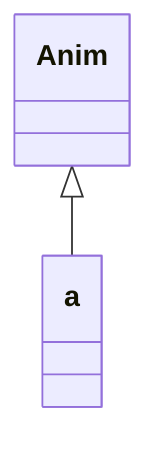
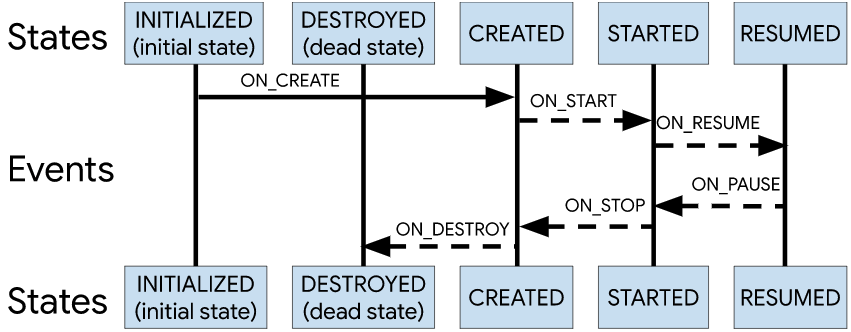
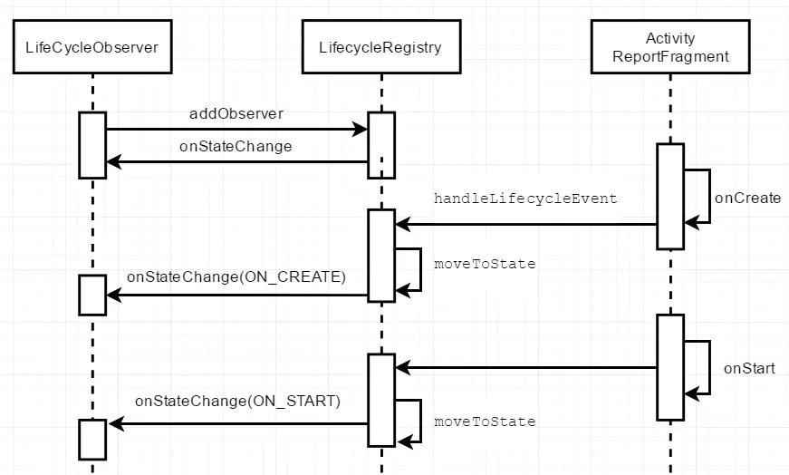

# Lifecycle组件




ComponentActivity使用透明ReportFragment分发生命周期事件

API 29以前直接在ReportFragment的生命周期中分发Lifecycle事件，API 29以上通过registerActivityLifecycleCallbacks监听Activity生命周期回调分发Lifecycle事件

```java
public static void injectIfNeededIn(Activity activity) {
    if (Build.VERSION.SDK_INT >= 29) {
        // On API 29+, we can register for the correct Lifecycle callbacks directly
        activity.registerActivityLifecycleCallbacks(
                new LifecycleCallbacks());
    }
    // Prior to API 29 and to maintain compatibility with older versions of
    // ProcessLifecycleOwner (which may not be updated when lifecycle-runtime is updated and
    // need to support activities that don't extend from FragmentActivity from support lib),
    // use a framework fragment to get the correct timing of Lifecycle events
    android.app.FragmentManager manager = activity.getFragmentManager();
    if (manager.findFragmentByTag(REPORT_FRAGMENT_TAG) == null) {
        manager.beginTransaction().add(new ReportFragment(), REPORT_FRAGMENT_TAG).commit();
        // Hopefully, we are the first to make a transaction.
        manager.executePendingTransactions();
    }
}
```

```java

private void dispatch(@NonNull Lifecycle.Event event) {
    if (Build.VERSION.SDK_INT < 29) {
        // Only dispatch events from ReportFragment on API levels prior
        // to API 29. On API 29+, this is handled by the ActivityLifecycleCallbacks
        // added in ReportFragment.injectIfNeededIn
        dispatch(getActivity(), event);
    }
}
```




##### ### 为什么不直接在SupportActivity的生命周期函数中给Lifecycle分发生命周期事件，而是要加一个Fragment呢？

> 因为不是所有的页面都继承AppCompatActivity，为了兼容非AppCompatActivity，所以封装一个同样具有生命周期的Fragment来给Lifecycle分发生命周期事件。



